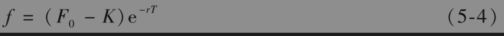
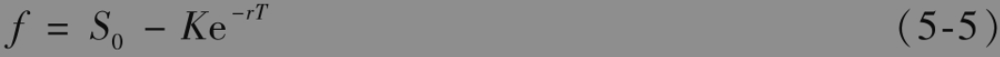
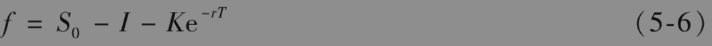
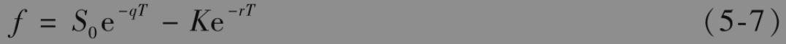

5.7 远期合约定价

在刚刚承约远期合约时，其价值为0，但在承约合约之后，远期合约价值可能为正也可能为负。对银行或其他金融机构来讲，每天计算这些合约的价值是非常重要的（称为对合约按市场定价或逐日盯市，marking to the market）。采用前面引入的符号，假设K是以前成交合约的交割价格，合约的交割日期是在从今日起T年之后，r是期限为T年的无风险利率，变量F0表示目前的远期价格，即假如在今天成交的话，合约的交割价格，我们还定义f为远期合约在今天的价值。

清楚地理解变量F0、K和f的含义非常重要。如果今天正好是合约的最初成交日，那么交割价格K等于远期价格F0，而且合约的价值f是0。随着时间的推移，K保持不变（因为已经被合约确定），但远期价格F0却会变动，而且远期合约的价值f可以变成或正或负。

对于远期合约的多头方（既可以是在投资资产上也可以是在消费资产上），合约的价值是

为了说明式(5-4)是正确的，我们构造一个组合：①以远期价格K在时间T购买标的资产：②以远期价格F0在时间T卖出标的资产。组合中第1个合约在时间T的收益为$`S_{T-K}`$，第2个合约的收益为$`F_0-S_T`$，总收益为$`F_0-K`$。因为这个数值在今天是已知的，因此交易组合无风险，它在今天的价值等于在时间T收益的贴现值，$`(F0-K)e-rT`$。因为F0是今天承约远期合约时的远期价格，所以按交割价格F0卖出资产的远期合约价值为0，由此可见，具有交割价格K的合约（多头）在今天的价值$`(F0-K)e-rT`$ 。类似地，以执行价格K卖出资产的远期合约（空头）的价值为

$`\left(K-F_0\right) \mathrm{e}^{-r T}`$

【例5-4】 一个无股息股票上的远期合约多头是在以前成交的。这个远期合约还有6个月到期。无风险利率（连续复利）为10%，股票价格为25美元，远期合约的交割价格为24美元。这时$`S_0`$=25，r=0.10,T=0.5，K=24。由式(5-1)得出6个月期的远期合约的价格F0为

$`F_0=25 e^{0.1 \times 0.5}=26.28 \text { (美元) }`$

由式(5-4)可知远期合约的价值为

$`f=(26.28-24) \mathrm{e}^{-0.1 \times 0.5}=2.17 \text { (美元) }`$

式(5-4)说明对于一个资产上的远期合约多头定价时，我们可以假定资产在远期合约到期时的价格等于远期价格F0。为了说明这一点，注意在做出这个假设之后，远期合约在T时刻的收益为$`F_0-K`$，贴现值$`\left(F_0-K\right) \mathrm{e}^{-r T}`$，这与式(5-4)中的f一致。类似地，在对于远期合约空头定价时，也可以假设远期价格在将来会实现。这与第4.9节中的结果类似：对远期利率合约定价时，我们可以假设远期利率在将来会实现。

将式(5-4)与式(5-1)结合，我们可以得出在没有中间收入的资产上远期合约多头的价值为

类似地，将式(5-4)与式(5-2)结合，我们可以得出在提供贴现值为I的已知收入的资产上远期合约多头价值为

最后，将式(5-4)与式(5-3)并用，我们可以得出提供收益率为q的资产上的远期合约多头价值为

当期货价格变化时，期货合约的盈亏等于其价格变化乘以持有期货头寸的大小。因为期货合约为每日结算，所以收益几乎马上就可以兑现。式(5-4)表示当远期价格变化时，其盈亏等于远期价格变化的贴现值，并乘以其头寸的大小。外汇交易中远期和期货收益的差别可能会给外汇交易员带来困扰（见业界事例5-2）。

## 业界事例5-2

## 是系统错误吗

家银行的一名外汇交易员承约了一个在3个月后以汇率1.5000的价格买入100万英镑远期合约的多头。同时，另外一个交易台的交易员承约了16份3个月期限英镑期货合约的多头，期货价格为1.5000。每份英镑期货合约的规模为62500英镑，因此远期和期货交易的头寸一样。在承约交易后，远期和期货价格都涨至1.5040。银行系统显示期货交易员获利4000美元，但远期合约交易员的获利只有3900美元。远期合约交易员马上打电话给银行系统部门进行抱怨，远期合约交易员的抱怨合理吗？

答案是否定的！期货合约的每天交割保证了交易员马上兑现了盈利，盈利数量对应于期货价格的涨幅。如果远期合约交易员马上对其头寸进行平仓，即承约执行价格为1.5040的远期合约空头，远期合约交易员在3个月后能够以1.5000的汇率买入100万英镑，并同时能够以1.5040的价格卖出100万英镑，这因此会产生4000美元盈利，但这一盈利是在3个月以后。因此远期合约交易员的盈利为4000美元的贴现值，这与式(5-4)是一致的。

远期合约交易员可以从盈利与亏损的对称性中得到安慰：如果远期/期货价格下跌到1.4960，而不是上升到1.5040，那么期货交易员马上会损失4000美元，而远期合约交易员却只损失3900美元。