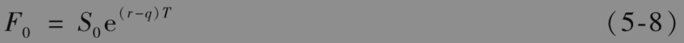

# 5.9 股指期货价格

在第3.5节中我们介绍了股指期货，并指出股指期货是管理股权组合非常有用的工具。表3-3给出了一些不同股指上的期货价格，我们现在考虑如何确定股指期货价格。

通常可以将股指看成支付股息的投资资产，投资资产为构成股指的股票组合，股息等于构成资产所支付的股息。通常假定股息为已知收益率（而不是现金收入）。如果q为股息收益率（按连续复利形式），式(5-3)给出的期货价格F0为

这说明期货价格按r-q的速度随期限增长。在表3-3中标准普尔500指数期货的结算价格每6个月降低大约0.5%，即每年1%。这说明市场对标准普尔500指数的预计是在第一年里的股息收益率比无风险利率高1%。

【例5-5】 考虑标准普尔500指数上3个月期的期货合约。假定构成股指的股票提供1%的年收益率（按连续复利），股指的当前价格为1300，按连续复利的无风险利率为每年5%。这时，r=0.05，S0=1300,T=0.25,q=0.01，因此期货价格F0由下式给出

$`F_0=1300 \mathrm{e}^{(0.05-0.01) \times 0.25}=1313.07 \text { (美元) }`$

在实际中，组成股指的股票组合的券息收益率在一年当中每周都会发生变化。例如，在NYSE交易的股票大部分券息都是在每年的2月、5月、8月和11月的第一个星期内支付。股息收益率q应该为在期货合约期限中的平均股息年收益率。用于估计q的股息的除息日应该是在期货的期限之内。

## 业界事例5-3

## CME的日经225指数期货合约

在本章所说明的期货价格确定方式中，我们需要假定股指为投资资产。这意味着股指必须为可交易资产组合的价值。在CME交易的日经225指数期货不满足这一要求，其原因并不是那么显而易见。假定S为日经225指数的价格，这一指数是以日元计算的日本225个股票组合的价格。CME交易的日经225指数期货的标的变量为5S美元。换句话讲，虽然股指期货的标的变量以日元计算，但期货价格却直接以美元计价。

我们无法投资于价值5S美元的投资组合，我们所能做的是投资于5S日元的组合，这时其价值永远为5QS，其中Q为1日元所对应的美元数量。变量5S美元不对应于任何投资资产的价格，因此式(5-8)不成立。

CME的日经225指数期货是交叉货币度量衍生产品(Quanto)的一个例子，这种衍生产品的标的资产以一种货币计价，但收益却是以另一种货币支付。在第30章中我们将进一步讨论这种产品。

## 指数套利

如果$`F_0>S_0 \mathrm{e}^{(r-q) T}`$，我们可以通过以即期价格（即马上支付）买入构成指数的股票，并且同时承约指数期货合约空头而获利。如果$`F_0<S_0 \mathrm{e}^{(r-q) T}`$，我们可以通过相反的操作，即卖空或卖出构成指数的股票，并且同时承约指数期货的多头而获利。这种交易策略就是所谓的指数套利(index arbitrage)。当$`F_0<S_0 \mathrm{e}^{(r-q) T}`$时，指数套利常常由拥有指数中股票组合的养老金实现。当$`F_0>S_0 \mathrm{e}^{(r-q) T}`$时，持有短期货币市场资产的银行或企业可能会进行指数套利。对于一些包含很多股票的指数而言，指数套利有时是通过交易数量相对较少但具有代表性的股票来进行的，这些股票组合的选取是使其变化与指数变化非常接近。指数套利通常是通过程序交易(program trading)来进行，即通过一个计算机系统来产生交易指令。

在大多数情况下套利者的行为保证了式(5-8)的成立。但有时套利也是不可行的，因此期货价格会脱离与即期价格之间的关系式（见业界事例5-4）。

## 业界事例5-4

## 1987年10月的指数套利

为进行指数套利，交易员必须能够在市场上得到报价后很快地同时交易指数期货和构成股指的股票。在正常市场条件下，交易员可以采用程序交易，并且式(5-8)成立。1987年10月19日和20日的市场绝非属于正常市场：在被称为“黑色星期一”的1987年10月19日这一天，市场下跌幅度超过了20%。这一天的6.04亿股股票交易量轻易地打破了以往的纪录。交易所整个系统超负荷运转，如果在这一天发出一个买入或卖出股票的指令，你可能要等上两个小时才能完成交易。

在1987年10月19日这一天的大部分时间里，期货价格远低于标的股指的价格。例如，在交易日结束时，股指标准普尔500指数收盘价为225.06（在这一天下跌了57.88），12月到期的标准普尔500指数股指期货的收盘价为201.50（在这一天下跌了80.75）。这种现象出现的主要原因是由于处理交易的延迟而使套利行为变得不可能。在接下来一天（即1987年10月20日，星期二），纽约股票交易所暂时限制了程序交易，这使指数套利变得更加困难，因此股票价格与期货价格之间通常具有的关系被打破。在那一天甚至出现12月交割的期货价格比标准普尔500指数股指的价格低18%的情形。但是，在几天以后市场恢复正常，套利者的行为保证了期货与即期价格之间的关系式，即式(5-8)的成立。