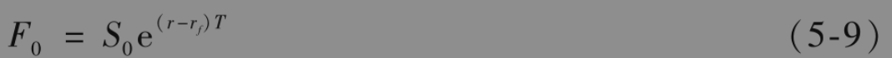
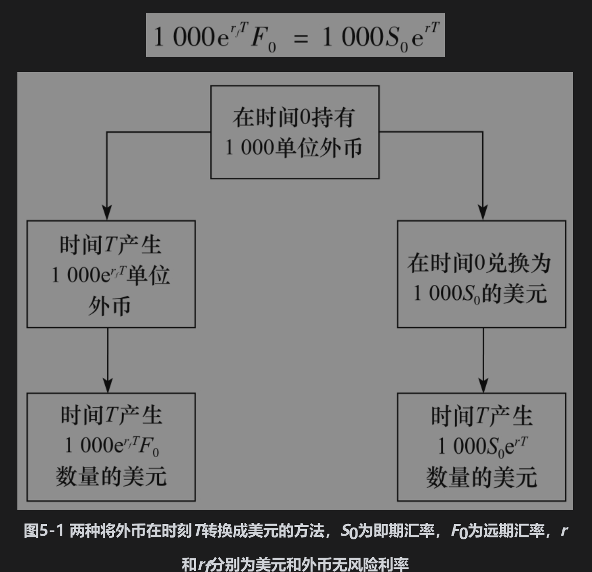
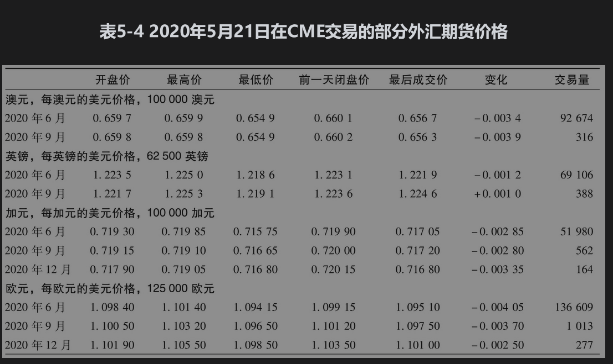
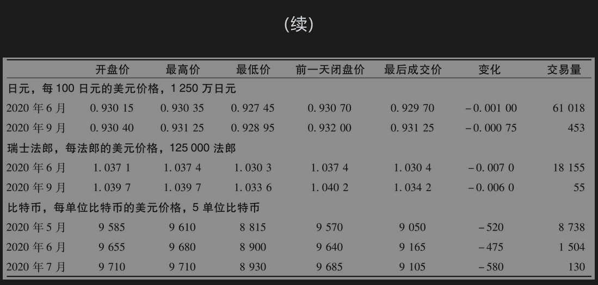

# 5.10 货币上的远期和期货合约

我们现在从美国投资者的角度来考虑外汇上的远期和期货合约，这里的标的资产为1单位的外币。定义变量S0为1单位外币的美元价格，F0为1单位外币的美元远期或期货价格。这种定义S0的方式与其他标的资产上远期和期货的形式是一致的。但是，正如第2.11节所述，这种形式并不一定对应于外汇市场上即期和远期汇率的报价方式。除英镑、欧元、澳元和新西兰元之外，主要货币的即期和远期汇率报价通常是1美元所对应的外币数量。

外币具有以下性质：外币持有人可以收取货币发行国的无风险利率。例如，外币持有人可将货币投资于以外币计价的债券。我们定义rf为对应于期限T的外币无风险利率，变量r为对应于同样期限的美元无风险利率。

F0与S0之间有以下关系式

这就是在国际金融领域里著名的利率平价关系式，图5-1显示了该公式成立的原因。假定某投资者在开始时持有1000单位的外币。投资者有两种办法可以在时刻T将外币转变为美元。一种办法是按利率rf将外币投资T年，并同时承约将所有的投资本息转换为美元的远期合约。这种办法的结果是在时间T具有$`1000 \mathrm{e}^{r_{/} T} F_0`$美元。另外一种办法是将外币在外汇即期市场转换成美元，然后再将美元按利率r投资T年。这种办法的结果是在时间T会具有1000S0erT美元。在没有套利机会的情况下，以上两种办法会取得同样的结果，即

因此

$`F_0=S_0 \mathrm{e}^{\left(r-r_f\right) T}`$

【例5-6】 假定澳元和美元的2年期无风险利率分别是3%和1%，并且澳元和美元的即期汇率为0.7500（即1澳元所对应的美元数量）。由式(5-9)得出2年期的远期汇率应该等于

$`0.7500 e^{(0.01-0.03) \times 2}=0.7206`$

首先假定2年期的远期汇率小于这个数量，比如0.7000。套利者可以进行以下交易：

(1)以3%的利率借入1000澳元，期限为2年。将澳元转化为750美元，并以1%的利率投资2年（两个利率均为连续复利）；

(2)承约一个远期合约，在合约中以1061.84×0.7000=743.29美元的价格买入1061.84澳元。以1%的利率投资的750美元在2年后会增长到750e0.01×2=765.15美元，在这部分资金中有743.29美元用于在远期合约中买入的1061.84澳元。这正好可以用于偿还借入1000澳元所产生的本息（即1000e0.03×2=1061.84）。这种策略所产生无风险收益为765.15-743.29=21.86美元（如果这一结果听起来不太刺激，你设想一下可以借入1亿澳元并采取以上策略所产生的结果）。

接下来，假定2年远期的价格为0.7600［大于由式(5-9)得出的0.7206］。这时，套利者可以进行以下交易：

(1)以1%的利率借入1000美元，期限为2年，并将资金兑换为1000/0.7500=1333.33澳元，然后将澳元以3%的利率进行投资；

(2)承约2年期的远期合约，在合约中卖出1415.79澳元，收入美元的数量为1415.79×0.76=1075.99美元。

以3%的利率投资的1333.33澳元在2年后会增长到1333.33e0.03×2=1415.79澳元，通过远期合约可以将这笔资金兑换为1075.99美元。偿还美元贷款的数量为1000e0.01×2=1020.20美元。因此，这种交易策略会产生1075.99-1020.20=55.79美元的无风险收益。

表5-4为2020年5月21日的外汇期货报价，这里的价格是外汇所对应的美元数量（对于日元，报价指的是每100日元所对应的美元数量）。这是期货的约定报价方式。这时，式(5-9)成立，其中r为美元无风险利率，rf为外汇无风险利率。

表中所列各种外汇的短期利率均低于美元短期利率，这对应于r>rf的情形。这也解释了为什么对于这些货币，期货价格随着期限增长而上涨。芝加哥商业交易所在2017年12月推出标的资产为比特币的期货。表中显示，在2020年5月21日，1单位比特币的价格大约是9000美元。期货的交割日期是交割月的最后一个星期五，交割方式是现金交割。

【例5-7】 在表5-4中，9月交割的欧元价格比6月交割的欧元价格高0.2%，而12月交割的欧元价格比9月交割的欧元价格高0.2%，这说明期货价格每年大约增长4×0.2=0.8%。由式(5-9)可知这大致等于2020年5月欧元短期利率比美元短期利率低多少的估计。

## 将外汇作为提供已知收益率的资产

注意，如果以rf代替q，式(5-9)与式(5-3)相同。这并非偶然：外币可以看成提供已知收益率的资产，这里的收益率为外汇的无风险利率。

为了理解这一点，注意外汇提供的利息与外汇的价值有关。假定英镑利率为5%。对于美元投资者而言，这一外币提供以英镑计量的收入为5%。换句话讲，英镑是提供5%收益率的资产。