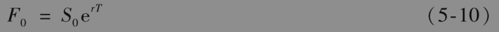
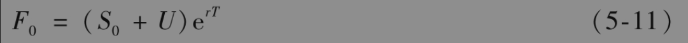
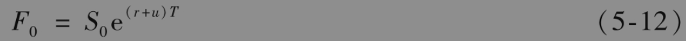
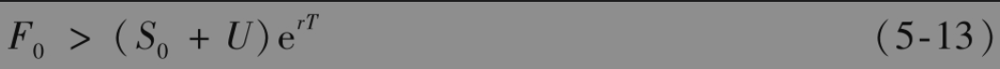
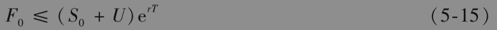
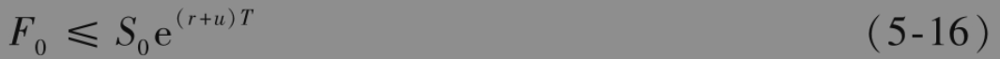
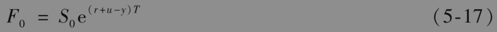

# 5.11 商品期货

我们接下来考虑商品期货，首先考虑黄金与白银这类投资资产的商品期货价格，然后考虑消费资产的期货价格。

## 5.11.1 收入和贮存费用

如业界事例3-1所示，由于黄金生产商的对冲策略，部分投资银行需要借入黄金。类似于像中央银行这样的黄金拥有者在借出黄金时会索取所谓的黄金租借率(gold lease rate)形式的利息，对于白银也是一样。因此，黄金和白银会给其拥有者带来收入。与其他商品一样，它们也需要支付贮存费用。

在没有贮存费用和收入时，式(5-1)给出了投资资产的远期价格

贮存费用可视为负收入。假定U为期货期限之间所有去掉收入后贮存费用的贴现值。由(5-2)得出

【例5-8】 考虑投资资产上的1年期期货合约。我们假定资产不提供收入，并假定贮存单位资产的费用为每年2美元，贮存费用在年末支付。资产的即期价格为450美元，对应所有期限的无风险利率均为每年7%。因此r=0.07，$`S_0`$=450,T=1

$`U=2 e^{-0.07 \times 1}=1.865`$

由式(5-11)，我们得出F0的理论价格为

$`F_0=(450+1.865) \mathrm{e}^{0.07 \times 1}=484.63 \text { (美元) }`$

如果期货的实际价格高于484.63美元，那么套利者可以买进资产并且同时承约1年期的期货合约空头来锁定一项盈利。如果期货的实际价格低于484.63，这时已拥有资产的投资者可以通过卖出资产并承约期货合约多头来改善收益。

如果在每个时刻的贮存费用（除去收入）都与商品价格成比例，这时的费用可看成负收益率。由式(5-3)得出

其中u为除去资产所赚取的所有收益率后贮存费用占即期价格的比例。

## 5.11.2 消费商品

用于消费而不是投资的商品往往不提供收入，且这些商品可能需要很高的贮存费用。我们接下来仔细考虑如何由即期价格来确定期货价格的套利策略。假设式(5-11)不成立，即

为了利用这一关系式，套利者可以进行以下交易：

(1)按无风险利率借入S0+U数量的资金，用这些资金买入一个单位的商品并支付贮存费用；

(2)承约一个单位的商品远期合约的空头。

如果我们将期货合约当作远期合约来考虑，即没有每日结算，以上策略在时间T产生的盈利为F0-(S0+U)erT。对于任何商品，采取这一套利策略都没有问题。但是，当套利者都这样做时将会造成S0价格上升或F0下降，直到不等式不再成立。因此我们可以肯定不等式(5-13)不会维持太久。

接下来假设

当商品为投资资产时，由于许多投资者拥有商品的目的是投资，所以当他们发现以上关系后，会采用以下交易策略来取得盈利：

(1)卖出商品，节省贮存费用，并将所得资金按无风险利率投资；

(2)承约远期合约的多头。

将结果与持有商品进行比较，投资者在到期日的无风险收益(S0+U)erT-F0，因此，不等式(5-14)不会持久。因为不等式(5-13)和不等式(5-14)都不可能持续太久的时间，所以F0=(S0+U)erT一定成立。

当持有商品的主要目的不是投资时，以上的讨论不再适用。当个人和公司持有商品的目的是其消费价值而不是其投资价值时，他们不愿意出售商品并买入期货合约，因为期货合约并不能用于加工或其他形式的消费。因此，我们没有任何理由说不等式(5-14)不能成立，我们所能肯定的只是以下关系式

如果将贮存费用表示成即期价格的比例u，等价表达式为

## 5.11.3 便利收益率

因为商品持有者可能会认为持有商品比持有期货能提供更多的便利，因此式(5-15)和式(5-16)不一定成立。例如，某原油加工厂不太可能将持有原油期货合约与持有原油库存同等看待。库存原油可以用于原油加工，而持有的期货合约并不能用于这个目的。一般来讲，持有实物资产可以确保工厂的正常运作，并且从商品的暂时局部短缺中盈利，而持有一个期货合约却做不到这一点。由于持有商品而带来的好处有时称为商品所具有的便利收益率(convenience yield)。如果贮存成本为现金形式而且已知现值为U，商品的便利收益率y可由以下关系式来定义

$`F_0 \mathrm{e}^{y T}=\left(S_0+U\right) \mathrm{e}^{r T}`$

如果单位商品的贮存成本为即期价格的比例u，那么便利收益率y可由以下关系式定义

$`F_0 \mathrm{e}^{y T}=S_0 \mathrm{e}^{(r+u) T}`$

即

便利收益率只是简单地衡量了不等式(5-15)和式(5-16)中左端小于右端的程度。对于投资资产，便利收益率为0，否则会产生套利机会。第2章的表2-2显示，在2020年5月21日，自2021年1月到2021年5月，大豆的期货价格随着期货合约期限的增加而下降，这说明在这段时间内大豆期货的便利收益率y比r+u还要大。

便利收益率反映了市场对将来能够购买商品的可能性的期望，商品短缺的可能性越大，便利收益率就越高。如果商品的用户拥有大量库存，在不久的将来出现商品短缺的可能性便会很小，这时便利收益率也会比较小。较低的库存一般会导致较高的便利收益率。