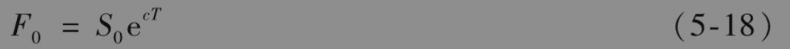
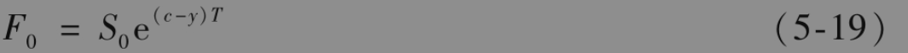

# 5.12 持有成本

期货价格与即期价格之间的关系式可由持有成本(cost of carry)来描述。持有成本包括贮存成本加上资产的融资利息，再减去资产所提供的收益。对于无股息的股票而言，持有成本为r，这是因为股票既没有贮存费用也没有中间收入；对于股指而言，持有成本为r-q，因为股指提供收益率为q的中间收入；对于货币而言，持有成本为r-rf；对于提供中间收益率q和贮存成本率为u的资产而言，持有成本为r-q+u，等等。

定义持有成本为c，对于投资资产，期货价格满足

对于消费资产，期货价格满足

其中y为便利收益率。

