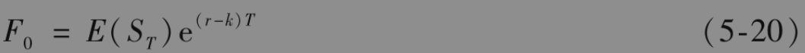
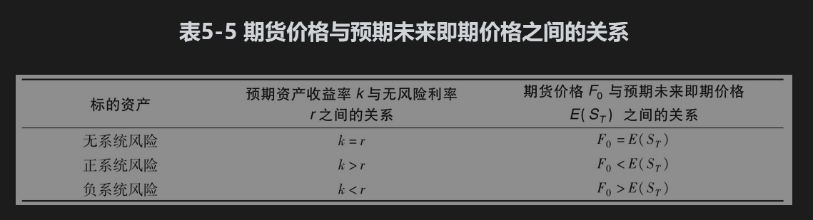

# 5.14 期货价格与预期未来即期价格

我们将市场对于在将来某时刻资产即期价格的一般观点称为资产在这一时刻的预期即期价格(expected spot price)。假定现在是6月，9月的玉米期货价格为450美分。这时我们会想知道：9月的预期即期价格是多少？这个价格等于450美分、高于450美分还是低于450美分呢？如图2-1所示，期货价格在到期时会收敛到即期价格。如果预期即期价格小于450美分，市场预料9月的期货价格将会下跌，因此持有期货空头的交易员会有盈利，而持有期货多头的交易员会有亏损。如果预期即期价格大于450美分，这时情况会相反：市场预料9月期货价格会上升，因此持有期货多头的交易员会有盈利，而持有期货空头方的交易员会有亏损。

## 5.14.1 凯恩斯和希克斯

经济学家约翰·梅纳德·凯恩斯(John Maynard Keynes)和约翰·希克斯(John Hicks)提出，如果对冲者倾向于持有空头而投机者倾向于持有多头，那么资产期货价格会低于预期未来即期价格。这是因为投机者因承担风险而会索取补偿，他们只有在预期产生盈利时才会进行交易。平均来讲对冲者会有损失，因为期货可以减小风险，所以对冲者更容易接受亏损的事实。凯恩斯和希克斯指出，如果对冲者倾向于持有多头而投机者倾向于空头时，类似的原因可以说明期货价格会高于预期即期价格。

## 5.14.2 风险与收益

解释期货价格与即期价格期望值之间关系的现代方法是以经济中风险与期望收益之间的关系为基础的。一般来讲，一项投资的风险越大，投资者所要求的期望收益也越高。资本资产定价模型（见附录3A）说明了在经济中有两类风险：系统风险与非系统风险。非系统风险对投资者并不重要，因为通过持有充分分散的投资组合而可以几乎完全消除这种风险。与此相反，投资者无法消除系统风险，这种风险来源于投资的回报与整个股票市场之间的相关性。在承受正的系统风险时，投资者通常会要求高于无风险利率的期望收益率。当投资中的系统风险为负时，投资者也会接受低于无风险利率的期望收益率。

## 5.14.3 期货头寸的风险

我们考虑一个承约了期货合约多头的投机者，期货合约期限为T年。这个投机者希望在期货到期时即期价格高于期货价格。忽略期货每天结算的特性，我们将这个期货合约与远期合约同等对待，并假设投机者将数量等于期货价格贴现值的资金进行无风险投资，而且同时承约了期货的多头。在期货交割日可用无风险投资的收入购买资产。投机者买入资产后，马上将资产在市场上卖出。对于投机者而言，其现金流为

今天：$`-F_0 \mathrm{e}^{-r T}`$

期货结束时：+$`S_T`$

其中F0为期货的当前价格，$`S_T`$为在到期日（即时刻T）的资产价格，r是期限为T的无风险投资收益率。

我们如何对这一投资定价呢？对于时刻T的预期现金流的贴现利率应当等于投资者所要求的投资收益率。假设k为投资者对于这一投资所要求的收益率，投资的贴现值为

$`-F_0 \mathrm{e}^{-r T}+E\left(S_7\right) \mathrm{e}^{-k T}`$

其中E代表期望值。假设在证券市场上所有投资定价都使得其净贴现值为0，这意味着

$`-F_0 \mathrm{e}^{-r T}+E\left(S_T\right) \mathrm{e}^{-k T}=0`$

即

像我们刚刚指出的那样，投资者对一项投资所要求的收益取决于其系统风险。事实上，我们这里考虑的投资是对期货标的资产的投资。如果这项资产的投资收益与股票市场无关，那么正确的贴现利率应该为无风险利率，因此我们应该将k设定为r，式(5-20)变为

$`F_0=E\left(S_T\right)`$

这一关系式说明：在标的资产的收益与股票市场无关时，期货价格是对未来即期价格期望值的无偏估计。

当一项资产价格与股票市场有正相关性时，由k>r和式(5-20)得出$`F_0<E\left(S_T\right)`$。 这一关系式说明，当期货标的资产具有正系统风险时，我们应该预料期货价格会低估将来即期价格的期望值。具有系统风险资产的一个例子是股指，投资者对股指所期望的收益率要大于无风险利率。假定股指的收益率为q，股指的预期增长率应大于r-q。因此式(5-8)与股指期货价格会低估预期未来即期价格这一结论是一致的。

如果资产收益与股票市场有负相关性，由k<r和式(5-20)得出$`F_0>E\left(S_T\right)`$。这一关系式说明，当期货标的资产有负的系统风险时，我们应该期望期货价格会高估预期未来即期价格。

表5-5总结了以上结果。

## 5.14.4 现货溢价和期货溢价

当期货价格低于预期未来即期价格时，这一情形叫现货溢价(normal backwardation)；当期货价格高于预期未来即期价格时，这一情形叫期货溢价(contango)。但是，需要注意这些名词有时是指期货价格低于或高于当前即期价格（而不是预期未来即期价格）。