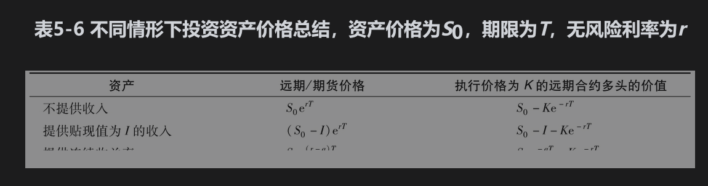

# 小结

在大多数情况下，具有确定交割日期的期货合约可以被看作等同于具有相同交割日期的远期合约。理论上可以证明，当利率在完全可以预测的情况下，两种合约价格应完全一致。

在理解期货（或远期）价格时，为了方便起见，我们将期货合约分成两种：一种标的资产是至少有些投资者持有的主要目的是投资，另一种是主要为了消费而持有的资产。

对于投资资产，我们主要考虑了3种不同情形：

(1)资产不提供收入；

(2)资产提供已知的现金收入；

(3)资产提供已知的收益率。

结果如表5-6所示。由此我们可以得出股票、货币、黄金和白银的期货价格。贮存费用可以被看作负收入。

对于消费性资产，我们不可能将期货价格表达为即期价格和其他可观察市场变量的函数。这时，所谓的资产便利收益参数变得十分重要。这一参数用于衡量商品的用户拥有实际资产比仅持有期货合约而带来额外好处的程度，这些好处包括从商品在本地暂时短缺中获利，以及为了保持生产线正常运作的能力，等等。我们可以从套利理论中得出消费性资产期货价格的上限，但无法建立期货价格与即期价格之间的等式。

持有成本这一概念有时很有用。持有成本等于标的资产贮存成本加上融资成本再减去资本中间收益。对于投资资产，期货价格大于即期价格的数量反映了持有成本。对于消费资产，期货价格大于即期价格的数量反映了持有成本与便利收益的差。

如果假设资本资产定价模型成立，期货价格与预期未来即期价格之间的关系取决于标的资产回报与股票市场的回报具有正相关性还是负相关性。正相关性会使得期货价格低于预期未来即期价格，负相关性会使得期货价格高于预期未来即期价格。只有在相关性为0时，理论期货价格才等于预期未来即期价格。

