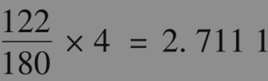
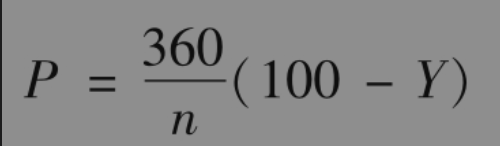
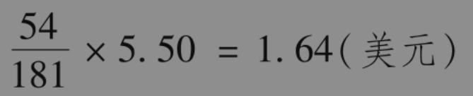

# 6.1 天数计算和报价惯例

在这里我们将提到天数计算和报价惯例等预备知识，这些知识适用于债券和其他与利率有关的证券产品。

## 6.1.1 天数计算

天数计算定义了在一段时间内利息累计的方式。一般来讲，我们知道在一段参考区间内的利息（例如，介于息票支付时间间隔内的利息），在这里，我们感兴趣的是对于其他时间期限内的利息累计方式。

一般做法是将天数计算表达成X/Y的形式。当我们计算两个日期之间的利息时，X定义了两个日期之间计算天数的方式，Y定义了参考期限内总天数的计算方式。在两个日期之间挣到的利息为

在美国有3种流行的天数计算惯例：

(1)实际天数/实际天数（一段时间内）；

(2)30/360；

(3)实际天数/360。

美国长期国债采用“实际天数/实际天数（一段时间内）”的天数计算惯例：在两个日期之间的利息是基于实际过去天数与两个息票支付日期之间实际天数的比率。假定一个债券的本金为100美元，息票支付日期为3月1日和9月1日，息票率为每年8%（这意味着在每年的3月1日和9月1日各付4美元的利息），我们想要计算3月1日与7月3日之间的利息。这里的参考时间段为3月1日至9月1日，总共有184天（实际天数），这段时间所得利息为4美元。在3月1日与7月3日之间总共有124天（实际天数）。因此，3月1日与7月3日之间的所得利息为

美国企业债券和市政债券采用“30/360”的天数计算惯例。我们在计算中假定每个月有30天，每年有360天。采用“30/360”的惯例，在3月1日与9月1日之间总共有180天。在3月1日与7月3日之间总共有4×30+2=122天。因此，对于和我们刚才考虑的政府债券具有一样期限和利率的企业债券，在3月1日与7月3日之间的所得利息为

如业界事例6-1所示，有时“30/360”天数计算惯例会产生令人吃惊的结果。

## 业界事例6-1

## 天数计算有时可能会使人迷惑

假设在2018年2月28日与3月1日之间，你可以选择一个美国国债或一个美国企业债券，两债券的息票率均为10%，并且报价是一样的。两者之间你应选择哪一个呢？

乍听起来，两者应该没有太大的区别，但事实上你应选择企业债券。在“30/360”天数计算惯例下，2018年2月28日与2018年3月1日之间总共有3天。在政府债券的“实际天数/实际天数（一段时间内）”的天数计算惯例下，两个日期之间只有1天。拥有企业债券所得利息将是拥有政府债券所得利息的大约3倍。

美国货币市场产品采用“实际天数/360”的天数计算惯例。这说明参考期限选定为360天，一年中的一段时间内所得利息等于实际过去的天数除以360，然后乘以报价利率。

90天期间所得的利息应正好等于报价利率的1/4。注意，含有365天的整年里所得的利息为365/360乘以报价利率。国家与国家之间和产品与产品之间的天数计算惯例都有所不同。例如，澳大利亚、加拿大以及新西兰的货币市场惯例为“实际天数/365”。除英镑外所有货币的LIBOR均为“实际天数/360”，英镑的LIBOR为“实际天数/365”。欧元债券和英镑债券通常采用“实际天数/实际天数”惯例。

## 6.1.2 美国短期国债的报价

货币市场的产品报价有时采用贴现率(discount rate)方式，该贴现率是所得利息作为最终面值（而不是最初所付出价格）的百分比。美国的短期国债就是一个例子：如果一个91天期限短期国债的报价为8，这意味着，每360天所得利率为面值的8%。假定面值为100美元，在91天内的利息为2.0222美元(=100×0.08×91/360)。对应于91天的真正利率为2.0222/(100-2.0222)=2.064%。一般来讲，美国短期国债的现金价格与报价的关系式为

其中P为报价，Y为现金价格，n为短期债券期限内以日历天数所计算的剩余天数。例如，当90天短期国债的现金价格为99美元时，报价为4美元。

## 6.1.3 美国长期国债的报价

美国长期国债是以美元和美元的1/32为单位报出的。所报价格是相对于面值100美元的债券。由于合约规模为面值100000美元，因此，120-05或$`120 \frac{5}{32}`$的报价意味着100000美元面值的债券的价格为120156.25美元。

交易人员将报价称为净价(clean price)，它不同于债券购买者支付的现金价格。现金价格也称为全价(dirty price)。一般来讲，我们有以下关系式

      现金价格=报价（即净价）+从上一个付息日开始的累计利息

为了说明这一公式，假设现在时间是2018年3月5日，所考虑的债券券息率为11%，到期日为2038年7月10日，报价为155-16，即155.50美元。因为政府债券的券息每半年支付一次（最后一个券息支付日期为债券的到期日）。最近的前一次付息日为2018年1月10日，下一个付息日为2018年7月10日。在2018年1月10日与2018年3月5日之间（实际天数）总共有54天，而在2018年1月10日与2018年7月10日之间（实际天数）总共有181天。一个面值为100美元的债券在1月10日和7月10日所支付的券息为5.50美元。2018年3月5日的累计利息是在7月10日所支付的息票被累积到2018年3月5日时的数量。因为美国国债累计利息是基于“实际天数/实际天数”，因此累计利息为

100美元面值债券的现金价格为

         155.50+1.64=157.14（美元）

因此，对应100000美元面值债券的现金价格为157140美元。