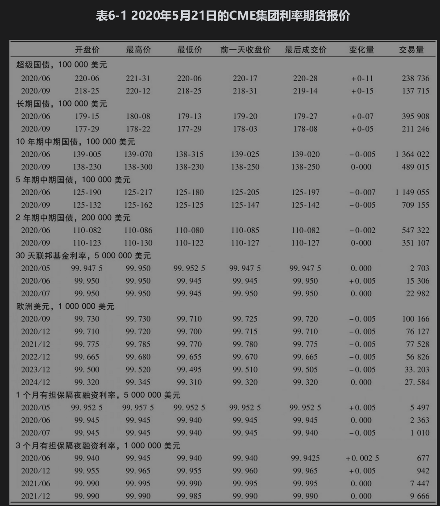
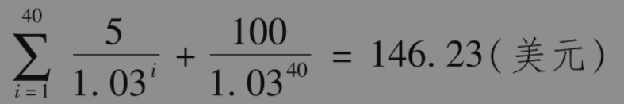
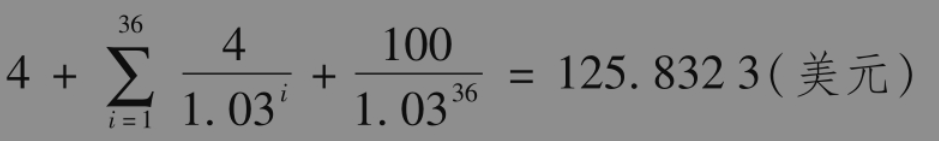
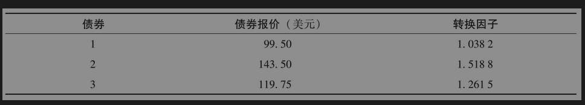
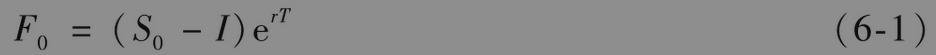
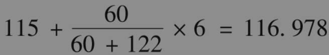
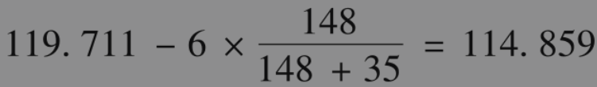
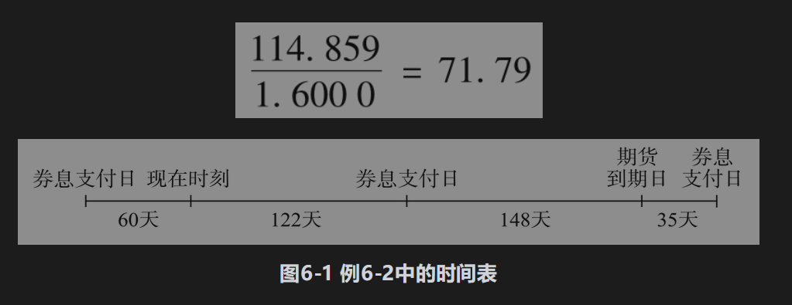

# 6.2 美国国债期货

表6-1是2020年5月21日利率期货的报价。自2010年开始，CME集团引入超级国债期货，任何期限超过25年的国债均允许期货合约的空头方交割。在美国长期国债利率期货合约中，任何期限介于15年与25年之间的债券均可以用于交割。

中期国债是期限为1年到10年的国债。从交易量看，10年、5年和2年美国中期国债期货合约同样非常流行。在10年期中期国债期货合约中，任何尚有
$`6 \frac{1}{2}`$ 到10年期限的长期（或中期）国债均可以用作交割。对于5年期和2年期的合约，可交割的国债的剩余期限分别为5年和2年（原始期限必须少于5.25年）。

30天联邦基金利率期货合约的结算价格是100减去合约期内联邦基金利率的算术平均数，欧洲美元期货合约和有担保隔夜融资利率(SOFR)期货合约将在第6.3节中讨论。

## 6.2.1 报价

超级国债(ultra T-bond)和超级国债期货合约均是对100元面值，以美元和美元的1/32为单位报出的，这与长期国债在即期市场上的报价方式类似。在表6-1中，2020年6月的美国长期国债期货结算价格为179-20，即$`179 \frac{20}{32}`$，或179.625。10年期中期国债期货的结算价格精确度为1/32的一半，因此2020年6月的期货价格为139-025，即$`139 \frac{2.5}{32}`$，或139.078125。5年期和2年期的期货报价更精确，精确度为1/32的1/4，2020年9月5年国债期货的开盘价为125-132，即$`125 \frac{13.25}{32}`$，或125.4140625。类似地，2020年9月2年期国债期货合约的结算价格为110-127，即$`110 \frac{12.75}{32}`$，或110.3984375。

## 6.2.2 转换因子

当交割选定的债券时，一个称为转换因子(conversion factor)的参数定义了空头方所收取的价格。对应于交割债券的报价等于其转换因子与最新成交期货价格的乘积。将累计利息考虑在内（见第6.1节），每交割100美元面值的债券所收入的现金价格为

         最新的期货成交价格×转换因子+累计利息

每一份合约对应于交割100000美元面值的债券。假定最新的成交价格为120-00，交割债券的转换因子为1.3800，并且在交割时面值为100美元的债券的累计利息为3美元。因此，期货空头方交割该债券时，对于每100美元面值所收到的现金数量为（由期货多头方支付）

        1.3800×120.00+3.00=168.60（美元）

期货空头方应交割的债券面值为100000美元，因此收到现金为168600美元。

一个债券的转换因子是这样来确定的：在假定所有期限的利率均为每年6%（按半年复利）的前提下，转换因子等于按交割月份第1天的债券报价所对应1美元面值的债券价格。对于表6-1中的前3份合约，债券的到期日以及距券息支付日的时间均下调到3个月的整倍数。通过这种方法，交易所会产生一个很全面的数表。如果在取整后，债券的期限为6个月的整数倍，我们假定第一次支付利息为6个月后。如果在取整后，债券的期限不是6个月的整数倍（即包含另外3个月），我们假定第一次支付利息为3个月后，支付利息数量中应减去累计利息。

作为以上规则的第一个例子，假定债券的券息率为每年10%，期限为20年零2个月，可以在国债期货合约中交割。为了计算转换因子，假定债券期限为正好20年，在6个月后第一次付息，然后每6个月支付一次券息，直到20年后支付本金为止。假定面值为100美元。当贴现率为每年6%（每半年复利一次），即每6个月为3%时，债券价格为

将以上价格除以100后得出转换因子为1.4623。

作为以上规则的第二个例子，假定债券的券息率为8%，债券期限为18年零4个月。为了计算转换因子，假定债券的期限为18年零3个月。将债券支付的所有现金流以每年（半年复利一次）贴现到3个月后的时间上，债券价格为

3个月的利率为$`\sqrt{1.03}-1`$，即1.4889%。因此，将3个月时的债券价格贴现到今天得出价值为125.8323/1.014889=123.99美元。减去累计利息2.0，得出债券价值为121.99美元。因此，转换因子为1.2199。

对于2年期和5年期债券期货合约，使用类似的计算来确定转换因子，但到期期限四舍五入至最近一个月。

## 6.2.3 最便宜可交割债券

在交割月份的任何时候都有许多债券可以用于长期国债期货合约的交割，这些可交割债券具有不同的券息率与期限。空头方可以从这些债券中选出最便宜可交割债券(cheapest-to-deliver bond)来用于交割。因为空头方收到的现金价格为

        最新成交价格×转换因子+累计利息买入债券费用为

买入债券费用为

          债券报价+累计利息

因此最便宜可交割债券是使得

          债券报价-最新成交价格×转换因子

达到最小的债券。一旦期货的空头方决定交割债券，最便宜可交割债券可以通过考虑每个可交割债券来确定。

【例6-1】 在期货空头方决定交割时可以从下表中选出最便宜可交割债券。假定最近一次成交的期货价格为93-08，即93.25美元。

交割每种债券的成本如下：

债券1:99.50-(93.25×1.0382)=2.69（美元）

债券2:143.50-(93.25×1.5188)=1.87（美元）

债券3:119.75-(93.25×1.2615)=2.12（美元）

因此，最便宜可交割债券为债券2。决定最便宜可交割债券的因素有许多种。当债券收益率大于6%时，转换因子系统倾向于券息率较低而且期限较长的债券。当债券收益率小于6%时，系统倾向于券息率较高而且期限较短的债券。还有，当收益率曲线为上升形时，通常会倾向于交割期限较长的债券；当收益率曲线为下降形时，通常会倾向于期限较短的债券。

除了拥有交割最便宜可交割债券的选择外，空头方还拥有一个称为万能牌规则的选择，在业界事例6-2中描述了这种选择。

## 业界事例6-2

## 万能牌规则

CME集团长期国债期货交易的交割价格是芝加哥当地时间下午2点的期货价格。但是，长期国债的即期交易在2点以后继续交易，而持有期货空头的交易员可以在当天更晚时间向结算中心下达交割意向通知书。在下达交割通知后，交割应付价格(invoice price)是以当天的成交价格为基础来进行结算的，该成交价格为下午2点的期货价格。

这种做法给了期货的空头方一种叫作万能牌规则(wild card play)的选择权。如果在交割月第1天的下午2点后债券价格下跌，空头方可以在比如3点45分发出交割意向通知书，然后买入债券并以下午2点的期货价格为标准计算交割价格。如果债券价格没有下跌，空头方可以保持头寸，并等到第2天再采用相同的策略。

就像空头方拥有其他选择权一样，万能牌选择权并不是免费的：它的价值反映在其期货价格中，有选择权的期货价格比不具备选择权的期货价格要低。

## 6.2.4 确定期货价格

由于空头方拥有选择交割时间和所交割债券的权利，因此精确地确定长期国债期货的理论价格十分困难。但是如果假定已知最便宜可交割债券及交割日期，长期国债期货等价于一个为持有人提供中间收入的证券上的期货合约。式(5-2)给出了期货价格F0与即期价格S0之间的关系式

其中，I为期货期限内券息的贴现值，T为期货到期时间，r为适用于期限T的无风险利率。

【例6-2】 假定对于某一国债期货已知最便宜可交割债券的券息率为12%，转换因子为1.6000。假定已知期货交割日期为270天后，每半年一次支付一次券息。如图6-1所示，上一次券息支付为60天前，下一次券息支付为122天后，再下一次券息支付为305天后。利率期限结构为水平，每年10%（连续复利）。假定债券的当前报价为115美元。债券的现金价格等于报价加上从上一次付息到今天的累计利息，债券现金价格为

在122天（0.3342年）后，债券持有者将收到6美元的券息，其贴现值为

$`6 e^{-0.1 \times 0.3342}=5.803`$

期货合约将持续270天（0.7397年）。如果期货合约是关于券息率为12%的债券，期货的现金价格为

$`(116.978-5.803) \mathrm{e}^{0.1 \times 0.7397}=119.711`$

在债券交割时会有148天的累计利息。假如期货合约是关于券息率为12%的债券，期货的报价为

由转换因子的定义，1.6000倍的标准债券等价于一个12%的债券。因此，期货的报价应为

