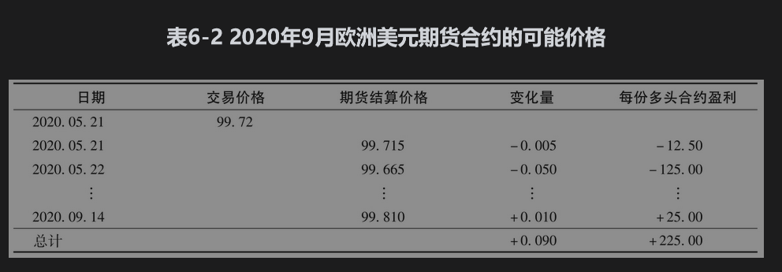
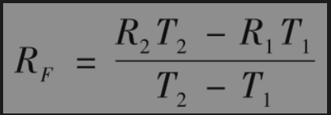
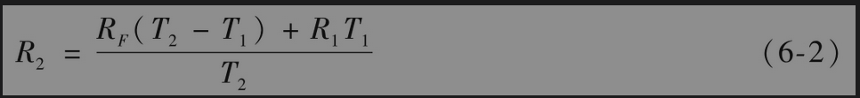
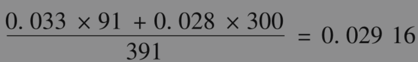
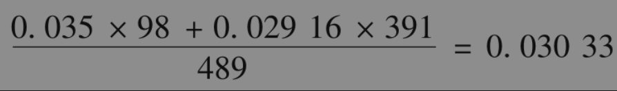

# 6.3 欧洲美元期货和有担保隔夜融资利率期货

在美国市场里最流行的利率期货是CME集团交易的3个月期限欧洲美元期货合约，以伦敦银行同业拆借利率(LIBOR)3个月期（90天）欧洲美元大额存单为基础报价。CME集团中交易的欧洲美元期货合约的期限最长为10年。从表6-1可以看出，2020年5月欧洲美元期货的交易量仍然相当高。但考虑到LIBOR利率将在2021年年底被逐步取消（见第4.2节），人们预计随着时间的推移，欧洲美元期货将逐渐被有担保隔夜融资利率期货取代。欧洲美元期货的交易量和未平仓量一直在下降，而有担保隔夜融资利率期货的交易量和未平仓量一直在上升。在本节中，我们将解释这两个合约的运作方式。

## 6.3.1 欧洲美元期货

欧洲美元期货合约的最后一个交易日是交割月份第3个星期三的两天前。在最后一个交易日，有一个数量为100-R的最后成交价格，其中R为这一天确定的3个月欧洲美元利率，该利率按每季度复利（天数计算惯例为“实际天数/360”）。因此，如果3个月期限的欧洲美元利率为0.75%（按季度复利，实际天数/360），那么期货的最后成交价格为99.250。一旦最后交易结算完成，所有合约被宣布平仓。表6-1表明，很多欧洲美元期货合约将于2021年之后才到期。正如第4.2节所讨论的，银行很可能会在2021年年底停止使用LIBOR。在这种情况下，CME集团表示将会以SOFR为最终结算基础，并对两种汇率之间的差额进行适当调整。

合约的设计使得期货报价1个基点(=0.01)的变化对应于每份合约25美元的收益或亏损。当欧洲美元报价增长1个基点时，持有一份合约多头的交易员的收益为25美元，而持有一份合约空头的交易员的损失为25美元。类似地，当报价下跌1个基点时，持有一份合约多头的交易员会亏损25美元，而持有一份合约空头的交易员会盈利25美元。例如，当交割价格从99.725变为99.685时，多头交易员在每份合约上的损失为25×4=100美元，空头方交易员每份合约上的收益为100美元。在期货报价中1个基点的变化相当于标的利率0.01%的变化，这会导致面值100万美元在3个月的利息变化为

        1000000×0.0001×0.25=25（美元）

因此，“每个基点变化25美元”的规则与以上提过的合约是为了锁定面值为100万美元的3个月利率的说法一致。

期货报价为100减去期货利率。因此，利率下降时对期货多头的投资者有利，利率上升时对期货空头方的投资者有利。假设某交易员在2020年5月21日以99.720的结算价格承约了表6-1中2020年9月期货多头，表6-2展示了可能出现的一组结果。

如果一笔本金为1000000美元，利率基于LIBOR的借款将在2020年9月14日后的3个月后到期，那么表6-2中的欧洲美元期货合约可以用来对冲该风险敞口。欧洲美元期货合约锁定的LIBOR为100-99.720，即每年0.28%。表6-2中2020年9月14日的LIBOR为100-99.810，即每年0.19%。收到的利息为0.25×0.0019×1000000=475（美元）。当考虑期货合约的225美元的收益时，收到的金额为700美元。这相当于LIBOR为0.28%时的收益，0.25×0.0028×1000000=700（美元）。可见，对冲的效果很好，但值得注意的是，对冲不是完美的，这是因为：①期货合约是每日结算（而不是仅在最后）；②期货的最后结算是在合约到期日，而3个月投资的利率支付是在3个月之后。

## 6.3.2 SOFR期货合约

表6-1显示了1个月和3个月期限有担保隔夜融资利率(SOFR)期货报价。期限为1个月的SOFR期货合约的设计与期限为1个月的联邦基金利率期货合约类似，交割月的结算价格等于100减去该月内SOFR的日均值（假设周末和节假日的利率为最近1个工作日的利率）。可以看出，2020年5月的期货合约仍然在2020年5月21日交割，尽管这个月大约2/3的利率已经被观察到。5月、6月和7月期货合约的结算利率分别是0.0475%、0.055%和0.55%。相应的联邦基金期货合同的利率也很相似。（理论上，它们应该稍微高一点，因为联邦基金利率是一个无担保利率，而SOFR是有担保的。但实际上差异非常小，在报价中不明显。）

利用一份期限为1个月的SOFR期货合约对冲5000000美元的头寸。与联邦基金利率合约类似，当期货报价变化1个基点，期货合约的盈利为41.67美元，与5000000美元风险敞口的损益大小一致，5000000×0.0001×1/12=41.67（美元），期货合约在13个月后交易。

期限为3个月的SOFR期货合约的设计与3个月欧洲美元期货合约类似，结算日为最后一个月第3个星期的星期三，结算价格等于100减去前3个月SOFR的复利。表6-1中的合约在3个月期限的期初交易，期末交割。因此，2020年6月的合约在2020年9月16日结算，结算价格等于100-R的最后成交价格，其中R是通过将2020年6月17日和2020年9月15日之间观察到的一天期SOFR通过复利转换获得的利率。（不包含最后一天的利率。）

期限为3个月的SOFR期货合约的交割月在3月、6月、9月和12月。CEM集团交易的1份10年期期货合约的交割月共有39个，交易员可以在未来10年内对冲或推测SOFR。该合约能对冲1000000美元的头寸（类似于欧洲美元期货合约）。当期货报价变化1个基点，每份合约的损益为25美元。因此，3个月期的SOFR期货合约和3个月欧洲美元期货合约在结构上非常类似。主要的区别在于，欧洲美元期货合约在3个月合约期的期初结算，而SOFR期货合约在3个月合约期的期末结算（能观测到时间段内每天的利率）。

【例6-3】 假设在2020年5月21日，一名投资者以3个月SOFR加上200个基点的利率获得一笔从2021年12月16日开始，期限为3个月的1亿美元借款。从表6-1可知，2021年12月3个月期有担保隔夜融资利率期货报价为99.990。因此，借款期间的SOFR仅为0.01%（1个基点）。投资者认为利率可能会上升，因此希望利用期货将借款利率锁定在2.01%。投资者可以通过做空100份12月合约来做到这一点。如果利率上升，期货报价将下降，并将产生收益来补偿额外支付的利息；如果利率下降，报价将上升，期货将出现亏损，但这将由支付的利息减少来补偿。

例如，假设最终的结算价格是99.200，即每年利率是0.8%。借款利率为每年2.8%，支付的总利息为0.25×100000000×0.028=700000（美元）。然而期货合约已经下降了79个基点（从99.990降至99.200），收益25美元，对应100份合约的收益为100×25×79=197500（美元），即实际支付的金额为700000-197500=502500（美元），对应的借款利率为每年2.01%，也就是0.25×100000000×0.0201=502500（美元）。

2020年5月21日，人们认为SOFR可能为负值。（新冠肺炎疫情暴发后，美联储采取措施通过降低利率来刺激经济，而其他一些国家的利率为负值。）假设最终结算价格为100.400。适用于借款的SOFR是-0.4%，投资者的借款利率为2%-0.4%=1.6%，支付的利息为0.25×100000000×0.016=400000（美元）。然而，期货合约增加了41个基点，导致损失100×25×41=102250（美元），使总支付金额达到502250美元。

## 6.3.3 凸性调整

在第5章中，我们认为对于大多数合约，没有必要区分期货和远期利率，因为两者非常类似。但当期货合约的期限超过2年时，区分期货和远期利率就很有必要。我们需要对于以上两种利率的差别进行凸性调(convexity adjustment)

             远期利率=期货利率-c

其中，c是凸性调整。进行凸性调整的一个原因是每日结算制度。假定有两个交易员，交易员A签订了期货合约，在利率较高时每天结算会造成现金流的流入，而在利率较低时会造成现金流的流出（交易员A可能是例6-3中的投资者）。交易员B也签订了类似的远期合约，除了交易员A每日结算，而交易员B在期末结算之外，利率是相同的。每日结算将有利于交易员A。当利率上升时，交易员A立即获利，因为利率刚刚上升，收益将倾向于以相对较高的利率投资。当利率下降时，交易员A会立即蒙受损失，但由于利率刚刚下降，这将倾向于以相对较低的利率融资。换句话说，当利率高时，交易员A的保证金账户里的资金会比利率低时更多。持有远期利率合约的交易员B并没有从每天的利率变化中受益。为了弥补这一点，交易员B的远期报价应该比交易员A的期货报价更有吸引力。在这种情况下，更有吸引力的报价对应较低的远期利率，因此凸性调整c是正值。

就欧洲美元期货合约而言，还有另一个考虑因素。期货合约在合约期初支付，而远期利率合约在合约期末支付。再次考虑交易员A和交易员B，如果利率上升，他们将获利，如果利率下降，他们将亏损。当利率被证明是高时，延迟结算对交易员B的收益价值的影响是相对高的。当利率被证明较低时，延迟结算对交易员B损失的影响相对较低。因此，结算时间的差异有利于交易员A，与每日结算一样，导致远期利率低于期货利率。因此，凸性调整c是正值，随着合约期限和利率波动程度的增加而增加。

## 6.3.4 零息利率曲线的计算

在经过刚刚描述的凸性调整以后，期货合约可用于估计远期利率。然后可以计算零息利率。从式(4-5)可知，在T1和T2间的远期利率是

其中，R1和R2分别是到期日为T1和T2的零息利率。（假设利率均为连续复利）因此

此公式可以用于计算LIBOR或SOFR零息利率曲线。

考虑一个期限为1年的LIBOR零息利率曲线（前提是银行继续提供估算其借款利率的报告）。式(6-2)可用来扩展到这个曲线，正如我们现在将显示的那样。

【例6-4】 300天期限的LIBOR零息利率（使用6个月和12个月期限的利率之间的插值）为2.80%（连续复利），由欧洲美元期货报价得出：①在300天开始的90天远期利率为3.30%（连续复利）；②从391天开始的90天远期利率是3.50%（连续复利）；③从489天开始的90天利率是3.60%（连续复利）。我们可以利用式(6-2)得出第391天的零息利率为

即2.916%。类似地，我们可以使用第2个远期利率来得出第489天的零息利率

即3.033%。下一个远期利率将会用来确定对应下一个欧洲美元期货到期日的零息利率（注意，尽管欧洲美元期货利率期限为90天，假设其覆盖区间为两个相邻的期货到期日，区间长度为91天或98天）。

确定短期到期的SOFR会复杂一点。我们用另一个例子来说明这一点。

【例6-5】 现在是10月，目前为期三个月的SOFR期货合约还有两个月到12月的最终交付日期。进一步假设第一次复合隔夜利率（已经观察到）合同月的利率为每年2%，期货报价显示整个三个月的利率为每年2.5%。如果所有的利率都用连续复利法表示，未来两个月的隐含零息利率R通过求解得出

          0.02×(1/12)+R×(2/12)=0.025×(3/12)

隐含利率为0.0275，即2.75%。从当年12月至第2年3月的合同计算的远期率可与此估计和式(6-2)一起使用，以获得例6-4中的5个月期限的零息利率。涵盖3月至6月期间的合同同样可以确定8个月期限的零息利率，依此类推。