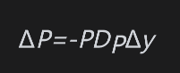
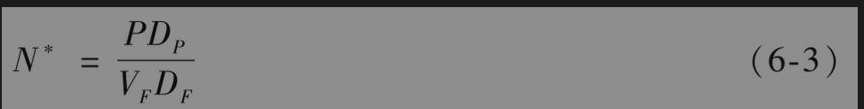
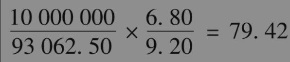

# 6.4 基于久期的期货对冲策略

我们在4.10节中曾讨论了久期。我们现在考虑如何利用利率期货来对冲债券组合在将来的收益。定义：

$`V_F`$：一份利率期货合约的价格：

$`D_F`$：期货标的资产在期货到期日的久期值：

P：被对冲的债券组合在对冲到期日的远期价值（在实际中，通常假设该价值等于债券组合的当前价值）；

$`D_P`$：在对冲到期日时，被对冲的债券组合的久期值。

如果我们假设对应于所有期限，收益率的变动均为Δy，那么以下方程近似成立

以下方程也近似成立

因此用于对冲收益率变动Δy所需的合约数量为

这个公式是基于久期的对冲比率(duration based hedge ratio)，有时也称为价格敏感性对冲比率(price sensitivity hedge ratio)。

当用于对冲的产品为长期国债期货时，对冲者必须在假设被交割的债券为某一特定债券的前提下计算DF。这意味着对冲者在实施对冲时，必须首先估计哪一个债券可能是最便宜可交割债券。如果利率环境的变化使其他债券变成了最便宜可交割债券，对冲者必须将对冲头寸进行调整，因此对冲效果也许会比预期的要差。

当用于对冲的产品为利率期货时，对冲者应注意利率与期货价格向相反方向变动：当利率上升时，利率期货价格下降；当利率下降时，利率期货价格上升。因此，在利率下降时会承受损失的公司应承约期货的多头。类似地，在利率上升时会承受损失的公司应承约期货的空头。

对冲人应选择期货合约使标的资产的久期尽量接近于被对冲资产的久期。欧洲美元期货常常用于短期利率头寸对冲，而超级国债、长期国债和中期国债期货常常用于对长期限利率头寸的对冲。

【例6-6】 假定今天是8月2日。一位负责管理价值为1000万美元的政府债券组合的基金经理十分担心在今后3个月内利率会剧烈变化，并决定利用12月的国债期货来对冲债券组合的价格变动。12月国债期货的报价为93-02，或93.0625。由于每份合约要交割面值为10万美元的国债，因此合约的价值为93062.50美元。

假设证券组合在3个月后的久期为6.80年。国债中最便宜可交割债券预计为20年期、券息率为12%的债券。这一债券当前收益率为每年8.80%，在期货到期时，其久期为9.20年。

基金经理需要持有国债期货的空头头寸来对冲其证券组合的价格变动：如果利率上升，期货空头会带来收益，同时债券组合会产生损失；如果利率下降，期货空头会带来损失，但债券组合会增值。基金经理需要卖出债券期货空头的数量可由式(6-3)求得

将以上数字取整，基金经理需要做空79份合约。