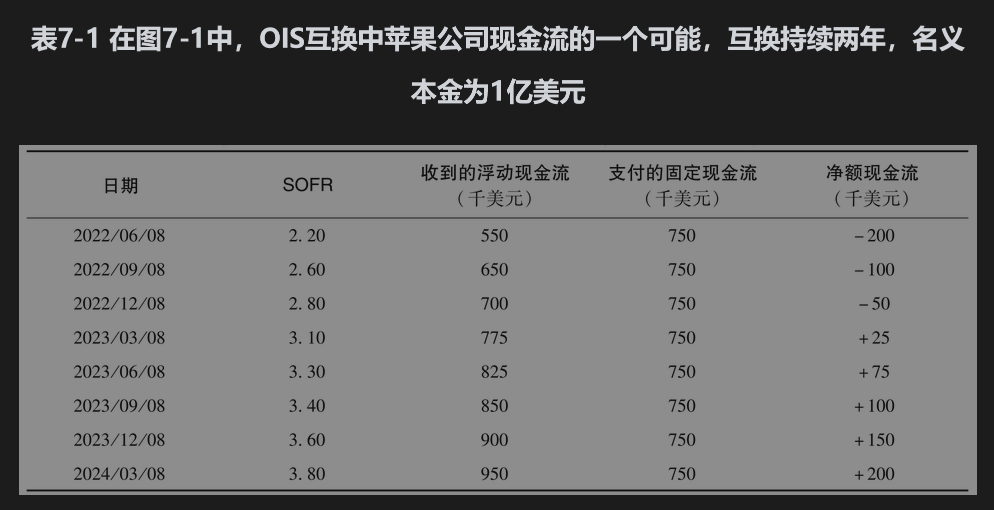

# 7.1 互换合约的机制

利率互换(interest rate swap)是一种互换合约，其中在约定的时间内定期将约定的固定利率用于某一本金所得利息与将“浮动参考利率”用于同一本金所得利息相交换。在历史上，利率互换中最常见的浮动参考利率是LIBOR。例如，在过去签署的利率互换可能是如下协议，即以对应于5000万美元本金、在2%利率下的利息与对应于同一本金、在3个月LIBOR下的利息进行交换，交换时间是之后5年内每3个月一次。

正如第4章所示，LIBOR是一个不尽如人意的参考利率，因为它是基于银行的估计而不是实际交易。金融市场将逐步废除LIBOR，取而代之的隔夜参考利率基于银行间的隔夜交易。对于互换市场来说，这个过渡期将是一个棘手的时段。许多LIBOR与固定利率的互换是在过去已经达成的，而且期限很长，这些合约在废除LIBOR后将继续存在。例如，在2013年年底达成的20年期互换在2021年年底仍有12年的剩余期限（而2021年是终止LIBOR的原定日期）。如果在2021年年底之后银行停止提供关于LIBOR的估值，市场就如何根据新的参考利率来估计LIBOR的方法必须达成一致。例如，3个月期的美国LIBOR很可能被估计为3个月期的SOFR加上一定溢差x，其中x是基于过去观察到的两个利率差异的平均值。

在这里我们有必要回顾一下LIBOR与替代它的隔夜参考利率之间的差异：

• LIBOR是银行在银行间市场上估计的1天到1年期限不等的借款利率。

• SOFR和SONIA等隔夜利率是基于银行间的实际交易。

• 隔夜利率可通过所谓的“平均化过程”来转换为较长的参考利率。通常，平均化过程包括第4.2节所述的每日复利计算，但有时也会使用简单的算术平均值（如CME的1个月期SOFR期货）。

• 对应于某一时段的LIBOR在其适用的时段开始时就成为已知，而隔夜利率的平均过程的最终结果仅在该期间结束时才能产生。

• LIBOR包含信用风险，而基于隔夜利率的利率，如SOFR和SONIA，则被认为是无风险利率。

随着LIBOR被逐步废除，基于隔夜利率的互换交易正变得越来越流行，这些互换称为隔夜指数互换(overnight indexed swap, OIS)。

OIS是将固定利率与参考利率进行互换的协议，这里的参考利率由已实现的隔夜利率计算得出的。OIS的简单例子是一个3个月期限的互换：互换将会在3个月结束时进行一次利息交换，用于某一本金固定利率下的利息与对应于同一本金参考利率下的利息相交换。期限为1个月、6个月，或者1年的OIS都与此相似：在期限末会有一次利息交换。当OIS的期限超过1年时，通常会将期限分成3个月的时间段，在每3个月的期末将固定利率下的利息与参考利率下的利息进行交换，其中3个月的参考利率是根据1天利率计算得出的。目前市场上已经出现了10年期限（甚至更长）的OIS交易。

考虑在2022年3月8日苹果公司和花旗集团之间签订的2年期OIS合约：假设苹果公司同意以每年3%的利率向花旗集团支付对应于1亿美元名义本金的利息，作为回报，花旗集团同意以相同名义本金向苹果公司支付对应于3个月期的浮动参考利率的利息。苹果公司是固定利率付款方；而花旗集团是浮动利率付款方。为了便于说明，假设利率是按季度复利。在这里我们忽略天数计算惯例和假日惯例(holiday convention)的影响（这些内容将在本章后面解释）。互换交易如图7-1所示。

在这笔互换交易中总共有8次利息的交换，表7-1显示了一种可能发生的结果。第1次交换支付发生在2022年6月8日：苹果公司将向花旗集团支付75万美元（1亿美元的3%的利息的1/4）。按照前3个月的每日SOFR计算出的3个月利率，花旗集团向苹果公司支付相应利息。在2022年6月8日计算的3个月SOFR（根据2022年3月8日至2022年6月8日的隔夜利率）为每年2.2%，或每3个月0.55%（在计算中使用第4.2节中的公式）。因此，花旗集团需向苹果公司支付的浮动利息为55万美元。将固定利息和浮动利息净额结算后，在2022年6月8日苹果公司需要向花旗集团支付20万美元。第2次交换利息的时间是2022年9月8日。同样，苹果公司向花旗集团支付的固定利息为75万美元。假设在2022年9月8日计算的3个月SOFR（根据2022年6月8日至2022年9月8日之间的隔夜利率计算）为每年2.6%，或每3个月0.65%。因此，浮动利息为65万美元，苹果公司向花旗集团支付的净额为10万美元。

OIS互换和LIBOR互换有什么区别呢？如果将表7-1中第2列的标题改为“LIBOR”，该表可以提供LIBOR互换的示例。不同之处在于任意一个时段的LIBOR在时段开始时就为已知，而OIS利率在该时段结束前一直是未知的。在2022年6月8日，用于计算第一个浮动利息数量的利率为2.20%。如果将利率换成LIBOR，那么在2022年3月8日（即在互换开始时）就已经知道该利率的值；在2022年9月8日，用于计算浮动利息的利率为2.60%，在2022年6月8日就已经知道该利率的值，依此类推。

