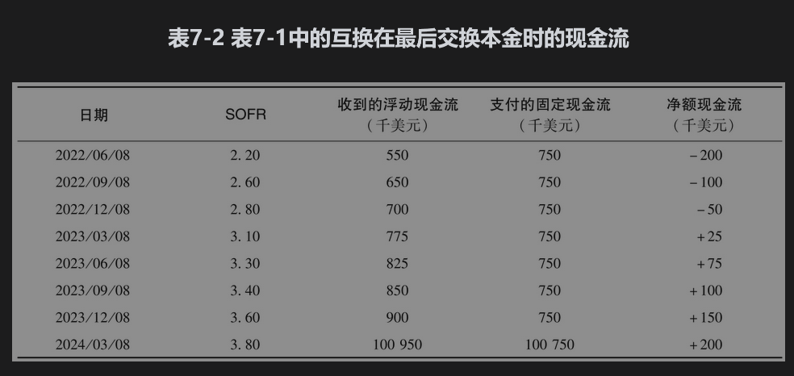
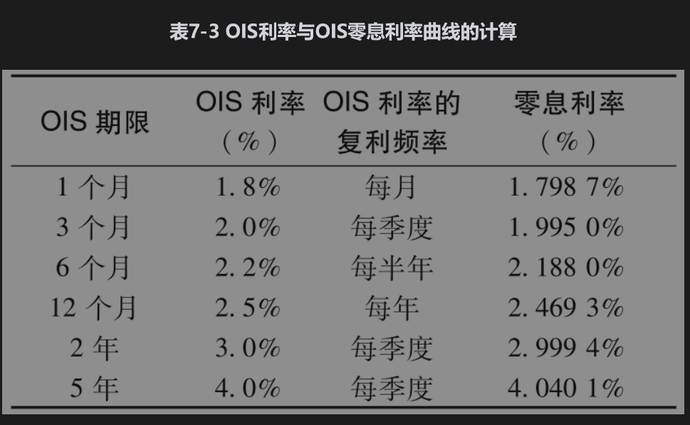
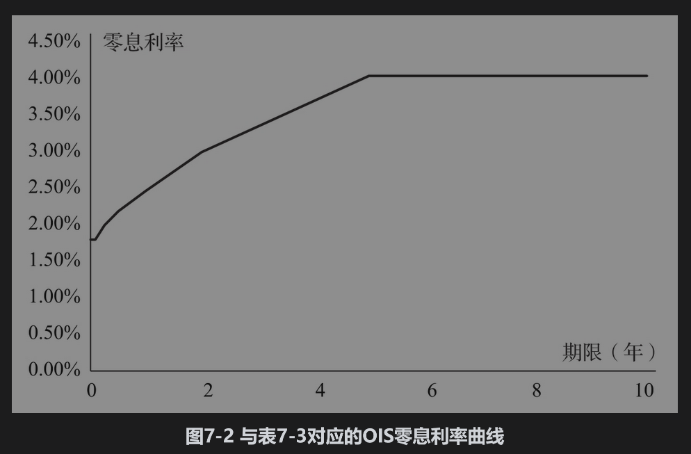

# 7.2 确定无风险利率OIS

在确定衍生产品定价所需的无风险利率方面扮演着十分重要的角色。

在最初签署OIS时其价值为0（从这一点看，OIS就像一个远期合约），在合约中与浮动利率交换的固定利率称为OIS利率，在任何时刻都可以在市场上观察到一系列期限的OIS利率。期限为1年或1年以下的OIS利率只对应一次利息的交换。因此，对于这样的OIS利率有一个简单的解释：它们提供了与基础隔夜利率等价的无风险零息利率。现在考虑期限大于1年的OIS利率。

在OIS中，名义本金(notional principal)是不交换的（这也就是我们将它称为名义本金的原因）。然而，如果在互换到期时交换名义本金，由于固定利率和浮动利率支付的名义本金相同，所以交换的金额数量不会发生任何变化。在互换到期时加上本金交换，由表7-1可以生成表7-2。从表7-2中可以看出互换的功能是将浮动利率债券（第3列现金流）转换为固定利率债券（第4列现金流）。

这里一个关键点是表7-2中浮动利率债券的价值为1亿美元，这是因为它提供了按隔夜利率借款1亿美元所对应的利息金额。（为了说明这一点，假设：①每个季度以连续的隔夜利率借入1亿美元外加累计利息；②每个季度末支付累计利息；③两年末偿还1亿美元本金。）因为在最初签订时OIS价值为0，固定利率债券（表7-2第4栏）的价值也必须等于1亿美元，这表明3%的OIS利率等价于一个2年期每季度支付固定券息的平价债券的利率。

因此，像在第4.7节里一样，可以用国债利率相同的方式使用OIS利率定义零息利率曲线。小于1年期的OIS利率直接定义了零息利率，而长期OIS利率定义了平价债券的利率。我们可以假设零息利率曲线在期限之间为线性，并且可以通过DerivaGem软件进行计算。表7-3和图7-2是计算结果的例子。在本例中确定2年期和5年期零息利率时使用迭代搜索程序（如Excel中的Solver程序）使它们满足以下条件：

• 2年期、每季度付息、券息率为3%（年利率）的债券为平价债券。

• 5年期、每季度付息、券息率为4%（年利率）的债券为平价债券。

