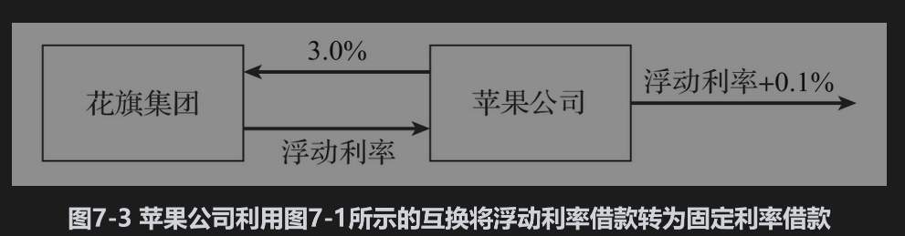
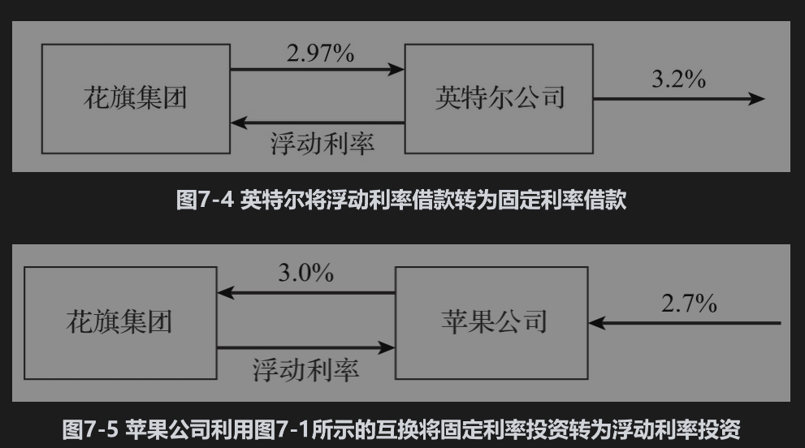
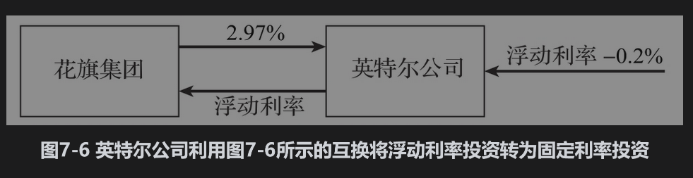

# 7.3 交易利率互换的原因

因为有许多用途，利率互换非常流行。无论使用哪种浮动参考利率，在接下来的几节中大多数关于利率互换的讨论都适用。

## 7.3.1 利用互换转变负债特征

对于苹果公司，图7-1所示的利率互换可以将浮动利率贷款转换为固定利率贷款（如图7-3所示）。假设苹果公司已经以浮动利率+10个基点借入1亿美元（一个基点是1%的1%，实际贷款利率为浮动利率+0.1%）的贷款。当苹果公司签订互换合约后，将会有以下3项现金流：①支付给外部放款人的利率为浮动利率+0.1%；②在互换合约中收入浮动利率；③在互换合约中支付3%的利率。

以上3项现金流的净效果为支付利率为3.1%的现金流。该互换将苹果的浮动利率+10个基点的浮动利率贷款转换为3.1%的固定利率贷款。

希望将固定利率贷款转换成浮动利率贷款的公司将会签订相反的合约。假设英特尔公司持有利率为3.2%、面值为1亿美元的3年期贷款，并希望将其转换成浮动利率贷款。与苹果公司一样，英特尔公司联系花旗集团并与其签订像图7-3所示的互换：在互换中英特尔公司支付浮动利率，同时收取2.97%的固定利率。

相关互换如图7-4所示。英特尔将会有以下3项现金流：①支付给外部放款人3.2%的利率；②在互换合约中付出浮动利率；③在互换合约中收入2.97%的利率。以上三项现金流的净效果为支付浮动利率+23个基点（即浮动利率+0.23%）的现金流。因此，对英特尔公司来讲，交换的效果是将3.2%的固定利率贷款转换为浮动利率+0.23%的贷款。

## 7.3.2 利用互换转变资产特征

利率互换也可以转换资产的特征。考虑例子中的苹果公司。图7-1中的互换可以将收入固定利息的资产转换成收入为浮动利息的资产。假设苹果公司持有面值为1亿美元的3年期债券，债券每年提供的券息为2.7%。相关互换如图7-5所示。苹果公司会有以下3项现金流：①债券收入为2.7%的利率；②在互换合约中收入浮动利率；③在互换合约中付出3%的利率。

以上3项现金流的净效果为收入现金流的年率，等于浮动利率减去30个基点。因此对于苹果来讲，互换的一种应用是将收入为固定利率2.7%的资产转换为浮动利率-0.3%的资产。

接下来考虑英特尔公司签订的如图7-4所示的互换。互换的效果是将浮动利率资产转换为固定利率资产。假设英特尔拥有一笔收益为浮动利率减去20个基点的1亿美元投资。相关互换如图7-6所示。英特尔公司会有以下3项现金流：①投资收入为浮动利率减去20个基点；②在互换合约中付出浮动利率；③在互换合约中收入2.97%的利率。

以上三项现金流的净效果为收入2.77%的现金流。对于英特尔公司来讲，利率互换可将其收取浮动利率减去20个基点的资产转换为收取2.77%的固定利率资产。

