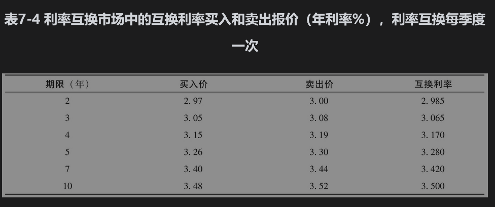
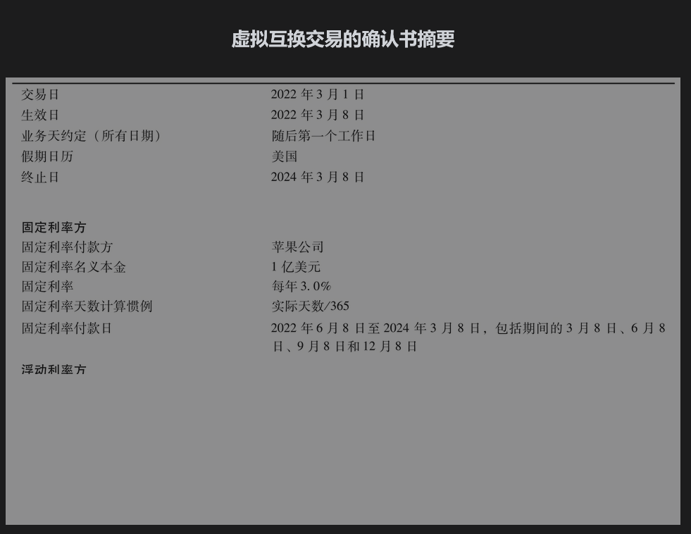

# 7.4 交易方式

像花旗集团这样充当做市商的金融机构会为准备承约的互换交易的固定利率提供买卖报价。表7-4中显示了在考虑图7-3至图7-6所示交易时，可能存在的固定利率的所有报价：买入价是金融机构支付固定利率和收入浮动利率时适用的固定利率，卖出价是在收入固定利率和支付浮动利率时适用的固定利率。买入和卖出利率的平均值称为互换利率(swap rate)，显示在最后一栏中。买卖价差（表中的3～4个基点）是用来补偿做市商的成本。

做市商可能偶尔会很幸运地几乎同时与两家非金融公司签订相互抵消的交易。在一般情况下，当做市商与一家非金融公司进行交易时，还必须与另一家金融机构进行相反的交易，目的是对冲风险，这样做会降低盈利。此外，如前几章所述，由于2008年的金融危机而促成的一项国际协议要求金融机构之间的标准互换交易必须在电子平台上进行，并通过中央交易对手(CCP)进行清算。这项协议不适用于图7-4和图7-6中的互换，因为英特尔公司是一家非金融公司，但它适用于花旗集团与任何一家金融机构之间的对冲交易。尽管花旗集团与英特尔公司的交易可能不需要支付抵押品，而与另一家金融机构的对冲交易则需要支付初始保证金和变动保证金，这是因为交易将通过CCP进行清算。本书在第9章里将对此做进一步讨论。

## 7.4.1 天数计算惯例

我们在第6.1节中讨论了天数计算惯例。天数计算惯例会影响互换中支付利息的数量，这意味着在本章前面示例中的一些数字只是大致正确。浮动参考利率（如SOFR和美国LIBOR）的报价是按“实际天数/360”计算的。表7-1中的第1次浮动利息支付是基于2.2%的利率。因为2022年3月8日和2022年6月8日之间有92天，所以反映实际天数/360的浮动利息数额为

一般在互换合约中浮动利息的现金流等于LRn/360，其中L为本金，R为相关的浮动参考利率，n为应计息的天数。

互换中固定利率的报价也使用天数计算惯例，常用的固定利率天数计算惯例为“实际天数/365”或“30/360”, 这意味着固定利率和浮动利率通常不可直接比较：一种适用于360天，而另一种适用于整年。此外，在“实际天数/365”的情况下，互换中固定利息的现金流将根据适用期间的天数而略有不同。

为了方便叙述，在本章下面的计算中我们将忽略天数计算惯例的问题。

## 7.4.2 确认书

在互换中的确认书(confirmation)是由交易双方代表签署的法律文件。确认书的初稿由总部在纽约的国际互换与衍生产品协会(International Swaps and Derivatives Association, ISDA, www.isda.org)提供。ISDA已经制定了一些主协议(master agreement)，这些协议试图覆盖所有场外市场的衍生产品交易，并且定义当交易的一方违约时将如何对合约进行处理以及相关交易需要的抵押品（如果需要的话）等。在业界事例7-1中，我们展示了苹果公司与花旗集团在图7-1的互换合约确认书的摘要。一份完整的确认书一般会指明ISDA主协议里的条款适用于这一交易。

确认书中指明业务天惯例(business day convention)为随后第一个工作日(following business day)和由美国的日历来作为决定一天是工作日还是节假日。这意味着如果一个付款日刚好为周末或美国的假日，付款日会挪到下一个工作日。

## 业界事例7-1

