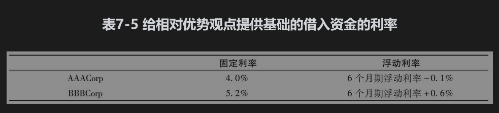
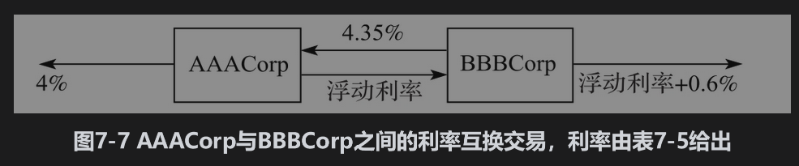
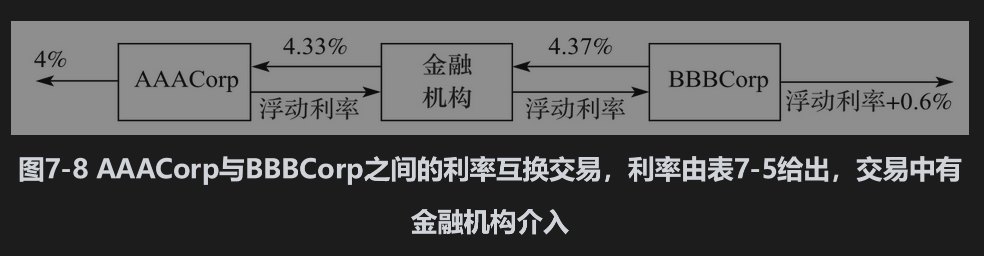

# 7.5 相对优势的观点

一种对互换合约在市场上如此流行的解释是所谓的相对优势(comparative-advantage)。这里的相对优势是指一家公司在一种债务市场里比在其他债务市场里具有相对优势。考虑利用利率互换转换负债性质的例子：某些公司在固定利率市场贷款具有相对优势，而另一些公司在浮动利率市场贷款具有相对优势。当需要一笔新的贷款时，公司会在自身具有相对优势的市场。因此，本想借入固定利率贷款的公司可能会借入浮动利率贷款，而本想借入浮动利率贷款的公司可能会借入固定利率贷款。互换合同可以用来将固定利率贷款转化为浮动利率贷款，反之亦然。

## 7.5.1 例示

假定两家公司AAACorp与BBBCorp均想借入1000万美元，期限为5年。表7-5给出了相应的贷款利率。AAACorp的信用评级为AAA；BBBCorp的信用评级为BBB；我们假定BBBCorp想借入固定利率贷款，AAACorp想借入浮动利率贷款。BBBCorp的信用评级比AAACorp差，因此，它所付的固定利率与浮动利率都会比AAACorp更高

提供给AAACorp及BBBCorp的利率报价中有一个重要特点：固定利率之间的差价大于浮动利率之间的差价。BBBCorp在固定利率市场要比AAACorp多付1.2%，而在浮动利率市场只多付0.7%。BBBCorp在浮动利率市场具有相对优势，AAACorp在固定利率市场具有相对优势。这一明显的差异也就触发了互换合约的形成：AAACorp以每年4%借入固定利率，BBBCorp以浮动利率+0.6%借入浮动利率，然后它们承约利率互换交易，最终结果是AAACorp公司融资利率为浮动利率，而BBBCorp公司的融资利率为固定利率。

为了理解互换的运作过程，我们（不太现实地）假定AAACorp与BBBCorp直接取得联系。它们达成的互换合约如图7-7所示。AAACorp同意向BBBCorp支付本金为1000万美元的6个月期浮动利率。作为回报，BBBCorp向AAACorp支付本金为1000万美元、每年4.35%的固定利率。

AAACorp会有以下3项现金流：

(1)支付给外部放贷人的利率为4%。

(2)在互换合约中从BBBCorp收入4.35%。

(3)在互换合约中向BBBCorp支付浮动利率。以上3项现金流给AAACorp带来的净效果是支出年率为浮动利率-0.35%的现金流。这比直接在浮动市场上贷款的利率低了0.25%。

当承约互换合约后，BBBCorp也有3项现金流：

(1)支付给外部放贷人的利率为浮动利率+0.6%。

(2)在互换合约中从AAACorp收入浮动利率。

(3)在互换合约中向AAACorp支付4.35%的利率。

以上3项现金流给BBBCorp带来的净效果是支出年率为4.95%的现金流。这比在固定市场的贷款利率低了0.25%。

在这个例子中，互换的构造使得双方均少付了0.25%，但不一定非是这样。很显然，这类互换合约的总收益总是a-b，其中a为两家公司在固定利率市场的利率差，b为两家公司在浮动利率市场的利率差。在我们的例子中，a=1.2%，b=0.70%，所以总收益为0.5%。

如果AAACorp与BBBCorp之间并不是直接进行交易，而是利用金融机构，结果可能如图7-8所示。这时，AAACorp的贷款利率为浮动利率-0.33%，BBBCorp的贷款利率为4.97%，金融机构的收益为4个基点。AAACorp的收益为0.23%，BBBCorp的收益为0.23%，金融机构的收益为0.04%。对于三方的总收益仍然等于以上所讨论的总收益差，即0.50%。

## 7.5.2 对相对优势观点的批评

对于为什么利率互换具有吸引力，在我们上面描述的观点中存在一些争议。为什么图7-5所示的对于AAACorp及BBBCorp之间的利率差在固定利率市场与浮动利率市场会有所不同呢？利率互换市场已经存在了好长时间，我们也许可以合理地假定这种利差已经被套利者消除了。

溢差差异存在的原因似乎归咎于这些公司在固定利率市场与浮动利率市场所能得到的这些合约的特点。AAACorp和BBBCorp在固定利率市场得到的4.0%与5.2%的利率均为5年期（例如，公司可以发行5年期的债券的利率）。浮动利率市场提供的浮动利率为3个月的期限。在浮动利率市场上，资金的借出方通常有机会在浮动利率的定息日检查一次高于浮动参考利率的溢差。当AAACorp及BBBCorp的信用评级下降时，资金的借出方可以选择在浮动利率上进行加息。甚至在极端的情形下，贷款人可以拒绝延续贷款。固定利率的贷款人没有以这种方式改变贷款条款的选择。