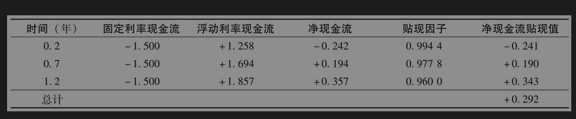
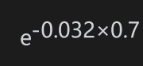

# 7.6 利率互换定价

现在我们讨论如何对利率互换定价。在刚开始签订时利率互换的价值为0，但经过一段时间后，合约的价值可能为正也可能为负。

互换中的每一次利率互换都可视为远期利率合约。如第4.9节末尾所示，我们可以通过假设远期利率在将来会实现来对远期利率合约进行定价，因为互换不过是一个远期利率合约的组合，利率互换也可以通过假设远期利率在将来会实现来进行定价，具体步骤是：①计算确定互换现金流的每个未知的浮动利率所对应的远期利率；②假设未知浮动利率等于远期利率，计算互换现金流；③对互换现金流以无风险利率进行贴现。

因此，对互换定价时需要计算与所有浮动利息相对应的远期利率，并对净现金流以无风险利率从支付日贴现到现在。在本章前面解释了如何用OIS利率计算无风险零息利率曲线，这一计算过程提供了必要的无风险利率。此外，如果互换是OIS，我们则可以使用第4.8节中的公式，从无风险零息利率曲线计算相关远期利率。

注意这里所需的第1个利率并不是真正的远期利率，它依赖于已经观察到的隔夜利率和对应于该期间内剩余隔夜利率的零息利率。在LIBOR互换的情况下，必要的远期利率是根据欧洲美元期货和互换利率来估计的（假设可以得到这些利率）。欧洲美元期货提供关于远期利率的直接估计（尽管如第6章所述的凸性调整可能是必要的）。在互换利率的情况下，我们使用了这样一个事实：表7-4中的互换利率定义了价值为0的互换合约，这从而提供了远期利率必须满足的等式。通过适当的插值可以得到与互换利率一致的完整远期曲线。注意这里第一个LIBOR通常已经确定，不需要进行远期利率计算。

【例7-1】 假设在一段时间之前一家金融机构签订了一个互换合约：金融机构同意每半年按3%的年利率支付利息，同时收取6个月期限的SOFR参考利率，名义本金为1亿美元。互换还剩2年的期限，支付日期为从今天开始的0.2年、0.7年和1.2年。按连续复利的0.2年、0.7年和1.2年期无风险利率（从SOFR确定）分别为2.8%、3.2%和3.4%。同时假设在过去0.3年中（其中包含了决定在0.2年利息天数的60%）观察到的连续复利无风险利率为2.3%，因此，在0.2年交换的浮动利率假设为0.6×2.3%+0.4×2.8%=2.50%。在0.7年交换的浮动利率是0.2到0.7年之间的远期利率，等于3.36%（连续复利）。同样，1.2年期交换的浮动利率是0.7年到1.2年之间的远期利率，等于3.68%（连续复利）。

对互换定价时我们假设连续复利的三个浮动利率分别为2.50%、3.36%，和3.68%。在每半年复利一次时，相应的利率分别为2.516%、3.388%和3.714%。因此，互换定价的计算如下表所示（所有现金流均以百万美元计）。

例如，考虑对应0.7年这一行：固定现金流为-0.5×0.03×100，即-1.5（百万美元）。假设远期利率在将来实现，这时浮动现金流为0.5×0.03388×100，即1.694（百万美元）。因此，净现金流为0.194（百万美元），贴现系数为，即0.9778。因此，净现金流的现值为0.194×0.9778=0.190（百万美元）。

互换的价值等于这些现值的和，即0.292（百万美元）。（注意在计算中我们没有考虑假期日历与天数计算惯例的影响。）