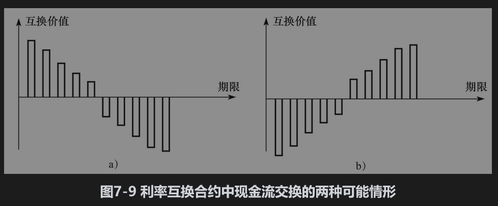

# 7.7 互换价值

随时间的变化在互换中对固定利率的选择是使得在开始时互换的价值为0，但这并不意味着互换中的每一笔净额交换最初都是0，而是现金流交换的价值总和为0。图7-9显示了互换中10次现金流交换的两种可能情况。

图7-9a出现在利率期限结构向上倾斜、在互换中支付浮动利息、收取固定利息的情形：向上倾斜的期限结构意味着远期利率会随着到期日的增加而增大。因此，现金流交换的价值随着到期日的临近而减少。因为现金流交换价值的总和是0，所以早期的现金流必须是正值，而后期的现金流必须是负值。如果利率的期限结构是向上倾斜的，而且在互换中收入浮动利息、支付固定利息，类似的论证可以说明早期的现金流将会为负值，而后期的现金流则会是正值（这是图7-9b中的情况）。当期限结构向下倾斜时，以上结论会刚好相反。因此，图7-9a显示了支付固定利息的情况，图7-9b显示了收入固定利息的情形。

这些结果可用于确定互换在未来的预期价值是正值还是负值。在图7-9a中，随着时间的推移，预计互换的价值将变为负值，这是因为早期现金流为正。同样，在图7-9b中，随着时间的推移，预计互换的价值将变为正值，这是因为早期现金流为负。

