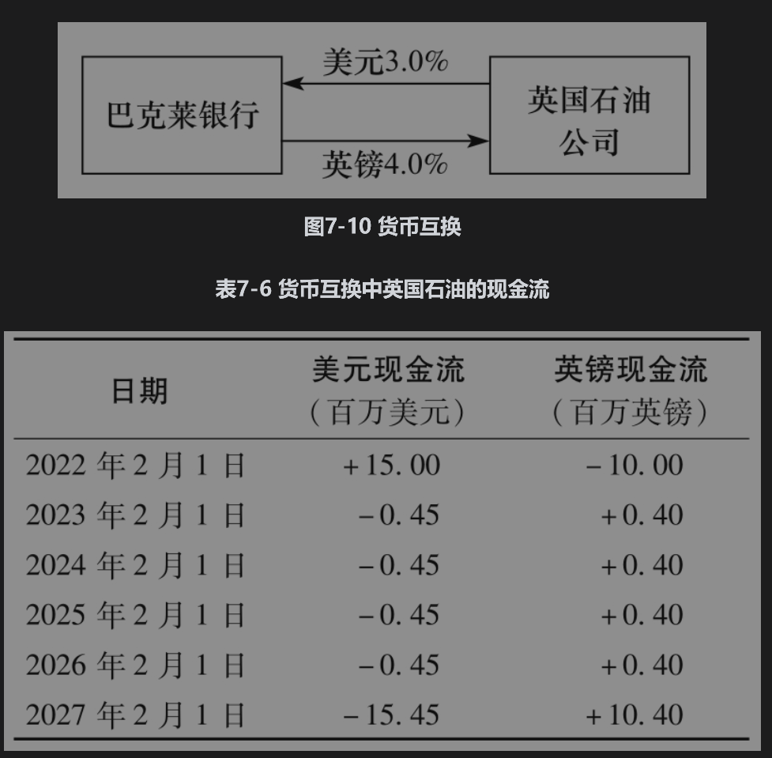
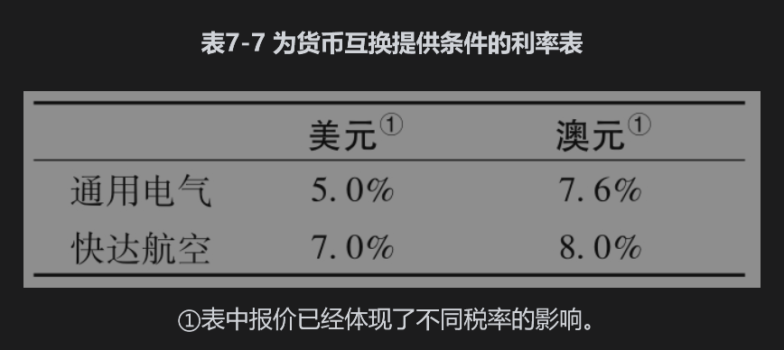
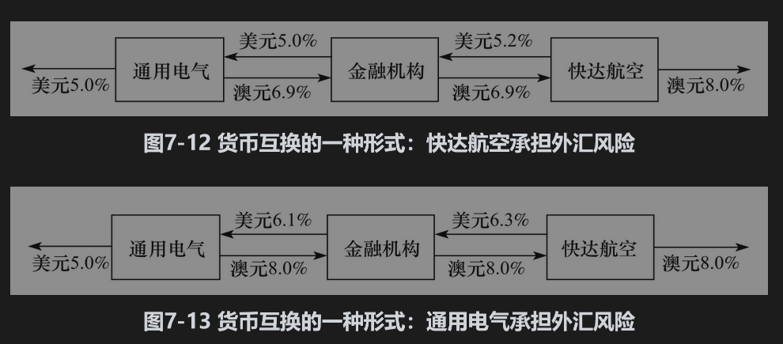

# 7.8 固定利息与固定利息货币互换

另外一种较为流行的互换是固定利息与固定利息货币互换(fixed-for-fixed currency swap)，这是将一种货币下的固定利息和本金与另外一种货币下的固定利息和本金进行交换。

货币互换合约要求指明在两种不同货币下的本金数量。互换中通常包括开始时和结束时两种货币下本金的交换。通常货币本金数量的选取是使得在互换开始时的汇率下，两种本金价值大致相同。但在最后交换时，两者的价值可能大不一样。

## 7.8.1 例示

考虑一个5年期英国石油公司(British Petroleum)与巴克莱银行(Barclays)之间的5年期货币互换合约，互换的开始日期为2022年2月1日。我们假定英国石油公司向巴克莱银行支付美元上3%的利率，同时从巴克莱银行收入英镑上4%的利率。现金流交换频率为一年一次，本金数量分别为1500万美元与1000万英镑。这种互换为固定利息与固定利息(fixed-for-fixed)的货币互换，因为每个货币下所对应的利息均为固定利息。互换如图7-10所示。在开始时，本金的交换与图中箭头所指方向相反，在互换期限内与互换结束时，现金流与图中箭头所指方向一致。因此，在互换开始时，英国石油公司首先支付1000万英镑，同时收进1500万美元。在互换期间的每一年里，英国石油公司收进40万英镑（即1000万英镑的4%）并支付45万美元（即1500万美元的3%）。在互换结束时，英国石油公司支付1500万美元的本金并同收进1000万英镑的本金。现金流如表7-6所示。巴克莱银行的现金流与表中所示正好相反。

7.8.2 利用货币互换改变债务与资产的特征

利用上面所描述的互换可以将一种货币下的贷款转化为另外一种货币下的贷款。假设英国石油公司能够以4%的利息借入1000万英镑，货币互换可以将贷款转化为本金为1500万美元、利息为3%的美元贷款。最初的本金互换将英镑贷款转化为美元贷款，之后货币互换的支付将英镑利息与本金转化为美元。

互换也可以用来转化资产的特征。假设英国石油公司可以将1500万美元以每年3%的收益率在美国投资5年，英国石油公司认为英镑价格同美元价格比较将会上涨（至少不会下跌），因此想将其投资收益转化为英镑。货币互换的作用是将美元投资转化成收益率为4%、本金为1000万英镑的投资。

## 7.8.3 相对优势

货币互换的动机可以由相对优势来解释。为了说明这一点，我们考虑另外一个虚拟的例子：假定通用电气(General Electric, GE)与快达航空(Qantas Airways)分别借入美元与澳元(AUD)的5年期固定利率如表7-7所示。表中的数据显示澳元的利率比美元的利率高，并且通用电气在两种货币下所对应的信用评级都比快达航空好，所以在两种货币下通用电气所能得到的利率都低过快达航空。从互换交易员的角度来看，有意思的是表7-7中数据说明通用电气在两种不同货币下所付利率的差价与快达航空所付利率的差价不同。快达航空在美元市场所付的利率比通用电气要高2%，而在澳元市场只高0.4%。

这一现象同表7-5类似：通用电气在美元市场具有相对优势，而快达航空在澳元中具有相对优势。在表7-5中考虑标准利率互换时，我们曾指出相对优势的论点只不过是一种假象。而在这里我们比较的是在不同货币下的利率，相对优势的论点很可能是真实的。可能造成相对优势的一种原因是纳税环境：由于通用电气所处的地位，借入美元资金可能会使其在全球范围内收入的税率低于借入澳元所面临的税率。快达航空所处的位置可能刚好相反（注意，我们假设表7-7所提供的利率已经反映了这种税率上的优势）。

我们假定通用电气想借入2000万澳元，而快达航空想借入1500万美元，并且当前的汇率为0.7500（每美元所对应的澳元数量）。这是产生货币互换的完美情形：通用电气与快达航空在自身具有相对优势的市场借入资金，即通用电气借入美元，快达航空借入澳元，然后通过货币互换可以将通用电气的美元贷款转化为澳元贷款，并同时将快达航空的澳元贷款转化成美元贷款。

互换有多种形式。图7-11显示了当金融机构介入时的情形：这时，通用电气借入美元，快达航空借入澳元。互换对通用电气的效果是将每年5%的美元利息转换为每年6.9%的澳元利息，这比通用电气直接在澳元市场贷款要低0.7%。类似地，快达航空将8%利息的澳元贷款转换成了6.3%利息的美元贷款，这比快达航空直接在美元市场贷款要低0.7%。金融机构在美元中收入1.3%，而在澳元亏损1.1%。如果我们忽略货币的差别，金融机构净收益为0.2%。正如预料的那样，所有参与方的收益总和为每年1.6%。

每一年金融机构的美元收益为195000美元（即1500万美元的1.3%），亏损为220000澳元（即2000万澳元的1.1%）。金融机构可以在互换期限内从远期市场每年买入220000澳元来避免外汇风险，这样做可以使金融机构锁定美元盈利。

我们已经指出，两家公司以美元借入资金的差价为2%，以澳元借入资金的差价为0.4%。同利率互换的例子类似，我们期望对于交易各方的总收益为每年2%-0.4%=1.6%。

我们也可以改变互换的设计而使金融机构免去对冲的必要。图7-12与图7-13是另外两种不同的互换形式。在实际中采用这两种形式的可能性不大，这是因为这两种做法不能使通用电气与快达航空免于外汇风险。在图7-12中，快达航空承担外汇风险，因为它要支付每年1.1%的澳元利息，并且支付每年5.2%的美元利息。在图7-13中，通用电气承担外汇风险，因为它要收入每年1.1%的美元利息，同时支付每年8%的澳元利息。

