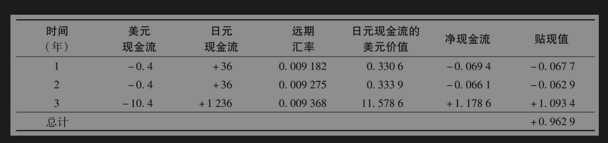
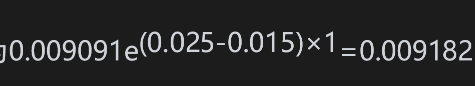
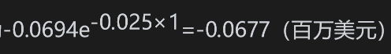
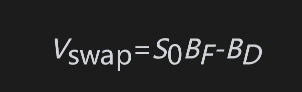
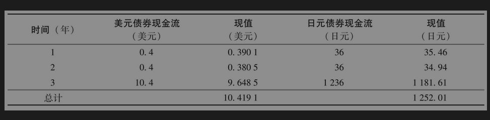

# 7.9 货币互换

定价固定利息与固定利息货币互换中每次支付的交换都是一个远期货币合约。如第5.7节所述，对远期货币合约定价时可以假设远期利率将会被实现。

【例7-2】 假设日元和美元的无风险利率曲线为水平状：日元利率为每年1.5%，美元利率为每年2.5%（均为连续复利）。假设在此之前某金融机构承约了一笔货币互换：在互换中收入3%的日元利率，付出4%的美元利率，互换每年支付一次。两种货币的本金分别为1000万美元与12亿日元。互换期限还剩3年，当前汇率为1美元等于110日元。以远期货币合约的方式对互换定价的计算结果列在下表中（所有值均以百万计）。

金融机构每年支付0.04×10=0.4（百万美元）并收取1200×0.03=36（百万日元）。除此之外，在第3年年末支付1000万美元，收取12亿日元。目前的即期汇率为每日元1/110=0.009091美元。在本例中，r=2.5%,rf=1.5%，由式(5-9)可得一年期远期汇率为。2年期与3年期的远期互换利率可以类似地计算。互换中的远期合约可以在假定远期汇率被实现的情况下定价。假如1年期远期汇率被实现，在1年后日元现金流的值为36×0.009182=0.3306（百万美元），而1年后的净现金流为0.3306-0.4=-0.0694（百万美元），贴现值为。这个值是对应于一年后交换现金流的远期合约的值。其他远期合约的值可以类似地计算。如表中所示，所有远期合约的总值为0.9629（百万美元）。

在最初签订货币互换合约的值为0。如果在开始时的汇率使两项本金的价值相同，那么在开始时刚交换过本金之后，互换合约的价值仍为0。然而，像在利率互换的情况一样，这并不意味着在互换中的每个远期合约值都是0。可以证明，如果在两种货币之下的利率相差很大，对高利率货币的支付者来讲，互换中前面的远期合约价值为负，而对应于最后交换本金的远期合约价值为正。支付低利率的一方刚好相反：前面的远期合约价值为正，而对应于最后交换本金的远期合约价值为负。

对支付低利率货币的一方来讲，在货币互换的大多时间内价值都是负的。对应于前面交换支付的远期合约价值为正值，一旦这些交换发生后，剩余远期合约价值的总和一般为负。对支付高利率货币的一方情况正好相反：在货币互换的大多时间内价值都是正的。像这样的结果在考虑双边清算时是非常重要的。

## 通过债券价格定价

与利率互换类似，固定利息与固定利息货币互换可以被分解成两个债券的差。如果我们定义Vswap为收入美元并支付外币的货币互换的美元价值，那么

其中BF为互换中外汇现金流所对应的债券以外币计价的价值，BD为互换中本国货币现金流所对应债券的价值，S0为即期汇率（表达形式为1单位外币所对应的美金数量）。因此，互换的价值可以由两种货币之下的LIBOR、本国货币下的利率期限结构以及即期汇率确定。

类似地，收入外币并同时支付美元的互换价值为

【例7-3】 再次考虑例7-2。假设日本与美国的无风险利率曲线均为水平状，日本利率为每年1.5%，美国为每年2.5%（连续复利）。一家金融机构签订了一年一次收取3%日元、支付4%美元的互换，两种货币下的本金为1000万美元与12亿日元，互换还剩3年期限。目前的汇率为110日元=1美元。通过债券的形式计算互换价值的计算总结在下表中（所有数值均以百万计）。

互换中美元债券的现金流展示在第2列中，以美元利率2.5%贴现的现值展示在第3列中，互换中日元债券的现金流展示在第4列中，以日元利率1.5%贴现的现值展示在最后一列。美元债券的值BD=10.4191（百万美元），日元债券的值BF=1252.01（百万日元）。因此，互换的美元值为(1252.01/110)-10.4191=0.9629（百万美元）。这与例7-2中的计算结果一致。

