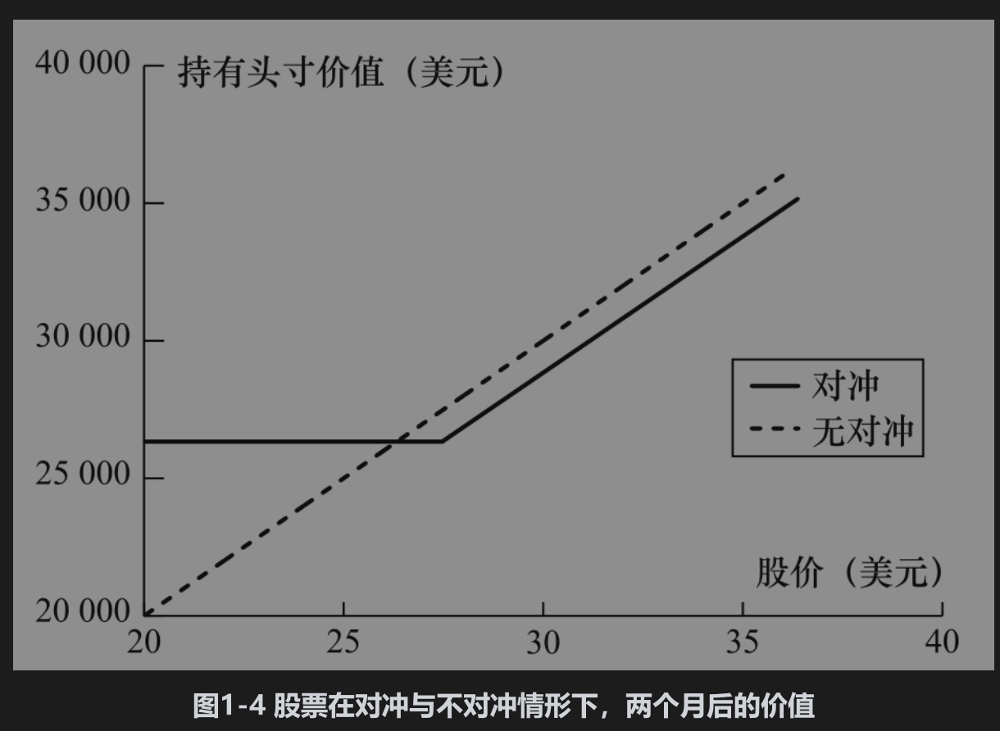

# 1.7 对冲者

在这一节中，我们将说明对冲者如何利用远期合约和期权来降低他们所面临的风险。

## 1.7.1 利用远期进行对冲

假定今天是2020年5月21日，一家美国进口公司ImportCo得知在2020年8月21日因买入商品需要向一家英国供应商支付1000万英镑。表1-1列出了金融机构关于美元/英镑汇率的报价。ImportCo可以从金融机构买入3个月期限、汇率为1.2225的英镑远期合约来对冲其外汇风险。这样做的实际效果是向其英国供应商支付的美元数量锁定为12225000美元。

接下来我们考虑另一家美国出口公司ExportCo，该公司向英国出口商品。2020年5月21日得知公司在3个月后将收入3000万英镑。ExportCo可以在3个月远期合约中以1.2220的价格卖出3000万英镑。这样做的实际效果是确定卖出英镑后收入美元的数量为36660000美元。

注意，一家公司选择不对冲时有可能会比选择对冲的盈利效果更好，但也有可能更差。考虑ImportCo公司。如果汇率在8月21日为1.2000，假如公司没有选择对冲，这时对于1000万英镑只需支付12000000美元，这一数量小于12225000美元。但如果汇率变为1.3000，1000万英镑值13000000美元，这时公司会希望自己进行了对冲！ExportCo的情形与以上刚好相反：如果8月的汇率低于1.2220，那么公司会希望进行对冲；如果汇率高于1.2220，那么公司会希望自己没有进行对冲。

这一例子说明了对冲的一个关键性质：对冲的目的是降低风险，对冲后的实际结果并不一定能保证比不对冲更好。

## 1.7.2 采用期权的对冲

期权也可以用来对冲。考虑一位投资者在5月拥有1000股某只股票的情形。股票价格为每股28美元。投资者非常担心在今后两个月内股票价格下跌，所以想买入保护。投资者可以买入10份在这个股票上7月到期的股票看跌期权合约，期权的执行价格为27.50美元。每份期权合约的规模为100股，持有这一期权可使投资者以27.50美元的价格卖出1000股股票。如果期权报价为1美元，每份期权合约的费用为100×1=100（美元），对冲的整体费用为10×100=1000（美元）。

这一策略的费用为1000美元，它可以保证卖出股票的价格在期权期限内至少为27.50美元。如果市场价格低于27.50美元，投资者行使期权，这时持有股票的收入为27500美元。将期权费用考虑在内，实际收入26500美元。如果股票价格高于27.50美元，期权不会被行使，这时期权到期时价值为0。但是拥有股票的实际收入总是高于27500美元（将期权费用考虑在内，实际收入高于26500美元）。图1-4显示了持有股票的净值（考虑期权费用以后）与两个月时股票股价的函数关系图形。虚线显示没有对冲时持有股票的价值。

## 1.7.3 比较

采用远期对冲与采用期权对冲有一个关键性区别：以远期合约来中和风险的形式是通过设定买入和卖出标的资产的价格来对冲的，而期权产品则提供了价格保险。当价格向不利方向变化时，期权产品对投资者提供了保护，但同时又能使投资者在价格向有利方向变化时盈利。与远期不同，拥有期权需要付费。