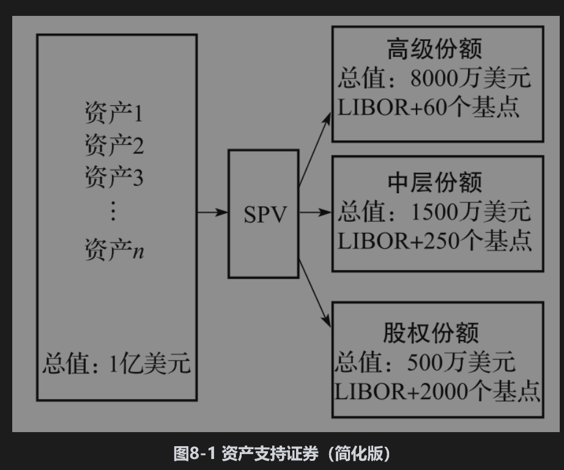
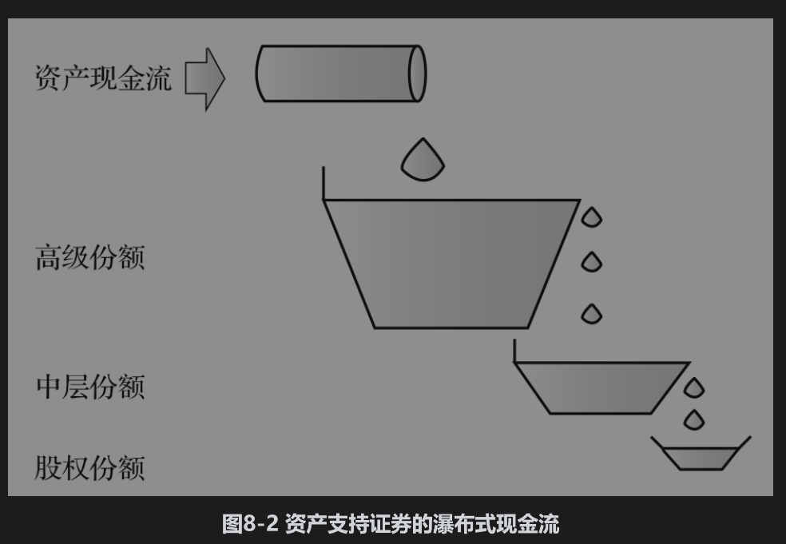
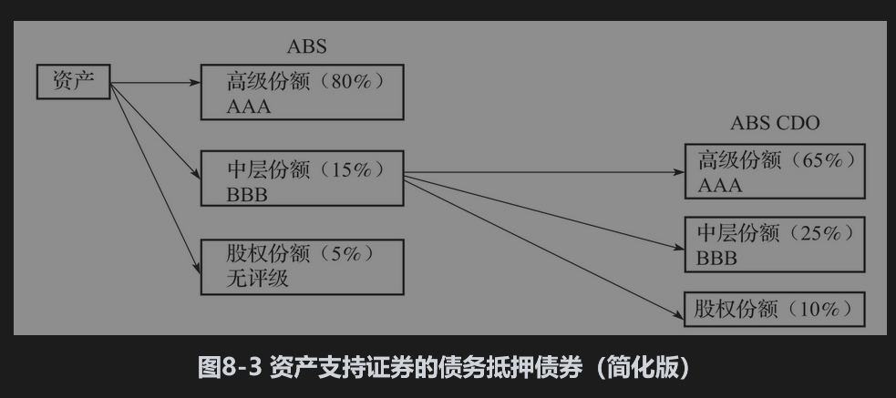
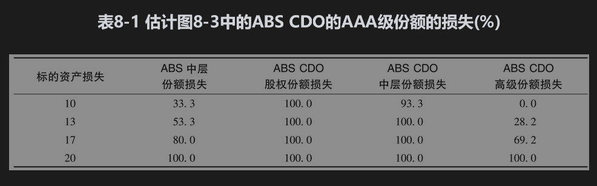

# 8.1 证券化

传统的银行经营模式是吸收存款和发放贷款。在20世纪60年代，美国银行发现这种传统的融资模式已经无法跟上对住房按揭贷款需求的增长步伐，从而导致了按揭抵押证券(MBS)市场的发展。活跃在这个市场的机构是：

• 政府全国住房按揭协会［The Government National Mortgage Association(GNMA)，又叫吉利美Ginnie Mae］。

• 联邦全国住房按揭协会［The Federal National Mortgage Association(FNMA)，又叫房利美Fannie Mae］。

• 联邦住房按揭贷款公司［The Federal Home Loan Mortgage Corporation(FHLMC)，又叫房地美Freddie Mac］。

这些机构从发行贷款的银行手中购买按揭贷款组合，然后将其打包后卖给投资人。这些机构对按揭的利息和本金提供担保（收取一定的费用）。

尽管银行是住房按揭贷款的发行人，但它们并没有把贷款保留在资产负债表上。证券化使得银行发放贷款的速度远远大于其存款的增长速度。吉利美、房利美和房地美为按揭抵押证券投资人提供了有关贷款人违约的保护。

在20世纪80年代，由按揭市场开发的证券化手段被用到了其他类型的资产上，比如美国的汽车贷款和信用卡应收账款。证券化在世界其他地方同样变得越来越流行。随着证券化市场的不断发展，投资人慢慢地开始接受没有违约担保的证券。

## 8.1.1 资产支持证券(ABS)

图8-1展示了在2000～2007年所使用的一种简单的证券化方式，这种方式称为资产支持证券(asset-backed security, ABS)。发行贷款的银行把这些产生现金流的贷款组合卖给一个特殊目的机构(special purpose vehicle, SPV)，然后现金流被分配到不同的份额(tranche)中。图8-1中有3个份额（在实际中的份额可能会很多），分别是高级份额(senior tranche)、中层份额(mezzanine tranche)和股权份额(equity tranche)。总体资产有1亿美元的面额，派生出的高级份额占8000万美元，中层份额占1500万美元，股权份额占500万美元。高级份额的收益率为LIBOR加上60个基点，中层份额的回报为LIBOR加上250个基点，而股权份额的回报为LIBOR加上2000个基点。

虽然乍看起来股权份额似乎最合算，但实际上并非如此。对利息与本金的支付是没有保证的。收益率（像债券收益率一样）指的是在没有违约的影响下，份额所实现的回报。与其他份额相比，股权份额损失一部分本金的可能性更大，而收到本金之上利息的可能性更小。证券化的现金流是按所谓的瀑布形式(waterfall)进行分配的。一般情况下瀑布现金流的分布形式如图8-2所示。本金与利息支付的现金流按不同的瀑布形式分配。本金支付首先要分配给高级份额，直到这个份额的本金被全部偿还，然后才会向中层份额进行分配，直到这个份额的本金被全部偿还。只有在此之后才会向股权份额支付本金。利息的支付也是先分配给高级份额，直到高级份额收到在尚未偿还本金之上所有承诺的利息。假设可以偿还所承诺的利息，然后才会将利息支付分配给中层份额。当中层份额所承诺的回报也被满足，而且现金流仍有剩余时，这时才会向股权份额进行分配。

各份额所收到的本金的程度取决于标的资产的损失程度，对瀑布式现金流的影响基本如下：最初5%的资产损失由股权份额承担，如果损失超过了5%，股权份额将会损失全部本金，剩余损失由中层份额承担；如果损失超过20%，中层份额将损失全部本金，剩余的损失由高级份额承担。

我们可以用两种方式来看资产支持证券的结构。一种是参考图8-2所示的瀑布形式：现金流首先会分配给高级份额，然后是中层份额，最后才是股权份额；另外一种是以承担损失的方式，股权份额首先承担损失，然后是中层份额，最后才是高级份额。穆迪、标准普尔和惠誉等评级机构在证券化过程中扮演了重要角色。如图8-1所示的资产支持证券的设计方式是为了保证高级份额的信用评级为AAA，中层份额的信用评级通常为BBB（尽管比AAA低很多，但仍是投资级别），而股权份额通常没有信用评级。

我们这里描述的是资产支持证券的一种简化形式。一般来讲，资产支持证券会有多于3个的份额，份额的信用评级也有许多种。在我们描述的瀑布式现金流规则中，现金流的分配是按次序进行的，即现金流首先分配给最高级的份额，然后是次高级，并依此类推。在实际中，现金流分配规则远比这里所讲述的更复杂，阐述现金流准确分配方式的法律文件一般会长达数百页。另外一个复杂之处在于常常会有超额抵押(over-collateralization)机制，即份额的面值总和低于抵押资产的面值，而且对份额所许诺的回报加权平均低于抵押资产的回报加权平均。

## 8.1.2 资产支持证券的债务抵押债券

寻找AAA级资产支持证券高级份额的投资者并不困难，因为这个份额所许诺的回报与AAA级的债券相比更具有吸引力。股权份额常常由按揭贷款发行人持有，或者卖给对冲基金。

寻找中层份额的投资者会比较困难，由此产生了以资产支持证券(ABS)为资产支持的证券（即ABS的ABS），其产生过程如图8-3所示。将许多如图8-1中所述的中层份额放在一起形成一个组合，并对这个组合相对应的现金流再次分层，其过程与图8-1类似，这样产生的结构叫作资产支持证券的债务抵押证券（即ABS CDO或中层ABS CDO, CDO是collateralized debt obligation的简写，即债务抵押债券）。在图8-3的例子中，ABS CDO高级份额的面值占ABS中层份额总面值的65%，ABS CDO中层份额占25%，而剩下的ABS CDO股权份额占10%。这种结构的设计是为了使ABS CDO的高级份额能被评为AAA级，这就意味着在这个例子中AAA级的证券为占相关资产组合面值的90%（80%加上15%的65%）。这一比率看起来已经很高，但如果考虑将中层ABS CDO进一步证券化（事实上确实如此），那么AAA级证券所占的比率将会更高。

在图8-3所示的例子中，如果相关按揭资产的损失小于20%，ABS的AAA级份额可以收到其承诺的收益和本金，因为所有损失都由其他次级份额承担了。图8-3所示ABS CDO的AAA级份额面临更大的危险。当相关按揭组合的损失不超过10.25%时，该份额会收到其承诺回报和本金。这是因为10.25%的损失意味着ABS中层份额所承担的损失等于ABS本金面值的5.25%。因为ABS CDO的面值为ABS面值的15%，其损失为面值的5.25/15，即35%。ABS CDO的股权份额与中层份额遭受全部损失，但高级份额却没有任何损失。

当相关资产的损失高于10.25%时，ABS CDO的高级份额会有损失。例如，考虑相关资产的损失为17%的情形，在这17%的损失中，有5%是ABS股权份额的损失，剩下12%是ABS中层份额的损失。所以ABS中层份额的损失率为12/15，即80%。最早的35%损失由ABS CDO的股权份额和中层份额来承担，因此ABS CDO的高级份额损失率为45/65，即69.2%。表8-1是对这一结果和其他损失情形的总结。在我们的计算中假设了所有ABS组合都有相同的违约率。

