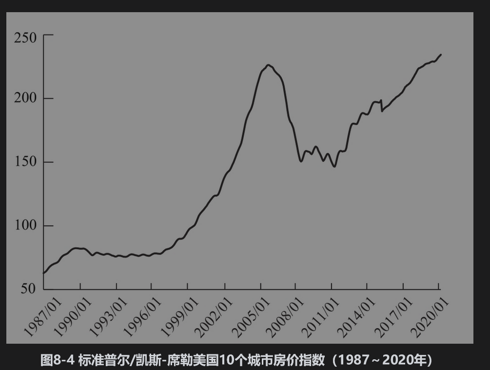

# 8.2 美国住房市场

图8-4展示了1987年1月～2020年1月的标准普尔/凯斯-席勒美国10个城市房价指数(S&P/Case-Shiller composite-10 index)。这个指数跟踪的是美国10个城市里的房产价格。该图表明大约从2000年开始，房产价格的增长速度远远超过了之前10年的增长速度。2002～2005年的低利率是造成价格增长的一个重要的原因，但住房市场价格泡沫形成的一个重要原因是对房屋贷款政策的松懈。

2000～2006年，美国按揭市场的一个显著特点是次级按揭贷款的激增，次级按揭贷款的风险明显高于按揭贷款的平均风险。在2000年以前，大部分被分类为次级的按揭贷款是借款人的第二个按揭(second mortgage)，但在2000年以后，金融机构逐渐接受了第一次级按揭贷款(subprime first mortgage)这一概念。

## 8.2.1 借贷标准的放松

对那些原本信用不够好、没有资格取得贷款的家庭而言，贷款标准的放松以及次贷按揭的增长使购买住房变成了现实。这些家庭增加了市场对房屋的需求，因此房价开始上涨。对贷款经纪人和贷款商而言，房屋价格上涨以及大量的借贷需求无疑是个好消息，更多的借贷意味着更多的盈利，并且房屋价格的上涨意味着贷款会有很好的抵押品，即使贷款人（即借入贷款者）违约，由于丧失赎回权(foreclosure)也不会造成损失。

贷款经纪人与贷款商自然希望保持盈利的增长。他们所面临的问题是随着房屋价格的上升，首次买房的购房者会越来越难以承担高房价。为了吸引新客户，贷款经纪人与贷款商不得不设法进一步降低贷款标准。果不其然，他们真是这样做的，贷款标准降低的结果是贷款面额与房屋价值的比例提高了。这时市场开发了可调整利率按揭(adjustable rate mort-gage, ARM)，在这一产品中，延续2～3年的优惠利率(“teaser”rate)很低，而随后的利率会很高。一个典型的前期优惠利率为6%，而在优惠利率期结束后，利率会被调整为LIBOR+6%。但是，市场上也有过1%或2%低优惠利率的报道，在这期间，贷款商在审查贷款申请时也变得越来越漫不经心，以至于他们常常对申请贷款人的收入和其他有关信息都不去仔细审查。

## 8.2.2 次级按揭贷款的证券化

次级按揭贷款通常以图8-1～图8-3里的形式证券化。投资于由次贷所生成份额的投资者通常没有收回利息和本金的保证。证券化在此次危机中扮演了重要的角色，当贷款发放人知道放出去的贷款会被证券化时，他们的发放行为将会改变：在发放新的按揭贷款时，他们关心的问题不再是“这是不是我们要承受的信用风险”，而是“我们是否可以通过卖给别人而从这份按揭上赚钱”。

当按揭被证券化后，所生成证券的买入方感到只要知道组合中每份按揭的贷款与价值比率(loan-to-value ratio)（即贷款数量与房屋估价的比率）以及贷款人的FICO分数就足够了。有关贷款申请人的其他信息被认为是无关紧要的，所以贷款发行者常常不去检查。对于贷款发行方而言，最重要的是能否将按揭贷款卖给其他人，而这主要取决于贷款与价值比率，以及贷款申请人的FICO分数。

然而即使通过了贷款与价值比率和FICO分数检验的按揭也可能具有较差的信用质量。有时因为迫于贷款人的压力，资产价格估测人(property assessor)会给资产定出很高的价格，有时一些潜在的贷款人可能会在做一些咨询后去设法改善自己的FICO分数。

为什么政府没有对贷款商的行为进行谨慎管理呢？答案是自20世纪90年代开始，美国政府一直致力于扩大住房拥有率，并常常对贷款商施压来使其加大对中低层收入群体的贷款力度。有些州的立法人（例如，俄亥俄州和佐治亚州）曾表示过对贷款现状的忧虑，并且试图通过立法来抑制掠夺性贷款现象，但是法院认定，全国的贷款标准应具有优先权。

在信用紧缩之前，市场上有一系列的术语用于描述按揭发放过程，其中一个术语为“骗子货款”(liar loan)，用来描述按揭贷款申请人因为知道在贷款申请过程中不会进行背景调查，从而在申请表上进行撒谎的行为。另外一个描述借贷人的术语为“NINJA”（no income，no job，no assets，没有收入、没有工作、没有资产）。

## 8.2.3 泡沫破裂

所有的泡沫最终都会破裂，这次也不例外。2007年，许多按揭贷款人发现自己在优惠利率结束之后没有能力偿还贷款而导致丧失赎回权，这使得大量住房进入市场，从而引起房价下跌。其他以住房价格100%（或接近100%）的数量进行按揭贷款的人发现自己在房子上的资产净值成为负值。

美国房屋市场的一个特性是在许多州按揭具有无追索(nonrecourse)条款，这意味着当贷款人违约时，贷款借出方可以收回住房，但对贷款人的其他财产是不能追索的。因此，贷款人事实上持有一个免费的美式看跌期权：他可以在任何时候以贷款余额价值将房屋售于贷款借出方。无追索条款特性鼓励了市场投机行为，这也是造成这次泡沫的原因之一。当市场参与者意识到这种看跌期权的代价以及对市场的破坏作用时已经太晚了。如果借贷方的资产净值为负值，最优的做法是将房子与剩余贷款本金数量相交换，然后放贷方将房子出售，从而进一步推动房价的下跌。

假设所有按揭违约人都面临相同处境的做法是错误的。有些人因为没有能力履行按揭付款，当他们不得不放弃房屋时遭受了许多困难。但市场上有许多违约者是出于投机的目的，他们买房屋是为了出租，这些人选择行使看跌期权，而这些房屋的租客则成了受害人。还有报告显示，有些不是投机者的房屋拥有人十分有创意地抽取看跌期权的价值：当他们将钥匙还给住房贷款借出方后，随即就以更好的价格买入其他那些已经丧失赎回权的住房。假设两个相邻并且结构相似的房屋均已丧失了赎回权，两个房屋的按揭均为250000美元，而且两个房屋的价值均为200000美元，丧失赎回权的拍卖价均为170000美元。这时房屋拥有者的最佳策略是什么？答案是每个房屋拥有者均行使看跌期权，并随即买入邻居的屋子。

美国并不是房产价格下跌的唯一国家，世界上许多其他国家的房价也难逃厄运。英国的房价在危机中也遭受了很大影响。如图8-4所示，美国的平均房价自2012年后开始回升。

## 8.2.4 损失

当丧失赎回权的情形越来越多时，按揭贷款的损失也与日俱增。我们或许认为如果房价下跌35%，违约按揭贷款最大损失也至多为面值的35%。事实上，损失远远比这大。丧失赎回权的房子通常各方面条件都很差，而且售价只是危机前房价的一小部分。根据2008年和2009年的报道，有些情况下在丧失赎回权房屋上的按揭贷款本金损失高达75%。

购买由按揭产生的ABS份额的投资者遭受了重大损失。次贷产生的ABS份额价值是由一系列叫ABX的指数来反映的。指数显示，2007年年底，BBB级份额的损失达到了其原始值的80%，而到2009年年中这一份额的损失高达97%。由BBB级份额再生成的ABS CDO份额是由一系列叫TABX的指数来反映的，指数显示，到2007年年底，原本AAA级的CDO份额损失达到了其原始价值的80%，到2009年年中，该类证券变得几乎一文不值。

像瑞银、美林、花旗这样的金融机构拥有大量份额，从而遭受了巨大损失；保险业巨头美国国际集团(AIG)由于为ABS CDO的AAA级提供损失担保，也遭受了惨重损失。政府不得不出手救助许多金融机构。在金融史上，比2008年更糟的年头并不多，贝尔斯登被摩根大通收购；美林被美国银行收购；高盛和摩根士丹利从之前的投行变成了银行控股公司，同时运作商业银行业务和投资银行业务；雷曼兄弟最终破产（见业界事例1-1）。

## 8.2.5 信用危机

由住房按揭贷款支持的证券损失导致了一场严重的信用危机。2006年，银行持有充足的资本金，取得贷款相对容易，而且信用溢差也很低（信用溢差是指贷款利率高于无风险利率的那一部分）。到2008年，情况完全不同，银行的资本金由于损失而大幅度下降；银行变得更厌恶风险而不愿意借出贷款，有良好信用记录的个人和公司都发现取得资金贷款非常困难，信用溢差急剧上升。全世界经历了几十年来最坏的经济萧条。如第4.2.3节所述，2008年10月，3个月期LIBOR-OIS溢差曾高达364个基点，这表明银行之间除了隔夜拆借之外，很不愿意相互之间提供贷款。另一个常用来衡量金融市场压力的测度是TED溢差，这是3个月期的LIBOR和3个月的美国国债利率的差。在正常市场情况下，TED溢差为30～50个基点，但是在2008年10月，这个溢差曾高达450个基点。