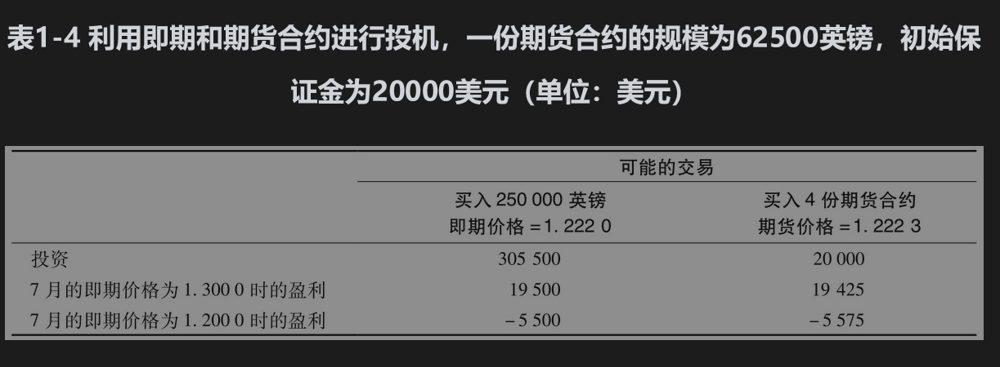
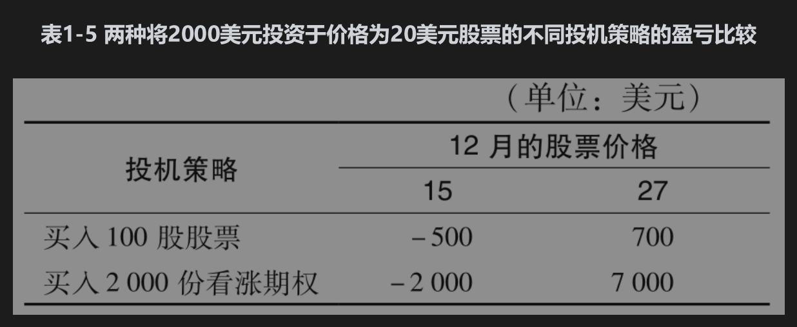
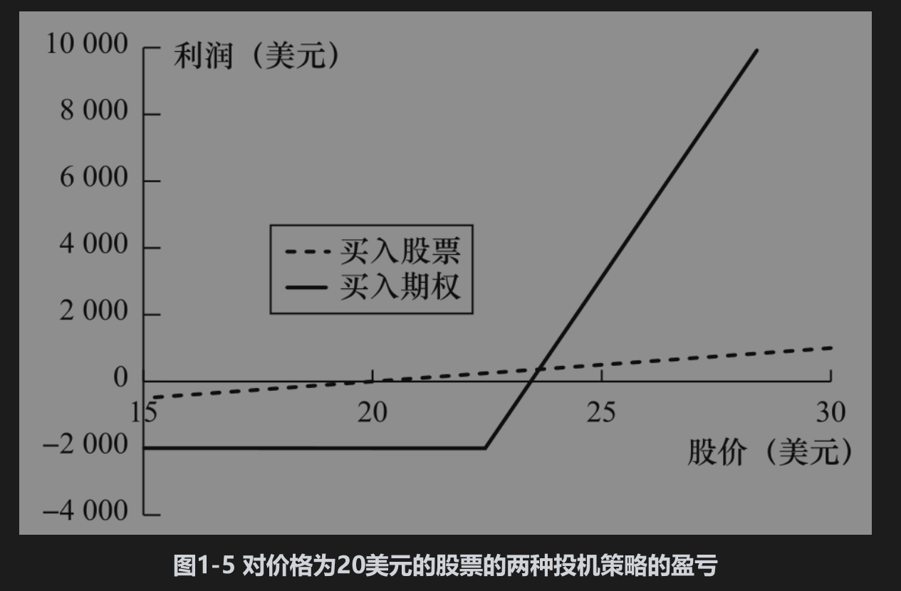

# 1.8 投机者

我们接下来考虑投机者如何利用期货和期权。对冲者是想避免面对将来资产价格不利波动的风险敞口，而投机者却要建立头寸：他们或者对资产价格上涨下注，或者对资产价格下跌下注。

## 1.8.1 利用期货进行投机

5月，一位美国投机者认为英镑（相对美元）在今后两个月会升值。投机者的一种做法是在即期市场买入250000英镑，然后希望在今后以更高的价格卖出这些英镑（买入的英镑被存入支付利息的账户中）。另外一种做法是承约4份CME的7月期货合约的多头（1份合约是买入62500英镑的合约）。表1-4总结了以上两种策略，其中当前汇率为1.2220（美元/英镑），7月期货价格为1.2223。在7月时如果汇率为1.3000，采用期货的做法可以使投机者盈利(1.3000-1.2223)×250000=19425（美元）。当采用即期汇率的做法时，投机者以1.2220的价格在5月买入250000英镑，并以1.3000的价格在7月将英镑卖出，其盈利为(1.3000-1.2220)×250000=19500（美元）。如果汇率跌至1.2000，期货带来的损失为(1.2223-1.2000)×250000=5575（美元），而采用即期带来的损失为(1.2220-1.2000)×250000=5500（美元）。在两种情形下，即期市场的结果看上去比期货市场稍微差一点，这是因为对以上两种做法所产生的盈利与亏损计算中没有考虑利息的收入和支出。



以上两种做法的差别是什么呢？第1种做法在最初需要250000×1.2220=305500（美元）的投资。与之相比，第2种做法只需要将少量资金存入保证金账户（在第2章中，我们将解释保证金账户的运作过程）。在表1-4中，最初的保证金要求为每份合同5000美元，总共为20000美元。期货市场可以使投机者取得杠杆效应，即投资者只需要支出少量资金就可以建立一个很大的投机头寸。

## 1.8.2 利用期权进行投机

投机者也可以利用期权进行投机。假定现在是10月，一位投机者认为某公司的股票在今后两个月内要涨价。股票的当前价格为20美元，执行价格为22.50美元、期限为两个月的看涨期权的当前价格为1美元。表1-5说明了投机者可以选择的两种投机方式：一种方式是买入100股股票，另外一种方式是买入2000份看涨期权（即20份合约）。假定投机者的猜测是正确的：股票在12月上涨到27美元。第1种投机方法带来的盈利为

```python 

100×(27-20)=700（美元）

```



但这时第2种方法盈利会更高。执行价格为22.50美元的看涨期权的收益为4.50美元（因为持有这一期权的投机者可以按22.50美元的价格买入价值为27美元的产品）。在第2种策略下，持有2000个期权的总收益为

```python 

2000×4.50=9000（美元）

```

将最初的费用扣除后，净盈利为

```python 

9000-2000=7000（美元）

```

因此买入期权的投机策略盈利是买入股票盈利的10倍。期权策略也会触发更大的损失：假定股票价格在12月降至15美元，买入股票的投机策略损失为

```python 

100×(20-15)=500（美元）

```


因为期权在到期时价值为0，期权策略的损失为2000美元（即最初付出的期权费用）。图1-5显示了两种交易策略在两个月后的收益与股票价格的函数关系图形。

与期货类似，期权给投机者提供了杠杆效应。对于一项投资，使用期权会放大最终的经济效果：好的收益会更好，坏的收益可能会使投机者丧失最初的全部投资。



## 1.8.3 比较

就投机者所取得的杠杆效应而言，期货和期权比较相似。但是，这两种产品有一个重要区别：投机者使用期货时，潜在的损失与收益都很大。但采用期权产品时，不管市场有多么糟糕，投机者的损失不会超过所支付的期权费用。
