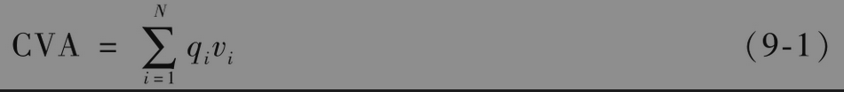
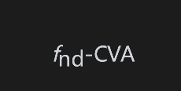
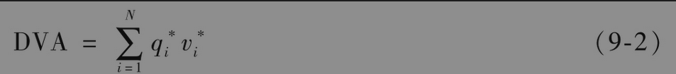
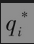
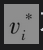
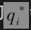
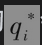
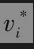

# 9.1 CVA和DVA

本书的大部分内容是关注在没有违约的前提下（即假定衍生产品的双方都不会违约），如何对于衍生产品进行定价。而CVA和DVA则是对于在没有违约前提下衍生产品价格的调节。它们分别反映了衍生产品交易双方违约可能性对于衍生产品价值的影响。我们在这一章首先给出一个概述，在第24章将给出详细的计算过程。

假设一家银行与交易对手之间进行一组双边清算的衍生产品交易，银行与交易对手之间的主协议通常肯定会阐明在结算过程中采用净额结算(netting)，也就是说，在出现违约情形时要将双方所有的交易看成是一笔交易。当交易的某一方宣布破产，或者没有能力支付必需的抵押品，或者无法保证交易条款中的其他承诺时，交易的另一方即可宣布违约事件已经发生。在违约事件发生后的几天内，银行和交易对手之间的衍生产品交易会提前终止，交易双方将确定交割数量(settlement amount)。交割数量反映了衍生产品的价值，以下事实会对价值进行调节：衍生产品交易中没有违约的一方需要对违约交易进行替换，而进行替换交易需要支付数量等于买卖差价一半的费用。

假设违约的一方是银行的交易对手，而且交易双方并没有支付抵押品（在今后将讨论抵押品对于交易的影响）。如果在提前终止事件发生时衍生产品组合对于银行具有正价值（对于交易对手具有负价值），这时银行是交割数量的无担保债权人，因此很可能会由于无法讨回衍生产品交易组合的全部价值而蒙受损失。

在相反的情形下，如果衍生产品组合对于银行具有负价值（对于交易对手具有正价值），由于是银行欠对方，银行要向交易对手（或交易对手的清算人）支付交割数量，此时交易双方都不会产生损失。信用价值调节量(CVA)是银行所估计的由于交易对手违约所引起的预期费用现值。假定银行与对手之间所交易衍生产品中最长的期限为T年，为了计算CVA，银行会将以后T年的时间区间划分为多个小区间，然后在每个小区间内进行如下计算：

(1)在每个区间上造成合约提前终止违约事件发生的概率；

(2)交易在第i个区间中间点被提前终止时合约组合的预期损失贴现值。

假定N为区间的数量，qi为交易对手在第i个区间违约的概率，vi为交易在第i个区间中间点被提前终止时合约组合预期损失的贴现值。CVA由以下公式给出

以上公式貌似简单，但相应的计算过程（尤其是对于vi的确定）却非常复杂，在第24章中我们将讨论计算过程。

将衍生产品交易组合对于银行的无违约价值定义为fnd，即假定交易双方都不会违约时衍生产品交易组合的价值。若将对手违约的可能性考虑在内，衍生产品组合价值为

但这样做并没有将定价问题考虑全面，因为银行本身也可能违约，从而会给交易对手带来损失，损失数量为银行的受益价值。债务价值调节量(DVA)是由于银行自身违约可能给自己带来的预期受益价值贴现值，计算公式为

其中为在第i个区间银行的违约概率，为当银行在第i个区间的中间点违约时给银行带来的期望收益价值（对应于交易对手的损失）贴现值。将CVA和DVA都考虑在内，对于银行而言组合的价值为

银行可以从自己的违约中受益，很多人会觉得这个想法很奇怪，违约怎么可能会使银行受益呢？一种理解方式如下：衍生产品交易是零和游戏(zero-sum game)，一方的受益一定会对应于另一方的损失。如果银行对于某衍生产品违约，交易对手会有损失，银行因此会受益。银行获得收益的原因在于当银行违约时，银行本身不需要履行合约，而这些合约在没有违约情形时对于银行的价值为负。

在没有DVA的情况下，交易对手之间很难达成衍生产品交易协议。假定两个市场参与者X和Y签订采用双边清算模式的利率互换交易，X支付固定利率而同时收入浮动LIBOR，并且无须支付抵押品。为了便于讨论问题，我们假设交易对手之间没有其他交易。X和Y约定在没有违约风险时，固定利率为2.2%。当X将Y的违约可能考虑在内时，X认为固定利率应该是2.1%，而不是2.2%（这里每年扣减0.1%是对于Y违约可能性的补偿）。当Y将X的违约可能考虑在内时，Y认为固定利率应该是2.35%，而不是2.2%（这里每年附加0.15%是对于X违约的补偿）。很容易看出，当双方都考虑了对手违约风险时，交易协议很难达成。但是，在交易的各方都计算了DVA的情况下（将自身的违约考虑在内），交易双方就容易达成交易协议，这是因为双方对于预期现金流定价的方式比较相似。

DVA的概念有悖于直觉，当银行的信用质量变差时，式(9-2)中的会增大，DVA会增大，对于银行而言，衍生产品价值会增大；当银行的信用质量变好时，式(9-2)中的会变小，DVA会变小，对于银行而言，衍生产品价值会减小。银行为什么会从自身信用质量的恶化中受益呢？原因是当银行违约可能性变大时，银行本身更有可能不去履行衍生产品所造成的义务。

## 抵押品

当交易双方需要支付抵押品时，情形会变得更加复杂。交易主协议中的信用支持附件(CSA)就是为了阐明抵押品的数量以及抵押品的具体种类。现金形式的抵押品通常会产生利息，所付的利率通常会接近于美联储基准利率（或者类似的隔夜利率）。如果抵押品为某种证券，在计算抵押品的数量时一般会对证券的市价加以折价。

当银行的交易对手违约时，如果抵押品低于对手所欠的最终交割数量，银行有权保留所有抵押品；类似地，当银行违约时，交易对手也有权保留抵押品用于抵偿银行违约所造成的欠款。双方必须返还抵押品超出交割数量的部分。

对应于支付抵押品的情形，式(9-1)和式(9-2)仍然成立，但公式中的vi和的计算会变得更加复杂，在计算过程中，我们需要考虑当合约被提前终止时的抵押品数量，我们通常会假设违约的一方在合约提前终止的前几天就会停止支付抵押品，同时也会拒绝返还高出交割数量的抵押品。我们将停止支付抵押品的时间段称为补救期(cure period)，或者风险边缘期(margin period of risk)。例如，10天的补救期等同于假设在合约提前终止时的抵押品数量等于CSA合约中阐明的在此之前10天的抵押品数量。
