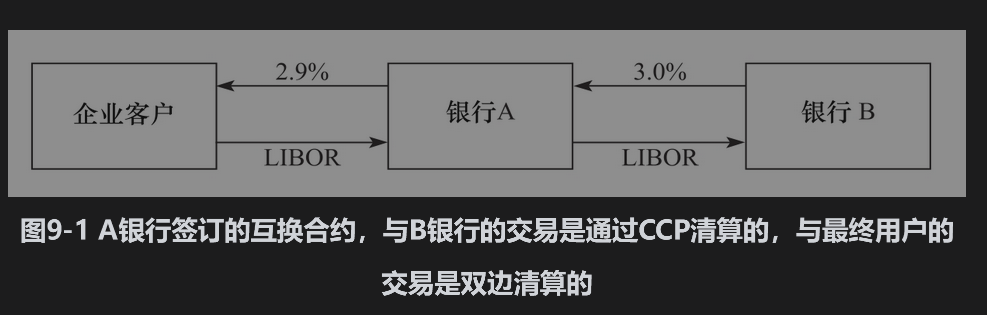

9.2 FVA和MVA

融资价值调节量(FVA)和保证金价值调节量(MVA)是对于衍生产品交易组合关于融资费用的价值调节。为了说明这些调节项的来源，假定衍生产品交易商银行A与银行B之间签订了一笔5年期的利率互换交易，同时银行A与某企业客户签订了一笔与原交易相互抵消的对冲交易（见图9-1）。银行A从银行B中收入3%的固定利率，同时支付给企业客户2.9%的固定利率。表面看来，银行A锁定了0.1%的盈利。假定银行A与银行B的交易是通过CCP来清算，银行A和银行B都需要支付初始保证金和追加保证金（如前面章节所示，在2008～2009年金融危机后，所有的标准利率互换都要需要通过CCP来进行清算）。

如果银行A与企业客户的互换也是通过同一家CCP来进行清算，那么银行A面临的问题就非常简单。CCP会通过净额结算将两边交易进行抵消，因此，A银行无须支付任何附加初始保证金。事实上，两笔交易给银行A带来的净值为正，银行A此时支付的保证金会少于当这两笔交易不存在时的情形。

但是，如果银行A和企业客户之间的交易是通过双边清算模式，那么结算过程中不需要支付任何抵押品。同时假定银行A和银行B之间的交易仍然是通过CCP来清算。这时，两种不同的清算过程对于融资会有不同的影响。首先，在互换交易的期限中，CCP也许会要求银行A支付更多的附加初始保证金。假设银行A支付保证金的资金成本高于CCP对于初始保证金所支付的利息，这会给银行A产生资金成本，这一成本称为保证金价值调节量(MVA)，该成本会降低银行与客户所签署合约的价值。

CCP的追加保证金也会造成融资需要。假定对于银行A而言，银行A与银行B之间的交易价值为负，银行A与企业客户的交易价值为正，银行A为了满足追加保证金要求而要向CCP支付保证金，但银行A同时从企业客户又收不到任何抵押品，银行A因此会出现资金需求，从而需要对外进行融资。相反，当银行A与银行B的交易价值为正，与企业客户的交易价值为负时，银行A从CCP收入追加保证金，同时又不需要向企业客户支付抵押品，这会给银行A带来资金盈余。

接下来我们继续假设银行支付的保证金成本利息高于CCP所付利息。以上讨论的第一个情形会给银行带来费用（银行A需要增加外部融资），而第二个情形会给银行带来收益（银行A可以减少外部融资）。FVA就是体现了这里的费用和收益对于衍生产品价值的影响。将来预期融资费用的贴现称为融资费用调节量(funding cost adjustment, FCA)，将来预期融资受益的贴现称为融资收益调节量(funding benefit adjustment, FBA)。FVA会使得衍生产品的价值有所下调，下调量等于FCA与FBA的差。如图9-1所示，随着时间的变化，FVA的正负取决于银行A与银行B互换价值正负的变化，该互换价值的正负取决于第7.7节中所讨论的利率的期限结构形状。

图9-1的情形不是产生FVA和MVA的唯一情形。当银行与交易对手进行一笔无抵押的衍生产品交易时，FVA也可能会出现。当无抵押的衍生产品对于银行而言价值为正时，就会产生融资费用；当无抵押的衍生产品对于银行而言价值为负时，就会产生融资收益。例如，当银行从交易对手处买入了一个无抵押的期权，对于银行而言，期权的价值为正，这时会产生融资成本，该成本等于银行的融资利率与期权定价中的无风险利率的差；当银行向交易对手处卖出了一个无抵押的期权，对于银行而言，期权的价值为负，这时会有融资收益。当交易触发附加初始准备金时，就会产生MVA。如前面的章节所述，无论是对于金融机构之间的双边交易，还是对于CCP清算交易，业界都在逐渐实施相应的初始保证金规则。

为了计算MVA和FVA，我们需要回答以下问题：“在例如图9-1所示的情形下，保证金融资费用是什么？”这在实践和理论之间常常存在差异，很多银行认为保证金融资费用等于平均债券融资费用。假定保证金是按美元计算的。如果银行收取的美元抵押品利率为美联储基准利率减去20个基点，同时银行的平均融资利率为美联储基准利率加上100个基点，在计算FVA和MVA时，银行会将融资成本计定为120个基点。

金融经济学家认为，投资项目的融资方式不会影响投资回报，投资者所寻求的回报应该反映在投资的风险中。初始保证金和追加保证金具有非常低的风险，因此，银行也应该可以接受保证金的回报接近于无风险利率这个事实。在我们的例子中，假如保证金所需要的收益率为美联储基准利率加上10个基点，而保证金所收入利息的利率为美联储基准利率减去20个基点，这时融资成本（或收益）为30个基点（而不是前面计算出的120个基点）。

在计算过程中，我们不应该使用美联储基金的平均融资利率加上100个基点，为了解释这一点，赫尔和怀特(Hull and White)采用了两个观点。
第一个观点是，银行可以对自己的债券违约，因此这里的100个基点溢差会使银行受益，这与前面讨论的DVA有些类似，赫尔和怀特将此项称为DVA2。正是因为这个收益，银行不需要将融资成本转移到衍生产品交易平台。

在第二个观点中，假定无风险利率为2%，银行的融资成本为3.5%。如果出现一个提供回报为3%的无风险项目，银行应该承接这个项目吗？答案是肯定的，对项目现金流贴现的利率应该是2%。采用无风险利率进行贴现时，该项目对于银行有一个正的贴现值。故“因为银行的融资成本利率为3.5%，所以银行只能承接收益率高于3.5%的项目”这种说法是不正确的。

我们考虑当银行承接了一个无风险项目（或者接近于无风险）后会出现的局面。这时，银行的融资成本会有所下降，无风险项目的附加融资成本应该是2%，而不是3.5%。考虑一个极端的例子，假定银行想通过承接无风险项目来将其规模扩大1倍，银行的融资成本因此变成2.75%（对于老项目采用3.5%，对于新项目采用2%，将新老项目成本取平均）。如果对于所有项目均采用3.5%来作为投资所需的回报，低风险就会变得不吸引人，而高风险项目会变得引人注目。

安德森(Andersen)等几位作者也对在FVA计算中使用平均融资费用提出了质疑。他们考虑了以下情形：债券投资者并没有意识到保证金是一种投资，他们会惊喜地发现，保证金投资使银行变得更加稳健。这等同于将财富从股权人转移到债权人。

关于XVA的争议有一个有意思的类比。在初级公司金融课程里，学生会学习到如何计算（非金融）企业的加权平均资本成本(WACC)，以及如何用其对一个资本投资项目的现金流进行贴现。学生会学到贴现利率与项目的风险有关，但与项目的融资方式无关。如果一个项目的风险高于所有项目的平均值，那么贴现利率应该高于WACC；如果一个项目的风险低于所有项目的平均值，那么贴现利率应该低于WACC。

许多企业对于所有的项目都使用单一的WACC，这会使得风险大的项目（与其实际情况相比）更具吸引力，也会使得风险小的项目（与其实际情况相比）吸引力更弱。当所有条件为相同时，使用单一的贴现利率可以导致一个公司风险随着时间而变大。

与XVA相比，许多考虑了FVA和MVA的投资项目风险均低于平均风险。与银行的其他投资项目相比，投资初始保证金和追加保证金的风险更低。因此，保证金的边际效应会使得银行融资的平均费用降低。

金融工程师与金融经济学家对于FVA和MVA看法的不同之处在于金融工程师关注平均费用，而金融经济学家关注于边际融资成本(marginal funding cost)，争论的焦点可以用以下对话来总结。

金融经济学家：一个项目的融资成本应该反映项目的风险，使用平均融资成本意味着银行所有的项目风险等同。

金融工程师：将资金投放到初始保证金或者低风险的对冲衍生交易之中，会使我们无法将资金用于别处。银行所得平均回报要比从类似初始保证金这样的投资中高得多，低风险低收益的项目会触发费用。

金融经济学家：你似乎是在说你的业务缺乏资金。但如果你有一个好项目，不管是低风险，还是高风险，市场都会给你提供融资。

金融工程师：但在实际中并非这样。