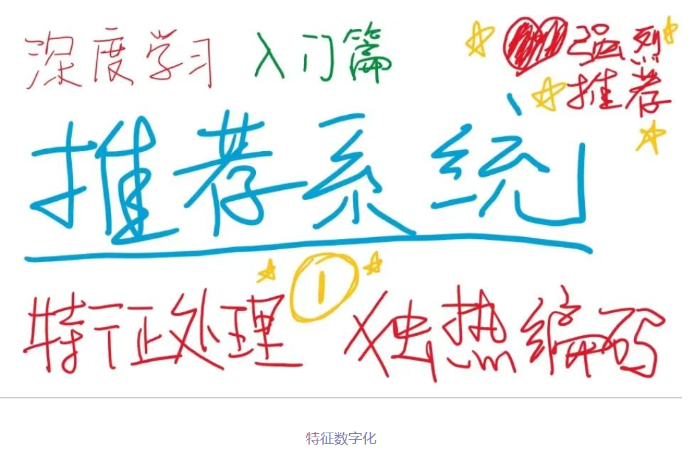
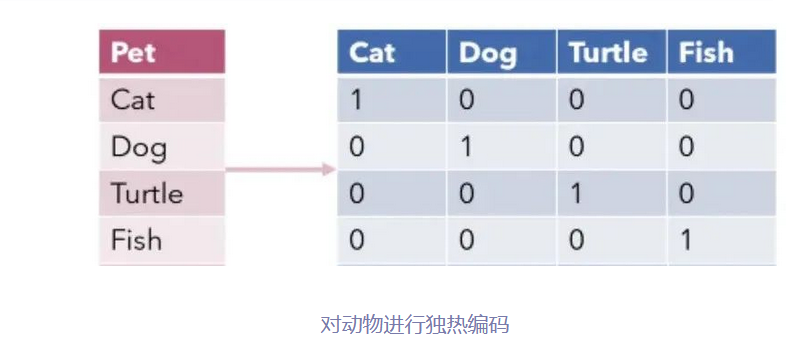
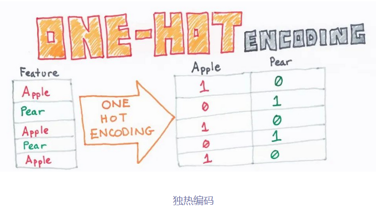
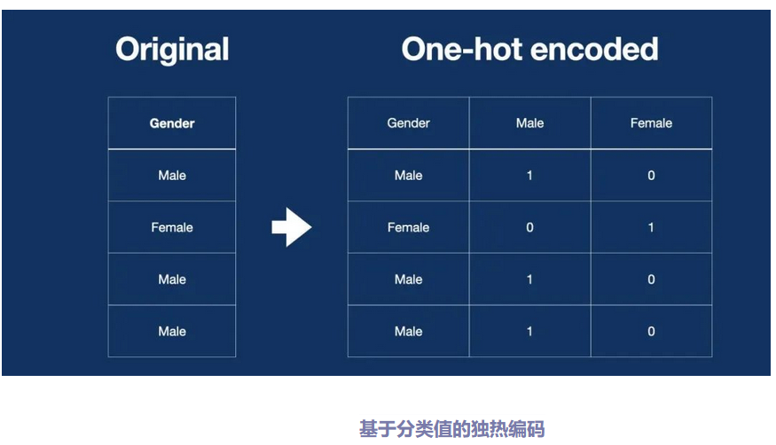
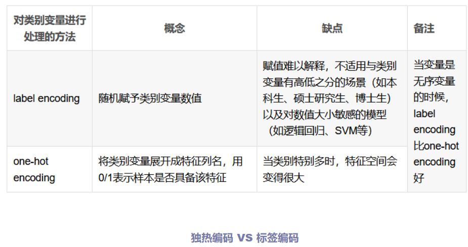
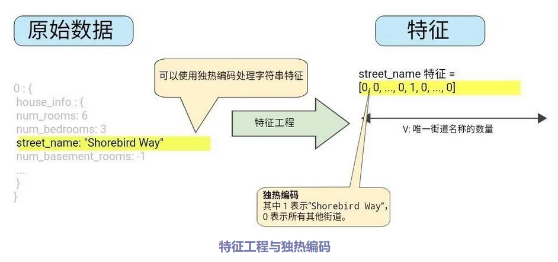
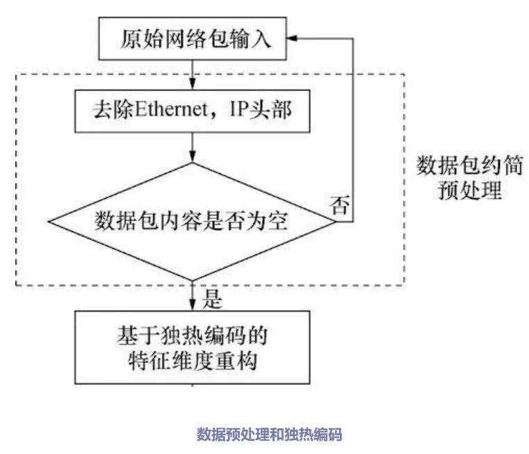

# 神经网络算法 - 一文搞懂One-Hot Encoding（独热编码）

本文将从独热编码的原理、独热编码的分类、独热编码的应用三个方面，带您一文搞懂独热编码 One-Hot Encoding 。

## 一、独热编码的原理

特征数字化：将分类变量（或称为离散特征、无序特征）转换为一种适合机器学习算法处理的格式。

为每个分类特征的每个可能值创建一个新的二进制特征（即“独热”特征），其中只有一个特征在任何给定时间被激活（标记为1），而其他所有特征都被标记为0。

步骤1：确定动物类别

首先，确定需要分类的动物类别。在这个例子中，我们有四种动物：猫、狗、乌龟和鱼。

步骤2：创建二进制特征向量

为每个动物类别创建一个二进制特征向量。向量的长度等于动物类别的数量，即在这个例子中是4。对于每个动物，只有与其对应的特征位置为1，其余位置为0。

步骤3：对动物进行独热编码

根据每个动物的类别，将其转换为对应的独热编码表示。在这个例子中，猫的编码是[1, 0, 0, 0]，狗的编码是[0, 1, 0, 0]，乌龟的编码是[0, 0, 1, 0]，鱼的编码是[0, 0, 0, 1]。

独热编码（One-Hot Encoding）：使用N位状态寄存器对N个状态进行编码，每个状态由其独立的寄存器位表示，并且任意时刻只有一位是有效的（即设置为1）。

优点：

解决分类数据处理问题：独热编码将离散分类特征转换为机器学习算法易于处理的二进制格式，提高了算法对离散特征的处理能力。

避免引入数值偏误：通过将每个类别映射到独立的二进制向量，独热编码消除了类别间可能存在的错误数值关系，从而避免了算法基于这些关系做出不准确的预测。

缺点：

维度增加：当类别数量较多时，独热编码会显著增加特征空间的维度，可能导致计算复杂性和过拟合问题。

信息损失风险：独热编码可能无法充分捕捉类别间的潜在关系或顺序信息，从而在某些情况下导致有用信息的丢失。

## 二、独热编码的分类

基于分类值的独热编码：独热编码是针对具有明确分类值的数据进行预处理的有效方法，通过将每个分类值转换为独立的二进制向量，确保模型正确理解非数值分类特征，避免数值关系的误判。

- 针对具有明确分类值的数据：

独热编码特别适用于处理那些具有明确、有限且通常不带有数值意义的分类值的数据。例如，在性别这一特征中，我们有“男”和“女”这两个分类值，它们之间没有数值上的大小或顺序关系。同样，在颜色特征中，“红”、“绿”和“蓝”也是纯粹的分类标签，没有隐含的数值含义。
- 每个唯一分类值转换为二进制向量：

在独热编码中，每个唯一的分类值都被赋予一个唯一的二进制向量，也被称为“独热”向量，因为在这个向量中，只有一个位置的元素是1（表示该类别的存在），其余所有位置的元素都是0。例如，如果有三个颜色类别，那么“红”可能被编码为[1, 0, 0]，“绿”被编码为[0, 1, 0]，而“蓝”被编码为[0, 0, 1]。

- 避免数值关系误解

使用独热编码的一个重要原因是，它可以防止机器学习模型错误地解释分类值之间可能存在的数值关系。如果直接使用原始的分类标签（如整数或字符串），某些模型（特别是基于数值计算的模型，如线性回归）可能会尝试在这些标签之间建立数值上的联系。通过转换为独热编码，每个类别都是完全独立的，模型不会受到这种潜在误导的影响。

基于序数的独热编码：对序数型数据应用独热编码可能会丢失重要的顺序信息，因此需要慎重考虑信息损失的风险，并根据模型需求和场景选择更合适的编码策略。

- 信息损失：

独热编码将每个序数类别转换为独立的二进制向量，这导致原始数据中的顺序信息丢失。

对于依赖类别间顺序关系的模型或分析，这种信息损失可能会影响结果的准确性和解释性。

- 模型适用性：

某些机器学习模型（如决策树和随机森林）能够隐式地处理序数关系，即使使用独热编码，也可能表现出良好的性能。

然而，其他模型（如线性回归或神经网络）可能需要额外的特征工程来捕获丢失的顺序信息。

- 替代方案：

在处理序数型数据时，可以考虑其他编码方案，如标签编码（将每个序数映射到一个整数），这样可以保留顺序信息但可能引入不必要的数值关系。

另一种方法是创建额外的特征来表示类别间的相对关系，如通过比较或计算不同类别之间的距离。

## 三、独热编码的应用
特征工程与独热编码：特征工程中的独热编码是处理分类特征的重要步骤，但使用时需要权衡其对特征维度、稀疏性、信息表示和模型选择的影响。

- 分类特征处理

问题：许多机器学习算法无法直接处理分类数据，因为它们需要数值输入。

- 独热编码的作用：将分类变量转换为二进制向量，使算法能够处理这些变量。每个分类值都被映射到一个唯一的二进制向量上，其中只有一个元素为1（表示该类别的存在），其余元素为0。

- 特征扩展

影响：独热编码会增加数据集的特征数量。例如，一个有n个不同取值的分类特征会被转换成n个新的二进制特征。

考虑因素：特征数量的增加可能会影响模型的复杂性和训练时间。在特征数量大幅增加时，可能需要考虑特征选择或降维技术。

- 稀疏性引入

结果：独热编码通常会产生稀疏特征矩阵，即矩阵中大部分元素都是0。

影响：稀疏性对于某些算法（如线性模型、树模型）可能是一个优点，因为它们可以有效地处理稀疏输入。但对于其他算法（如神经网络），稀疏输入可能需要特殊的处理或优化。

- 信息表示

优点：独热编码能够明确表示分类特征之间的不同，而不会引入任何数值上的偏序关系。

限制：独热编码不保留类别之间的任何数值或顺序关系。如果类别之间存在自然顺序（如评级：低、中、高），则独热编码可能会丢失这种信息。

- 模型适用性

选择理由：选择独热编码是因为许多机器学习算法（如逻辑回归、支持向量机、决策树）在处理数值型输入时表现更好。

注意事项：并非所有算法都需要或受益于独热编码。例如，一些基于树的算法（如随机森林）可以直接处理分类特征，而无需进行独热编码。

数据预处理与独热编码：独热编码是数据预处理中常用的一种技术，主要用于处理分类数据。

- 分类数据处理：

在数据集中，经常遇到包含分类（或称为名义）特征的情况，这些特征的值是非数值的，如性别（男、女）、颜色（红、绿、蓝）等。

独热编码是将这些分类特征转换为机器学习模型能够理解的数值格式的一种有效方法。

- 避免引入偏序关系：

如果直接将分类特征的标签（如1, 2, 3）用作数值输入，模型可能会错误地解释这些标签之间存在数值上的关系（如认为2是1的两倍，或3大于2）。

独热编码通过为每个类别分配一个独立的二进制向量来消除这种偏序关系，确保模型不会基于错误的数值假设做出预测。

- 与其他预处理技术的结合：

独热编码通常与其他数据预处理技术一起使用，如缺失值处理、特征缩放和特征选择。

在应用独热编码之前，可能需要先处理缺失值，因为独热编码通常不适用于包含缺失值的分类特征。此外，在应用独热编码后，可能还需要进行特征选择以减少维度和冗余。