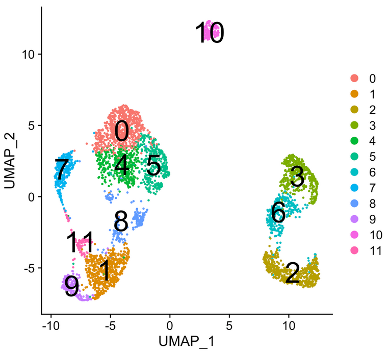
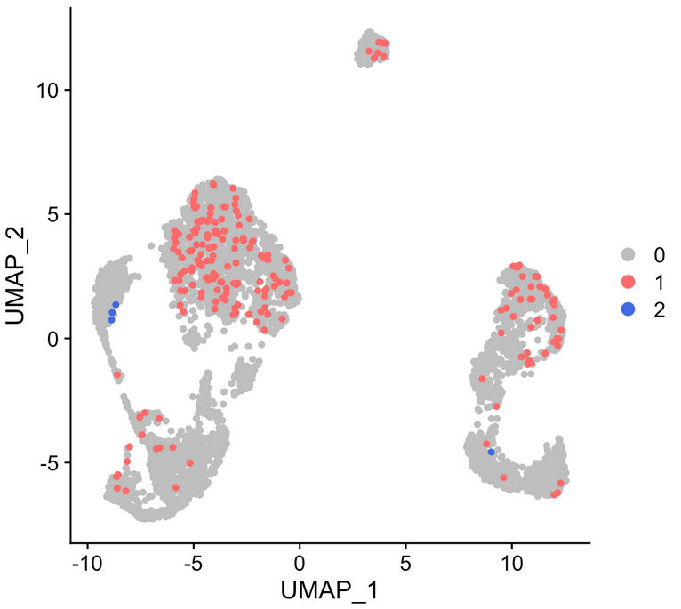
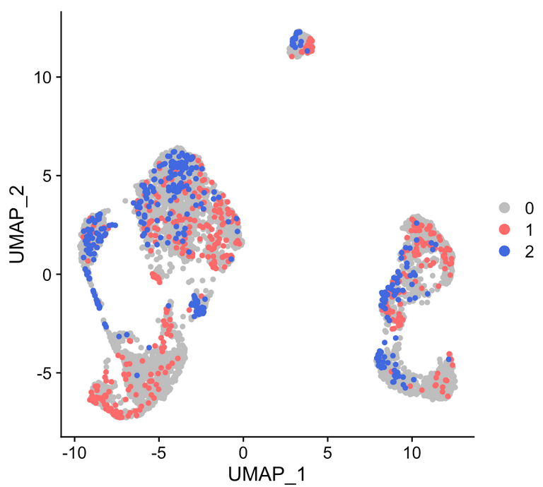
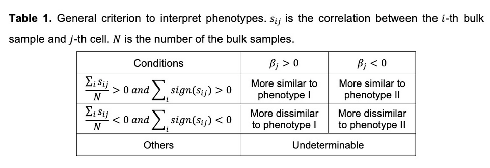

 # Scissor Tutorial

 Duanchen Sun
2021-08-03

- Introduction
- Scissor examples
  
   + Apply Scissor with Cox regression

     Prepare the scRNA-seq data

     Prepare the bulk data and phenotype

     Execute Scissor to select the informative cells
            
     Tune model paramters

   + Apply Scissor with logistic regression

     Prepare the bulk data and phenotype

     Execute Scissor to select the informative cells
- Scissor result interpretation
- Reliability significance test
- Cell level evaluations
- Reference

## Introduction

This Scissor R package contains the proposed Scissor algorithm (function Scissor), which is a novel single-cell data analysis approach that utilizes bulk phenotypes to identify the most highly phenotype-associated cell subpopulations from single-cell sequencing data. The advantages of Scissor can be briefly summarized as follows: First, the phenotype-associated cells identified by Scissor exhibit distinct molecular properties, which involve crucial marker genes and biological processes of the given phenotypes. Second, Scissor does not require any unsupervised clustering on single-cell data, which avoids subjective decisions of cell cluster numbers or clustering resolution. Finally, Scissor provides a flexible framework to integrate various external phenotypes in bulk data to guide single-cell data analysis, enabling hypothesis-free identification of clinically and biologically relevant cell subpopulations.

In this tutorial (R version: 3.6.1), we use several examples to help users executing Scissor in real applications. We first load in the required package:

```python 

library(Scissor)

```

## Scissor examples

There are three data sources for Scissor inputs: a single-cell expression matrix, a bulk expression matrix, and a phenotype of interest. The phenotype annotation of each bulk sample can be a continuous dependent variable, binary group indicator vector, or clinical survival data. 

In this tutorial, we use several applications on the Lung Adenocarcinoma (LUAD) scRNA-seq cancer cells as examples to show how to execute Scissor in real applications.
### Apply Scissor with Cox regression

In our first example, we use the LUAD bulk samples with survival information in Scissor to identify aggressive cancer cell subpopulations within the LUAD cancer cells.
#### Prepare the scRNA-seq data

We load in the LUAD scRNA-seq raw counts data:

```python 

location <- "https://xialab.s3-us-west-2.amazonaws.com/Duanchen/Scissor_data/"
load(url(paste0(location, 'scRNA-seq.RData')))

```

In this LUAD scRNA-seq data, each row represents a gene and each column represents a cancer cell. The dimensions of the LUAD single-cell data are:

```python 

dim(sc_dataset)
## [1] 33694  4102

```
which indicates there are 33,694 genes and 4,102 cancer cells in total. For the scRNA-seq data used in Scissor, a Seurat object that contains the preprocessed data and constructed network is preferred. We use the functions in the Seurat package to preprocess this data and construct a cell-cell similarity network. In this package, we wrapped the Seurat analysis pipeline into the following function:

```python 

sc_dataset <- Seurat_preprocessing(sc_dataset, verbose = F)

```

The output of Seurat_preprocessing function is a Seurat object

```python 

class(sc_dataset)

```

```python 

## [1] "Seurat"
## attr(,"package")
## [1] "Seurat"


```


It contains the required preprocessed matrix and constructed cell-cell similarity network, as well as other helpful dimensionality reduction results, such as the PCA, t-SNE, and UMAP.

```python 

names(sc_dataset)

```

```python 

## [1] "RNA"     "RNA_nn"  "RNA_snn" "pca"     "tsne"    "umap"

```

Users can tune the preprocessing parameters in this function to achieve different goals and apply other related Seurat functions to sc_dataset. For example, we can visualize these 4,102 cells using the UMAP coordinates:

```python 

DimPlot(sc_dataset, reduction = 'umap', label = T, label.size = 10)

```



Furthermore, users can also provide a Seurat object using their own Seurat analysis pipeline (a normalized data and a constructed network is required) or a scRNA-seq dataset preprocessed by other tools.
#### Prepare the bulk data and phenotype

We load in the preprocessed LUAD bulk expression matrix and the corresponding survival data downloaded from The Cancer Genome Atlas (TCGA).

```python 

load(url(paste0(location, 'TCGA_LUAD_exp1.RData')))
load(url(paste0(location, 'TCGA_LUAD_survival.RData')))

```

Same with the LUAD scRNA-seq data, the rows and columns are genes and cells, respectively. The dimensions of the LUAD bulk dataset are:

```python 

dim(bulk_dataset)

```

```python 

## [1] 56716   471

```

It shows this data has 56716 genes and 471 samples in total. Users do not need to keep the common genes between the single-cell and bulk samples, which can be automatically achieved in Scissor. Besides, all of these samples have clinical outcomes:

```python 

head(bulk_survival)

```


The clinical survival phenotype requires a two-column matrix with columns named 'time' and 'status'. The first column contains the sample IDs (observations), which should in the same order as the columns in the bulk expression matrix. The second column is a binary variable, with '1' indicating event (e.g.recurrence of cancer or death), and '0' indicating right-censored.

```python 

all(colnames(bulk_dataset) == bulk_survival$TCGA_patient_barcode)

```

```python 

## [1] TRUE

```

```python 

phenotype <- bulk_survival[,2:3]
colnames(phenotype) <- c("time", "status")
head(phenotype)

```


#### Execute Scissor to select the informative cells

Given the above inputs, we can use Scissor to select the phenotype-associated cell subpopulations, which is fitted by a Cox regression model (family = 'cox'):

```python 

infos1 <- Scissor(bulk_dataset, sc_dataset, phenotype, alpha = 0.05, 
                 family = "cox", Save_file = 'Scissor_LUAD_survival.RData')

```

```python 

## [1] "|**************************************************|"
## [1] "Performing quality-check for the correlations"
## [1] "The five-number summary of correlations:"
##       0%      25%      50%      75%     100% 
## 0.013191 0.196584 0.239458 0.298085 0.837278 
## [1] "|**************************************************|"
## [1] "Perform cox regression on the given clinical outcomes:"
## [1] "alpha = 0.05"
## [1] "Scissor identified 201 Scissor+ cells and 4 Scissor- cells."
## [1] "The percentage of selected cell is: 4.998%"
## [1] "|**************************************************|"

```

As showed in the printing messages, Scissor first outputs the five-number summary of the correlations between the single-cell and bulk samples. We found that all the correlations are positive, and these values are not close to 0. In real applications, Scissor will give a warning message if the median correlation of the used datasets is too low (< 0.01), which may cause unreliable phenotype-to-cell associations.

In total, Scissor identifies 201 Scissor+ cells associated with worse survival and 4 Scissor- cells associated with good survival, which is saved in infos1:

```python 

names(infos1)

```
```python 

## [1] "para"        "Coefs"       "Scissor_pos" "Scissor_neg"

```
```python 

length(infos1$Scissor_pos)

```
```python 

## [1] 201

```
```python 

infos1$Scissor_pos[1:4]

```
```python 

## [1] "AAAGTAGAGGAGCGAG_19" "AACCATGCATCTCCCA_19" "AACCGCGAGCTGCGAA_20" "AACTCAGTCCGCGGTA_19"

```
```python 

length(infos1$Scissor_neg)

```
```python 

## [1] 4

```
```python 

infos1$Scissor_neg

```

```python 

## [1] "ACGCCAGTCCTCCTAG_20" "ACGGGCTAGTGGCACA_20" "CCGGTAGGTACCCAAT_15" "GACGCGTAGTGGTCCC_20"

```
These selected cells account for 5% of total 4,102 cells. We can visualize the Scissor selected cells by adding a new annotation in the Seurat object sc_dataset:
```python 

Scissor_select <- rep(0, ncol(sc_dataset))
names(Scissor_select) <- colnames(sc_dataset)
Scissor_select[infos1$Scissor_pos] <- 1
Scissor_select[infos1$Scissor_neg] <- 2
sc_dataset <- AddMetaData(sc_dataset, metadata = Scissor_select, col.name = "scissor")
DimPlot(sc_dataset, reduction = 'umap', group.by = 'scissor', cols = c('grey','indianred1','royalblue'), pt.size = 1.2, order = c(2,1))

```



in which 1 stand for Scissor+ cells and 2 stand for Scissor- cells.

At last, we can get access to the parameters and used model using:
```python 

infos1$para

```
```python 

## $alpha
## [1] 0.05
## 
## $lambda
## [1] 0.042292
## 
## $family
## [1] "cox"

```
#### Tune model paramters

We set the parameter α equals to 0.05 (alpha = 0.05) in the above implementation. Parameter α balances the effect of the L1-norm and the network-based penalties. A larger α inclines to emphasize the L1-norm to encourage sparsity, making Scissor selects fewer cells than the result using a smaller α. In application, Scissor can automatically save the regression inputs into a RData (Save_file = 'Scissor_LUAD_survival.RData), which is convenient for the users to tune different α. We can set Load_file = 'Scissor_LUAD_survival.RData' and use the default α sequence (alpha = NULL) to run Scissor:
```python 

infos2 <- Scissor(bulk_dataset, sc_dataset, phenotype, alpha = NULL, cutoff = 0.03, 
                 family = "cox", Load_file = 'Scissor_LUAD_survival.RData')

```
```python 

## [1] "alpha = 0.005"
## [1] "Scissor identified 889 Scissor+ cells and 28 Scissor- cells."
## [1] "The percentage of selected cell is: 22.355%"
## 
## [1] "alpha = 0.01"
## [1] "Scissor identified 573 Scissor+ cells and 20 Scissor- cells."
## [1] "The percentage of selected cell is: 14.456%"
## 
## [1] "alpha = 0.05"
## [1] "Scissor identified 201 Scissor+ cells and 4 Scissor- cells."
## [1] "The percentage of selected cell is: 4.998%"
## 
## [1] "alpha = 0.1"
## [1] "Scissor identified 139 Scissor+ cells and 5 Scissor- cells."
## [1] "The percentage of selected cell is: 3.510%"
## 
## [1] "alpha = 0.2"
## [1] "Scissor identified 78 Scissor+ cells and 5 Scissor- cells."
## [1] "The percentage of selected cell is: 2.023%"
## [1] "|**************************************************|"

```
In the above implementation, we set a new percentage cutoff (cutoff = 0.03), which stopped the α searching when the total percentage of the selected cells is less than 3%. The corresponding α equals 0.2, which selected 78 Scissor+ cells and 5 Scissor- cells. To avoid arbitrarily choosing alpha in real applications, we recommend searching α based on the percentage of the selected cells in total cells. The default value of cutoff is 0.2, i.e., the number of the Scissor selected cells should not exceed 20% of total cells in the single-cell data. Furthermore, users can set their customized α sequence and percentage cutoff to achieve their different goals. For example, we can run Scissor as:
```python 

infos3 <- Scissor(bulk_dataset, sc_dataset, phenotype, alpha = seq(1,10,2)/1000, cutoff = 0.2,
                 family = "cox", Load_file = 'Scissor_LUAD_survival.RData')

```

```python 

## [1] "alpha = 0.001"
## [1] "Scissor identified 1666 Scissor+ cells and 1870 Scissor- cells."
## [1] "The percentage of selected cell is: 86.202%"
## 
## [1] "alpha = 0.003"
## [1] "Scissor identified 1262 Scissor+ cells and 37 Scissor- cells."
## [1] "The percentage of selected cell is: 31.667%"
## 
## [1] "alpha = 0.005"
## [1] "Scissor identified 889 Scissor+ cells and 28 Scissor- cells."
## [1] "The percentage of selected cell is: 22.355%"
## 
## [1] "alpha = 0.007"
## [1] "Scissor identified 729 Scissor+ cells and 24 Scissor- cells."
## [1] "The percentage of selected cell is: 18.357%"
## [1] "|**************************************************|"

```
### Apply Scissor with logistic regression

In another example, we use other phenotypical features provided by TCGA-LUAD to guide the identification of cell subpopulations within the same 4,102 cancer cells. Here we focus on TP53, one of the most commonly mutated tumor suppressor genes found in human malignancies.
#### Prepare the bulk data and phenotype

We download the TP53 mutation status (mutant or wild-type) from TCGA-LUAD as the phenotypes of bulk samples:
```python 

load(url(paste0(location, 'TCGA_LUAD_exp2.RData')))
load(url(paste0(location, 'TCGA_LUAD_TP53_mutation.RData')))

```

There are 498 bulk samples; 255 of them are detected with TP53 mutant, and the remainings are wild-types:

```python 

table(TP53_mutation)

```
```python 

## TP53_mutation
##   0   1 
## 243 255

```

#### Execute Scissor to select the informative cells

Given the above binary variable with TP53 mutant = 1 and wild-type = 0, we use family = 'binomial' in Scissor to select the phenotype-associated cell subpopulations:

```python 

phenotype <- TP53_mutation
tag <- c('wild-type', 'TP53 mutant')
infos4 <- Scissor(bulk_dataset, sc_dataset, phenotype, tag = tag, alpha = 0.5, 
                 family = "binomial", Save_file = "Scissor_LUAD_TP53_mutation.RData")

```
```python 

## [1] "|**************************************************|"
## [1] "Performing quality-check for the correlations"
## [1] "The five-number summary of correlations:"
##      0%     25%     50%     75%    100% 
## 0.01309 0.19502 0.23725 0.29589 0.83831 
## [1] "|**************************************************|"
## [1] "Current phenotype contains 243 wild-type and 255 TP53 mutant samples."
## [1] "Perform logistic regression on the given phenotypes:"
## [1] "alpha = 0.5"
## [1] "Scissor identified 173 Scissor+ cells and 160 Scissor- cells."
## [1] "The percentage of selected cell is: 8.118%"
## [1] "|**************************************************|"

```
Note that the parameter tag is used to double check the phenotype encoding. The different 0-1 encoding in phenotype may lead to opposite interpretations. Please see the next section Scissor result interpretation for more details. 

Similarly, we can directly tune other α values by setting Load_file = "Scissor_LUAD_TP53_mutation.RData:

```python 

infos5 <- Scissor(bulk_dataset, sc_dataset, phenotype, tag = tag, alpha = 0.2, 
                 family = "binomial", Load_file = "Scissor_LUAD_TP53_mutation.RData")

```

```python 

## [1] "alpha = 0.2"
## [1] "Scissor identified 414 Scissor+ cells and 318 Scissor- cells."
## [1] "The percentage of selected cell is: 17.845%"
## [1] "|**************************************************|"

```
In total, Scissor identifies 414 Scissor+ cells associated with the TP53 mutant and 318 Scissor- cells associated with the wild-type. We can visualize these selected cells using UMAP technique:
```python 

Scissor_select <- rep(0, ncol(sc_dataset))
names(Scissor_select) <- colnames(sc_dataset)
Scissor_select[infos5$Scissor_pos] <- 1
Scissor_select[infos5$Scissor_neg] <- 2
sc_dataset <- AddMetaData(sc_dataset, metadata = Scissor_select, col.name = "scissor")
DimPlot(sc_dataset, reduction = 'umap', group.by = 'scissor', cols = c('grey','indianred1','royalblue'), pt.size = 1.2, order = c(2,1))

```


in which 1 stand for Scissor+ cells and 2 stand for Scissor- cells.
## Scissor result interpretation

Both Scissor+ cells and Scissor- cells are the Scissor selected cells that are most highly associated with the specified phenotypes. The associations between the Scissor selected cells and phenotypes depend on the used model and should be interpreted in a specific context. For both linear regression and classification models, the initial values in parameter phenotype will affect the interpretation. For example, in the above application using the TP53 mutation status, if TP53 mutant is encoded as 1, and wild-type is 0, Scissor+ cells would be associated with the TP53 mutant, and Scissor- cells will be associated with the wild-types. If the coding is reversed in phenotype for two phenotypes, the interpretations of Scissor+ cells and Scissor- cells are changed accordingly. For Cox regression, Scissor+ cells are associated with worse survival, and Scissor- cells are associated with good survival.

Scissor can associate cells with phenotypes, and this kind of association is a relative concept between phenotypes. Namely, Scissor assigns which phenotype a cell is more likely associated with than the other phenotype. 

Considering the possible negative correlations between the single-cell and bulk samples, we can further interpret a cell by assigning it into the following three categories (Table 1): if the average of a cell’s correlations with all bulk samples is greater than 0 and the number of positive correlations is larger than the number of the negative correlations, this cell is more similar to the associated phenotype; if the average of a cell’s correlations is less than 0 and the number of negative correlations is larger than the number of positive correlations, this cell should be interpreted as more dissimilar to the other phenotype; otherwise, this cell’s association with the phenotype is undeterminable. In most cases, the negative correlation values are very few and the identified cells fall into the “more similar” category.



## Reliability significance test

To determine whether the inferred phenotype-to-cell associations are reliable, we use the function reliability.test to perform a reliability significance test. The motivation for the reliability significance test is: if the chosen single-cell and bulk data are not suitable for the phenotype-to-cell associations, the correlations would be less informative and not well associated with the phenotype labels. Thus, the corresponding prediction performance would be poor and not be significantly distinguishable from the randomly permutated labels. In this tutorial, we test the identified associations in the above applications as examples to show how to run reliability.test.

We choose the 205 Scissor selected cells associated with worse or good survival. The saved Rdata in Scissor can be used as the test inputs:

```python 

load('Scissor_LUAD_survival.RData')

```
We use the 10-fold cross-validation (nfold = 10) and set the permutation time as 10 (n = 10) to save some time. In real applications, the reliability significance test can be time-consuming for larger permutation time (default n = 100).

```python 

numbers <- length(infos1$Scissor_pos) + length(infos1$Scissor_neg)
result1 <- reliability.test(X, Y, network, alpha = 0.05, family = "cox", cell_num = numbers, n = 10, nfold = 10)

```
```python 

## [1] "|**************************************************|"
## [1] "Perform cross-validation on X with true label"
## Finished!
## [1] "|**************************************************|"
## [1] "Perform cross-validation on X with permutated label"
## Finished!
## [1] "Test statistic = 0.628"
## [1] "Reliability significance test p = 0.000"

```
We can see that reliability.test prints a test statistic and a test p-value. This p-value is less than 0.05, indicating that these associations are reliable. The output result1 also contains the evaluation measurements calculated using the real label and permutated labels:

```python 

names(result1)

```
```python 

## [1] "statistic"         "p"                 "c_index_test_real" "c_index_test_back"

```
In our study, the evaluation measurement is the mean squared error (MSE) for linear regression, the area under the ROC curve (AUC) for classification, and the concordance index (c-index) for Cox regression. The averaged evaluation measurement calculated using the real label is used to serve as the test statistic.

Similarly, we can test the Scissor selected cells associated with the TP53 mutant or wild-types.
```python 

load('Scissor_LUAD_TP53_mutation.RData')
numbers <- length(infos5$Scissor_pos) + length(infos5$Scissor_neg)
result2 <- reliability.test(X, Y, network, alpha = 0.2, family = "binomial", cell_num = numbers, n = 10, nfold = 10)

```
```python 

## [1] "|**************************************************|"
## [1] "Perform cross-validation on X with true label"
## Finished!
## [1] "|**************************************************|"
## [1] "Perform cross-validation on X with permutated label"
## Finished!
## [1] "Test statistic = 0.790"
## [1] "Reliability significance test p = 0.000"

```
## Cell level evaluations

Finally, we can use the function evaluate.cell to obtain some supporting information for each Scissor selected cell. Using the application on the LUAD cancer cells with survival as an example, we evaluate the 205 Scissor selected cells by running the following code:

```python 

evaluate_summary <- evaluate.cell('Scissor_LUAD_survival.RData', infos1, FDR = 0.05, bootstrap_n = 100)

```
```python 

## [1] "|**************************************************|"
## [1] "Performing correlation check for each selected cell"
## Finished!
## [1] "|**************************************************|"
## [1] "Performing nonparametric bootstrap"
## Finished!

```

The evaluate.cell function contains two strategies to evaluate each Scissor selected cell. The first strategy focuses on the correlation values and their corresponding p-values for each selected cell with all bulk samples, which includes the first four columns in the output data.frame variable:
```python 

evaluate_summary[1:5,1:4]

```


We can see that the evaluate.cell function reports the mean correlation (column Mean correlation) and the percentages of positive/negative correlations (columns Correlation > 0 and Correlation < 0) of a cell with all bulk samples, which correspond to the conditions in our proposed general interpretation criterion (Table 1). In this application, all Scissor selected cells are more similar to the associated phenotypes:

```python 

all(evaluate_summary$`Mean correlation` & as.numeric(gsub('%','',evaluate_summary$`Correlation > 0`)) > 50)

```
```python 

## [1] TRUE

```
The evaluate.cell function also inspect the FDRs derived from the standard correlation p-values for each selected cell. It outputs the percentages of significant correlations (FDR < 0.05, column Significant Correlation) for each selected cell.

The second strategy uses the nonparametric bootstrap to assess the coefficient distribution for each Scissor selected cell:

```python 

evaluate_summary[1:5,5:10]

```


By utilizing the bootstrap resampling, the evaluate.cell function outputs the five-number summary to show the range of the coefficient for each Scissor selected cell, which includes the minimum value (column Beta 0%), the lower quartile (column Beta 25%), the median value (column Beta 50%), the upper quartile (column Beta 75%), and the maximum value (column Beta 100%).
## Reference

Phenotype-guided subpopulation identification from single-cell sequencing data (2021).

Duanchen Sun and Zheng Xia
