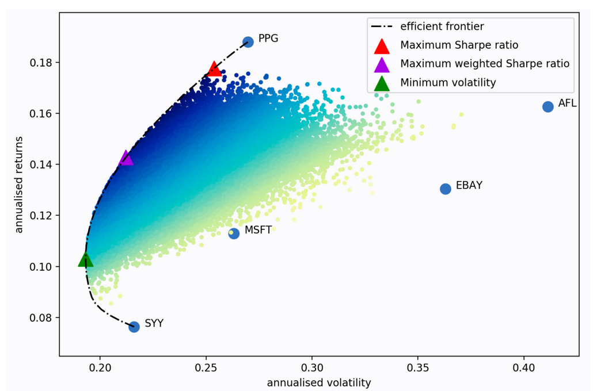

# 量化实战入门101—投资组合优化：资产配置从艺术到科学 

## 一、现代投资组合理论

“不要把所有鸡蛋放到同一个篮子里”是投资中一句耳熟能详的名言，大多数人在不知不觉中就进行了分散投资，比如把一部分钱存银行、一部分钱买余额宝、一部分钱买基金等等。那么如何分散投资才能最大程度的享有收益而最小程度的承担风险呢？这就是投资组合管理要解决的问题。哈里·马科维茨（Harry Markowitz）于1952年提出的现代投资组合理论（Modern Portfolio Theory，简称MPT），标志着投资组合管理从一门艺术转变为一门科学。其核心观点在于，通过结合预期回报和波动各异的资产，我们可以找到数学上的最优资产配置方案。

MPT认为，收益是投资的报酬，而风险是投资的代价。投资者在投资时需要在期望收益和所承担的风险之间做出平衡。不同的投资者可能有不同的风险偏好，MPT理论提倡根据个人的风险承受能力来配置投资组合。

MPT强调分散化的重要性。通过在不同的资产之间分配投资，可以降低非系统性风险（即可以通过分散化消除的风险）。如果资产之间的价格变动没有完全正相关，那么分散投资可以减少整个投资组合的总体风险。

MPT中的一个核心概念是有效前沿（Efficient Frontier）。有效前沿代表了在给定的风险水平下可以获得的最大预期回报，或者在给定的预期回报水平下需要承担的最小风险的投资组合集合。在这个前沿上的任一投资组合都被认为是效率最高的。

有效前沿如下图所示：



图上的横轴表示风险（方差或标准差），纵轴表示收益（预期回报）。每一个点都代表着一个潜在的投资组合，其中更深的蓝色表示“更优”的投资组合（此处以夏普比率衡量）。那些点状的黑线（从左向上弯曲的边界线）就是有效前沿。这条边界线上的每一点都代表一个有效组合。在有效前沿之下的区域是不可接受的，因为你可以通过选择有效前沿上的一个组合获得更高的预期回报或更低的风险。有效前沿之上的区域则是不可达的，因为它们表示比任何可能的风险组合都要高的回报。

图上的三角形的标记则表示各种优化目标下的最优投资组合。投资者可以根据自己对风险的偏好选择有效前沿上的点。风险厌恶型投资者可能会选择靠近最小方差组合的点，而风险中立或风险接受型投资者可能会选择有效前沿上更高风险和回报的组合。
## 二、投资组合优化的关键组成部分

投资组合的优化过程涉及三个关键组成部分：资产的预期收益率、资产的风险（方差或标准差），以及资产之间的相关性（协方差或相关系数）。
### 1. 资产预期收益率
资产的预期收益率是指对未来资产收益的估计，通常是基于历史数据和未来预期进行计算，但更精细的方法可能包括使用资本资产定价模型（CAPM）或其他金融模型来估算。
### 2. 资产的风险（方差或标准差）
风险是指投资收益的不确定性和波动性。在现代投资组合理论中，资产的风险通常用方差或标准差来衡量。 方差或标准差越大，表明资产收益的不确定性越高，风险越大。
### 3. 资产之间的相关性（协方差或相关系数）
资产之间的相关性描述了不同资产收益之间的关系，即一个资产的收益如何随着另一个资产的收益变动。在投资组合优化中，考虑资产之间的相关性是至关重要的。通过组合相关性较低或负相关的资产，可以实现风险的分散化，从而在不降低预期收益的情况下降低投资组合的整体风险。

协方差衡量了两个资产的收益之间的共同变动趋势。正协方差表示资产收益倾向于同方向变动，而负协方差表示资产收益倾向于反方向变动。

相关系数是标准化的协方差，其值介于-1和1之间。相关系数为1表示完全正相关，-1表示完全负相关，0表示没有相关性。
## 三、均值-方差模型
均值方差模型（Mean-Variance Model）的核心思想是投资者可以通过资产的组合来达到风险分散化，并在给定的风险水平下寻求最大化的投资组合预期收益，或者在给定预期收益的情况下寻求最小的投资风险。

均值方差模型的构建过程涉及以下几个步骤：

1. 估计资产的预期收益率、方差和协方差。

2. 根据预期收益率和风险，构建不同的投资组合，并计算每个投资组合的预期收益和风险。

3. 投资者根据自己的风险偏好，在有效前沿上选择最适合自己的投资组合。

在均值方差模型中，最优资产组合的优化目标可以有：

### 1. 最大收益组合（Maximum Return Portfolio）：

- 这个目标追求的是最高的预期收益率，不考虑风险。

- 通常在所有可能的投资组合中选择预期收益最高的一个。

- 这个组合可能具有非常高的风险，因为它没有考虑风险的大小。

### 2. 最小风险组合（Minimum Risk Portfolio）：
- 这个目标旨在在所有可能的投资组合中寻找风险（标准差或方差）最小的组合。
- 这个组合不一定提供最佳的收益，但它确保了风险的最小化。
- 它通常对应于有效前沿的最低点，也被称为最小方差组合。
### 3. 最大风险调整后回报比率组合（Maximum Risk Adjusted Return Ratio Portfolio）：

- 这个组合也称为最大夏普比率组合（Maximum Sharpe）。

- 这个目标关注于风险调整后的回报，即投资者为每单位承担的风险获得的预期收益。

- 这个组合通常位于资本市场线（CML）与有效前沿的切点，也称为切线组合或市场组合。
### 4. 最大效用组合（Maximum Utility Portfolio）：

- 这个目标结合了投资者的风险偏好，寻找最大化投资者效用的组合。

- 效用函数通常是一个数学函数，用于量化投资者对收益和风险的偏好。

- 投资者可能会选择有效前沿上的某个点，该点根据其效用函数提供最大的满足度。 这通常需要对投资者的风险厌恶程度进行定量分析。

我们需要通过求解优化问题来找到符合目标的最优组合，在实际应用中，资产的数量通常比较多，相关性和预期收益率的估计更为复杂，这需要使用高级的数学和统计工具，以及相关的优化算法。
## 四、Black-Litterman 模型
Black-Litterman 模型是由 Fisher Black 和 Robert Litterman 在 1990 年代初期提出的。这个模型是作为一种改进传统的均值-方差模型和资本资产定价模型（CAPM）的工具，旨在解决实际投资组合构建过程中的一些问题，特别是为了克服均值-方差优化中对预期收益率估计过于敏感的问题。

Black-Litterman 模型的核心思想是结合市场投资组合的预期收益率和投资者个人观点来产生新的预期收益率估计。这种方法可以帮助投资者在资产配置决策中获得更加稳健的结果。

Black-Litterman 模型的步骤是：

1. 设定市场均衡收益率：首先，使用CAPM或其他模型估计市场均衡收益率。这些是基于市场数据，例如资产的市值加权收益率。

2. 构建先验收益率分布：该模型假设市场是有效的，市场均衡收益率可以作为资产预期收益的先验分布。

3. 整合投资者的主观观点：如果投资者有关于某些资产的特定观点（例如，认为某个资产的收益率会高于或低于市场的共识预期），Black-Litterman 模型允许以一种形式化的方式将这些观点合并进来。这些观点被表达为期望收益率的调整，并附有一个置信度的度量。

4. 组合先验与主观观点：通过贝叶斯方法，模型结合市场均衡收益率和投资者的主观观点，得到后验收益率分布。这个组合考虑了观点的强度和市场数据的不确定性。

5. 构建最优投资组合：使用更新后的预期收益率来构建最优投资组合，通常是通过最大化夏普比率或最小化方差来完成。
## 五、实现投资组合优化的开源库
优化投资组合需要有深厚的金融知识和数学技能，不仅涉及各种数学模型和计算，还要对市场有深入理解，这些都是拦在初学者面前的鸿沟。好在我们有很多优秀的开源库，借助这些开源库，即便是初学者也能比较轻松的利用投资组合优化来构建投资策略。
### 1. PyPortfolioOpt库
PyPortfolioOpt 是一个Python库，用于构建金融投资组合优化模型，它包含实现现代投资组合理论（如有效前沿和资本资产定价模型）的工具和方法。

安装PyPortfolioOpt的命令如下：

```python 
pip install PyPortfolioOpt

```
### 2. Riskfolio-Lib 库

Riskfolio-Lib 是一款源自秘鲁的 Python 库，专为投资组合优化和定量策略性资产配置而设计。它的宗旨在于降低构建基于高度数学模型的投资组合的难度，以便学生、研究人员和从业者可以轻松上手。该库建基于 CVXPY，并且与 pandas 的数据结构无缝对接。

安装Riskfolio-Lib的命令如下：

```python 

pip install riskfolio-lib

```

在后续的文章中，我们将详细的介绍如何使用 PyPortfolioOpt 库和 Riskfolio-Lib 库进行投资组合优化。