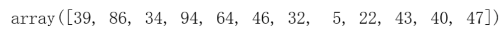
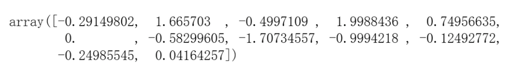
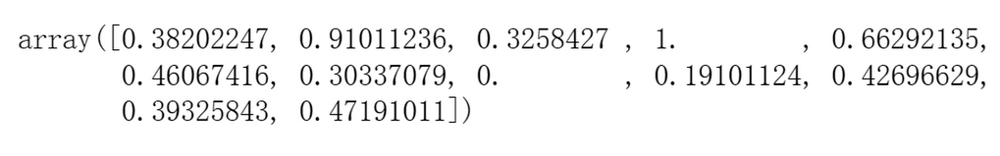
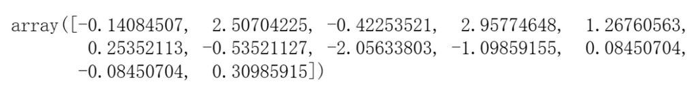
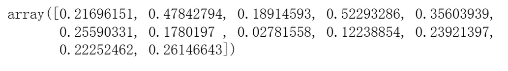
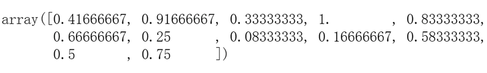
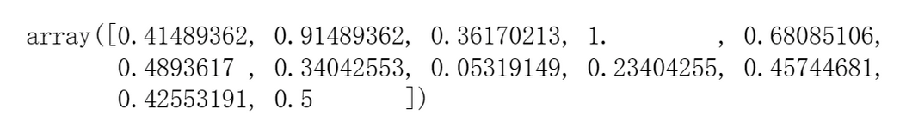
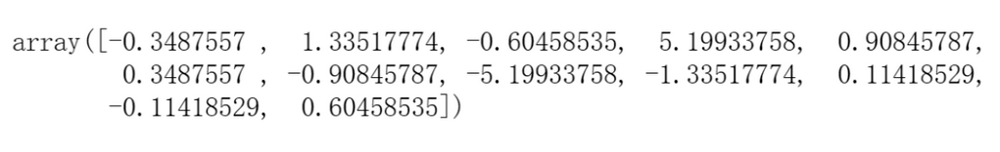
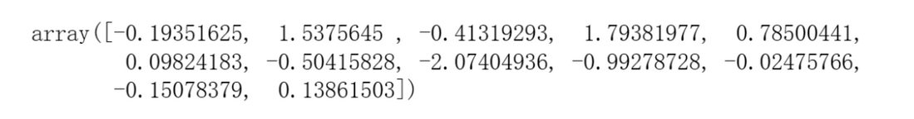

# 量化实战入门105—标准化：量化模型必不可少的数据预处理 

标准化（Normalization），在统计学和量化投资领域中，通常指的是将不同量纲和数值范围的数据转换到一个标准或者通用的可比较的尺度下。在量化投资中，因子标准化是一个常见的预处理步骤，它能够帮助去除因子之间的量纲影响，使得不同的股票或者资产之间的因子值具有可比性，也便于组合构建和风险模型的使用。

## 一、为什么要对因子进行标准化处理

因子标准化的作用是多方面的，具体如下：
### 1. 消除量纲影响
不同的因子往往具有不同的量纲和单位，例如，市盈率通常是两位数的，而营收增长率通常以百分比表示。直接比较或相加这些具有不同量纲的因子是没有意义的。因子标准化通过转换使所有因子无量纲化，因而可以在同一个标准下进行比较和计算。
### 2. 校准因子影响力
在未经标准化的情况下，数值较大的因子可能会在模型中占据主导地位。在构建多因子模型时，经常需要将多个单一因子组合成一个综合因子得分。如果这些单一因子未经标准化，则它们的组合可能会导致某些因子对综合得分的贡献过大或过小。标准化确保了所有因子对模型的贡献是由其信息内容决定的，而非其数值大小。
### 3. 提高模型稳定性，增强模型的泛化能力
不同股票或资产的因子值往往具有不同的分布特征，标准化通过减少因子值之间的差异，有助于降低这种非系统性的波动对模型的影响，使模型结果更加稳健，从而提升了模型的泛化能力和预测准确性。
### 4. 提高参数估计的准确性
在回归分析中，如果因子之间的量纲和数值范围差异较大，可能会导致回归系数的估计不准确。通过标准化处理，可以使所有因子的均值归零，标准差归一，这有助于消除因子量纲和数量级差异对参数估计的影响，从而提高回归模型的统计效能。
### 5. 便于比较不同因子的重要性
当因子标准化后，回归系数的绝对大小可以直接反映因子对目标变量（如股票回报率）的相对重要性。在未标准化的模型中，因子的系数大小受其原始尺度的影响较大，难以直观比较不同因子的影响力。
### 6. 降低多重共线性的风险
当模型中的因子存在较高的相关性时，可能会导致多重共线性的问题，使得回归系数的估计变得不稳定。标准化后的因子具有统一的尺度，有助于减轻这一问题，尽管它不能完全消除共线性本身。
### 7. 促进模型的收敛
在利用优化算法（如梯度下降法）来估计回归系数时，如果因子的尺度差异很大，可能会导致优化算法收敛缓慢或不收敛。标准化处理后，因为所有因子的尺度统一，可以加快模型的收敛速度，提高计算效率。

因此，因子标准化在量化模型构建和应用中扮演着至关重要的角色，它不仅优化了模型的统计特性，也增强了模型的实际应用价值。
## 二、标准化的方法及其Python实现
数据标准化的方法很多。不同的方法适用于不同的情境和需求。以下我们介绍常用的标准化方法，以及如何用Python实现这些方法。通过调用Python的库，我们可以很方便的实现标准化操作。

为了举例说明标准化方法，我们假设factor_values是我们要标准化的因子值数组：

```python 

# 关闭警告信息
import warnings
warnings.filterwarnings('ignore')
# 随机生成12个数值
import numpy as np
import random
factor_values = np.array([random.randint(1, 100) for _ in range(12)])
print(factor_values)

```

生成的数组如下：



### 1. Z-Score标准化（标准分数标准化）
Z-Score标准化也称为标准分数标准化，是最常用的标准化方法之一。具体操作是将每个因子的值减去其均值，然后除以其标准差。标准化后的因子值表示原始值距离均值的标准差数。数学表达为：

```python 

Ni = (Xi − μ) / σ

```


其中：Ni 是标准化后的值，Xi 是原始因子值，μ 是均值，σ 是标准差。
Python实现如下：

```python 

# 方法1：使用scipy库
from scipy.stats import zscore
z_scores = zscore(factor_values)

# 方法2：使用sklearn.preprocessing
from sklearn.preprocessing import StandardScaler
scaler = StandardScaler()
z_scores = scaler.fit_transform(factor_values.reshape(-1, 1)).flatten()

```

标准化后的数组为：




### 2. Min-Max标准化
Min-Max标准化也称为归一化，它将因子值缩放到0和1之间的范围。这种方法对于需要将变量值限定在一定范围内的情况很有用。数学表达为：

```python 

Ni = (Xi−min(X)) / (max(X)−min(X))

```

其中：Ni 是标准化后的值，Xi 是原始因子值，min(X) 和 max(X) 分别是因子值的最小值和最大值。

Python实现如下：

```python 

from sklearn.preprocessing import MinMaxScaler
min_max_scaler = MinMaxScaler()
min_max_scaled = min_max_scaler.fit_transform(factor_values.reshape(-1, 1)).flatten()

```

标准化后的数组为：



### 3. Robust标准化

Robust标准化方法考虑到了异常值的影响，使用中位数和四分位数范围（IQR）来替代均值和标准差。这种方法对于异常值较多的数据集更为稳健。数学表达为：

```python 

Ni = (Xi−median(X)) / IQR(X)

```

其中：Ni 是标准化后的值，Xi 是原始因子值，median(X)为中位数值，IQR(X)是因子值的四分位数范围，即第三四分位数与第一四分位数之差。

Python实现如下：

```python 

from sklearn.preprocessing import RobustScaler
robust_scaler = RobustScaler()
robust_scaled = robust_scaler.fit_transform(factor_values.reshape(-1, 1)).flatten()

```

标准化后的数组为：



### 4. 单位向量标准化
单位向量标准化将原始因子值除以其L2范数（即向量的模），使得标准化后的因子值向量的模为1。多适用于某些机器学习算法中。

Python实现如下：

```python

from sklearn.preprocessing import Normalizer
normalizer = Normalizer()
unit_vector_scaled = normalizer.fit_transform(factor_values.reshape(1, -1)).flatten()

```

标准化后的数组为：



### 5. 百分位排名标准化
百分位排名标准化是将原始因子值转换为其在所有值中的百分位排名。这种方法不受异常值的影响，且易于解释。

Python实现如下：

```python 

from scipy.stats import rankdata
percentile_ranks = rankdata(factor_values) / len(factor_values)

```

标准化后的数组为：



### 6. MaxAbsScaler标准化
MaxAbsScaler缩放每个特征到 [-1, 1] 范围内，不移动/居中数据，因此不破坏任何稀疏性。这种方法适用于数据已经以0为中心或者稀疏数据。

Python实现如下：

```python 

from sklearn.preprocessing import MaxAbsScaler
max_abs_scaler = MaxAbsScaler()
max_abs_scaled = max_abs_scaler.fit_transform(factor_values.reshape(-1, 1)).flatten()

```

标准化后的数组为：



### 7. QuantileTransformer标准化
QuantileTransformer将特征转换为遵循正态分布或均匀分布的值。它通常用于减少异常值的影响，并使特征分布更加均匀。

Python实现如下：

```python 

from sklearn.preprocessing import QuantileTransformer
qt = QuantileTransformer(output_distribution='normal')
quantile_transformed = qt.fit_transform(factor_values.reshape(-1, 1)).flatten()

```

标准化后的数组为：



### 8. PowerTransformer标准化
PowerTransformer应用幂变换方法（如Box-Cox变换或者Yeo-Johnson变换）来使数据更符合正态分布。这对于处理具有非常偏态分布的特征数据非常有用。

Python实现如下：

```python 

from sklearn.preprocessing import PowerTransformer
pt = PowerTransformer(method='yeo-johnson') # 或者 method='box-cox'
power_transformed = pt.fit_transform(factor_values.reshape(-1, 1)).flatten()

```

标准化后的数组为：



在实际应用中，选择哪种标准化方法需要根据因子的分布特性、模型的需求以及对异常值的敏感度等因素综合考虑。通常，在金融量化分析中，由于金融数据经常包含异常值或者是长尾分布，Z-Score标准化和Robust标准化比较常用。但最终的选择应该基于数据探索和预先的模型测试来决定。
## 三、标准化需要注意的事项

在进行因子标准化时，也需要注意以下几点：
### 1. 异常值的影响
标准化方法对异常值的敏感度不同。例如，Z-Score标准化会受到异常值的较大影响，因为异常值会显著改变均值和标准差。因此，使用MinMaxScaler或RobustScaler可能更适合处理含有异常值的数据，或者在标准化之前进行异常值处理，如剔除或替换异常值。
### 2. 分布的假设
一些标准化方法（例如Z-Score标准化）隐含地假设数据是呈正态分布的。如果实际数据分布远离正态分布，这种标准化方法可能不是最优的选择。如果数据分布远离正态分布，可以使用非线性的标准化方法（如QuantileTransformer或PowerTransformer）来使数据更加符合模型的假设。
### 3. 信息损失
标准化可能会导致一些有用信息的损失。例如，通过Z-Score标准化，所有特征的方差都被设定为1，这可能会导致模型忽略原始特征方差中包含的信息。在某些情况下，可以保留未标准化的原始特征，与标准化后的特征一起作为模型的输入，这样可以让模型同时学习到标准化特征和原始特征的信息。
### 4. 数据范围的选择
在使用分位数标准化（QuantileTransformer）或者最大值-绝对值标准化（MaxAbsScaler）时，选择合适的数据范围非常关键，因为它们会直接影响到数据的缩放范围和最终模型的性能。可以通过实验来确定最合适的数据范围，以确保模型的性能最优化。
### 5. 标准化的逆过程
在某些应用场景下，如预测任务，我们需要将标准化后的预测结果转换回原始尺度。这就要求我们能够准确执行标准化的逆过程，这对于一些复杂的标准化方法来说可能会是个挑战。sklearn.preprocessing 的许多Scaler都提供了 inverse_transform 方法，可以将标准化后的数据转换回原始尺度。
### 6. 样本外数据的处理
模型在实际应用中会遇到样本外数据。在这种情况下，需要确保样本外数据使用的是样本内数据的标准化参数（即在训练集上得到的参数），以便保持模型的一致性和公平性。
### 7. 特征（因子）之间的依赖性
标准化通常是独立于每个特征进行的，如果特征之间存在依赖关系，单独标准化可能会破坏这些关系，影响模型的解释性和表现。如果特征间有依赖关系，可以尝试使用主成分分析（PCA）等方法，来在降维的同时保持特征间的依赖关系。
### 8. 稀疏性的保持
稀疏数据（Sparse Data）是指在一个数据集中，大量的元素取值为零或者为空的情况。对于稀疏数据，我们需要使用不会破坏稀疏结构的标准化方法。例如，MaxAbsScaler和MinMaxScaler是更好的选择，而Z-Score由于会改变零值可能不是一个好选择。

因子标准化的过程需要仔细考虑以上的问题，并根据具体的应用场景和数据特征选择最合适的标准化方法。在实践中，可能还需要进行多轮实验和验证，以确定最佳的标准化策略。