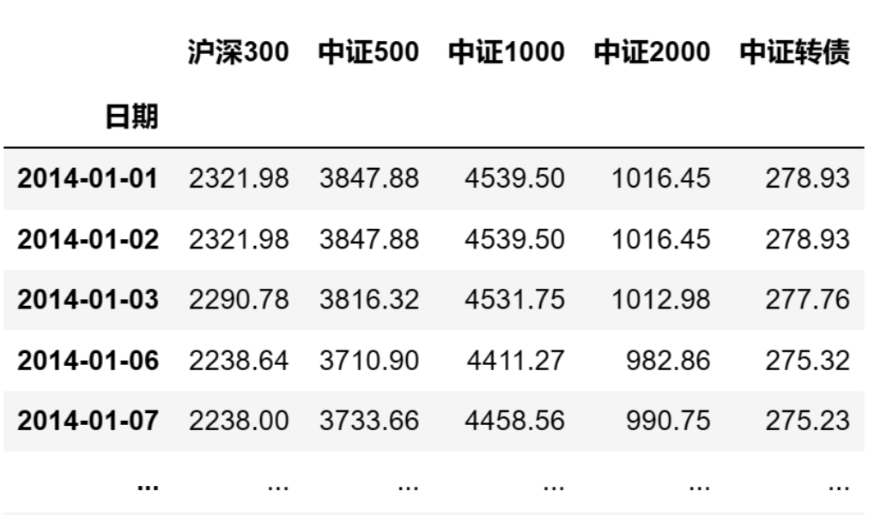
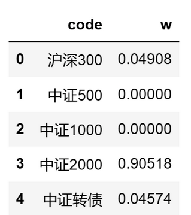
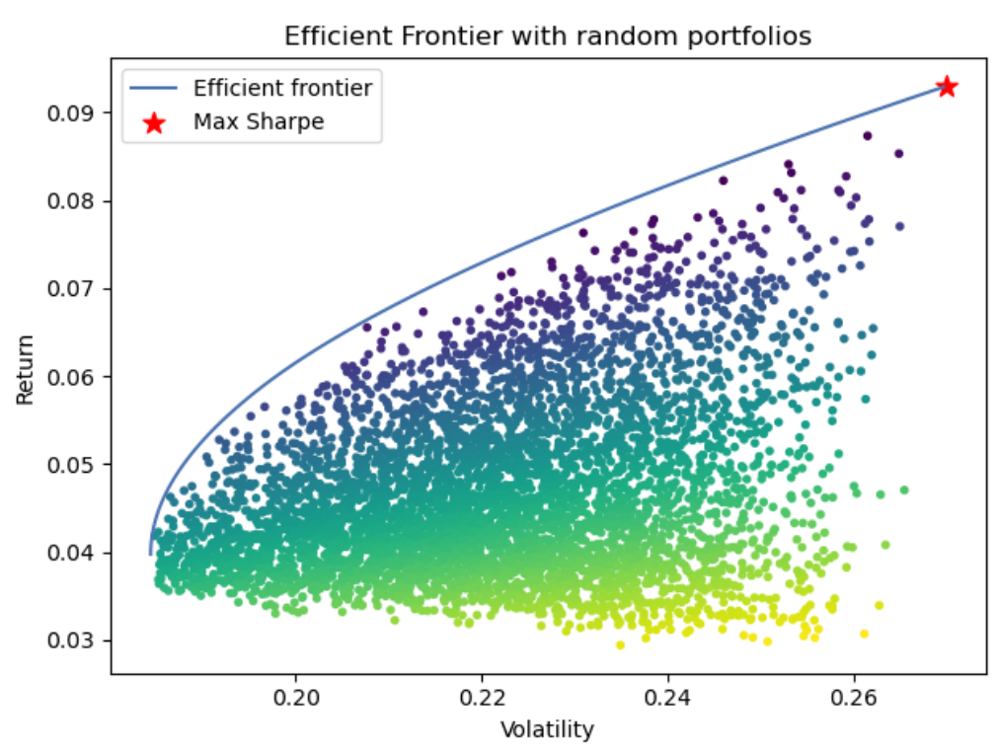

# 量化实战入门108—组合优化利器：PyPortfolioOpt库使用教程 

在投资中构建一个优化的投资组合是提高收益、降低风险的关键一步。但投资组合优化通常涉及到复杂的数学计算和模型构建。幸运的是，Python有一个强大的库：PyPortfolioOpt，它让我们能够以简单、高效的方式来实现这一目标。

PyPortfolioOpt是一个专门为资产配置、投资组合优化而设计的Python库。它提供了一系列的工具和方法，用以估算资产的预期收益和协方差矩阵，构建有效前沿，并找到最优风险调整后的权重。下面我们通过一个实际的例子来看看如何使用PyPortfolioOpt库实现“均值-方差”模型的组合优化。
## 一、首先，我们需要安装PyPortfolioOpt库，并且导入必须的模块：

```python 

import pandas as pd
import numpy as np
import akshare as ak
from pypfopt.expected_returns import mean_historical_return
from pypfopt import risk_models
from pypfopt import EfficientFrontier
from pypfopt import objective_functions
from pypfopt import plotting
from pypfopt.discrete_allocation import DiscreteAllocation, get_latest_prices
import matplotlib.pyplot as plt
# 关闭警告信息
import warnings
warnings.filterwarnings('ignore')

```

## 二、接下来，我们需要资产池的历史价格数据集：
在本例中，我们要投资的资产池是：沪深300指数、中证500指数、中证1000指数、中证2000指数、中证转债指数。当然，指数本身是不能投资的，但这不影响我们的研究。

本例从AKShare数据源中获取这些指数近10年的历史价格数据：

```python 

# 指数列表：沪深300、中证500、中证1000、中证2000、中证转债
index_list = ['000300', '000905', '000852', '932000', '000832']
index_name = ['沪深300','中证500','中证1000','中证2000','中证转债']
start_date = '20140101'
end_date = '20231229'
price_df = pd.DataFrame()
# 逐个获取指数行情数据
for ind in index_list:
    bars = ak.stock_zh_index_hist_csindex(symbol=ind, start_date=start_date, end_date=end_date)
    bars.index = pd.to_datetime(bars['日期'])
    price_df[ind] = bars['收盘']
price_df.columns = index_name
print(price_df)

```

数据集的格式如下：



## 三、用资产池的历史价格数据集来估算预期收益和协方差：

```python 

# 计算预期收益
mu = mean_historical_return(price_df)  
# 计算样本协方差
S = risk_models.sample_cov(price_df)

```
mean_historical_return是PyPortfolioOpt库中用来估计预期收益率的函数。这个函数通过计算每个资产过去价格的平均历史回报来实现。它使用的是简单的算术平均数，假设过去的平均收益率可以预测未来的收益率。

sample_cov函数用来估计资产之间的协方差矩阵。协方差矩阵是衡量资产之间价格变动关系的重要工具，它可以帮助我们理解多个资产的价格变动是如何相互影响的。这对于构建一个分散化的投资组合来说是极其重要的，因为分散化可以帮助降低非系统性风险。
## 四、构建一个EfficientFrontier对象，这是寻找最优权重的关键步骤：

```python 

ef = EfficientFrontier(mu, S, weight_bounds=(0, 1))

```

EfficientFrontier类接受预期收益率向量mu和协方差矩阵S作为输入，并且提供了一系列方法来优化投资组合。weight_bounds参数用于设置资产权重的范围，这里设置为(0, 1)意味着每个资产的权重必须在0到1之间，不允许卖空。
## 五、接着，我们引入一个L2正则化项，以避免过度集中投资于少数资产：

```python 

ef.add_objective(objective_functions.L2_reg, gamma=0.1)

```
add_objective方法允许我们向优化问题中添加自定义的优化目标或是限制条件。在这个例子中，我们添加了一个L2正则化项。

objective_functions.L2_reg是一个目标函数，它实施了L2正则化，也称为岭回归（Ridge Regression）。L2正则化通过惩罚权重的平方和来鼓励投资组合权重的平滑分布，并且可以减少投资组合中个别资产的权重过大的问题，从而有助于降低模型的过拟合风险。

参数gamma是正则化强度的系数。gamma的值越大，正则化的影响越强，权重将趋向于更加均匀的分布。如果gamma设置得过大，可能会使正则化的影响过于强烈，导致所有资产的权重趋于一致，而忽略了资产之间的预期收益率和风险特性。相反，如果gamma设置得过小，正则化的影响可能会不足以产生明显的效果。
## 六、现在，我们可以找到夏普比率最大化的投资组合权重：

```python 

weights = ef.max_sharpe()
```

max_sharpe方法用于找到最大夏普比率的投资组合权重。夏普比率是衡量投资组合风险调整回报的一个指标，它是超额回报率（投资组合的预期回报率减去无风险利率）与投资组合波动率的比值。最大夏普比率的投资组合在理论上提供了最佳的风险调整回报。

在PyPortfolioOpt库中，除了max_sharpe()，还有多种其他优化目标函数可以使用。比如：

```python 

weights = ef.min_volatility()

```

这个方法会返回一个预期波动率最小的投资组合权重。
## 七、为了实用性，我们可以清洗权重，移除那些过于微小的权重：

```python 

cleaned_weights = ef.clean_weights()
print(cleaned_weights)

```

clean_weights方法用于清理优化后的权重。这个过程会将非常小的权重（接近0的权重）设置为0，并重新归一化其余的权重。这对于实际操作很有帮助，因为它简化了投资组合，去除了那些对投资组合影响不大的资产。资产组合权重的输出结果如下：



## 八、我们还可以将上面的权重比例兑换为实际的购买数量

```python 

total_portfolio_value = 100000  # 投资组合的总仓位
latest_prices = get_latest_prices(price_df)  # 标的资产的最新价格
da = DiscreteAllocation(cleaned_weights, latest_prices, total_portfolio_value)
allocation, leftover = da.lp_portfolio()
print("分配的购买数量:", allocation)
print("剩余金额: {:.2f}".format(leftover))

```

输出结果如下：

```python 

分配的购买数量: {'沪深300': 1, '中证2000': 38, '中证转债': 12}
剩余金额: 699.55

```
## 九、然后，我们可以查看投资组合的性能，包括预期收益、预期波动率和夏普比率：

```python 

ef.portfolio_performance(verbose=True)

```

portfolio_performance方法是用来计算投资组合的预期收益率、预期波动率（标准差）以及夏普比率。当参数verbose设置为True时，这个方法会打印出这些性能指标，从而让我们可以直观地了解到优化后投资组合的表现。输出结果如下：

```python 

Expected annual return: 8.8%
Annual volatility: 25.7%
Sharpe Ratio: 0.26

```

## 十、最后，我么可以生成有效前沿曲线的图表，帮助我们直观理解投资组合的风险与收益：

```python 

# 调用matplotlib的subplots()函数来初始化一个图表和一个绘图轴（ax）
fig, ax = plt.subplots()
# 创建EfficientFrontier对象
ef = EfficientFrontier(mu, S, weight_bounds=(0, 1))
# 复制EfficientFrontier对象，便于后续继续使用
ef_max_sharpe = ef.deepcopy()
# 绘制有效前沿曲线
plotting.plot_efficient_frontier(ef, ax=ax, show_assets=False)

# 寻找最大夏普比率的投资组合
# 找到的投资组合的预期收益率（ret_tangent）和标准差（std_tangent）被用来在图上画一个红色的星号，代表这个特殊的投资组合
ef_max_sharpe.max_sharpe()
ret_tangent, std_tangent, _ = ef_max_sharpe.portfolio_performance()
ax.scatter(std_tangent, ret_tangent, marker="*", s=100, c="r", label="Max Sharpe")

# 生成随机投资组合
n_samples = 5000
w = np.random.dirichlet(np.ones(ef.n_assets), n_samples)
rets = w.dot(ef.expected_returns)
stds = np.sqrt(np.diag(w @ ef.cov_matrix @ w.T))
sharpes = rets / stds
ax.scatter(stds, rets, marker=".", c=sharpes, cmap="viridis_r")

# 输出图表
ax.set_title("Efficient Frontier with random portfolios")
ax.legend()
plt.tight_layout()
plt.show()

```

通过这段代码，我们可以得到一个展示有效前沿、最大夏普比率投资组合和一系列随机投资组合的图表，结果如下：



图上的横轴表示风险，纵轴表示收益。每一个点都代表着一个潜在的投资组合，上方从左向上弯曲的边界线就是有效前沿，这条边界线上的每一点都代表一个有效组合，其中星号为最大夏普比率的投资组合。

使用PyPortfolioOpt进行投资组合优化是一个高效、直观且强大的方法。它简化了许多个复杂计算和决策过程，使得量化投资不再是只有专业人士才能进行的活动。无论是个人投资者还是专业的资产管理人，都可以利用这一工具，以科学的方法构建和管理投资组合。

本文介绍的仅是PyPortfolioOpt的冰山一角。它还有许多其他功能，比如自定义预期收益模型、不同的风险模型、以及对不同类型资产的支持等。更多的功能请参阅PyPortfolioOpt库的使用文档。