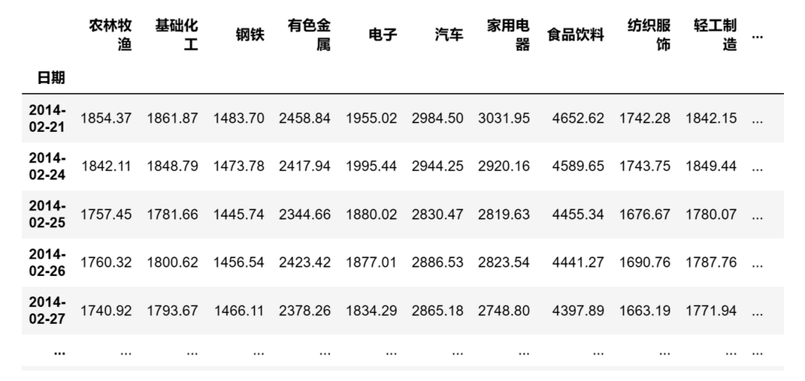
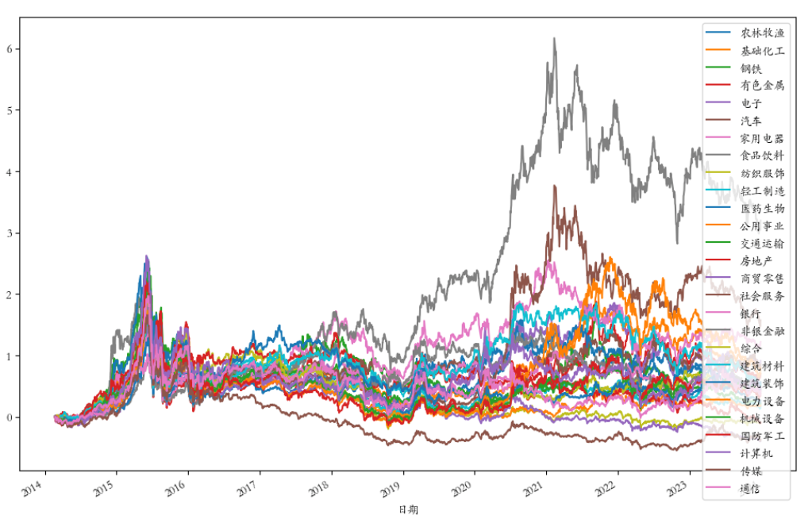
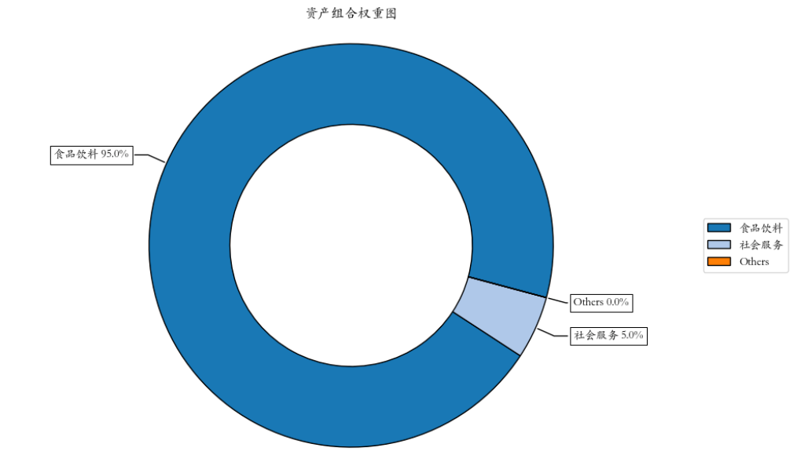
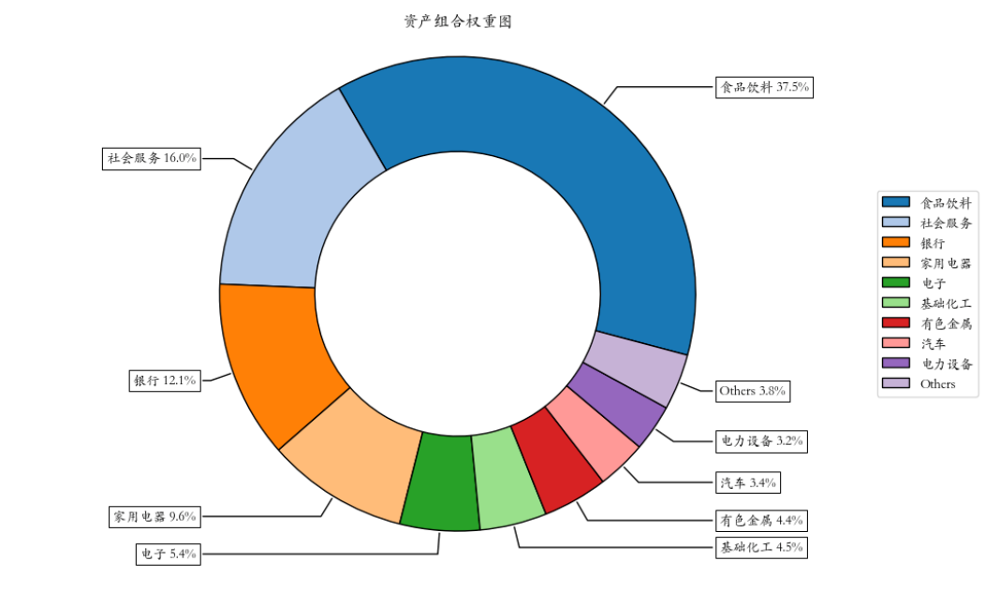
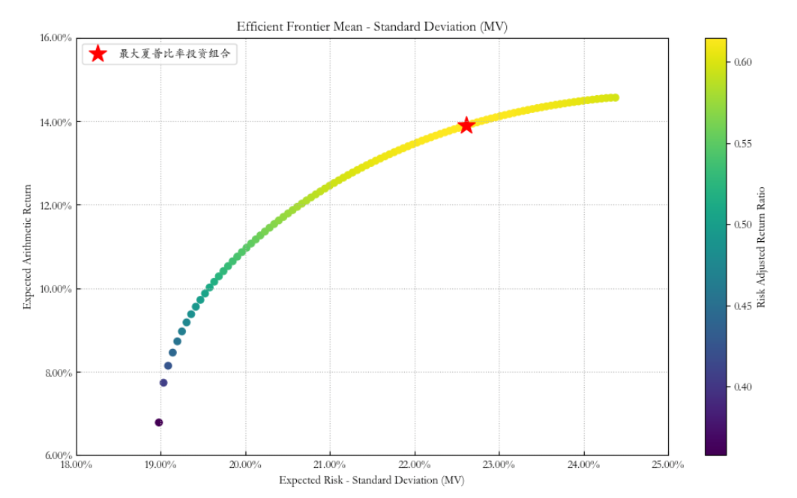

# 量化实战入门125—组合优化神器Riskfolio-Lib教程1：基于历史估计的“均值-方差”优化模型 

Riskfolio-Lib 是一个专门用于构建和分析投资组合的Python库，它提供了各种量化工具来优化投资组合并评估风险。本文通过具体的例子说明在Riskfolio-Lib库中如何使用历史估计来构建“均值-方差”优化模型。
## 一、如何构建最大化夏普比率的投资组合及有效前沿
以下教程将说明如何使用 Riskfolio-Lib 来估算“均值-方差”模型，计算最大夏普比率的投资组合，并绘制有效前沿。
### 1. 导入相关的模块

```python 

import akshare as ak
import pandas as pd
import numpy as np
import riskfolio as rp
# 在matplotlib绘图中显示中文和负号
import matplotlib.pyplot as plt
import matplotlib as mpl
mpl.rcParams['font.family'] = 'STKAITI' # 中文字体'STKAITI'
plt.rcParams['axes.unicode_minus'] = False   # 解决坐标轴负数的负号显示问题
# 关闭警告信息
import warnings
warnings.filterwarnings('ignore')

```

### 2. 获取资产池的历史价格数据集，并计算资产收益率
在本例中，我们要投资的资产池是申万一级行业指数。当然，指数本身是不能投资的，但这不影响我们的研究。

本例从AKShare数据源中获取这些指数近10年的历史价格数据：

```python 

# 获取申万一级行业代码
sw_index_df = ak.sw_index_first_info()  # 申万一级行业信息
# 申万一级行业代码列表，删除近年新增指数['煤炭', '石油石化', '环保', '美容护理']，因其数据太少
sw_index_list = [s for s in sw_index_df['行业代码'] if s not in ['801950.SI', '801960.SI', '801970.SI', '801980.SI']]  
# 申万一级行业名称列表
sw_index_name = list(sw_index_df[sw_index_df['行业代码'].isin(sw_index_list)]['行业名称'])  
# 删除代码后缀
sw_index_list = [s.rstrip(".SI") for s in sw_index_list]

# 获取资产池的历史价格
price_df = pd.DataFrame()
# 逐个获取指数行情数据
i = 0
for code in sw_index_list:
    bars = ak.index_hist_sw(symbol=code, period="day")
    bars.index = pd.to_datetime(bars['日期'])
    price_df[code] = bars['收盘']
    i += 1
    print("\r已获取[{}/{}]支指数的数据".format(i, len(sw_index_list)), end="")  # 输出处理进度
price_df.columns =sw_index_name

# 选取指定日期范围的数据
start_date = '20140221'
end_date = '20231229'
price_df = price_df[(price_df.index >= start_date) & (price_df.index <= end_date)]

print(price_df)

```


数据集的格式如下：



可视化指数收益率曲线：

```python 

fig = plt.figure(figsize=(12, 8)) 
ax = fig.add_subplot(111)
(price_df.div(price_df.iloc[0])-1).plot(ax=ax)
plt.show()

```

可视化结果如下：




从上图可以看到近10年食品饮料行业的收益率明显高于其他行业。

计算资产收益率Y：

       Y = price_df.pct_change().dropna()

### 3. 构建投资组合对象

```python 

# 构建投资组合对象
port = rp.Portfolio(returns=Y)

```

### 4. 估算投资组合参数

我们需要选择方法来估算预期收益和协方差矩阵。

```python 

# 选择估算方法
method_mu='hist' # 基于历史数据估算预期收益的方法
method_cov='hist' # 基于历史数据估算协方差矩阵的方法

# 使用选择的方法估算参数
port.assets_stats(method_mu=method_mu, method_cov=method_cov, d=0.94)

```


在这里，d 参数用于指数加权移动平均，用于估计协方差矩阵。
### 5. 估算最优投资组合权重

接下来，我们将选择模型和目标函数，以及风险度量，以估算最优投资组合。本例中的优化目标为最大夏普比率。

```python 

# 选择模型和目标函数
model='Classic' # 模型可以是 Classic（经典）、BL（Black Litterman）或 FM（Factor Model）
rm = 'MV' # 使用的风险度量，这里我们使用标准差
obj = 'Sharpe' # 优化的目标，可以是 MinRisk, MaxRet, Utility 或 Sharpe
hist = True # 是否使用历史场景来计算依赖于场景的风险度量
rf = 0 # 无风险利率
l = 0 # 风险厌恶因子，仅在目标函数为 'Utility' 时有用

# 估算最优投资组合权重
w = port.optimization(model=model, rm=rm, obj=obj, rf=rf, l=l, hist=hist)

# 可视化资产组合权重图
ax = rp.plot_pie(w=w, title='资产组合权重图', others=0.05, nrow=25, cmap="tab20", height=6, width=10, ax=None)

```

最大夏普比率的投资组合权重如下：



由于食品饮料行业的收益率大大高于其他行业，因此在投资组合中的占比高达95%。如果我们想增加投资组合的多样化，避免过度依赖单一资产，我们可以增加一个最少资产数量的约束，在估算最优投资组合权重之前，加上这样一条语句：

```python 

# 设置投资组合的资产数量不少于5个
port.nea = 5

```

在Riskfolio-Lib中，port.nea可以用来作为投资组合构建时的一个约束或目标，以确保投资组合达到一定程度的多样化。这可以帮助投资者控制投资组合中的集中度风险，通过推动权重分配更加均衡，从而可能降低投资组合的总体风险。

加上这条语句后的投资组合权重如下，可看到组合中的资产数量增加了：



### 6. 计算有效前沿

我们将计算并绘制有效前沿，这展示了在不同风险水平下的最优收益。

```python 

# 设置有效前沿的点数
points = 100

# 计算有效前沿
frontier = port.efficient_frontier(model=model, rm=rm, points=points, rf=rf, hist=hist)

```

### 7. 绘制有效前沿的图表
最后，我们将绘制有效前沿，并高亮显示最大风险调整后收益（即最大夏普比率）的投资组合。

```python 

# 设置标签和其他参数
label = '最大夏普比率投资组合' # 点的标题
mu = port.mu # 预期收益
cov = port.cov # 协方差矩阵
returns = port.returns # 资产收益率

# 绘制有效前沿
ax = rp.plot_frontier(w_frontier=frontier, mu=mu, cov=cov, returns=returns, rm=rm, rf=rf, alpha=0.05, cmap='viridis', w=w, 
                      label=label, marker='*', s=16, c='r', height=6, width=10, ax=None)

```

结果如下：





图上的横轴表示风险，纵轴表示收益。从左向上弯曲的曲线就是有效前沿，这条曲线上的每一点都代表一个有效的投资组合，其中星号处为最大夏普比率的投资组合。
## 二、实际操作中的注意事项

在使用以上方法时，我们需要注意以下几点：
### 1. 历史数据的局限性
“均值-方差”投资组合优化模型的关键假设是，历史收益率的统计特性（如均值、方差、协方差）可以作为未来预期收益率和风险的合理估计。然而，这个假设在现实中可能并不总是成立，市场条件、宏观经济因素以及资产自身特性的变化都可能导致历史估计与未来表现出现偏差。因此，在实际操作中，投资者应结合其他分析工具和市场洞察来调整和完善优化模型。
### 2. 模型假设
大多数优化模型都基于一定的假设，例如资产回报的分布特征。在实际中，这些假设可能不完全成立。
### 3. 市场动态变化
市场条件不断变化，因此投资组合需要定期回顾和调整以适应新的市场情况。
### 4. 交易成本和流动性
在构建投资组合时，交易成本和资产的流动性也是不可忽视的因素.