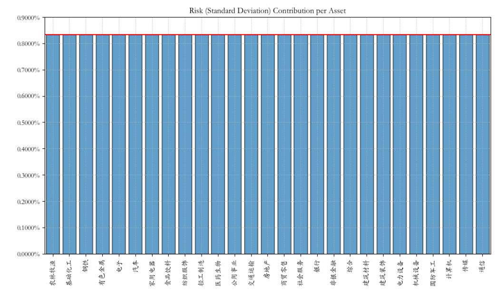

# 量化实战入门130—组合优化神器Riskfolio-Lib教程3：构建风险平价的投资组合 

在前文《投资组合优化神器Riskfolio-Lib教程1：基于历史估计的“均值-方差”优化模型》中，我们用Riskfolio-Lib库构建了一个最大夏普比率的投资组合，本文将介绍如何用Riskfolio-Lib库构建一个风险平价的投资组合。本文代码的前半部分与《投资组合优化神器Riskfolio-Lib教程1：基于历史估计的“均值-方差”优化模型》一文相同，相关代码请请参阅该文，本文不再重复。

## 一、风险贡献图

在构建最大夏普比率投资组合的例子中，计算出组合权重w后，我们可以用以下代码绘制风险贡献图：

```python 


ax = rp.plot_risk_con(w, cov=port.cov, returns=port.returns, rm=rm, rf=0, alpha=0.05,
                      color="tab:blue", height=6, width=10, ax=None)

```

显示如下：


这张图表显示的是每个资产按照其权重对投资组合总标准差（即总风险）的贡献情况，以便投资者可以直观地了解哪些资产对总体风险的影响最大。


这里的风险是用标准差来度量的，图中每个条形代表一个资产，并且条形的高度表示该资产的风险贡献量。所有条形的总高度会等于投资组合的总风险，即所有资产的风险贡献之和等于投资组合的总标准差。


从上图可以看到，食品饮料行业对总体风险的贡献最高。有时我们希望投资组合中各类资产的风险贡献相同，这就需要用到风险平价的方法。


## 二、什么是风险平价


风险平价（Risk Parity）是一种投资组合构建方法，其核心理念是在各个资产或资产类别之间平衡风险贡献，这通常不意味着所有资产的权重相等，而是权重被分配以反映资产之间不同的风险水平。这种方法的目标是创建一个风险分散化较好的投资组合，其中每个资产或资产类别对整个投资组合的风险贡献相等或按预定的比例分配。


风险平价作为一种投资组合管理策略，其作用和优势主要表现在以下几个方面：

### 1. 风险分散化


风险平价策略的核心目标是实现风险的均衡分配。它通过确保投资组合中每个资产或资产类别对总体风险的贡献相等，来降低对任何单一资产的依赖，从而减少特定资产或市场环境下的风险集中。

传统的投资组合策略可能会导致某些资产过度集中。风险平价通过考虑资产之间的关系和它们对组合风险的贡献来优化权重，从而提高真正的分散化水平。


### 2. 稳定性和抗震性

在市场波动或压力情况下，风险平价投资组合由于其更为均衡的风险配置，理论上能够更好地吸收冲击，从而提供更稳定的回报。
### 3. 可能的风险调整回报提升
尽管风险平价投资组合不是为了最大化预期回报而设计的，但通过减少不必要的风险（如非系统性风险），长期来看可能实现更高的风险调整后回报。
### 4. 适应性强
风险平价策略不依赖于特定的市场环境或经济周期，它可以适用于各种市场条件，并通过定期调整来适应市场变化。
### 5. 降低极端事件影响
通过平衡各资产的风险贡献，风险平价可以减少单一事件对整个投资组合的影响，比如某一行业或资产类别的崩溃。

风险平价模型理论上应当能够在不同市场环境下表现出更好的风险调整后回报。它也被认为能够在市场压力下提供更好的保护，因为它不依赖于任何特定资产或资产类别的表现。

风险平价策略也存在一些局限性。例如，如果市场对不同资产的定价效率不同或者出现流动性问题，那么风险平价可能不会总是提供最优结果。其次，实施风险平价策略需要对投资组合进行频繁的监控和调整，可能会增加交易成本。此外，在追求风险平衡的同时，可能会牺牲部分预期收益，尤其是当市场明显偏好某些资产时。

## 三、风险平价组合的适用情况
风险平价组合的核心在于风险的均衡而非收益的最大化，因此，具有下述情景的投资者可能会更倾向于选择这种投资策略：

### 1. 风险分散需求
当投资者希望在组合中实现均衡的风险分布，以减少对任何单一资产或资产类别过度依赖时，风险平价策略可以提供更均衡的风险贡献。
### 2. 市场环境不确定
在市场波动较大或预测困难的环境下，风险平价组合可以帮助投资者避免因市场突然变化而产生重大损失。
### 3. 中等风险偏好
对于既不是极端风险厌恶也不是极端风险偏好的投资者，风险平价组合提供了一种中庸之道，它旨在在风险控制和回报之间取得平衡。
### 4. 长期投资视角
风险平价策略适合那些有长期投资视角的投资者，他们更关注于稳健的长期回报而非短期的高波动性收益。
### 5. 动态调整倾向
如果投资者倾向于根据市场环境变化动态调整投资组合配置，风险平价策略可以提供一种系统性的方法来实现这一目标。
### 6. 对市场时机不敏感
对于不擅长或不愿意进行市场时机判断的投资者，风险平价组合在理论上提供了一种减少这种需求的投资策略。
### 7. 避免极端情况下的大幅回撤
在市场极端不利情况下，风险平价组合因其风险均衡的特性，可能会比那些集中在高风险资产上的组合表现出更好的抗风险能力。
## 四、如何用Riskfolio-Lib库构建风险平价的投资组合
在Riskfolio-Lib中，只需将计算投资组合权重的函数 optimization() 换成 rp_optimization()，即可计算分风险平价的组合权重。
### 1. 计算风险平价的组合权重

```python 

b = None # 各资产的风险贡献，如果设置为None，则默认所有资产的风险贡献相同

w_rp = port.rp_optimization(model=model, rm=rm, rf=rf, b=b, hist=hist)

```

### 2. 绘制风险贡献图

```python 

ax = rp.plot_risk_con(w_rp, cov=port.cov, returns=port.returns, rm=rm, rf=0, alpha=0.05,
                      color="tab:blue", height=6, width=10, ax=None)

```

风险贡献图如下：




可以看到各类资产的风险贡献是相同的。
### 3. 显示风险平价下的组合权重：

```python 

ax = rp.plot_pie(w=w_rp, title='资产组合权重图', others=0.05, nrow=25, cmap="tab20", height=6, width=10, ax=None)

```

资产组合权重如下：


### 4. 观察风险平价组合在有效前沿图中的位置：
```python 


# 设置有效前沿的点数
points = 100 

# 计算有效前沿
frontier = port.efficient_frontier(model=model, rm=rm, points=points, rf=rf, hist=hist)
# 绘制有效前沿
label = '风险平价投资组合' # 设置标签
ax = rp.plot_frontier(w_frontier=frontier, mu=port.mu, cov=port.cov, returns=port.returns, rm=rm, rf=rf, alpha=0.05, cmap='viridis', w=w_rp, 
                      label=label, marker='*', s=16, c='r', height=6, width=10, ax=None)


```

显示如下：


从上图可见风险平价的投资组合并不在有效前沿上。

选择哪一种组合策略，取决于投资者的个人偏好和对市场的判断。风险平价组合通过平衡各资产的风险贡献，提供了一种中间的选择，既考虑到了风险分散，也尽力保持了组合的回报潜力。风险平价组合既不像最小风险组合那样可能限制了收益潜力，也不像最大夏普比率组合那样可能需要承受较高的短期波动。对于许多投资者而言，这种平衡风险与回报的方法可能更符合他们的整体投资策略和目标。