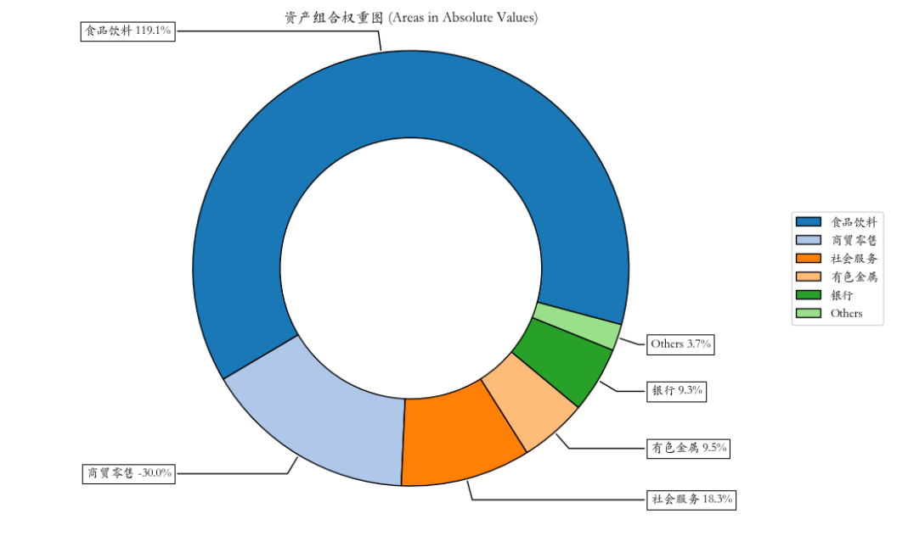
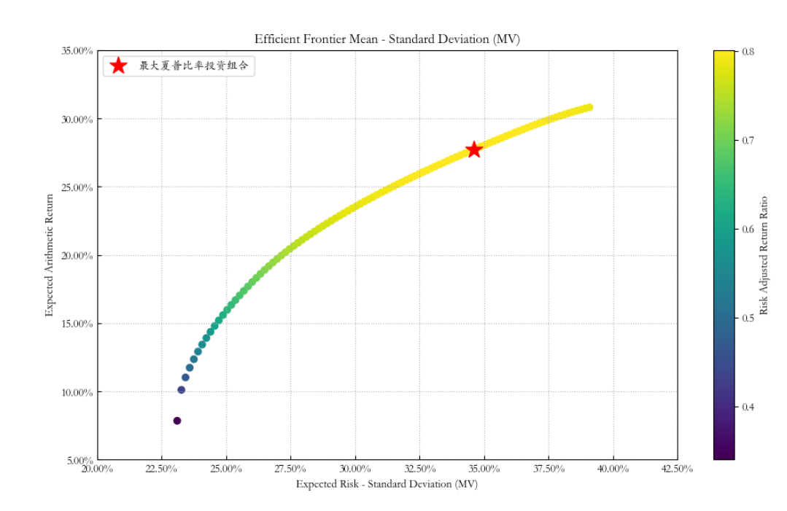

# 量化实战入门131—组合优化神器Riskfolio-Lib教程4：杠杆与做空的组合优化 

在金融市场中，投资者除了进行传统的多头投资，还经常涉足做空与杠杆策略。Riskfolio-Lib库支持此类策略的组合优化。以下是如何使用Riskfolio-Lib来估算并优化具有做空和杠杆的均值-方差投资组合的例子。
## 一、构建包含空头和杠杆的投资组合
### 1. 导入相关的模块

```python

import akshare as ak
import pandas as pd
import numpy as np

import riskfolio as rp
# 在matplotlib绘图中显示中文和负号
import matplotlib.pyplot as plt
import matplotlib as mpl
mpl.rcParams['font.family'] = 'STKAITI' # 中文字体'STKAITI'
plt.rcParams['axes.unicode_minus'] = False   # 解决坐标轴负数的负号显示问题
# 关闭警告信息
import warnings
warnings.filterwarnings('ignore')

```

### 2. 获取资产池的历史价格数据集，并计算资产收益率
首先，我们要有一个资产池的历史价格数据集price_df，相关数据获取可以参见《组合优化神器Riskfolio-Lib教程1：基于历史估计的“均值-方差”优化模型》一文（附后）。
然后，计算资产收益率Y：

```python 

Y = price_df.pct_change().dropna()

```

### 3. 构建投资组合对象，估算投资组合参数

```python 

# 构建投资组合对象
port = rp.Portfolio(returns=Y)
# 选择估算方法
method_mu='hist' # 基于历史数据估算预期收益的方法
method_cov='hist' # 基于历史数据估算协方差矩阵的方法
# 使用选择的方法估算参数
port.assets_stats(method_mu=method_mu, method_cov=method_cov, d=0.94)

```

### 4. 配置做空和杠杆参数

```python 

port.sht = True # 允许使用空头权重
port.uppersht = 0.3 # 空头权重的最大绝对值之和
port.upperlng = 1.6 # 多头权重的最大值之和
port.budget = 1.3 # 总投资预算，通常等于port.upperlng - port.uppersht

```

这里，我们配置了投资组合的做空限制和总体投资预算，允许投资组合在一定限制内进行杠杆和做空。

### 5. 估算最优投资组合权重
接下来，我们将选择模型和目标函数，以及风险度量，以估算最优投资组合。本例中的优化目标为最大夏普比率。

```python 

# 选择模型和目标函数
model='Classic' # 模型可以是 Classic（经典）、BL（Black Litterman）或 FM（Factor Model）
rm = 'MV' # 使用的风险度量，这里我们使用标准差
obj = 'Sharpe' # 优化的目标，可以是 MinRisk, MaxRet, Utility 或 Sharpe
hist = True # 是否使用历史场景来计算依赖于场景的风险度量
rf = 0 # 无风险利率
l = 0 # 风险厌恶因子，仅在目标函数为 'Utility' 时有用

# 估算最优投资组合权重
w = port.optimization(model=model, rm=rm, obj=obj, rf=rf, l=l, hist=hist)

# 可视化资产组合权重图
ax = rp.plot_pie(w=w, title='资产组合权重图', others=0.05, nrow=25, cmap="tab20", height=6, width=10, ax=None)

```

包含杠杆和做空的资产组合权重图如下：




从上图可看到，多头的总仓位为160%，空头的总仓位为30%。
### 6. 计算有效前沿并绘制图表
我们将计算并绘制有效前沿，绘制图表，并高亮显示最大风险调整后收益（即最大夏普比率）的投资组合。

```python 

# 设置有效前沿的点数
points = 100

# 计算有效前沿
frontier = port.efficient_frontier(model=model, rm=rm, points=points, rf=rf, hist=hist)

# 绘制有效前沿
label = '最大夏普比率投资组合' # 设置标签
ax = rp.plot_frontier(w_frontier=frontier, mu=port.mu, cov=port.cov, returns=port.returns, rm=rm, rf=rf, alpha=0.05, cmap='viridis', w=w, 
                      label=label, marker='*', s=16, c='r', height=6, width=10, ax=None)

```

结果如下：



通过以上步骤，我们利用Riskfolio-Lib库计算并优化了包含杠杆和空头的投资组合。
## 二、做空和杠杆的参数解析
在Riskfolio-Lib库中，port.sht、port.uppersht、port.upperlng和port.budget这些参数用来设置投资组合权重的空头和杠杆约束。
### （一）参数解析
#### 1. port.sht
port.sht是一个布尔值（True/False），用于指示是否允许投资组合中包含做空头寸。

当设置为True时，允许某些资产的权重为负，即可以做空这些资产；当设置为False时，则所有资产的权重必须为非负，即不允许做空。
#### 2. port.uppersht
port.uppersht是一个数值，用于设定投资组合中所有做空头寸（short positions）权重的绝对值之和的上限。

它限制了投资者可以做空的总额度，防止过度做空。例如，如果port.uppersht设置为0.3，则表示所有做空头寸的权重绝对值之和不能超过投资组合总资金的30%。
#### 3. port.upperlng
port.upperlng是一个数值，用于设定投资组合中所有多头寸（long positions）权重之和的上限。

这个参数实际上定义了可以使用的杠杆程度。如果port.upperlng大于1，则表示允许投资组合的多头总权重超过100%，即使用杠杆；如果等于1，则没有杠杆；如果小于1，则意味着投资组合中必须保持一定比例的现金。
#### 4. port.budget
port.budget是一个数值，通常设置为port.upperlng减去port.uppersht（但也可以不等），代表投资组合的“预算”或者说是投资组合的总权重。

当port.budget设置为1时，这意味着投资组合的所有头寸（包括多头和空头）的权重加总必须等于1，或者换句话说，投资组合的净敞口是100%的资本。这反映了没有杠杆的情况。

如果port.budget大于1，这表示投资组合的净敞口超过了100%，这通常意味着投资者在使用杠杆。

如果port.budget小于1，这表示投资组合的净敞口小于100%，也就是说投资者保留了一部分现金。
### （二）举例说明
为了更好地理解port.budget、port.upperlng和port.uppersht是如何起作用的，让我们通过一些例子来说明它们在不同情况下的作用。

例子 1：没有杠杆，没有做空

假设我们有一个投资组合，我们不想使用杠杆，也不想进行做空操作。

```python 

port.budget = 1
port.upperlng = 1
port.uppersht = 0

```

在这种情况下，我们的投资组合只能进行多头投资（做多），并且投资的总额不能超过我们的资本总量。因此，所有资产的权重加总必须等于1，没有资产的权重可以是负数。

例子 2：使用杠杆，没有做空

假设我们想要进行杠杆投资，但不想做空。

port.budget = 1.2
port.upperlng = 1.2
port.uppersht = 0

在这种情况下，我们允许投资组合的总权重超过100%，达到120%。这意味着我们借入了相当于我们20%资本的额外资金来进行投资，但我们的所有投资都是多头。

例子 3：没有杠杆，允许做空

假设我们不使用杠杆，但我们希望通过做空一些资产来对冲风险。

```python 

port.budget = 1
port.upperlng = 1
port.uppersht = 0.3

```

在这种情况下，我们的总投资组合权重等于我们的资本总量，但我们允许最多30%的资本用于做空头寸。这意味着我们的多头头寸权重加总不能超过100%，而空头头寸的绝对值权重之和也不能超过30%。

例子 4：使用杠杆，也允许做空

假设我们想要通过使用杠杆和做空策略来寻求更高的收益和对冲风险。

```python 

port.budget = 1.2
port.upperlng = 1.5
port.uppersht = 0.3

```

在这个例子中，我们允许投资组合的多头头寸总权重达到150%，同时允许最多30%的资本用于做空。我们的净投资组合权重（多头减去空头）是120%，这意味着我们使用了额外的资金来增加投资，并且我们的做空策略是有限制的。

例子 5：保留现金，不允许做空

假设我们希望保留一部分资金作为现金或类现金投资，并且不允许做空。

```python 

port.budget = 0.8
port.upperlng = 0.8
port.uppersht = 0

```

在这种情况下，我们的投资组合总权重是80%，这意味着我们留出了20%的资本不投入股票市场，可能是作为应急资金或其他原因。同时，我们不允许做空操作。