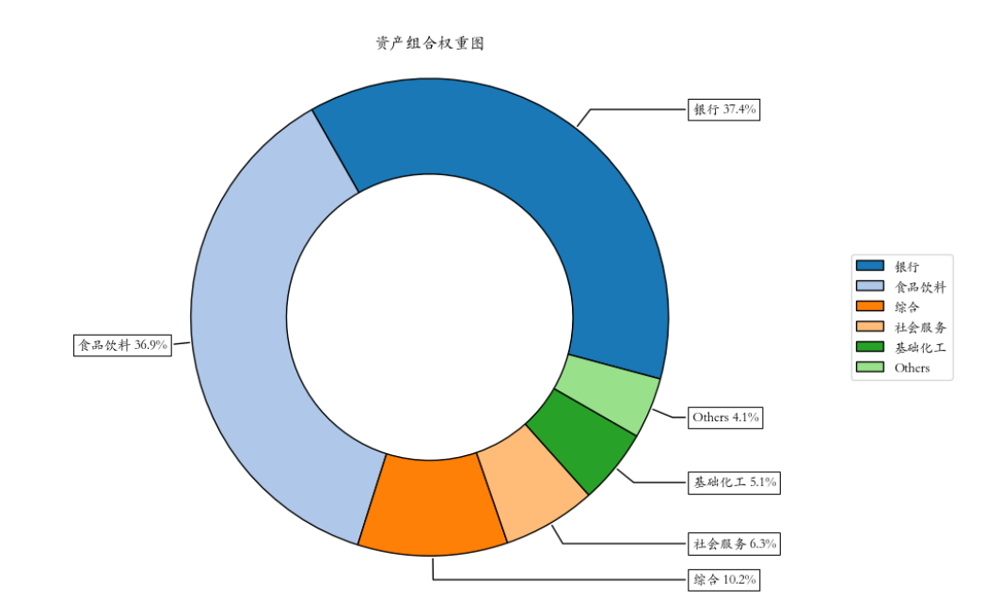
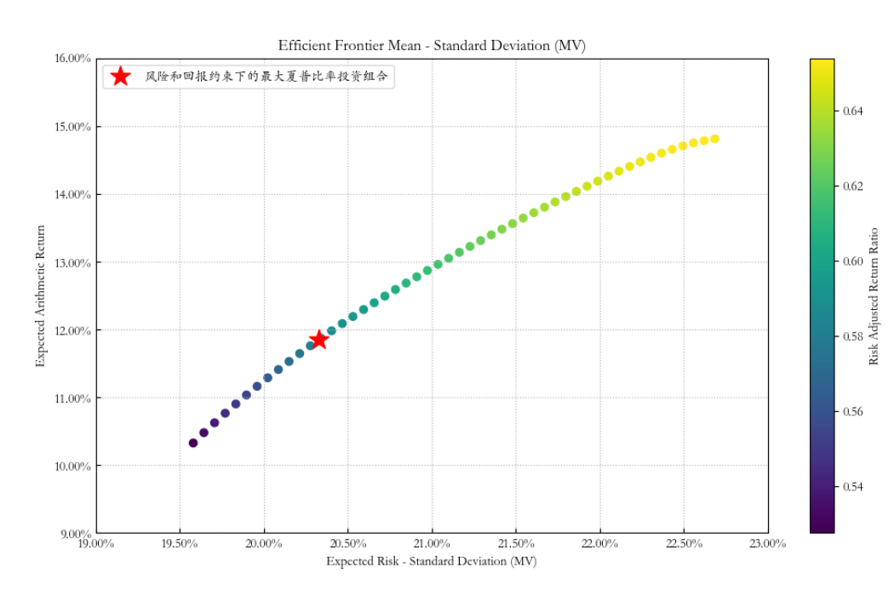

# 量化实战入门132—组合优化神器Riskfolio-Lib教程5：风险和回报约束下的组合优化 

不同的投资者有不同的风险偏好和预期回报的需求，比如：一些投资者可能更倾向于保守投资，希望投资组合的波动性较低；而另一些投资者可能愿意接受更高的风险以换取更高的潜在回报。又如：保险公司和养老基金可能需要遵守特定的标准，这些标准会要求它们的投资组合在风险敞口上不能超过一定的限额。为了满足这些需求，需要在投资组合中加入风险和回报的约束。

本文将通过一个具体的例子来说明如何利用Riskfolio-Lib库在特定的风险和回报约束下进行投资组合优化，以帮助投资者在符合特定目标和限制条件的前提下，构建高效的投资组合。
## 1. 导入相关的模块

```python 

import akshare as ak
import pandas as pd
import numpy as np

import riskfolio as rp
# 在matplotlib绘图中显示中文和负号
import matplotlib.pyplot as plt
import matplotlib as mpl
mpl.rcParams['font.family'] = 'STKAITI' # 中文字体'STKAITI'
plt.rcParams['axes.unicode_minus'] = False   # 解决坐标轴负数的负号显示问题
# 关闭警告信息
import warnings
warnings.filterwarnings('ignore')
```

## 2. 获取资产池的历史价格数据集，并计算资产收益率
首先，我们要有一个资产池的历史价格数据集price_df，相关数据获取可以参见《组合优化神器Riskfolio-Lib教程1：基于历史估计的“均值-方差”优化模型》一文（附后）。

然后，计算资产收益率Y：

```python 

Y = price_df.pct_change().dropna()

```

## 3. 构建投资组合对象，估算投资组合参数

```python 

# 构建投资组合对象
port = rp.Portfolio(returns=Y)
# 选择估算方法
method_mu='hist' # 基于历史数据估算预期收益的方法
method_cov='hist' # 基于历史数据估算协方差矩阵的方法
# 使用选择的方法估算参数
port.assets_stats(method_mu=method_mu, method_cov=method_cov, d=0.94)

```

## 4. 选择模型和目标函数

```python 

# 选择模型和目标函数
model='Classic' # 模型可以是 Classic（经典）、BL（Black Litterman）或 FM（Factor Model）
rm = 'MV' # 使用的风险度量，这里我们使用标准差
obj = 'Sharpe' # 优化的目标，可以是 MinRisk, MaxRet, Utility 或 Sharpe
hist = True # 是否使用历史场景来计算依赖于场景的风险度量
rf = 0 # 无风险利率
l = 0 # 风险厌恶因子，仅在目标函数为 'Utility' 时有用
```

## 5. 计算资产组合可选的风险和回报的边界值
我们需要找到每个风险度量和回报的最小值和最大值。这是一个重要的步骤，因为在大规模问题中，构建整个有效边界并不实际，找到每个风险度量的前沿的第一个和最后一个点会更加快捷。

在本例中，我们选取了“MV”（标准差）和“MDD”（最大回撤）这两个风险度量指标。

```python 

# 计算收益和风险指标的最小值、最大值
risk = ['MV', 'MDD']  # 风险指标列表
label = ['标准差', '最大回撤']  # 风险指标的名称
alpha = 0.05  # 置信水平alpha
annual_days = 244  # 一年中的交易日天数，用于年化计算
mu = port.mu # 预期收益
cov = port.cov # 协方差矩阵
returns = port.returns # 资产收益率

for i in range(len(risk)):
    limits = port.frontier_limits(model=model, rm=risk[i], rf=rf, hist=hist)
    risk_min = rp.Sharpe_Risk(limits['w_min'], cov=cov, returns=returns, rm=risk[i], rf=rf, alpha=alpha)
    risk_max = rp.Sharpe_Risk(limits['w_max'], cov=cov, returns=returns, rm=risk[i], rf=rf, alpha=alpha)    

    if 'MDD' in risk[i]:
        factor = 1    
    else:
        factor = annual_days**0.5

    print('\n风险最小值_' + label[i] + ': ', risk_min * factor)
    print('风险最大值_' + label[i] + ': ', risk_max * factor)
    print('收益最小值_' + label[i] + ': ', (mu @ limits['w_min']).item() * annual_days)
    print('收益最大值_' + label[i] + ': ',  (mu @ limits['w_max']).item() * annual_days)
```

输出结果如下：

```python 

风险最小值_标准差:  0.18506003760596626
风险最大值_标准差:  0.2689738276976874
收益最小值_标准差:  0.06063815993360126
收益最大值_标准差:  0.18311292742311225

风险最小值_最大回撤:  0.4193801606795273
风险最大值_最大回撤:  0.555667430639037
收益最小值_最大回撤:  0.0663852528889664
收益最大值_最大回撤:  0.1831129273923968

```


通过以上程序，我们可以得到每个风险度量的最小和最大回报以及风险值。例如，如果我们的目标函数使用标准差作为风险度量，我们可以获得的回报率只在6.06%和18.31%之间，标准差在0.185和0.269之间。其他风险度量也有类似的限制。这些信息非常有用，比如如果我们在优化问题中对最大标准差设置了低于0.185的约束，那么优化问题就没有解决方案。
## 6. 设置风险和收益约束
在本例中，我们设置组合的风险和优化约束如下：

1）年化回报率不低于10%；

2）年化标准差不高于0.20；

3）最大回撤不高于45%。

```python 

# 最小回报率的约束
port.lowerret = 0.10/annual_days  # 将年化回报率转换为日回报率

# 最大标准差的约束
port.upperdev = 0.20/annual_days**0.5 # 将年化标准差转换为日标准差
# 最大“最大回撤”的约束
port.uppermdd = 0.45  # 最大回撤不需要转换
```

## 7. 计算在收益和风险约束下最优的投资组合
然后，我们可以执行优化，获得满足这些约束条件的最优投资产组合。在这一步，我们将使用MV（标准差）作为风险度量，并以最大化夏普比率作为优化目标。

```python 

# 估算最优投资组合权重
w = port.optimization(model=model, rm=rm, obj=obj, rf=rf, l=l, hist=hist)
# 可视化资产组合权重图
ax = rp.plot_pie(w=w, title='资产组合权重图', others=0.05, nrow=25, cmap="tab20", height=6, width=10, ax=None)

```

输出结果如下：



## 8. 计算有效前沿并绘制图表
我们将计算并绘制有效前沿，绘制图表，并高亮显示最大风险调整后收益（即最大夏普比率）的投资组合。

```python 

# 设置有效前沿的点数
points = 50

# 计算有效前沿
frontier = port.efficient_frontier(model=model, rm=rm, points=points, rf=rf, hist=hist)

# 绘制有效前沿
label = '风险和回报约束下的最大夏普比率投资组合' # 设置标签
ax = rp.plot_frontier(w_frontier=frontier, mu=port.mu, cov=port.cov, returns=port.returns, rm=rm, rf=rf, alpha=0.05, cmap='viridis', w=w, 
                      label=label, marker='*', s=16, c='r', height=6, width=10, ax=None)
```

结果如下：

