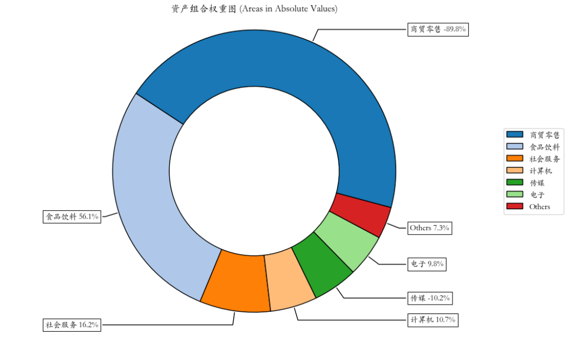
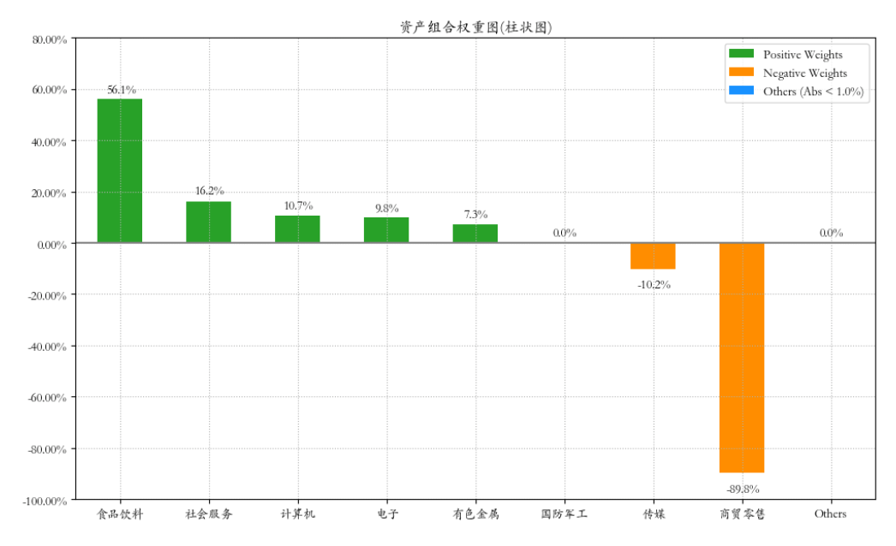
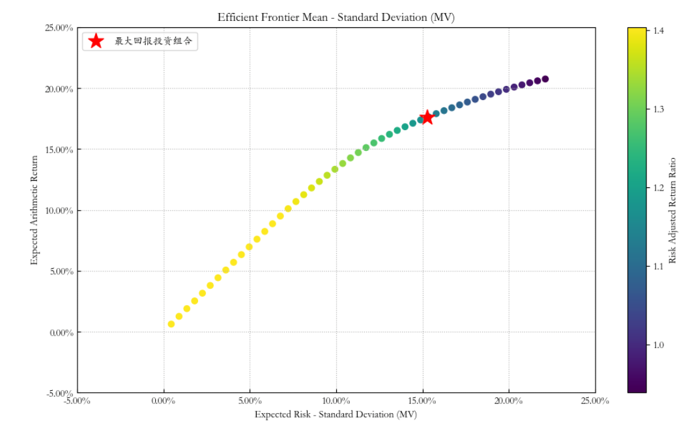

# 量化实战入门133—组合优化神器Riskfolio-Lib教程6：风险约束的市场中性组合优化 

市场中性组合是一种投资策略，旨在通过对冲头寸降低或消除市场风险的影响，以期实现与市场运动无关的稳定回报。市场中性策略通常涉及同时持有多头和空头头寸，目的是让组合的整体市场暴露（市场风险敞口）接近零，从而使得组合的回报主要来源于选股或其他非市场因素的表现。

在市场中性组合中，多头头寸是指投资者购买并持有期望其价值上升的证券，而空头头寸是指投资者借入并出售那些他们预计其价值会下降的证券。通过精心设计的对冲策略，投资者可以尝试使得这些多头和空头头寸的市场风险相互抵消。

本文的例子说明如何使用Riskfolio-Lib库构建一个市场中性的最优组合，为了展示Riskfolio-Lib库的丰富功能，我们还为这个组合加了一个最高风险的约束。

注意，本文中的资产只是示例，在现实市场中并不能直接做空。

## 1. 导入相关的模块

```python 

import akshare as ak
import pandas as pd
import numpy as np

import riskfolio as rp
# 在matplotlib绘图中显示中文和负号
import matplotlib.pyplot as plt
import matplotlib as mpl
mpl.rcParams['font.family'] = 'STKAITI' # 中文字体'STKAITI'
plt.rcParams['axes.unicode_minus'] = False   # 解决坐标轴负数的负号显示问题
# 关闭警告信息
import warnings
warnings.filterwarnings('ignore')

```

## 2. 获取资产池的历史价格数据集，并计算资产收益率
首先，我们要有一个资产池的历史价格数据集price_df，相关数据获取可以参见《组合优化神器Riskfolio-Lib教程1：基于历史估计的“均值-方差”优化模型》一文（附后）。

然后，计算资产收益率Y：

```python 

Y = price_df.pct_change().dropna()

```

## 3. 计算满足标准差约束的市场中性组合

```python 

# 构建组合对象
port = rp.Portfolio(returns=Y)

# 基于历史数据估算期望回报和协方差矩阵
method_mu = 'hist'
method_cov = 'hist'

port.assets_stats(method_mu=method_mu, method_cov=method_cov, d=0.94)

# 设置市场中性和风险约束
annual_days = 244  # 一年中的交易日天数，用于年化计算
port.sht = True # 允许空头头寸
port.uppersht = 1 # 空头头寸总权重的上限
port.upperlng = 1 # 多头头寸总权重的上限
port.budget = 0 # 权重和为零
port.upperdev = 0.15 / annual_days**0.5 # 设置最高风险约束：每日标准差的上限

# 估算最优化组合
model = 'Classic'
rm = 'MV' # 使用方差作为风险度量
obj = 'MaxRet' # 市场中性策略的目标必须是最大化回报
hist = True # 使用历史情景进行风险度量
rf = 0 # 无风险利率
l = 0 # 风险厌恶系数，仅在目标是'Utility'时有用

# 进行优化
w = port.optimization(model=model, rm=rm, obj=obj, rf=rf, l=l, hist=hist)

```

在上述代码中，我们首先估算了资产的期望回报率和协方差矩阵。接着，我们定义了市场中性组合的约束条件，包括允许空头头寸、设置多头和空头头寸的总权重上限、以及确保组合总预算为零，从而实现市场中性。此外，我们还设定了年化标准差为0.15的上限，以控制组合风险。

通过使用Riskfolio-Lib库中的优化方法，我们可以得到一组最优化的组合权重，这些权重在满足所有约束条件的情况下，使得组合的预期回报最大化。在这个过程中，我们选择了经典优化模型（Classic），并将风险度量设置为最小化方差（MV），目标函数设置为最大化回报（MaxRet）。此外，我们还考虑了历史情景下的风险度量，并假设无风险利率为零。

构建风险约束的市场中性组合优化的关键代码解释：

### 1）port.sht = True
这行代码允许投资组合中出现空头头寸。市场中性策略通常涉及多头和空头头寸，以对冲市场风险。设置sht为True意味着在优化过程中，个别资产的权重可以小于0，即可以卖空。
### 2） port.uppersht = 1
这行代码设定了空头头寸权重总和的上限。在这个例子中，上限设置为1，意味着所有空头头寸的权重之和不能超过整个投资组合的100%。
### 3）port.upperlng = 1
这行代码设定了多头头寸权重总和的上限。同样地，上限被设置为1，意味着所有多头头寸的权重之和也不能超过投资组合的100%。
### 4）port.budget = 0
这行代码设定了投资组合权重总和的目标值，即所有资产权重的加总。在市场中性策略中，这个数值通常设为0，表示多头头寸和空头头寸的权重总和应该相互抵消，使得投资组合的净敞口为零。
### 5）port.upperdev = 0.15 / annual_days**0.5
这行代码设定了投资组合日度标准差的上限。在这个例子中，上限被设置为0.15（年化波动率假设为15%），然后除以一年中的交易日天数**0.5将其转换为日度波动率。这个约束用于控制投资组合的风险水平。

通过这种优化策略，我们可以构建一个在控制风险的同时，追求高效回报的市场中性投资组合。
## 4. 可视化资产组合权重

```python 

# 可视化资产组合权重图（饼图）
ax = rp.plot_pie(w=w, title='资产组合权重图', others=0.05, nrow=25, cmap="tab20", height=6, width=10, ax=None)
```

输出结果如下：




我们还可以绘制组合权重的柱状图，可以更清晰的反映多头和空头的权重：

```python 

# 可视化资产组合权重图（柱状图）
ax = rp.plot_bar(w, title="资产组合权重图(柱状图)", kind="v", others=0.05, nrow=25, height=6, width=10)
```

结果如下：



5. 计算并绘制有效前沿

```python 

# 删除标准差上限
port.upperdev = None 
# 设置有效前沿的点数
points = 50 

# 计算有效前沿
frontier = port.efficient_frontier(model=model, rm=rm, points=points, rf=rf, hist=hist)
# 设置标签和其他参数
label = '最大回报投资组合' # 点的标题
mu = port.mu # 预期收益
cov = port.cov # 协方差矩阵
returns = port.returns # 资产收益率

# 绘制有效前沿
ax = rp.plot_frontier(w_frontier=frontier, mu=mu, cov=cov, returns=returns, rm=rm, rf=rf, alpha=0.05, cmap='viridis', w=w, 
                      label=label, marker='*', s=16, c='r', height=6, width=10, ax=None)

```

结果如下：

