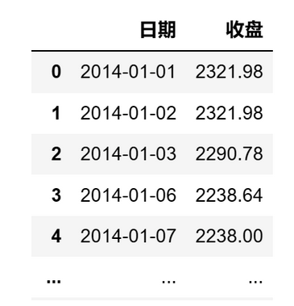
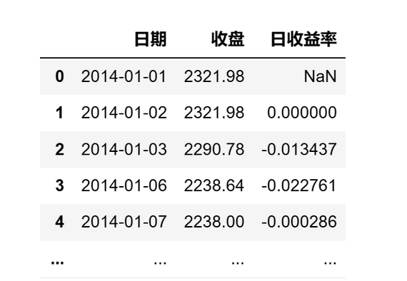
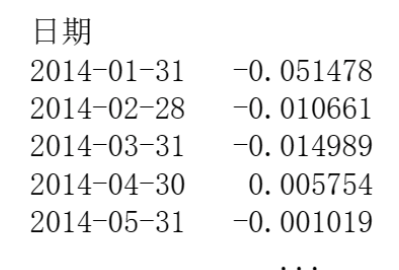
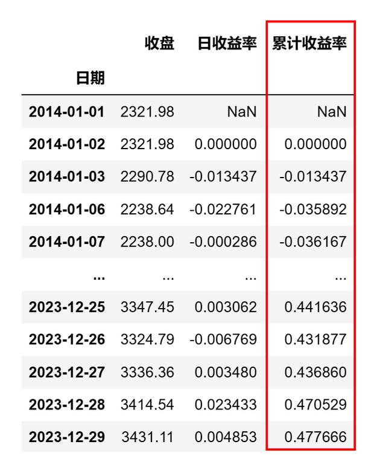
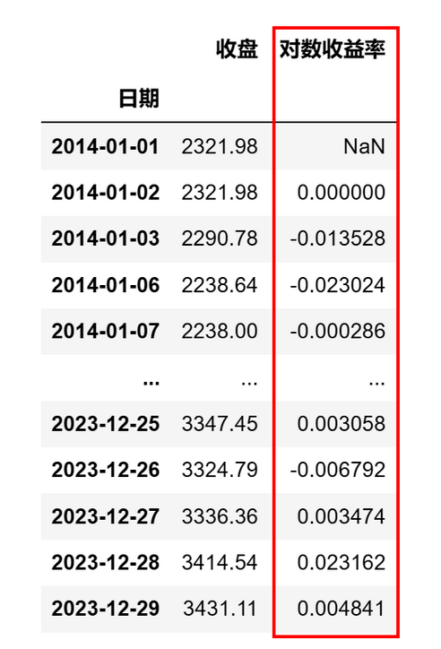

# 量化实战入门134：一文讲清7种收益率的python实现 

在量化模型中，我们经常涉及各种收益率的计算：日收益率、周收益率、月收益率、累计收益率、总收益率、年化收益率、对数收益率等。本文将介绍如何用Python来计算这些收益率。

## 一、获取基础数据
我们以沪深300为例，介绍如何计算上述收益率。首先我们需要从AKShare数据源获取沪深300的收盘价数据。

AKShare的接口有时会有更新，如果提示接口不存在，请参考AKShare的网站。

```python 

# 导入需要使用的库
import akshare as ak
import pandas as pd
import numpy as np
# 关闭警告信息
import warnings
warnings.filterwarnings('ignore')
# 获取沪深300指数10年的收盘价数据
start_date = '20140101'  # 开始日期
end_date = '20231229'  # 结束日期
bars = ak.stock_zh_index_hist_csindex(symbol='000300', start_date=start_date, end_date=end_date)
price_df = bars[['日期','收盘']]
# 将日期设置为datetime格式
price_df['日期'] = pd.to_datetime(price_df['日期'])

```

price_df的格式如下：



## 二、日收益率
日收益率是指某个投资在单一交易日内的收益率。DataFrame的pct_change()函数的功能是计算数据序列的百分比变化，可以用来计算日收益率。

```python 

# 计算日收益率
price_df['日收益率'] = price_df['收盘'].pct_change()

```

计算结果如下：




## 三、周收益率和月收益率
周收益率/月收益率则是指投资在一周/一个月内的收益率。要计算周收益率和月收益率，需要按照日期对日收益率进行分组，然后将这些日收益率进行累计。可以使用resample方法来对数据进行重采样，以按周或按月分组。代码如下：

```python 

# 计算周收益率和月收益率
# 设置日期列为索引
price_df.set_index('日期', inplace=True)

# 计算周收益率：使用 resample 来按周重采样
weekly_return = (1 + price_df['日收益率']).resample('W').prod() - 1

# 计算月收益率：使用 resample 来按月重采样
monthly_return = (1 + price_df['日收益率']).resample('M').prod() - 1

```

在上述代码中：

1）resample('W') 是按周重采样。


2）resample('M') 是按月重采样。

3）(1 + price_df['日收益率']).prod() - 1 是计算复利收益率的公式，累乘一周或一个月内的每日收益率后再减1，以得到整个周期的总收益率。

以月收益率monthly_return为例，计算结果如下：





## 四、累计收益率和总收益率
累计收益率是指从投资开始到当前的收益率。在Python的pandas库中，cumprod()函数可以用来计算累积乘积，非常适合用于计算累计收益。以下是如何使用日收益率来计算累计收益的代码：

```python 

# 计算累计收益
price_df['累计收益率'] = (1 + price_df['日收益率']).cumprod() - 1

```

计算结果如下：




price_df['累计收益率'] 列即为从起始日期到每个日期的累计收益率。这个累计收益率表示的是如果在起始日期进行了投资，到当前日期为止的收益率，假设所有的收益都被再投资，这反映了复利效应。

总收益率指投资期末最终的收益率，即累计收益率序列的最后结果，在上例中为0.477666，这表示如果你在2014年初买入沪深300，那么10年后你的总收益率约是47.77%。当然，如果我们不需要中间日期的收益率，只需要最终的总收益率的话，用：（期末的资产价格 / 期初资产价格 - 1）就能算出总收益率。

## 五、年化收益率
年化收益率（Annualized Return）是将任意时间段的收益率转换为一个标准年度的收益率。年化收益率是用来衡量投资表现的一个非常重要的指标，因为它能够将不同时间长度的投资收益进行标准化比较。年化收益率考虑了复利效应，即在计算过程中假设投资收益会被再投资。

年化收益率的计算公式为：

          年化收益率 = (1 + 总收益率)^(1 / 投资年数) - 1

在上例中，我们取的是沪深300指数10年整的数据，因此年化收益率为：

```python 

(1 + price_df['累计收益率'][-1])**(1 / 10) - 1

```

计算结果为0.0398，即3.98%。

如果数据的跨度不是整年，我们可以用以下公式计算投资年数：

         投资年数 = 总的投资期数 / 一年的投资期数

确定投资期数可以用自然日天数，也可以用交易日天数。
### 1. 用自然日天数计算年化收益率

```python 

# 计算年化收益率：用自然日天数计算投资年数
# 计算投资年数，一年约有365天
years = (price_df.index[-1] - price_df.index[0]).days / 365
# 计算年化收益率
annualized_return = (1 + price_df['累计收益率'][-1])**(1 / years) - 1
```

### 2. 用交易日天数计算年化收益率

```python 

# 计算年化收益率，用交易日天数计算投资年数
# 计算投资年数，一年约有244个交易日
years = len(price_df) / 244
# 计算年化收益率
annualized_return = (1 + price_df['累计收益率'][-1])**(1 / years) - 1

```

两种方法的计算结果略有差异，这是由于每年的交易日天数并不都是244天导致的。

## 六、对数收益率
对数收益率的公式是取价格序列的自然对数的差分。对数收益率具有时间可加性的特点，即多个连续时间段的对数收益率可以直接相加来得到总的收益率，这在金融分析和量化交易策略中非常有用。

```python 

# 计算对数收益率
# 首先，计算所有价格的自然对数
log_prices = np.log(price_df)
# 然后，计算对数价格的差分来获取对数收益率
price_df['对数收益率'] = log_prices.diff()

```
计算结果如下：



