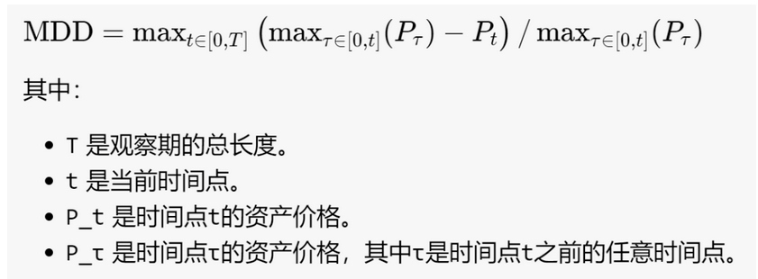
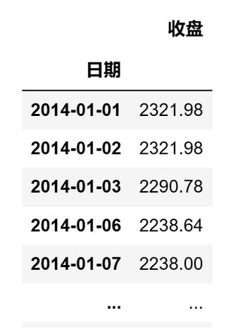
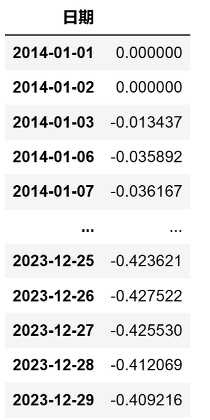
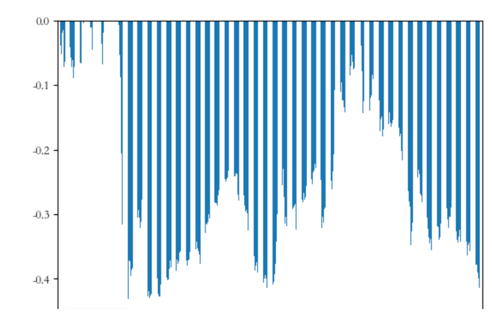

# 量化实战入门135—只需一行代码计算最大回撤 

最大回撤（Maximum Drawdown, MDD）是衡量资产价格下跌风险的一个统计指标，它记录了一个投资组合在选定的时间区间内从最高点下降到最低点的最大幅度。最大回撤是观察投资组合历史表现时常用的风险指标之一。

以数学公式表示，最大回撤可以表达为：



上述公式看似复杂，但其实用一行Python语句就能实现。下面我们以沪深300指数为例，介绍如何计算最大回撤。
## 1. 获取基础数据
我们从AKShare数据源获取沪深300的10年收盘价数据。AKShare的接口有时会有更新，如果提示接口不存在，请参考AKShare的网站。

```python 

# 导入需要使用的库
import akshare as ak
import pandas as pd
import numpy as np
# 关闭警告信息
import warnings
warnings.filterwarnings('ignore')
# 获取沪深300指数10年的收盘价数据
start_date = '20140101'  # 开始日期
end_date = '20231229'  # 结束日期
bars = ak.stock_zh_index_hist_csindex(symbol='000300', start_date=start_date, end_date=end_date)
prices = bars[['日期','收盘']]
# 将日期设置为datetime格式
prices['日期'] = pd.to_datetime(prices['日期'])
prices = prices.set_index('日期')
```

prices的格式如下：



## 2. 计算最大回撤
计算最大回撤只需一行代码：

```python 

mdd = (prices / prices.expanding(min_periods=0).max()).min() - 1

```

这行代码将每个价格点除以到目前为止观察到的最大价格。这会得到一个新的序列，显示当前价格相对于之前观察到的最高价格的比例。接下来，使用min()函数从这个比例序列中找到最小值，它表示价格相对于之前观察到的最高价格的最大下降比例。最后，我们从这个最小值中减去1，得到最大回撤的值。
## 3. 计算每日的回撤序列
我们还可以计算回撤序列，即每天相对于之前最高点的回撤值。

回撤序列同样只需一行代码即可实现：

```python 
dd_series = prices / np.maximum.accumulate(prices) - 1.0

```
结果如下：



dd_series是一个序列，其中每个值都代表了在特定时间点的回撤。具体来说，每个dd_series中的值表示从历史最高价格到当前价格的相对下跌百分比。这里的“历史”是指从时间序列开始到当前时间点为止的历史。

我们将dd_series可视化输出：

```python  

dd_series.plot(kind='bar')

```

即可得到回撤情况图：


