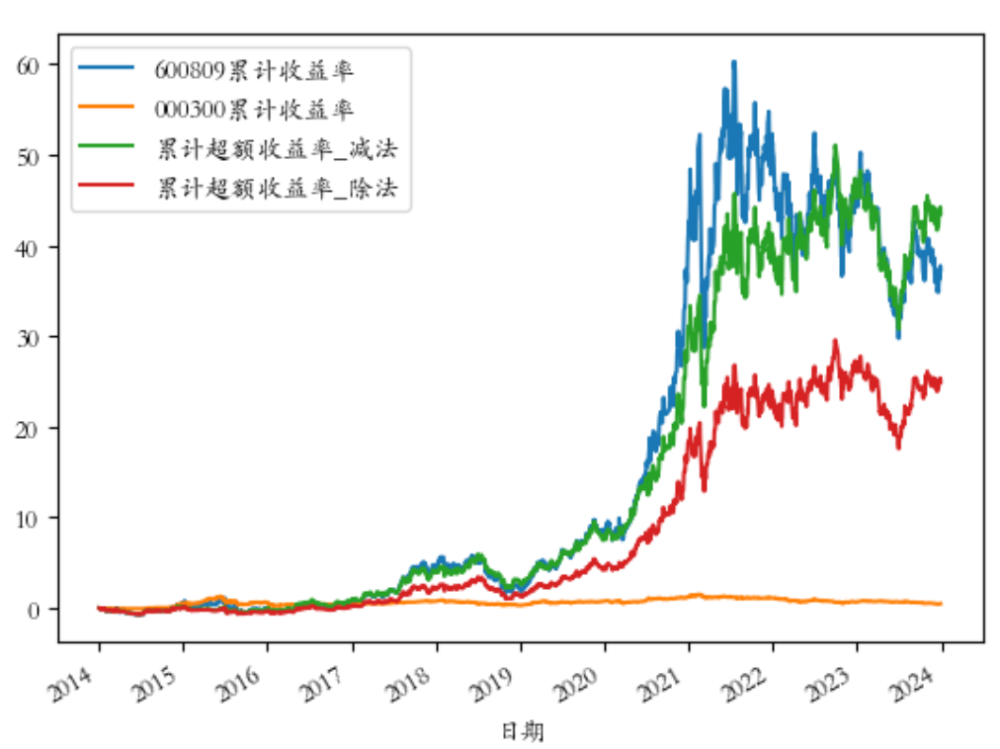

# 量化实战入门137—计算超额收益，你用减法还是除法？

超额收益是指一个投资策略相对于某个基准所实现的收益差额。它代表了投资策略在扣除基准收益之后的额外收益，是衡量投资绩效的重要指标。
根据超额收益的含义，我们自然而然的想到用减法来计算，即：

      超额收益率 = 投资组合收益率 − 基准收益率

除此之外，我们还可以用除法来计算超额收益率，即：

       超额收益率 = (1 + 投资组合收益率) / (1 + 基准收益率) - 1

这两种超额收益的计算结果差别大吗？哪种方法更合理呢？我们通过具体例子来说明。

本例以沪深300指数（000300）为基准，计算山西汾酒（600809）的超额收益。
## 1. 获取标的股票和基准的基础数据
我们从AKShare数据源获取沪深300和山西汾酒的收盘价数据。AKShare的接口有时会有更新，如果提示接口不存在，请参考AKShare的网站。

```python 

# 导入需要使用的库
import akshare as ak
import pandas as pd
import numpy as np
# 在matplotlib绘图中显示中文和负号
import matplotlib.pyplot as plt
import matplotlib as mpl
mpl.rcParams['font.family'] = 'STKAITI' # 中文字体'STKAITI'
plt.rcParams['axes.unicode_minus'] = False   # 解决坐标轴负数的负号显示问题
# 关闭警告信息
import warnings
warnings.filterwarnings('ignore')

# 设置取数日期范围
start_date = '20140101'
end_date = '20231229'
# 获取基准指数的收盘价数据
benchmark = "000300"
bars = ak.stock_zh_index_hist_csindex(symbol=benchmark, start_date=start_date, end_date=end_date)
# 将日期设置为datetime格式
bars['日期'] = pd.to_datetime(bars['日期'])
prices_df = pd.DataFrame(index=bars['日期'])
prices_df[f'{benchmark}'] = bars.set_index('日期')['收盘']

# 获取股票的收盘价数据
stock = "600809"
bars = ak.stock_zh_a_hist(symbol=stock, period="daily", start_date=start_date, end_date=end_date, adjust="qfq")
# 将日期设置为datetime格式
bars['日期'] = pd.to_datetime(bars['日期'])
prices_df[f'{stock}'] = bars.set_index('日期')['收盘']
```

## 2. 计算减法版的超额收益

```python 

# 计算基准和标的股票的日收益率
returns = prices_df.pct_change().fillna(0)
# 计算累计超额收益率：减法版
# 用减法计算每日的超额收益
returns['日超额收益率_减法'] = returns[f'{stock}'] - returns[f'{benchmark}']
# 计算减法版累计超额收益曲线
returns['累计超额收益率_减法'] = (1 + returns['日超额收益率_减法']).cumprod() - 1

```

上述代码先计算基准和标的股票的日收益率；然后用标的股票的日收益率减去基准的日收益率，得到每日的超额收益；最后用累积乘积函数cumprod()计算累计的超额收益。

关于日收益率、累计收益率的相关知识，可以参见前文《一文讲清7种收益率的python实现》。
## 3. 计算除法版的超额收益

```python 

# 计算累计超额收益率：除法版
# 用除法计算每日的超额收益
returns['日超额收益率_除法'] = (1 + returns[f'{stock}']) / (1 + returns[f'{benchmark}']) - 1
# 计算除法版累计超额收益曲线
returns['累计超额收益率_除法'] = (1 + returns['日超额收益率_除法']).cumprod() - 1

```

上述代码先用除法计算每日的超额收益，然后再计算累计的超额收益。
## 4. 减法版和除法版的比较分析
为了对减法版和除法版的超额收益进行比较，我们还需要计算基准和标的股票的累计收益率：

```python 

# 计算基准和标的股票的累计收益率
returns[f'{benchmark}累计收益率'] = (1 + returns[f'{benchmark}']).cumprod() - 1
returns[f'{stock}累计收益率'] = (1 + returns[f'{stock}']).cumprod() - 1

然后我们将相关数据输出查看：

df = returns[[f'{stock}累计收益率',f'{benchmark}累计收益率','累计超额收益率_减法','累计超额收益率_除法']]
print(df)

```

结果如下：


从上图可以看到，对于时间跨度比较大的数据（例如本例为10年），累计超额收益的减法版和除法版差别还是比较大的，期末总超额收益率减法版的结果为43.5247（即4352.47%），而除法版的计算结果为24.9377（即2493.77%）。

哪种计算方法更合理呢？我们先看标的股票（600809）和基准（000300）10年的总收益率，标的股票为37.3272（即3732.72%），基准为0.4777（即47.77%）。接下来我们计算标的股票的总收益是基准的多少倍：

```python 

(1+37.3272) / (1+0.4777) - 1

```

计算结果为24.937，正好就是除法版的期末总超额收益率（尾数差异为计算过程的四舍五入导致），从这个角度看，用除法来计算超额收益是更合理的。

我们再来看减法版的超额收益。标的股票的总收益率为3732.72%，基准的总收益率为47.77%，但减法版的超额收益却达到4352.47%，甚至比标的股票的总收益率还高。究其原因，减法版的超额收益实质上是做多标的股票并做空基准的综合收益，由于在某些时段做空基准取得了较大的正收益，使得这个多空组合的综合收益高于单纯做多标的股票的收益。

我们将相关的数据可视化为曲线图：




可以看到减法版的超额收益曲线与标的股票的收益率曲线大部分时间粘连在一起，而除法版的超额收益曲线与标的股票和基准的收益曲线都明显分开，更能清楚的反映超额收益的变化情况。因此，如果计算超额收益的目的是观察标的股票相对于基准的变化趋势，那么用除法来计算超额收益是更合适的方法。