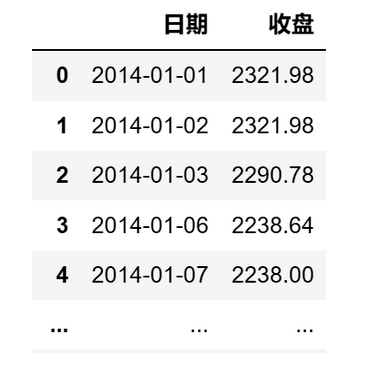

# 量化实战入门138—从风险中寻找机会：解码波动率 

在投资领域，波动率通常是用来衡量资产价格变动的风险程度的指标，而它通常是通过计算资产收益率的标准差来得到的。波动率计算不复杂，但需要注意的是在很多场合下我们需要使用年化后的波动率指标。下面我们以沪深300指数的数据举例说明如何计算波动率和年化波动率。

## 1. 获取基础数据
我们从AKShare数据源获取沪深300的10年收盘价数据。AKShare的接口有时会有更新，如果提示接口不存在，请参考AKShare的网站。

```python 

# 导入需要使用的库
import akshare as ak
import pandas as pd
import numpy as np
# 关闭警告信息
import warnings
warnings.filterwarnings('ignore')

# 获取沪深300指数10年的收盘价数据
start_date = '20140101'  # 开始日期
end_date = '20231229'  # 结束日期
bars = ak.stock_zh_index_hist_csindex(symbol='000300', start_date=start_date, end_date=end_date)
price_df = bars[['日期','收盘']]
# 将日期设置为datetime格式
price_df['日期'] = pd.to_datetime(price_df['日期'])

```
price_df的格式如下：



## 2. 计算波动率
波动率即收益率的标准差，我们分别计算日收益率、周收益率、月收益率的标准差如下：

```python 

# 用日收益率计算波动率
daily_return = price_df['收盘'].pct_change()  # 日收益率
vol_1 = daily_return.std()

# 用周收益率计算波动率
weekly_return = (1 + daily_return).resample('W').prod() - 1  # 周收益率
vol_2 = weekly_return.std()

# 用月收益率计算波动率
monthly_return = (1 + daily_return).resample('M').prod() - 1  # 月收益率
vol_3 = monthly_return.std()

print(vol_1,vol_2,vol_3)

```

结果分别是：0.01386、0.02849和0.06256。问题来了，同一段时间的波动率为什么会不同呢？其实这三个标准差是等价的，之所以出现数值的差异，是因为我们没有做年化处理。
## 3. 计算年化波动率
因为标准差的扩展是遵循平方根时间规则的，随着时间的增加，价格变动的标准差会以时间的平方根增长。

对于日波动率（日收益率的标准差），如果我们想要计算年化波动率，需要将日波动率调整为年度尺度。一年有大约244个交易日（这个数字可能会因市场而异），因此我们会乘以 np.sqrt(244)。

同理，如果我们从周波动率转换到年化波动率，我们会乘以 np.sqrt(52)，因为一年大约有52个星期。如果是月波动率转年化波动率，则乘以 np.sqrt(12)。

```python 

# 计算年化的波动率
vol_1 = daily_return.std() * np.sqrt(244)
vol_2 = weekly_return.std() * np.sqrt(52)
vol_3 = monthly_return.std() * np.sqrt(12)
print(vol_1,vol_2,vol_3)

```
计算结果为：0.2166、0.2055和0.2167。可以看到进行年化处理后波动率就基本相等了，还存在一些差异是因为一年并不正好是244个交易日或52周。