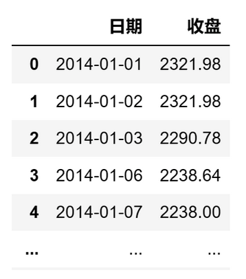

# 量化实战入门139—专注坏的波动：解析下行波动率 

下行波动率是一种风险衡量指标，用于评估投资策略在收益率低于0时的波动性。与传统的波动率（如标准差）不同，下行波动率只考虑策略表现小于0的情况，因此更侧重于衡量下行风险。

下行波动率越高，表示策略在表现不佳时的波动性越大，下行风险越高。下行波动率越接近0，表示策略在表现不佳时的波动性较小，下行风险较低。

与传统的波动率相比，下行波动率提供了一种区分好的波动和坏的波动的方法。它只关注策略表现低于0的情况，忽略了表现大于0的情况。这对于评估策略在不利市场环境下的风险非常有用。

下面我们以沪深300指数为例，介绍如何用python计算下行波动率。
## 1. 获取基础数据
我们从AKShare数据源获取沪深300的10年收盘价数据。AKShare的接口有时会有更新，如果提示接口不存在，请参考AKShare的网站。

```python 

# 导入需要使用的库
import akshare as ak
import pandas as pd
import numpy as np
# 关闭警告信息
import warnings
warnings.filterwarnings('ignore')

# 获取沪深300指数10年的收盘价数据
start_date = '20140101'  # 开始日期
end_date = '20231229'  # 结束日期
bars = ak.stock_zh_index_hist_csindex(symbol='000300', start_date=start_date, end_date=end_date)
price_df = bars[['日期','收盘']]
# 将日期设置为datetime格式
price_df['日期'] = pd.to_datetime(price_df['日期'])

```
price_df的格式如下：



## 2. 计算下行波动率

```python 

# 计算日收益率
returns = price_df['收盘'].pct_change()
n = len(returns)

# 计算下行差异
downside_returns = np.clip(returns, -np.inf, 0)

# 计算下行波动率
downside_variance = np.sum(downside_returns ** 2) / n
downside_risk = np.sqrt(downside_variance * 244)

```

在这段代码中：

1）returns 为沪深300的每日收益率序列。

2）使用np.clip()函数来检查哪些日子的收益率低于0，如果实际收益率低于0，则保留差值；否则，将差值设为0。np.clip(a, a_min, a_max, out=None)函数用于将数组中的元素限制在指定的范围内：小于a_min的元素将被替换为a_min，大于a_max的元素将被替换为a_max。

3）计算差值平方的总和除以天数得到方差，然后乘以244（假设一年有244个交易日）并开方得到年化后的下行波动率。
