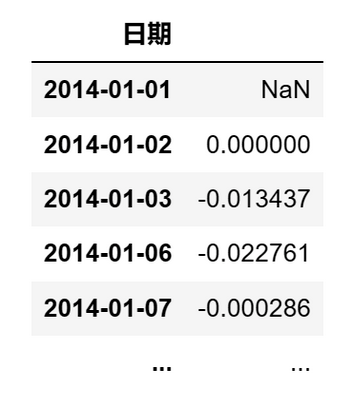

# 量化实战入门140—夏普比率揭秘：风险与收益的平衡艺术 

夏普比率（Sharpe Ratio）是一种衡量投资组合绩效相对于承担的风险表现的指标，旨在评估投资组合的超额回报和风险。夏普比率通过计算组合收益相对于无风险收益的超额收益与投资组合的波动率（标准差）的比值，来反映投资者每多承担一单位的风险，能获得多少的超额收益。夏普比率的公式为：

       夏普比率 =（投资组合收益率- 无风险利率）/ 投资组合标准差

夏普比率的值越高，意味着投资组合每增加一单位的风险所能承受的超额收益越高。这反映了投资经理在控制风险方面的能力，以及他们能够从投资组合中获得的回报。因此，夏普比率成为了评价投资策略和基金业绩的核心指标之一。

夏普比率的公式虽然简单，但计算时仍需注意不少细节，例如：有没有做年化处理；使用简单年化收益率还是复合年化收益率等。如果没有处理好这些问题，计算出的结果就不符合要求。

下面以A股市场为例，介绍夏普比率的计算。
## 1. 获取基础数据
我们从AKShare数据源获取沪深300的10年收盘价数据。AKShare的接口有时会有更新，如果提示接口不存在，请参考AKShare的网站。

```python 

# 导入需要使用的库
import akshare as ak
import pandas as pd
import numpy as np
# 关闭警告信息
import warnings
warnings.filterwarnings('ignore')

# 获取沪深300指数10年的收盘价数据
start_date = '20140101'  # 开始日期
end_date = '20231229'  # 结束日期
bars = ak.stock_zh_index_hist_csindex(symbol='000300', start_date=start_date, end_date=end_date)
prices = bars[['日期','收盘']]
# 将日期设置为datetime格式
prices['日期'] = pd.to_datetime(prices['日期'])
prices = prices.set_index('日期')
# 计算日收益率
returns = prices['收盘'].pct_change()

```
日收益率returns的计算结果如下：




接下来我们计算夏普比率。由于计算投资组合收益率有两种方法：简单年化收益率法和复合年化收益率法，相应的计算夏普比率也有两种方法。
## 2. 用简单年化收益率计算夏普比率（方法一）

```python 

# 计算夏普比率：用简单年化收益率
rf = 0.0  # 无风险利率设为0
annual_periods = 244  # 年化期数，一年约244个交易日
# 计算超额收益
returns = returns - rf
# 简单年化收益率 = 投资组合的平均超额收益率 * 年化期数
return_mean = np.mean(returns) * annual_periods
# 计算年化标准差
std_annualized = returns.std() * np.sqrt(annual_periods)
# 计算夏普比率
sharpe = return_mean / std_annualized

```
在上述代码中，我们先计算投资组合的超额收益，然后，用np.mean()函数计算日超额收益率的平均值，并乘以一年的交易日天数，得到简单年化的收益率。最后，用简单年化的收益率除以年化的标准差，得到夏普比率。

本例中将无风险利率设为0，如果该值不为0，需注意无风险利率的频率要与策略收益率 returns 一致。比如本例中 returns 为日频收益率，则无风险利率也要是日频的利率。
## 3. 用复合年化收益率计算夏普比率（方法二）

```python 

# 计算夏普比率：用复合年化收益率
rf = 0.0  # 无风险利率设为0
annual_periods = 244  # 年化期数，一年约244个交易日
# 计算超额收益
returns = returns - rf
# 计算年化收益率
years = len(returns) / annual_periods  # 投资年数
total = returns.add(1).prod() - 1  # 总收益率
return_annualized = abs(total + 1.0) ** (1.0 / years) - 1  # 年化收益率
# 计算年化标准差
std_annualized = returns.std() * np.sqrt(annual_periods)
# 计算夏普比率
sharpe = return_annualized / std_annualized

```
方法二跟方法一不同的是，方法一用的是投资组合的平均收益率，并进行了简单年化处理；而方法二用的是投资组合的复合年化增长率（CAGR）。

CAGR考虑了复利效应，而简单年化方法则没有。上面两种方法由于计算的投资组合收益率不同，最后得到的夏普比率也就不同。

因此，如果我们需要比较不同来源的夏普比率，首先要确认计算方法是不是一样的，然后还要检查一些计算细节是否统一，比如：1年中的交易日天数是否一致，是否做了年化的处理，无风险利率的频率是否和投资组合收益率一致等等。只有计算方法相同，夏普比率的值才是可比的。