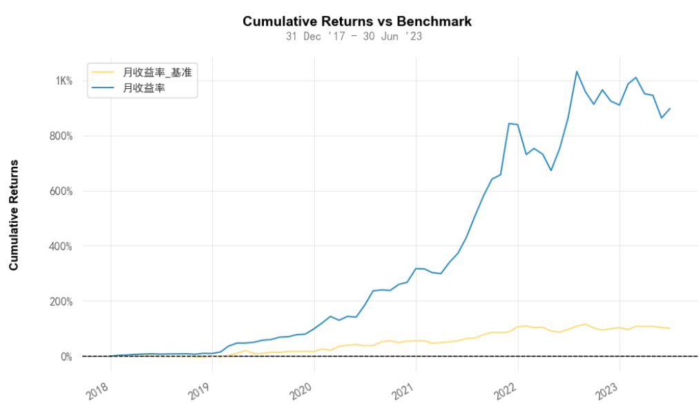

# 从零学量化35—策略的收益评价（使用empyrical和quantstats库）
在上节《量化投资策略评价和可视化分析概述》，我们介绍了量化策略评价和可视化分析的基本知识，本节我们具体介绍策略的收益评价，以及相关的程序代码。

任何投资策略的有效性都需要通过科学的方法来进行评价。在量化投资中，我们通常会采用一系列定量的指标来评价投资策略的收益性能。本文介绍如何从收益角度评价一个投资策略，收益的指标包括总收益、年化收益、胜率、盈亏次数比，以及赔率等。通过这些指标，我们可以更全面地理解和评价策略的收益性能，从而为优化策略提供有力的依据。本文将详细介绍这些收益评价指标，以及如何可视化分析策略的投资收益。

本文的例子来自《量化回测实例：可转债低转股溢价率策略》，为了节省篇幅，不再重复策略的实现代码，策略代码参见上文。本文使用empyrical库和quantstats库来计算评价指标和进行可视化分析，借助empyrical和quantstats这些优秀的开源量化工具库，即便是初学者也能快捷的计算各项金融指标，以及绘制专业且精美的分析图表。

empyrical库和quantstats库的安装可参见《本地Python环境部署》一文。

本文的可视化分析是在 Jupyter Notebook 中完成，使用其他的Python编辑器可能会有图表显示问题。

在使用empyrical库和quantstats库之前，我们需要先导入这两个库：

``` python 

import empyrical as ep
import quantstats as qs

```

## 一、收益评价的指标

### 1. 总收益率
总收益率是最直观的收益评价指标，它直接反映了投资策略在整个投资期间的累计收益，这个指标可以告诉我们投资策略的整体表现。

总收益率的计算公式为：

总收益率 = (投资结束时的资产价值 / 投资初始时的资产价值 - 1) * 100%

可以用empyrical库的cum_returns_final函数计算策略的总收益率：
``` python

ep.cum_returns_final(returns=results_df['月收益率'])

```
上述代码中 returns 参数为收益率序列，本例中 results_df['月收益率'] 为策略的每月收益率序列，下同。

总收益率的大小可以直观地反映出投资策略的盈利能力。总收益率越大，说明策略的盈利能力越强。但是，我们也要注意，高收益往往伴随着高风险。因此，我们在追求高收益的同时，也要关注投资策略的风险控制。

总收益率虽然能够反映出投资策略的整体盈利能力，但是因为不考虑投资期限的长短，因此不能直接用来比较不同期限的投资策略。为了比较不同期限的投资策略，我们需要引入年化收益率这个指标。
### 2. 年化收益率
年化收益率是一个重要的投资收益评价指标，它反映了投资策略在每年的平均收益。与总收益率不同，年化收益率是一个经过时间调整的指标，这使得我们可以公平地比较投资期限不同的投资策略。

年化收益率的计算公式为：

年化收益率 = (1 + 总收益率) ^ (1 / 投资年数) - 1

可以用empyrical库的annual_return函数计算年化收益率：

``` python

ep.annual_return(returns=results_df['月收益率'], period='monthly')

```
上述代码中 period 参数为收益率序列的频率，用于计算年化值。由于本策略的收益率序列是月频的，因此该参数取值 'monthly'；如果策略的收益率序列是日频或周频的，该参数取值应为 'daily' 或 'weekly'，下同。

年化收益率的大小可以反映出投资策略的年均盈利能力。年化收益率越大，说明策略的年均盈利能力越强。

年化收益率是一个非常有用的指标，它可以帮助我们公平地比较不同期限的投资策略。
### 3. 胜率
胜率是衡量量化投资策略成功率的一个关键指标，它反映了策略盈利交易次数占总交易次数的比例。在很多交易策略中，胜率是一个非常关键的参数，它直接关系到策略的盈利能力。

胜率的计算公式为：
胜率 = 盈利交易次数 / 总交易次数

在这个公式中，盈利交易次数指的是在所有交易中，实现盈利的交易次数，而总交易次数则是指策略在评价周期内进行的所有交易的次数，不论这些交易是盈利还是亏损。
可以用quantstats库的win_rate函数计算胜率：
``` python

qs.stats.win_rate(returns=results_df['月收益率'])

```
胜率越高，说明策略的盈利概率越大。一般来说，一个成功的投资策略应该有一个相对较高的胜率，这样才能保证在大多数情况下能够获得盈利。然而，胜率并不是衡量一个投资策略优劣的唯一指标。一个投资策略的胜率再高，如果每次盈利的金额太低，或者每次亏损的金额太高，也可能导致总体的投资收益为负。

同时，我们也要注意，胜率是基于过去的交易数据计算出来的，未来的胜率可能会受到市场条件变化等因素的影响，因此我们不能只依赖胜率来预测未来的投资收益。
### 4. 盈亏次数比
盈亏次数比是衡量量化投资策略中，盈利交易次数与亏损交易次数关系的一个重要指标。它是一个直观的比例，可以帮助我们理解策略在交易过程中的盈利与亏损情况。

盈亏次数比的计算公式为：

盈亏次数比 = 盈利交易次数 / 亏损交易次数

在这个公式中，盈利交易次数指的是在所有交易中，实现盈利的交易次数，而亏损交易次数则是指在所有交易中，发生亏损的交易次数。

我们可以通过胜率来计算盈亏次数比，假设胜率为win_rate，那么计算盈亏次数比的代码为：

``` python

win_rate / (1 - win_rate)

```
盈亏次数比的大小可以直观地反映出策略的盈利交易次数与亏损交易次数的比例。盈亏次数比越高，说明策略的盈利交易次数相对亏损交易次数越多，这通常被视为策略执行效果较好的表现。

然而，盈亏次数比并不能反映策略的盈亏幅度。例如，一个策略可能有很高的盈亏次数比，但其盈利的幅度可能很小，而亏损的幅度可能很大，这样的策略总体来看可能并不好。因此，我们在评价一个投资策略的时候，除了要看盈亏次数比，还需要引入赔率（盈亏额比）这个指标。
### 5. 赔率
赔率，也被称为盈亏金额比，是一个用来衡量量化投资策略中盈利和亏损金额之间关系的关键指标。它表示策略盈利金额与亏损金额的比例，从而反映出投资策略的盈利能力。

根据取值口径是总额还是平均额，赔率有2个计算公式：

赔率 = 平均盈利金额 / 平均亏损金额，或

赔率 = 总盈利金额 / 总亏损金额

其中，平均盈利金额是指所有盈利交易金额的平均值，平均亏损金额则是指所有亏损交易金额的平均值。

可以用quantstats库的win_loss_ratio函数或profit_factor函数来计算赔率：

``` python

qs.stats.win_loss_ratio(returns=results_df['月收益率'])  # 平均盈利金额 / 平均亏损金额
qs.stats.profit_factor(returns=results_df['月收益率'])  # 总盈利金额 / 总亏损金额

```

赔率越高，说明策略的盈利能力越强，即策略在盈利交易中赚取的金额大于在亏损交易中损失的金额。
### 6. 期望收益
在评估投资策略时，胜率和赔率是两个非常重要的因素。胜率衡量的是投资策略盈利交易次数占总交易次数的比例，而赔率则反映了策略在盈利和亏损交易中的资金管理能力。二者都是衡量投资策略优劣的重要指标，但是各自只能反映策略的部分特性，因此，我们需要同时考虑这两个因素，才能对投资策略有全面的评价。

胜率和赔率的综合考虑方法通常是通过期望收益来实现。期望收益是一个统计学概念，它反映的是所有可能结果的平均值，也就是说，它衡量的是投资策略预期的平均收益。期望收益可以用以下公式计算：

期望收益 = 胜率 * 平均盈利金额 - (1 - 胜率) * 平均亏损金额

在这个公式中，“胜率 * 平均盈利金额”反映了投资策略预期的平均盈利，而“(1 - 胜率) * 平均亏损金额”则反映了投资策略预期的平均亏损。期望收益能够同时考虑胜率和赔率，因此它是一个较为全面的投资策略评价指标。

计算期望收益的代码如下：

``` python

win_rate = qs.stats.win_rate(returns=results_df['月收益率'])  # 胜率
avg_win = qs.stats.avg_win(returns=results_df['月收益率'])  # 平均盈利金额
avg_loss = qs.stats.avg_loss(returns=results_df['月收益率'])  # 平均亏损金额
win_rate * avg_win - (1 - win_rate) * avg_loss  # 期望收益

```

如果一个投资策略的期望收益为正，那么这个策略就是有利可图的；如果期望收益为负，那么这个策略就是亏损的。因此，我们在选择投资策略时，应该选择期望收益高的策略。

在实际投资中，我们需要根据市场的具体情况和投资目标，选择年化收益率、赔率、胜率、盈亏次数比、期望收益等指标综合评价投资策略，以实现最佳的投资回报。同时，我们也要注意，任何策略指标都是基于历史数据计算出来的，它并不能保证未来的收益，因此我们不能仅依赖这些指标来预测未来的投资收益。
## 二、策略收益的可视化分析
可视化分析能够直观的观察策略的收益情况，通过调用quantstats库中plots模块的相关函数，我们可以绘制多种收益分析图表：
### 1. 收益曲线图
收益曲线图可以直观显示收益在时间序列上的变化趋势，通过曲线的起伏反映收益的增长和下降。以下代码用于绘制策略收益曲线和基准收益曲线：

``` python

qs.plots.returns(returns=results_df['月收益率'], benchmark=results_df['月收益率_基准'])

```
图形如下：

