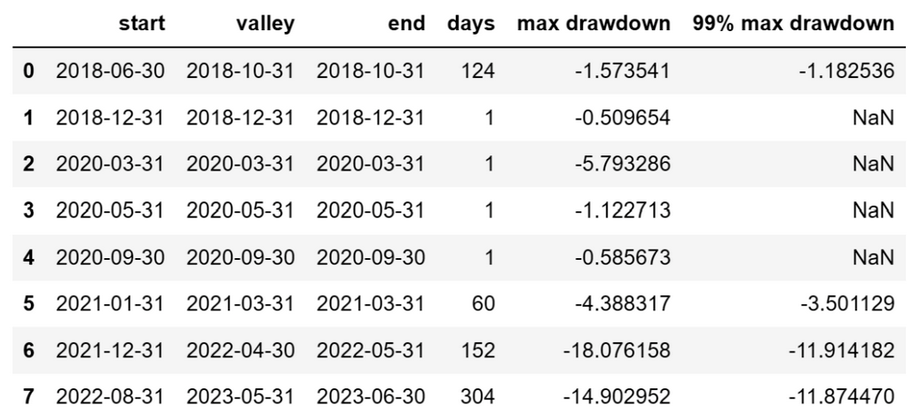
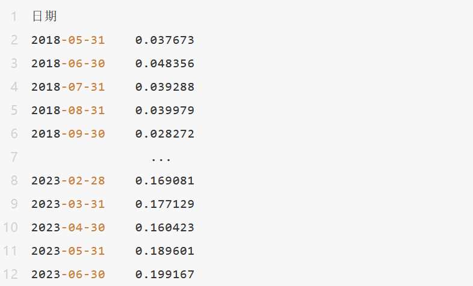
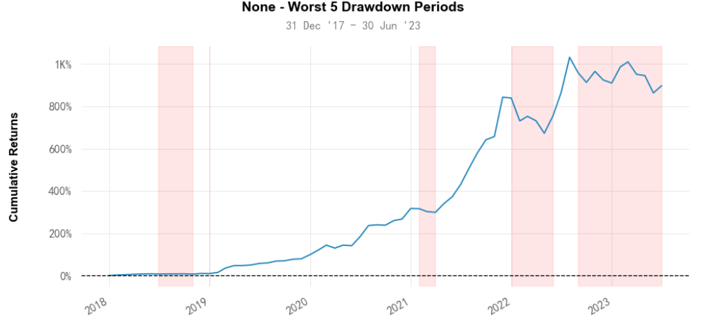

# 从零学量化36—策略的风险评价（使用empyrical和quantstats库） 
在上一节《策略的收益评价》我们介绍了如何从收益的角度去评价一个投资策略，但仅评价收益是不够的，因为高收益往往伴随着高风险。在量化投资中，对投资策略的风险评价是至关重要的。通过对投资策略的风险进行量化评估，我们可以了解策略可能带来的潜在损失，从而更好地管理风险。在本文中，我们将详细介绍几种常用的风险评价指标，并探讨如何通过可视化分析进行策略风险的评估。

本文的例子来自《量化回测实例：可转债低转股溢价率策略》，为了节省篇幅，不再重复策略的实现代码，策略代码参见上文。本文使用empyrical库和quantstats库来计算评价指标和进行可视化分析，借助empyrical和quantstats这些优秀的开源量化工具库，即便是初学者也能快捷的计算各项金融指标，以及绘制专业且精美的分析图表。

empyrical库和quantstats库的安装可参见《本地Python环境部署》一文。

本文的可视化分析是在 Jupyter Notebook 中完成，使用其他的Python编辑器可能会有图表显示问题。

在使用empyrical库和quantstats库之前，我们需要先导入这两个库：

``` python

import empyrical as ep
import quantstats as qs

```
## 01 风险评价的指标
### 1. 最大回撤
最大回撤是一种常见的风险度量，用于衡量投资策略在最坏的情况下可能发生的最大损失。它是通过计算投资策略从一次最高峰值下跌到之后的最低点的百分比来量化的。这是一个非常重要的指标，因为它可以帮助我们理解在极端不利条件下投资可能的下跌幅度。最大回撤越大，说明投资策略在面临逆境时的风险越高，反之则说明该策略的风险程度较低。

计算最大回撤的公式如下：

最大回撤 =（策略最高价 - 策略最低价）/ 策略最高价

这里的“策略最高价”指的是投资策略在考虑的时间范围内的最高价值，而“策略最低价”则是从最高价之后到结束日期内的最低价值。

例如，如果一种投资策略的最高价值是100元，然后下跌到60元，那么最大回撤就是40%。

可以用empyrical库的max_drawdown函数计算最大回撤：

``` python

ep.max_drawdown(returns=results_df['月收益率'])

```
上述代码中 returns 参数为收益率序列，本例中 results_df['月收益率'] 为策略的每月收益率序列，下同。
除了最大回撤，我们还可以用quantstats库的drawdown_detail函数列出回测期间的各次回撤的详细数据，代码如下：
``` python

drawdown = qs.stats.to_drawdown_series(returns=results_df['月收益率'])  # 将投资收益率序列转换为回撤序列
qs.stats.drawdown_details(drawdown)  # 各次回撤的情况表

```
得到的结果如下：



上表包括了各次回撤的开始日期(start)、结束日期(end)、最低点日期(valley)、回撤天数(days)、最大回撤(max drawdown)以及99%回撤期间的最大回撤(99% max drawdown)。
需要注意的是，最大回撤只考虑了过去的数据，并不能预测未来的风险。此外，最大回撤也主要关注极端的负面情况，而不是平均或常见的风险水平。因此，在评估投资策略的风险时，最大回撤只是众多风险度量指标之一。
### 2. 波动率
波动率是一种度量金融资产价格变动幅度的统计指标，它能反映市场的不确定性和风险程度。在金融市场中，波动率通常用收益的标准差来衡量。具体来说，波动率是对资产收益率的一种度量，它衡量了资产收益率在一段时间内的变动程度。波动率越高，资产价格的变动范围就越大，风险也就越大。反之，波动率越低，资产价格的变动范围就越小，风险也就越小。

使用empyrical库的annual_volatility函数计算年化波动率的代码如下：

``` python

ep.annual_volatility(returns=results_df['月收益率'], period='monthly')

```
上述代码中 period 参数为收益率序列的频率，用于计算年化值，以便不同期间的策略进行比较。由于本策略的收益率序列是月频的，因此该参数取值 'monthly'；如果策略的收益率序列是日频或周频的，该参数取值应为 'daily' 或 'weekly'，下同。

我们还可以观察滚动波动率来衡量策略的风险，轮动波动率是一个给定时间窗口内的波动率，它能展示投资策略的风险随时间的变化情况。

使用empyrical库的roll_annual_volatility函数可以计算滚动的波动率：
``` python

ep.roll_annual_volatility(arr=results_df['月收益率'], window=6, period='monthly')

```
上述代码中的 window 参数为滚动的时间窗口，此处设为6个月。输出结果为每个月的波动率（以6个月为时间窗口计算）：

需要注意的是，虽然波动率可以反映出投资策略的风险程度，但它并不能完全代表投资风险。因为波动率只考虑了收益率的变动范围，而没有考虑收益率的方向。例如，一个收益率波动很大但总体向上的投资策略，其风险可能就没有波动率所反映的那么大。
### 3. 下行波动率
下行波动率，也被称为负波动率或者负半标准差，是一种重要的风险度量指标，它专门衡量投资收益为负（或低于某一预定目标）时的波动率。与通常的波动率（衡量全部收益，无论正负）不同，下行波动率关注的是投资策略在不利市场环境下的风险表现，更加关注投资的潜在损失。

可以用empyrical库的downside_risk函数计算下行波动率：
``` python

ep.downside_risk(returns=results_df['月收益率'], period='monthly')

```
在投资管理中，下行波动率被广泛认为是一个比全样本波动率更好的风险度量方式，因为它能更好地反映出投资者最关心的风险——潜在的损失。投资者通常对负面的价格变动更为敏感，因此，下行波动率为我们提供了一个更符合投资者风险感知的风险度量工具。
### 4. 价值风险（VaR）
价值风险（Value at Risk, VaR）是一种广泛应用于金融领域的风险度量方法。它用于衡量在一定的置信水平和特定的时间阈值下，投资组合可能出现的最大损失。

VaR的计算基于概率和统计理论，它将金融资产的价格变动的不确定性、时间阈值和置信水平三个要素结合在一起，从而得出一个具体的损失数值。这个数值表示，在指定的时间阈值内，以特定的置信水平，投资组合的损失不会超过这个数值。例如，一个一天95% VaR为1%，意味着在未来的一天中，有95%的可能性投资组合损失不会超过1%（或：有5%的可能性投资组合损失超过1%）。

可以用empyrical库的value_at_risk函数计算VaR：
``` python

ep.value_at_risk(returns=results_df['月收益率'], cutoff=0.05)

```
上述代码中的参数 cutoff=0.05 表示有 5% 的可能性投资组合损失超过VaR。

需要注意的是，虽然VaR是一个非常有用的风险度量工具，但它也有其局限性。首先，VaR只能提供潜在损失的上限，而无法提供损失超过这个上限时的信息。这就是说，VaR无法告诉我们当事情变得非常糟糕时会发生什么。其次，VaR假设市场的变动是正态分布的，但在实际的金融市场中，市场的变动往往是偏态的，有时还会出现“黑天鹅”事件。因此，在使用VaR时，我们需要结合其他风险度量工具，如条件VaR（CVaR）等，全面评估投资风险。
### 5. 条件价值风险（CVaR）
条件价值风险（Conditional Value at Risk，CVaR），也被称为期望短缺（Expected Shortfall, ES），或者尾部风险值（Tail Value at Risk, TVaR），是一种衡量金融风险的先进方法。与价值风险（VaR）不同，CVaR不仅考虑了可能出现的最大损失，还进一步考虑了当损失超过VaR值时的风险情况，即尾部风险。

CVaR的计算方式是，首先确定一个置信水平，然后计算在这个置信水平下损失超过VaR值的情况下的平均损失。这就意味着，CVaR实际上是在考虑最坏的情况下的期望损失。例如，一个一天95%的CVaR为2%，意味着在最坏的5%的一天中，如果损失超过VaR值，那么平均损失可能会达到2%。

可以用empyrical库的conditional_value_at_risk函数计算CVaR：
``` python

ep.conditional_value_at_risk(returns=results_df['月收益率'], cutoff=0.05)

```
上述代码中的参数 cutoff 为5%，那么CVaR就是计算所有收益在最坏的5%的日子中的平均值。

CVaR的优点是，它不仅提供了可能的最大损失（即VaR），还提供了当事情变得非常糟糕时可能发生的情况。这使得CVaR成为一个比VaR更全面的风险度量工具。同时，CVaR也适用于不符合正态分布的市场情况，因此，它在处理市场的极端事件（如"黑天鹅"事件）时更为有效。

然而，CVaR也有其局限性。首先，和VaR一样，CVaR是基于历史数据的，它不能预测未来的尾部风险。其次，CVaR也不能完全代表投资的全部风险，因此在实际应用中，我们需要结合其他风险度量工具，全面评估投资风险。


## 02 策略风险的可视化分析
风险的可视化分析能够直观的观察策略的风险情况，通过调用quantstats库中plots模块的相关函数，我们可以绘制多种风险分析图表：
### 1. 回撤曲线图
回撤曲线图是在收益曲线图上叠加了回撤情况图。通过这个图，我们可以直观地了解策略在何时何地出现了大的回撤，及其持续的时间。以下代码绘制回撤曲线图：

``` python

qs.plots.drawdowns_periods(returns=results_df['月收益率'])

```
结果如下：


### 2. 回撤水下（underwater）图
水下图也是反映回撤的情况，跟回撤曲线图不同，水下图是以0值为基准，反映回撤在0值以下的持续时间和幅度。因为基准都是0值，因此更有利于对不同时期的各次回撤进行比较。以下代码绘制水下图：
``` python

qs.plots.drawdown(returns=results_df['月收益率'])


```