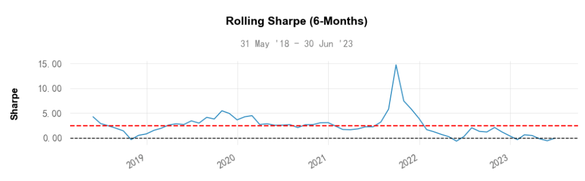

# 从零学量化37—策略风险调整后的收益评价（使用empyrical和quantstats库）
在前面的文章中，《策略的收益评价》与《策略的风险评价》两篇分别从收益与风险的角度对量化策略进行了独立的评估。那么，是否存在一种评价指标能够将这两个维度有效结合，从而实现对投资策略的全面评价？答案是肯定的，这就是我们称之为风险调整后的收益，换句话说，就是在接受一定风险的前提下，我们能够获取多少的收益。

本文将重点介绍这些风险调整后的收益评价指标，包括夏普比率（Sharpe Ratio）、索提诺比率（Sortino Ratio）、卡玛比率（Calmar Ratio）以及欧米茄比率（Omega Ratio）。这些指标从各自的角度量化了投资策略的风险与收益之间的关系，为投资者提供了更为全面且深入的决策参考，帮助他们更好地理解并评估投资策略的整体性能。

本文的例子来自《量化回测实例：可转债低转股溢价率策略》，为了节省篇幅，不再重复策略的实现代码，策略代码参见上文。本文使用empyrical库和quantstats库来计算评价指标和进行可视化分析，借助empyrical和quantstats这些优秀的开源量化工具库，即便是初学者也能快捷的计算各项金融指标，以及绘制专业且精美的分析图表。

empyrical库和quantstats库的安装可参见《本地Python环境部署》一文。

本文的可视化分析是在 Jupyter Notebook 中完成，使用其他的Python编辑器可能会有图表显示问题。

在使用empyrical库和quantstats库之前，我们需要先导入这两个库：

``` python

import empyrical as ep
import quantstats as qs

```
## 01 风险调整后的收益评价指标
### 1.夏普比率（Sharpe Ratio）
夏普比率是由诺贝尔经济学奖得主威廉·夏普提出的一种评价投资策略性能的指标。其主要功能是衡量投资者每承受一单位总风险，可以获得多少超额回报。此处的“超额”指的是超过无风险收益的部分。夏普比率的计算公式是：
夏普比率 = (Rp - Rf) / σp
其中：

- Rp 代表投资策略的预期收益率
- Rf 代表无风险收益率，通常可以采用国债的年利率或者存款利率作为参考
- σp 代表投资策略的收益的标准差，用来衡量投资策略的风险性。标准差越大，投资策略的风险性越高。

在上述计算公式中，Rp - Rf 是投资策略的超额收益，即投资策略的预期收益与无风险收益之差，这直接反映了投资策略的盈利能力。σp 是投资策略的收益的标准差，它作为风险的度量，反映了投资策略收益的波动性，波动性越大，风险越高。

夏普比率的分子部分代表了投资策略的收益，分母部分代表了投资策略的风险。当我们计算夏普比率时，我们实际上是在查看每单位风险能带来多少的超额收益。因此，夏普比率考虑了收益和风险这两个维度，是一个风险调整后的收益评价指标。夏普比率越高，表示单位风险所能获得的超额收益越高，投资策略的性能越好。

可以用empyrical库的sharpe_ratio函数计算夏普比率：

``` python

ep.sharpe_ratio(returns=results_df['月收益率'], period='monthly')

```
上述代码中 returns 参数为收益率序列，本例中 results_df['月收益率'] 为策略的每月收益率序列；period 参数为收益率序列的频率，由于本策略的收益率序列是月频的，因此该参数取值 'monthly'；如果策略的收益率序列是日频或周频的，该参数取值应为 'daily' 或 'weekly'，下同。

我们还可以计算滚动夏普比率，滚动夏普比率是在一个设定的时间窗口滚动计算的夏普比率，滚动夏普比率可以观察不同时间段内投资组合风险调整后收益的变化情况。如果夏普比率随时间增大,说明投资组合的风险调整后收益在提高。

可以用empyrical库的roll_sharpe_ratio函数计算滚动夏普比率：
``` python

ep.roll_sharpe_ratio(arr=results_df['月收益率'], window=6,  period='monthly')

```
上述代码中的参数 window=6 用于设定时间窗口为6期，本例中收益率为月频数据，因此时间窗口为6个月，下同。
需要注意的是，夏普比率虽然能提供一个快速评估投资策略性能的方式，但它假设投资收益是正态分布的，这在现实中可能并不准确，收益的分布往往具有“肥尾”的特征，因此夏普比率不善于表征尾部风险。
### 2.索提诺比率（Sortino Ratio）
索提诺比率是另一种风险调整后收益的指标，不同于夏普比率考虑的是总体风险，索提诺比率更关注下行风险，即投资收益低于期望或负收益的情况，从而更为适合风险厌恶的投资者。
索提诺比率的计算公式是：
索提诺比率 = (Rp - Rf) / DR
其中：

- Rp 代表投资策略的预期收益率
- Rf 代表无风险收益率，通常可以采用国债的年利率或者存款利率作为参考
- DR 代表投资策略的下行风险，通常通过计算负收益的标准差（即：下行波动率）来衡量

在上述公式中，Rp - Rf 是投资策略的超额收益，即投资策略的预期收益与无风险收益之差，反映了投资策略的盈利能力，这跟夏普比率是相同的。但与夏普比率不同的是，索提诺比率的分母并非全部收益的标准差，而只是负收益的标准差，即下行波动率。因此索提诺比率反映投资策略单位下行风险的超额收益。索提诺比率越高，表示投资策略单位下行风险带来的超额收益越高，也就意味着投资策略的性能越好。

可以用empyrical库的sortino_ratio函数计算索提诺比率:

``` python

ep.sortino_ratio(returns=results_df['月收益率'], period='monthly')

```

我们还可以在设定的时间窗口滚动计算索提诺比率，滚动索提诺比率高低反映了投资组合在不同期间的风险调整收益表现。随着时间的推移，持续比较滚动索提诺比率的变动趋势，可以评估投资组合长期的风险调整回报情况。

可以用empyrical库的roll_sortino_ratio函数计算滚动索提诺比率：
``` python

ep.roll_sortino_ratio(arr=results_df['月收益率'], window=6,  period='monthly')

```
需要注意的是，索提诺比率也有一些缺点，首先，索提诺比率假设投资收益的分布是对称的，即收益的上行风险和下行风险相同。然而，在现实中，许多投资策略的收益分布可能是非对称的。在这种情况下，索提诺比率可能不能准确地反映投资策略的风险；其次，索提诺比率对极端事件非常敏感。如果一个投资策略在大部分时间内表现良好，但在某个特定时期表现非常糟糕，索提诺比率可能会严重低估该投资策略的性能。
### 3.卡玛比率（Calmar Ratio）
卡玛比率是一个广泛应用于投资领域的性能评估指标，它衡量的是投资策略的年化收益与策略的最大回撤之间的关系。通过这个比率，投资者可以更好地理解投资策略的收益和风险之间的平衡。
卡玛比率的计算公式是：

卡玛比率 = 年化收益 / 最大回撤

其中：

    "年化收益" 是指投资策略在一年内的平均收益率
    "最大回撤" 是指投资策略在一段时间内，从最高点到最低点的回落幅度

在上述公式中，"年化收益"是一个收益指标；而"最大回撤" 是一个风险指标，它反映了投资策略在最糟糕的情况下可能遭受的损失，一个较大的最大回撤可能意味着该投资策略的风险较高。因此，卡玛比率综合了收益和风险两个维度，实际上是在衡量每单位最大回撤带来的年化收益。卡玛比率越高，表示单位最大回撤所能获得的年化收益越高，也就意味着投资策略的性能越好。

可以用empyrical库的calmar_ratio函数计算卡玛比率：

``` python

ep.calmar_ratio(returns=results_df['月收益率'], period='monthly')

```

需要注意的是，卡玛比率也存在一些缺点：首先，卡玛比率使用最大回撤作为风险度量，但最大回撤是基于特定时间段的，可能无法充分反映投资策略在不同时期的风险；其次，卡玛比率对极端事件非常敏感。如果一个投资策略在大部分时间内表现良好，但在某个特定时期表现非常糟糕，这个非常糟糕的时间段的最大回撤可能会严重影响卡玛比率的结果；最后，最大回撤可以衡量投资策略的短期损失，但无法反映投资策略从最大回撤恢复的速度。如果一个策略能够在短时间内快速恢复，那么其风险可能被卡玛比率所高估。因此卡玛比率也需要和其他评价指标综合使用。
### 4.欧米茄比率（Omega Ratio）
欧米茄比率是一个综合性的风险-收益性能指标，与许多其他投资性能指标不同的是，欧米茄比率考虑了投资策略收益的全部分布，包括收益的方差，偏度和峰度，而不仅仅是均值和方差。这使得欧米茄比率能够描绘出一个更全面，更真实的投资策略性能画像。

欧米茄比率的计算公式可以表示为：

欧米茄比率 = E(R | R >= MAR) / E(R | R < MAR)

在这个公式中：

- E(R | R >= MAR) 是投资策略产生正收益（即收益大于或等于最小可接受回报率，MAR）的期望值。
- E(R | R < MAR) 是投资策略产生负收益（即收益小于最小可接受回报率，MAR）的期望值。

欧米茄比率实际上是投资策略在达到或超过投资者的最小可接受回报率（MAR）时的平均收益与未达到MAR时的平均损失之比。欧米茄比率越高，说明投资策略在取得正收益的可能性相对于产生负收益的可能性越大，即投资策略的效果越好。

由于欧米茄比率考虑了收益的全分布，包括偏度和峰度，因此它能捕捉到收益分布可能的非对称性和尖峰厚尾等特性。这使得欧米茄比率成为了一个灵活的风险-收益性能度量工具，特别适合用于评价那些收益分布可能存在显著非正态性的复杂投资策略。

可以用empyrical库的omega_ratio函数计算欧米茄比率：

``` python

ep.omega_ratio(returns=results_df['月收益率'], annualization=12)

```

上述代码中 annualization 参数为一年中的交易频率，本例为月度调仓，一年的交易频率为12次。

同样的，欧米茄比率也有一些潜在的缺点：首先，欧米茄比率的计算依赖于选择的最小可接受回报率（MAR），但是，MAR的选择可能会有很大的主观性，不同的投资者可能会有不同的MAR，这可能会影响其在不同投资者或策略之间的比较；其次，欧米茄比率对收益分布的偏度和峰度非常敏感，这意味着它可能会对极端事件有过度的反应。如果一个投资策略在大部分时间内表现良好，但在某个特定时期由于一些极端事件表现非常糟糕，这可能会严重影响欧米茄比率的结果；最后， 如果投资策略的正负收益分布非对称，那么欧米茄比率可能会给出误导性的结果。例如，如果一个策略的正收益非常稀少但却非常大，而负收益则频繁但较小，那么欧米茄比率可能会过高，从而过度估计了该策略的性能。

综上所述，夏普比率、索提诺比率、卡玛比率和欧米茄比率分别从不同的角度衡量了风险调整后的收益，但他们都有各自的局限性，在实际应用时，需要结合其他工具和信息进行综合评估，以得到更全面的投资策略评估。

## 02 风险调整后收益的可视化分析
通过调用quantstats库中plots模块的rolling_sharpe函数，我们可以绘制滚动夏普比率图：

``` python

qs.plots.rolling_sharpe(returns=results_df['月收益率'], period=6, period_label='6-Months', periods_per_year=12)

```

绘制出的图表如下：



以上就是使用empyrical和quantstats库对策略进行风险调整后的收益评价的相关内容，下一节将介绍策略相对基准的评价。
