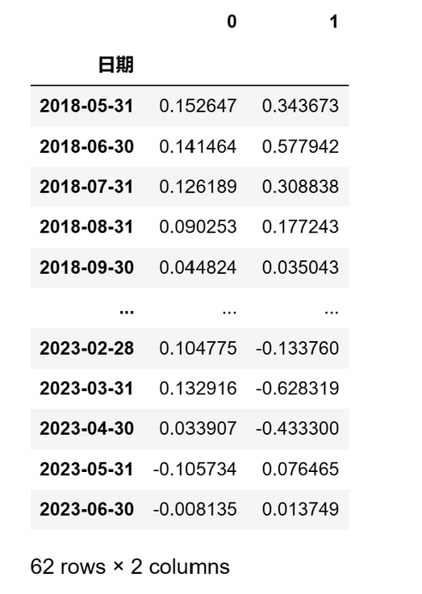

# 从零学量化39—策略相对基准的评价二（使用empyrical和quantstats库）

接着上一篇《策略相对基准的评价一》的内容，继续讲策略相对基准的评价指标：
### 4.阿尔法（Alpha）
阿尔法是投资策略的超额收益的部分，这部分超额收益不能被市场风险所解释。阿尔法可以看作是投资策略的选股能力或市场时机选择能力的反映。具体来说，如果一个策略在扣除了市场收益（基准收益）后，还能实现正的收益，那么这部分收益就是阿尔法。

阿尔法通常通过回归分析来计算。在最常见的资本资产定价模型（CAPM）中，阿尔法是回归方程的截距项：

投资回报 = 阿尔法 + 贝塔 * 市场回报 + 误差项

在这个公式中，贝塔（Beta）衡量的是投资策略对市场风险的敏感度，市场回报是基准的回报，阿尔法就是在控制了市场风险后，投资策略的超额收益。

可以用empyrical库的alpha函数来计算策略的阿尔法值：

``` python

ep.alpha(returns=results_df['月收益率'], factor_returns=results_df['月收益率_基准'], period='monthly')

```

上述代码中 returns 参数为策略的收益率序列；factor_returns 参数为基准的收益率序列；period 参数为收益率序列的频率，本例为月频'monthly'，下同。

阿尔法是评估投资策略性能的一个重要工具。一个正的阿尔法表示策略在控制市场风险后，实现了超过市场的收益。这意味着投资策略产生了真正的超额收益，而这部分收益不能被市场风险所解释，因此可以看作是投资策略的选股能力或市场时机选择能力的结果。

投资者通常会寻找有正阿尔法的策略，因为这意味着策略在承受一定的市场风险的情况下，能够产生超过市场的收益。然而，投资者也需要注意，阿尔法的计算需要依赖于回归模型和基准的选择，因此在解释和使用阿尔法时需要谨慎。
### 5.贝塔（Beta）
贝塔衡量的是投资策略的系统性风险，即当市场整体变动时，投资策略的预期变动情况。更简单地说，贝塔描述的是策略收益与市场收益的相关性，它可以看作是策略对市场的敏感性。

贝塔通常通过回归分析来计算。在最常见的资本资产定价模型（CAPM）中，贝塔是回归方程的斜率项：

投资回报 = 阿尔法 + 贝塔 * 市场回报 + 误差项

在这个公式中，阿尔法（Alpha）衡量的是投资策略的超额收益，市场回报是基准的回报，贝塔就是投资策略对市场风险的敏感度。

可以用empyrical库的beta函数计算策略的贝塔值：
``` python

ep.beta(returns=results_df['月收益率'], factor_returns=results_df['月收益率_基准'])

```
贝塔是评估投资策略风险的一个重要工具。一个高于1的贝塔表示策略比市场更具风险性，当市场上涨时，策略的预期收益会超过市场；当市场下跌时，策略的预期损失也会超过市场。低于1的贝塔表示策略的风险性低于市场，无论市场涨跌，策略的预期收益或损失都会低于市场。

贝塔对于投资者的投资决策有重要影响。风险厌恶的投资者可能会倾向于选择贝塔低于1的策略，因为这些策略的风险性低于市场。而风险承受能力较强的投资者可能会倾向于选择贝塔高于1的策略，因为这些策略有可能在市场上涨时获得超额收益。
### 6.滚动计算的阿尔法和贝塔
除了计算投资策略整体的阿尔法和贝塔，我们还可以滚动计算阿尔法和贝塔。滚动计算的阿尔法和贝塔是指在一段时间内，以滚动窗口的方式计算这两个参数，以观察它们的变化趋势。

通过滚动计算阿尔法和贝塔，我们可以观察到这两个参数的变化趋势。例如，如果阿尔法的滚动值在上升，说明投资策略的超额收益在提高；如果贝塔的滚动值在下降，说明投资策略的市场风险在降低。这对于评价投资策略的性能和风险具有重要意义。

滚动计算的阿尔法和贝塔不仅可以反映策略的收益和风险，还可以用来评估策略的稳定性。如果阿尔法和贝塔的滚动值波动性较大，说明策略的性能和风险可能会随时间而变化，这可能是策略的稳定性较差的一个信号。

滚动计算的阿尔法和贝塔还可以帮助我们发现投资策略的问题。例如，如果贝塔的滚动值持续高于1，说明策略的市场风险较高；如果阿尔法的滚动值持续为负，说明策略的超额收益较低。这些都可能是策略存在问题的信号，需要投资者及时调整策略。

可以用empyrical库的roll_alpha_beta函数计算滚动的阿尔法和贝塔：

``` python

ep.roll_alpha_beta(returns=results_df['月收益率'], factor_returns=results_df['月收益率_基准'], period='monthly', window=6)

```
上述代码中 window 参数为滚动窗口的大小，本例中设置为6期，由于本例的调仓频率为月频，因此滚动窗口为6个月。

输出结果如下（第0列为滚动的阿尔法；第1列为滚动的贝塔）：



### 7.特雷诺比率（Treynor Ratio）
特雷诺比率是投资策略的超额收益与贝塔的比率，用以衡量每承担一单位市场风险，策略可以获取多少超额收益。特雷诺比率是一种风险调整后的收益度量，它考虑了投资策略的市场风险。

特雷诺比率的计算公式如下：

特雷诺比率 = (策略收益 - 无风险收益) / 贝塔

在这个公式中，策略收益是投资策略的总收益，无风险收益是在同一时期内，无风险投资（例如国债）的收益，贝塔是投资策略的市场风险。特雷诺比率计算的是每承担一单位市场风险，投资策略能够获得多少超过无风险收益的收益。

可以用quantstats库的treynor_ratio函数来计算特雷诺比率：

``` python

qs.stats.treynor_ratio(returns=results_df['月收益率'], benchmark=results_df['月收益率_基准'], periods=12, rf=0)

```

上述代码中 returns 参数为策略的收益率序列；benchmark 参数为基准的收益率序列；periods 参数为一年中的交易频率，本例为月度调仓，一年的交易频率为12次；rf 参数为无风险收益，本例中设为0。

特雷诺比率是评估投资策略性能的一个重要工具。特雷诺比率越高，表明策略的风险调整后的性能越好，也就是说，投资策略能够在每承担一单位市场风险的情况下，获取更高的超额收益。
## 03 策略相对基准的可视化分析
我们可以通过以下可视化图表分析策略相对基准的收益和风险：