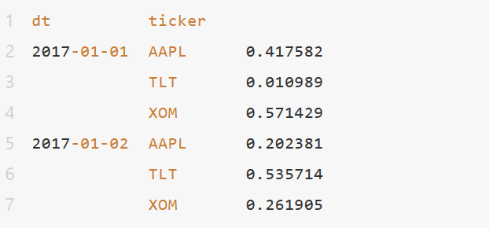
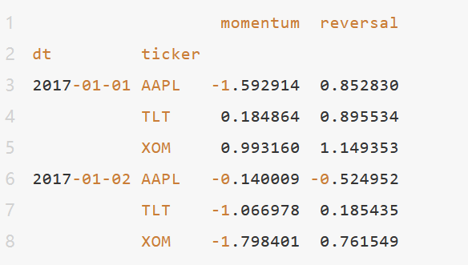
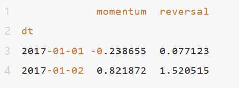
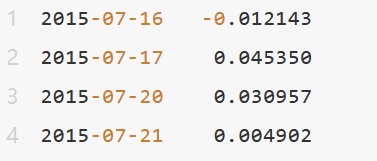

# 从零学量化41：用Empyrical库计算金融指标的中文指南（二） 

Empyrical是一个由Quantopian开发的开源的Python库，专门用于计算常用的金融风险和性能指标。它包含了许多用于策略回测分析的工具，能够帮助投资者对投资策略的性能进行定量分析。本文详细介绍Empyrical库的用法，由于内容较多，分为五篇阐述。

本篇为第二篇，继续介绍Empyrical库的金融指标函数（按字母排序）：
### 10. beta_fragility_heuristic(returns, factor_returns)
这个函数 beta_fragility_heuristic 用于估计在beta下降时的脆弱性。
函数的参数如下：

- returns：策略的每日收益，非累积。这可以是 pandas 的 Series 或 numpy 的 ndarray。
- factor_returns：计算beta的因子的每日非累积收益。通常是一个基准，比如市场。这同样应为 pandas 的 Series 或 numpy 的 ndarray 类型。

函数的返回值是一个浮点数或者 np.nan，表示策略的beta脆弱性。
注意：

- 如果返回值为负，表示可能会在beta波动的情况下出现亏损。负值的大小表示可能亏损的大小。

简单来说，Beta脆弱性启发式函数是一个量化风险的方法，它试图估计在给定风险因子（比如市场）的收益率变化的情况下，投资策略的脆弱性。在这种情况下，脆弱性被定义为策略在风险因子的负面影响下可能遭受的损失。这主要是通过计算投资策略与风险因子之间的Beta（即系统性风险）并观察其变化来完成的。如果Beta的变化引起了投资策略的收益变动，那么我们就可以说策略对Beta的变化是脆弱的。
### 11. beta_fragility_heuristic_aligned(returns, factor_returns)
beta_fragility_heuristic_aligned函数和之前提到的beta_fragility_heuristic函数功能相似，这两个函数的主要区别在于，beta_fragility_heuristic_aligned函数需要输入的returns和factor_returns在标签上已经被对齐，如果是np.ndarray类型，则这两个参数应该具有相同的形状。
### 12. cagr(returns, period='daily', annualization=None)
该函数 cagr 用于计算复合年增长率（Compound Annual Growth Rate，CAGR），这是函 annual_return 的别名函数。
函数参数如下：

- returns：策略的每日收益，非累积。这可以是 pandas 的 Series 或 numpy 的 ndarray。

- period：定义 'returns' 数据的周期性，以便进行年化。如果指定了 annualization 参数，则忽略该值。默认值如下：
  
  'monthly': 12

  'weekly': 52

  'daily': 252

annualization：用于抑制 period 中可用的默认值，将收益转化为年收益。该值应为 returns 的年频率。

函数返回的是一个浮点数，代表CAGR的值。

CAGR（复合年增长率）是一种描述投资回报率的测量方法，它假设投资回报是连续复合的。使用CAGR计算投资的年化平均增长率可以很好地消除投资回报中的波动性和季节性因素，从而更准确地反映投资的长期表现。

简单来说，CAGR通过以下公式定义：

$`\text { CAGR }=(\text { Ending Value } / \text { Beginning Value }) \wedge(1 / \text { number of years })-1`$

其中，"Ending Value" 是投资在计算期末的价值，"Beginning Value" 是投资在计算期初的价值，"number of years" 是投资的年数。
### 13. calmar_ratio(returns, period='daily', annualization=None)
该函数 calmar_ratio 用于计算策略的Calmar比率，也被称为回撤比率。

函数的参数如下：

- returns：策略的每日收益，非累积。这可以是 pandas 的 Series 或 numpy 的 ndarray。

- period：定义 'returns' 数据的周期性，以便进行年化。如果指定了 annualization 参数，则忽略该值。默认值如下：
  
  'monthly': 12
  
  'weekly': 52
  
  'daily': 252

annualization：用于抑制 period 中可用的默认值，将收益转化为年收益。该值应为 returns 的年频率。

函数的返回值是一个浮点数，代表Calmar比率。如果没有Calmar比率，返回 np.nan。

Calmar比率是一个评估策略风险调整后表现的指标，它通过比较策略的年化收益和最大回撤来计算。具体来说，Calmar比率是年化收益率与最大回撤的绝对值之比。高的Calmar比率意味着策略的风险调整后收益较高，而低的Calmar比率则表示策略的风险调整后收益较低。

Calmar比率的计算公式为：

Calmar比率 = 年化收益率 / 最大回撤的绝对值

注意，当计算Calmar比率时，我们通常考虑的是策略的历史表现，因此最大回撤是在计算期间内观察到的最大回撤。
### 14. capture(returns, factor_returns, period='daily')
这个函数 capture  用于计算捕获比率。

函数的参数如下：

- returns：策略的每日收益，非累积。这可以是 pandas 的 Series 或 numpy 的 ndarray。

- factor_returns：计算beta的因子的每日非累积收益。通常是一个基准，比如市场。这同样应为 pandas 的 Series 或 numpy 的 ndarray 类型。

- period：定义 'returns' 数据的周期性，以便进行年化。默认值如下：
  
  'monthly': 12

  'weekly': 52

  'daily': 252

函数的返回值是一个浮点数，代表捕获比率。

捕获比率是一个评估投资策略相对于基准性能的指标。具体来说，捕获比率分为两种：上行捕获比率和下行捕获比率。

- 上行捕获比率：当基准收益为正时，策略收益与基准收益的比值。
- 下行捕获比率：当基准收益为负时，策略收益与基准收益的比值。

总的捕获比率通常是上行捕获比率与下行捕获比率的比值。一个高的捕获比率通常意味着策略在基准上涨时能获取更多的收益，而在基准下跌时损失更少。

需要注意的是，捕获比率是一个相对指标，它的值取决于所选择的基准。因此，在使用捕获比率进行策略评价时，应选择一个与策略投资目标和风险容忍度相匹配的基准。
### 15. compute_exposures(positions, factor_loadings)
该函数 compute_exposures 用于计算每日的风险因子敞口。

函数的参数如下：

- positions：按日期和股票代码索引的持仓百分比的系列。例如：

- factor_loadings：日期范围内所有天的因子载荷，日期和股票代码为索引，因子为列。例如：

函数的返回值是一个 DataFrame，由日期索引，因子作为列。例如：

这个函数的主要目的是计算投资组合的风险因子敞口，也就是投资组合在各个风险因子上的敞口。风险因子敞口是投资组合风险结构的一个重要组成部分，它反映了投资组合在各个风险因子上的敏感度。通过了解投资组合的风险因子敞口，投资者可以更好地理解投资组合的风险特性，从而做出更有针对性的投资决策。
### 16. conditional_value_at_risk(returns, cutoff=0.05)
该函数 conditional_value_at_risk 用于计算收益流的条件风险价值（CVaR）。
函数的参数如下：

- returns：非累积的每日收益，可以是 pandas 的 Series 或 1-D numpy.array。

- cutoff：表示所有日收益下百分位数的小数，其默认值为0.05。

函数返回的是一个浮点数，代表CVaR的值。

条件风险价值（CVaR），也被称为期望短缺风险（Expected Shortfall，ES），是一种衡量投资风险的高级方法，用于预计在最糟糕情况下（即在最坏的百分之几的日子里）投资的预期损失。与之相比，风险价值（Value at Risk，VaR）只提供了可能的最大损失，而没有考虑超过这个点的损失。

CVaR的计算方法为：首先确定最坏的百分之几的日子（由 cutoff 参数确定），然后计算在这些日子中的平均收益。

具体来说，如果 cutoff 为5%，那么CVaR就是计算所有收益在最坏的5%的日子中的平均值。

CVaR提供了对尾部风险的更深入的理解，因为它考虑到了极端情况下的平均损失。由于这个原因，CVaR是许多风险敏感的投资者和机构投资者的首选风险度量。
### 17. cum_returns(returns, starting_value=0, out=None)
该函数 cum_returns 用于从简单收益中计算累积收益。

函数的参数如下：

- returns：作为百分比的策略收益，非累积。这可以是一个时间序列，包含小数形式的收益。例如：
  

此函数也接受二维数据。在这种情况下，每一列都会被累积计算。

- starting_value：初始收益，可选，其默认值为0。
- out：用作输出缓冲区的数组，可选。如果不传递此参数，将会创建一个新的数组。

函数的返回值是累积收益的数组。

累积收益是一种评价投资性能的重要指标，它表示投资从开始到现在的总体收益。计算累积收益的方法是，将每一期的单期收益加上之前所有期的单期收益，从而得到从投资开始到现在的总体收益。

