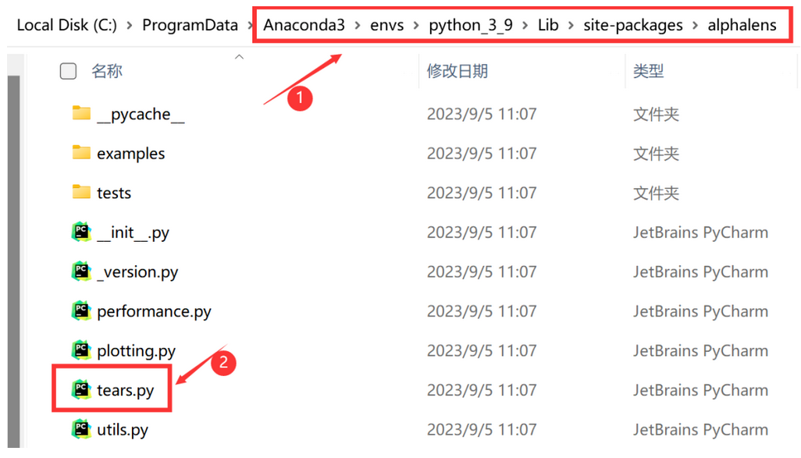
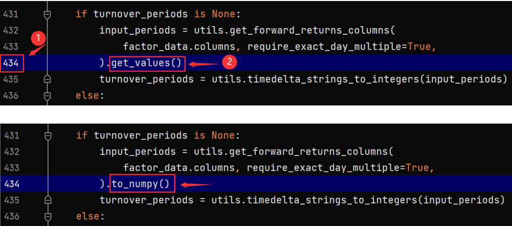
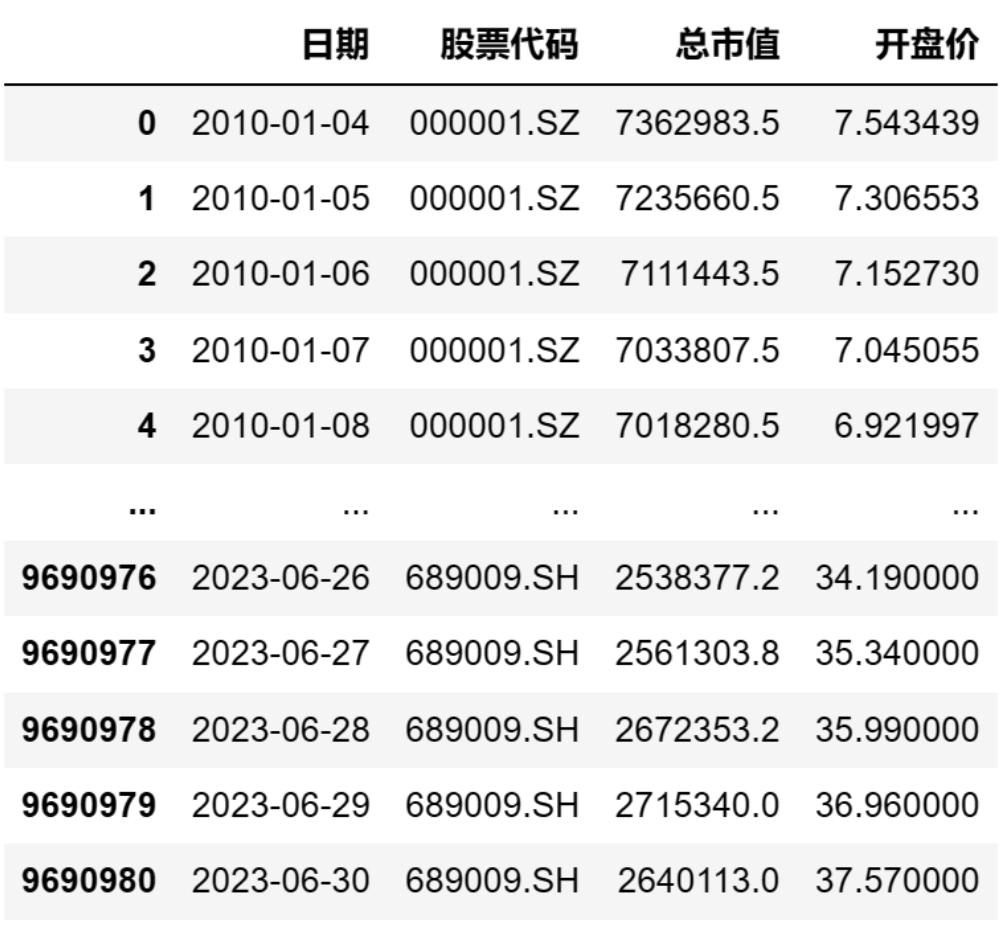
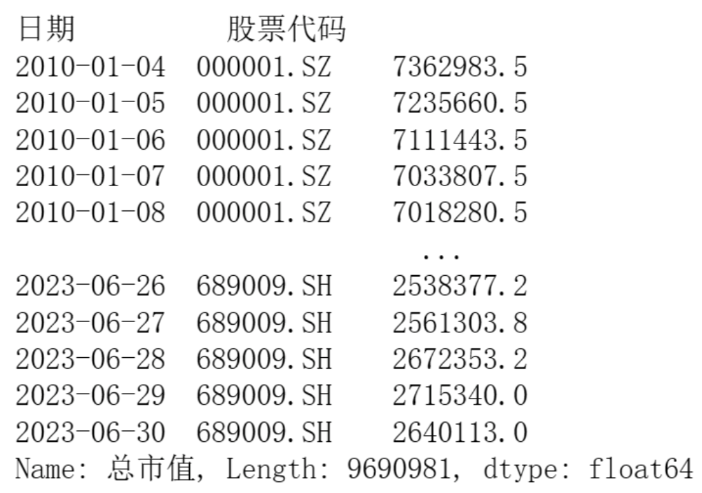
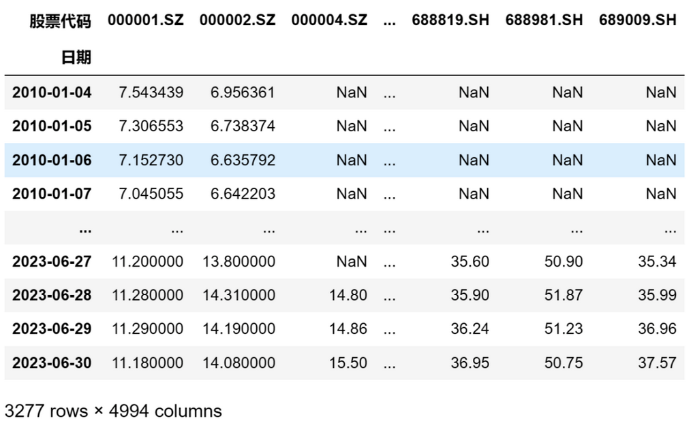
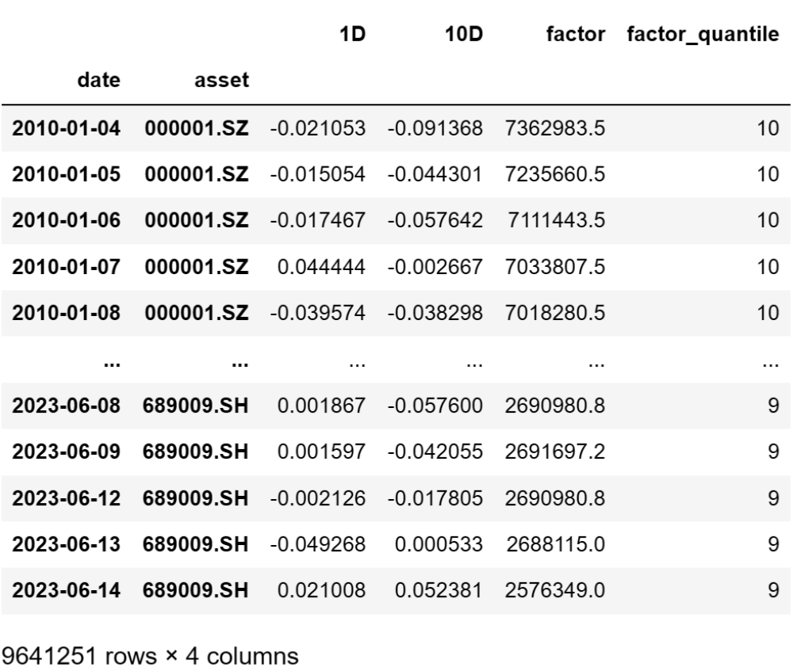

# 从零学量化61—因子评价神器Alphalens库详解（一）：数据准备 
对初学者而言，编写因子评价的程序不是一件容易的事，好在python有很多现成的工具可以直接用于因子评价，其中最为强大的之一就是专门用于因子性能测试的Alphalens库。本节以市值因子为例介绍Alphalens库的使用。

## 01 Alphalens库的优点
在量化投资领域，Alphalens库是一个广受赞誉的工具，具有诸多优点：
### 1. 详尽的因子性能分析
Alphalens库可以生成详尽的因子性能报告，包括因子收益、信息比率、换手率、最大回撤等多个重要的统计量。这些统计量可以帮助我们全面地了解因子的性能，包括但不限于因子的稳定性、预测能力、风险等方面。
### 2. 强大的可视化功能
Alphalens库内置了强大的可视化工具，可以生成直观的因子性能图表，例如累积收益曲线、分位数收益图、换手率图等。这些图表可以帮助我们直观地理解因子的性能，特别是在比较不同因子的性能时，可视化工具的优势更为突出。
### 3. 高度的灵活性
Alphalens库具有高度的灵活性，可以自定义各种参数，例如分析的时间范围、分位数的数量等。这使得Alphalens可以适应各种不同的分析需求，无论是对单一因子的深度分析，还是对多个因子的比较分析，Alphalens都能够胜任。
### 4. 易于使用和集成
Alphalens库易于使用，其API设计得清晰直观，即使是初学者也能够快速上手。另外，Alphalens库可以轻松地与Pandas、NumPy等其他Python库集成，这使得我们可以在Alphalens的基础上，使用其他库的功能，例如数据处理、数值计算等，从而构建出更加复杂和强大的分析流程。
这些优点使得Alphalens在量化投资领域中得到了广泛的应用和认可。
## 02 安装与导入Alphalens
### 1. 安装Alphalens
在Python环境中，可以通过以下命令安装Alphalens库：
```python 

pip install alphalens

```
不熟悉这种安装方法的请参看以前的章节《本地Python环境部署》。

需要注意的是，由于开发Alphalens的Quantopian公司已经关门了，因此Alphalens的源码缺乏维护，个别代码由于跟新版本的依赖库不兼容，会导致执行错误。如果你在运行Alphalens时报错，需要修改以下Alphalens代码，方法如下：

1）找到Alphalens的安装目录，打开tears.py文件

如下图所示，如果你是通过Anaconda来安装Alphalens，需要先找到Anaconda的安装目录，然后进入envs子目录（该目录为虚拟环境的目录），然后进入你的虚拟环境的子目录（下图为python_3_9，这里视你起的虚拟环境的名称不同而不同），然后进入Lib子目录，然后进入site-packages子目录，最后进入alphalens子目录。

在alphalens目录下，找到tears.py这个文件，打开这个文件。



2）将tears.py文件第434行的get_values()改为to_numpy()即可，如下图所示：

### 2. 导入Alphalens
安装完成后，我们可以通过以下方式导入Alphalens库：
```python 

import alphalens as al

```
初学者建议使用Jupyter Notebook运行Alphalens，在其他的Python编辑器中可能有些图表的显示会出现问题。

## 03 使用Alphalens
使用Alphalens主要有3个步骤：

- 按规定的格式准备因子数据；
- 用get_clean_factor_and_forward_returns函数来预处理因子数据；
- 用create_full_tear_sheet函数生成因子性能报告。

下面我们以市值因子为例，详细说明这3个步骤。在此之前我们先要导入相关的python库：

```python 

import pandas as pd
import alphalens as al

```
由于Alphalens中一些代码的用法在未来的python库中会被弃用，由此会产生一些警告信息，这些警告信息不影响程序的执行，如果你不想看到这些警告信息，可以用下面的方法将其关闭：

```python 

import warnings
warnings.filterwarnings('ignore')

```

### 1. 按规定的格式准备因子数据
Alphalens需要输入两个数据：因子值和股票交易价格（即根据因子进行交易的价格）。

1）我们先要获取沪深交易所全部股票从2010年1月1日至2023年6月30日每天的市值数据和开盘价数据，这些数据可以从AKShare或Tushare获取，数据获取的方法可以参见前面的章节。由于数据量比较多，在线获取数据的时间很长，我也为大家准备好了相关的数据，在公众号后台回复“alphalens”即可下载数据。

下载数据后解压，得到一个文件名为“data.csv”的文件，我们需要用pandas的read_csv函数将这个文件读取为dataframe，并用pandas的to_datetime函数将日期这列转为datetime格式：
```python 

file_path = 'e:temp/data.csv'  # 文件的路径和文件名
df = pd.read_csv(file_path, encoding='gbk', index_col=0)  # 从CSV文件读取数据
df['日期'] = pd.to_datetime(df['日期'])  # 转换日期格式

```
如果你将“data.csv”文件存放在其他目录，请记得修改上述代码中的file_path变量值。

然后我们可以用print(df)将这个dataframe输出查看：



整个数据总共有969万多行。

2）接下来我们需要将表中的因子值数据（即：总市值）整理为Alphalens要求的格式。Alphalens要求因子数据格式为一个两重索引的Series：第一重索引为日期，第二重索引为股票代码，Series的值为因子值。我们可以用以下代码生成这种格式的Series：

```python 

# 生成符合Alphalens要求格式的因子值数据
factor = df.set_index(['日期','股票代码'])['总市值']

```
上述代码用set_index函数将'日期'和'股票代码'设为索引，然后取'总市值'这一列的数据。可以用print(factor)来查看生成的因子值数据：



3）整理股票交易价格数据，Alphalens将根据这个价格对因子进行回测。Alphalens要求价格数据为DataFrame格式，行索引（index）为日期，列索引（columns）为股票代码，值为价格（本例中为开盘价）。

我们的原始数据为DataFrame格式的面板数据，包括多只股票多个日期的开盘价，如何整理为Alphalens需要的格式呢？用DataFrame的数据透视命令pivot即可实现：
```python 

prices = df.pivot(index='日期', columns='股票代码', values='开盘价')

```
我们用print(price)将数据打印出来查看：



这里需注意要避免用到“未来数据”，股票价格的时间戳要在因子值的时间戳之后，否则就会“提前”用因子值进行交易了。通常情况下，这是交易价格是因子计算出来后，下一个可用的价格。在本例中，市值数据是收盘后获取的，因此下一个可用的价格就是第二天的开盘价，我们需要用shift函数对数据做个位移，将第二天的开盘价移上来作为交易价格：
```python 

prices = prices.shift(-1)

```

至此，我们完成了股票因子值数据和交易价格数据的整理。
### 2. 用get_clean_factor_and_forward_returns函数来预处理因子数据
接下来我们需要调用Alphalens的get_clean_factor_and_forward_returns函数，得到符合Alphalens需要的数据格式。代码如下：

```python 

factor_data = al.utils.get_clean_factor_and_forward_returns(
                factor=factor,
                prices=prices,
                quantiles=10,
                periods=(1, 10))

```

get_clean_factor_and_forward_returns函数的参数说明如下：

1）factor参数是刚才整理的因子数据；

2）prices参数是刚才整理的股票价格数据；

3）quantiles参数是对因子进行分组测试的分组数，在本例中按市值大小分为10组；

4）periods参数用于规定换仓的间隔时间，在本例中测试1天和10天两个换仓时间，需要注意这个参数的值是元组类型(1, 10)，而不能是数值（例如：1）或列表（例如：[1, 10]）。

用print(factor_data)将数据打印查看：



整理后数据为一个DataFrame，具有两重索引：第一重索引date为日期；第二重索引asset为股票代码。该DataFrame的各列为：1D列为1日换仓的收益率；10D列为10日换仓的收益率；factor列为因子值；factor_quantile列为该股票处于哪个分组。
### 3. 用create_full_tear_sheet函数生成因子性能报告
得到factor_data数据之后，我们调用Alphalens的create_full_tear_sheet函数就能得到一份完整的因子评价报告：
```python 

al.tears.create_full_tear_sheet(factor_data)

```
这份因子评价报告的内容很多，图文并茂，限于篇幅不在此列出，大家可以运行上述代码查看。这份因子评价报告主要有三个部分的内容：

1）因子分组收益的评价；

2）因子信息系数（IC）的评价；

3）因子换手率的评价。

上述三个部分的内容实际上是调用了三个子函数来实现的：create_returns_tear_sheet函数、create_information_tear_sheet函数、create_turnover_tear_sheet函数。

在后续的章节中，我们将详细讲述这三个部分的内容，并结合市值因子进行具体的分析。