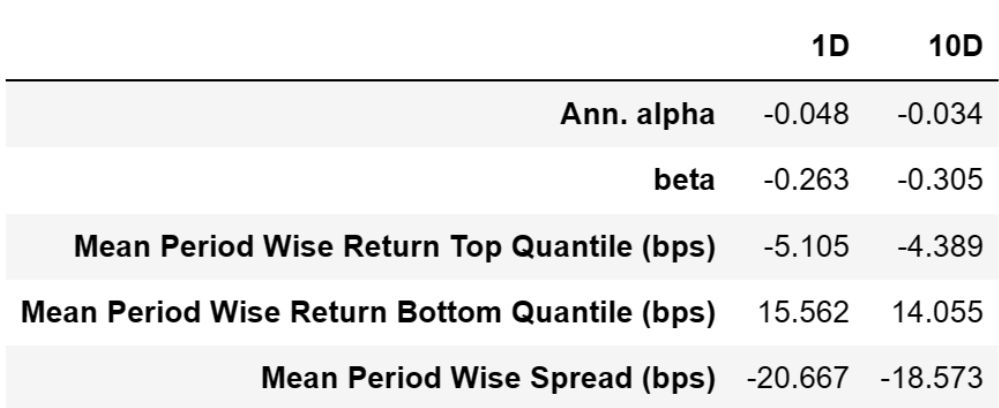
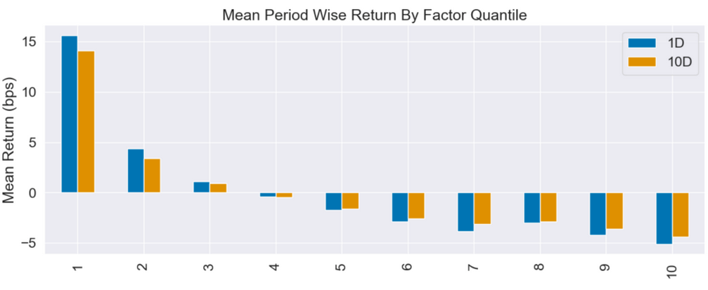
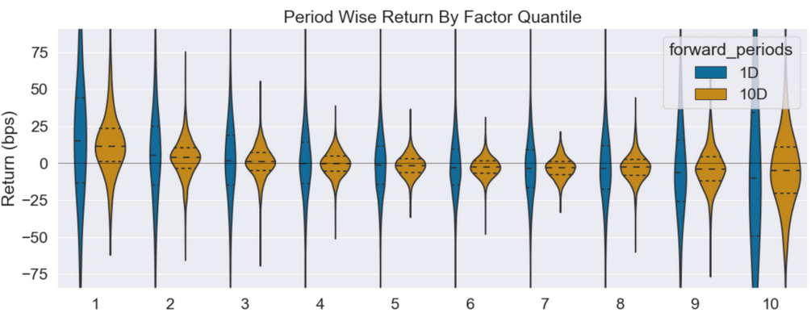
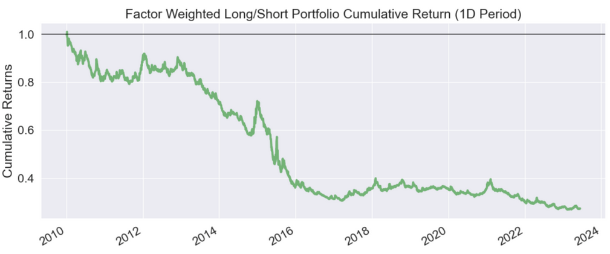
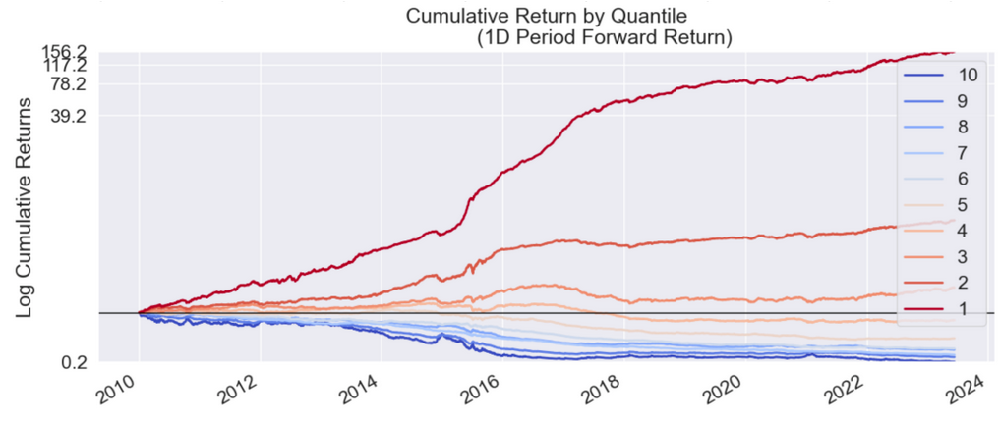
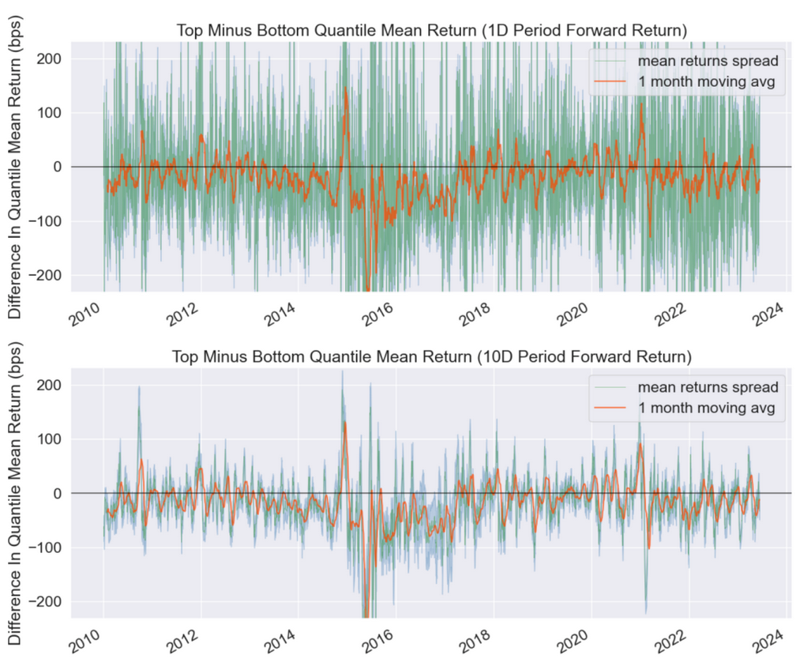

# 从零学量化62—量化因子评价神器Alphalens库详解（二）：因子分组收益 
在《因子评价神器Alphalens库详解（一）：数据准备》这篇文章中，我们对Alphalens库做了个总体的介绍，Alphalens对因子性能的评价主要有三部分：

1）因子分组收益的评价；

2）因子信息系数（IC）的评价；

3）因子换手率的评价。

本文将继续以市值因子为例，详细介绍因子分组收益的评价。因子分组收益评价是通过调用Alphalens库的create_returns_tear_sheet函数完成的。关于什么是因子分组收益评价，请参见《解析因子评价：如何选择最佳的投资因子》一节。

## 01 调用create_returns_tear_sheet函数
### 1. 在调用create_returns_tear_sheet函数之前，先要获取因子值数据和股票的交易价格数据，然后用Alphalens的get_clean_factor_and_forward_returns函数来预处理因子数据，得到符合Alphalens格式要求的数据：
```python 

factor_data = al.utils.get_clean_factor_and_forward_returns(
                factor=factor,
                prices=prices,
                quantiles=10,
                periods=(1, 10))

```
对get_clean_factor_and_forward_returns函数的参数说明如下：

1）factor参数为因子数据；

2）prices参数为股票价格数据；

3）quantiles参数是对因子进行分组测试的分组数，在本例中按市值大小分为10组；

4）periods参数用于规定换仓的间隔时间，在本例中测试1天和10天两个换仓时间。

具体的因子数据和数据预处理参见《因子评价神器Alphalens库详解（一）：数据准备》一节，这里不再赘述。

### 2. 得到符合Alphalens格式要求的数据factor_data后，就可以调用create_returns_tear_sheet函数生成因子的分组收益评价报告：

```python 

al.tears.create_returns_tear_sheet(factor_data)

```

注意Alphalens的因子收益默认是做市场中性处理的，即因子收益将会减去全市场的均值。

初学者建议使用Jupyter Notebook运行Alphalens，在其他的Python编辑器中可能有些图表的显示会出现问题。

## 02 因子分组收益评价报告解析
对create_returns_tear_sheet函数生成的因子分组收益评价报告逐一解析如下：
### 1. 因子收益率分析表



这个表格是一个收益分析报告，它展示了因子在1天(1D)和10天(10D)的时间区间内的表现。以下是对表格内容的详细解析。

1）Ann. alpha：
年化alpha，衡量了因子投资策略相对于基准的超额收益，即在剔除市场影响后，因子投资策略自身的表现。

2）beta：
beta系数，反映了因子投资策略收益与市场收益之间的相关性。在这个表格中，1天和10天的beta系数分别为-0.263和-0.305，这意味着因子投资策略的收益与市场收益存在负相关。

上述 alpha 和 beta 是通过回归得到的，回归的自变量是全市场的平均收益，因变量是市值因子的因子加权（多空）组合收益。

3）Mean Period Wise Return Top Quantile (bps)：

Top 组的平均周期收益。这是指在每个周期内，因子值最高一组的平均收益。在这个表格中，1天和10天的顶部量化组的平均周期收益分别为-5.105和-4.389，表示这个组合的收益为负。

4）Mean Period Wise Return Bottom Quantile (bps)：

Bottom 组的平均周期收益。这是指在每个周期内，因子值最低一组的平均收益。在这个表格中，1天和10天的底部量化组的平均周期收益分别为15.562和14.055，表示这个组合的收益为正。

5）Mean Period Wise Spread (bps)：

平均周期收益差距。这是Top组的平均周期收益和Bottom组的平均周期收益之间的差距。在这个表格中，1天和10天的平均周期收益差距分别为-20.667和-18.573，表示Top组的收益低于Bottom组的收益。

从上述分析可看出，市值因子的收益呈现出小市值高于大市值的特征。

### 2. Mean Period Wise Return By Factor Quantile



这张图展示了不同市值因子分组在未来1、10期的平均收益率。图的X轴为因子分组，Y轴为每组的平均收益率。

注意，Alphalens的收益默认是做市场中性处理的，即这里的收益率为"超额收益率"，指在截面上对所有股票收益率做中心化处理后的收益率。

具体来说，市值因子被分成十组，每组包含相同数量的股票。然后，计算每组在未来1、10期的平均收益率，并减去所有股票收益率的平均值，得到超额收益率。

从图表可以看出，市值因子的平均超额收益具有非常好的单调性，即市值越小，平均超额收益率越高；市值越大，平均超额收益率越低。这个观察结果符合所谓的"小市值效应"，也就是小市值股票往往能够获得较高的收益。
### 3. Period Wise Return By Factor Quantile



上图是一种小提琴图（violin plot），它展示了在不同时间周期下，各个因子分位组中股票收益的分布情况。

小提琴图是一种同时展示数据的分布和概率密度的图表。在这个图中，每个小提琴的宽度表示数据的密度，也就是在该收益水平下的股票数量。小提琴的中心线通常表示四分位数，提供了更多关于数据分布的信息。

这个图表可以帮助我们更好地理解各个因子分位组的收益分布情况。虽然收益率的平均值可以提供关于数据的总体情况的信息，但它无法告诉我们数据的分布情况。例如，如果一个分组的收益分布非常广泛，那么这个分组的平均收益可能就不太可靠，因为它可能受到一些极端值的影响。

此外，通过观察收益的分布情况，我们可以感受因子中噪音的比重。如果一个分组的收益分布非常分散，这可能意味着这个因子在预测股票收益方面的噪音比较大，也就是说，这个因子的预测能力可能不够稳定。
### 4. Factor weighted Long/Short Portfolio Cumulative Return（1D Period）



该图展示的是一个模拟交易策略的累计收益，这个策略是根据因子值对所有股票进行加权投资的，这里和分组无关。

在这个模拟策略中，我们不只交易头部和尾部的分位组，而是交易整个市场中的所有股票。每只股票的投资权重等于其因子值减去因子的整体均值，并且根据因子值的正负决定是做多还是做空。然后，为了确保总的杠杆率为1，我们将每只股票的投资权重除以所有股票投资权重绝对值的和。

对市值因子而言，这个模拟策略就是做多大市值股票，做空小市值股票。因为市值因子是一个负向因子，即因子值小的分组较因子值大的分组具有超额收益，因此上图中曲线整体是下降的。而其中有部分时段出现曲线上升，表明该时段小市值出现了回撤。

这个图表可以帮助我们评估因子的预测能力。如果因子在全域中的表现越一致，那么它的预测性就越好，我们就越有信心根据这个因子来配置组合的权重。反之，如果因子在全域中的表现不一致，那么我们可能就需要对因子的预测能力持怀疑态度，可能需要在实际操作中采取更为谨慎的策略。
### 5. Cumulative Return by Quantile



该图展示的是各个因子分组的累计收益。在这个图表中，我们关注的是每个分组在不同时间段的收益表现。

在这个图表中，每个分组的收益是通过对该分组中所有股票的每日收益取平均得到的，而每个分组中的股票权重相同。这种方式可以帮助我们更好地理解因子在不同分组的表现，也就是因子的预测力。

与前面相同，Alphalens的收益默认是做市场中性处理的，即在计算收益时，会扣除所有股票的整体均值，这样可以消除市场整体的影响。

我们通常重点观察头部和尾部分组的表现。因为在实际的投资策略中，我们常常会做多头部分组，做空尾部分组。通过观察头部和尾部分组的表现，我们可以评估实际操作中这种策略的效果。

从上图中可以看到，市值最小的一组表现特别突出，而且各分组表现出了很好的单调性，即市值越小的分组累计收益越高。
### 6. Top Minus Bottom Quantile Mean Return



该图展示了最高分位组（第十组）的平均收益率减去最低分位组（第一组）的平均收益率的变化。这个图表可以帮助我们理解因子在最高和最低分位组的表现差异，也就是因子的预测力。

头部和尾部分位组的重要性往往大于其他的分组，在实际的投资策略中，我们通常会做多头部分位组（即因子值最高的股票），做空尾部分位组（即因子值最低的股票）。因此，这个图表提供的是一种实际策略的模拟结果。

图表中蓝色阴影部分则展示了头尾部分位组收益差的分布情况，可以帮助我们理解这个差异的波动范围。而红线表示头部和尾部分位组收益差的一个月移动平均线，可以帮助我们更好地观察这个差异的长期趋势。

在本例中，0线以上表示最大市值组的收益高于最小市值组的收益，而0线以下表示最大市值组的收益小于最小市值组的收益。

在这篇文章中，我们深入探讨了Alphalens库中对因子分组收益评价的各种方法和功能。通过Alphalens的细致分析，我们可以看到因子分组收益的各种可能性，可以清晰地看到因子在不同分位组的表现，也可以通过比较头尾部分位组的表现来评估因子的预测力。这些都是我们在构建和优化量化投资策略时必须要考虑的重要因素。

下节我们将详细介绍Alphalens如何评价因子的信息系数（IC）。