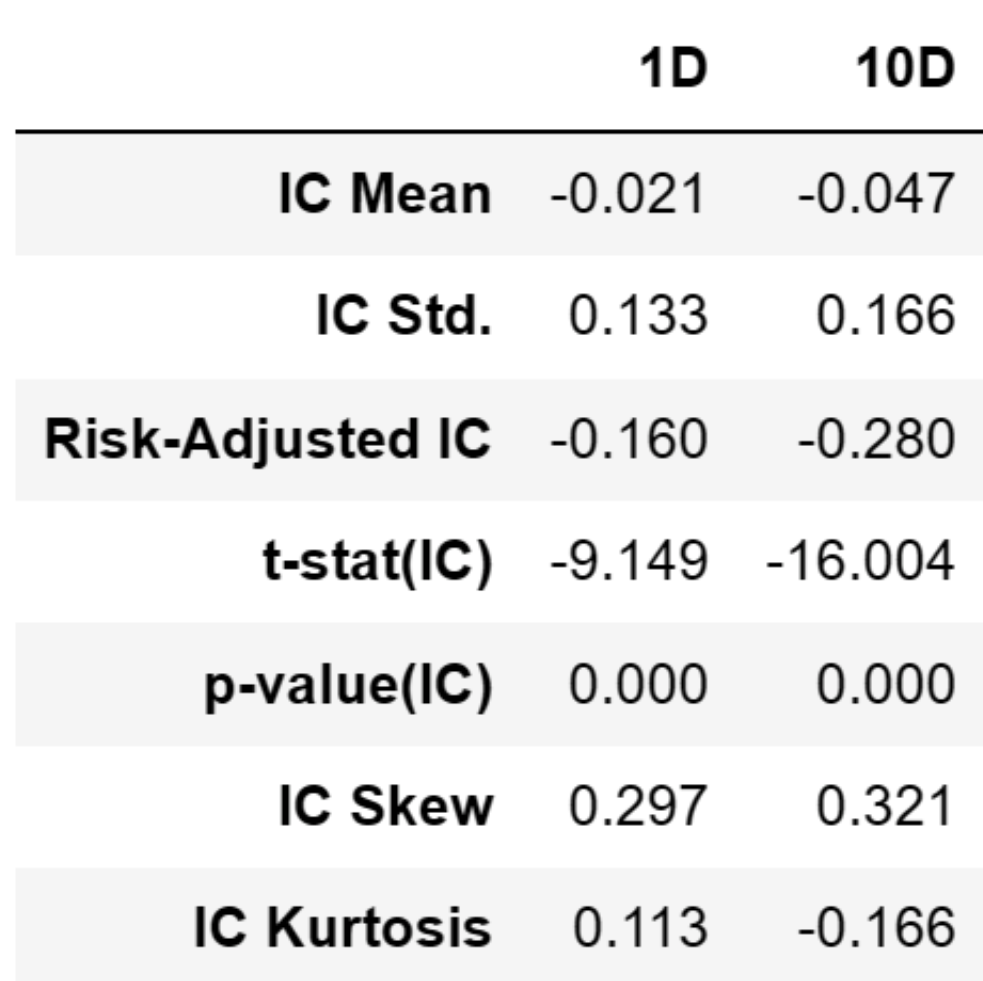
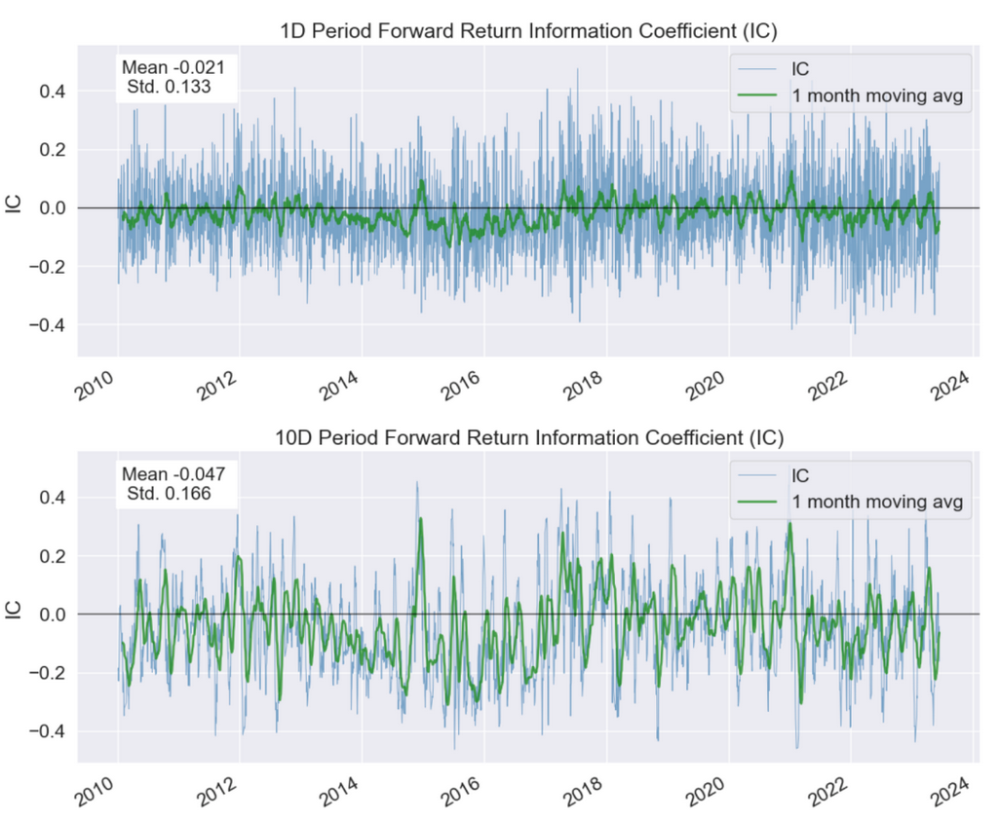
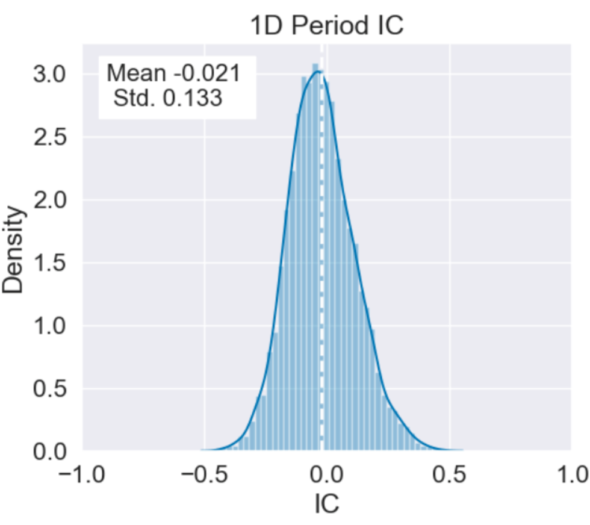
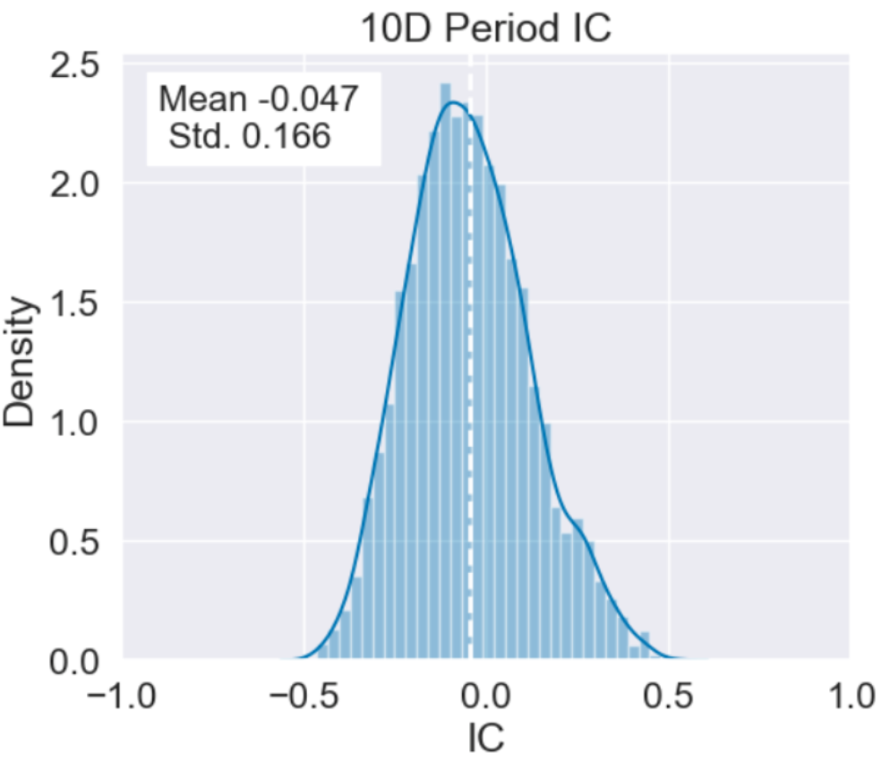
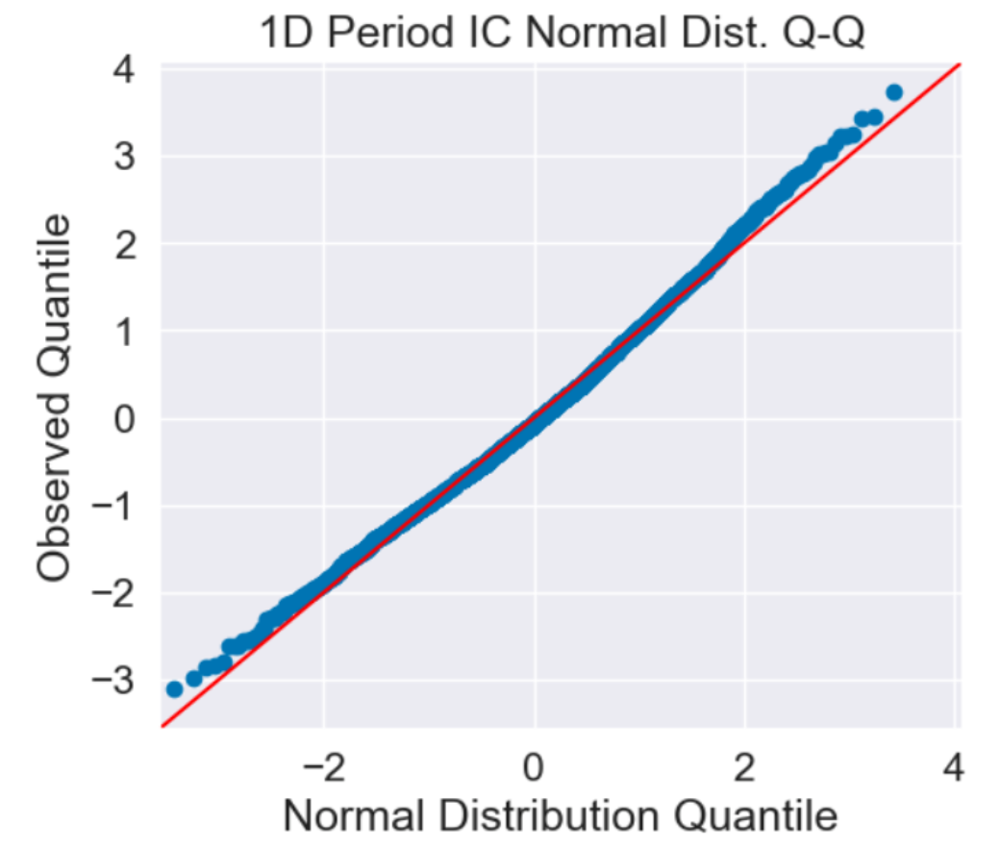
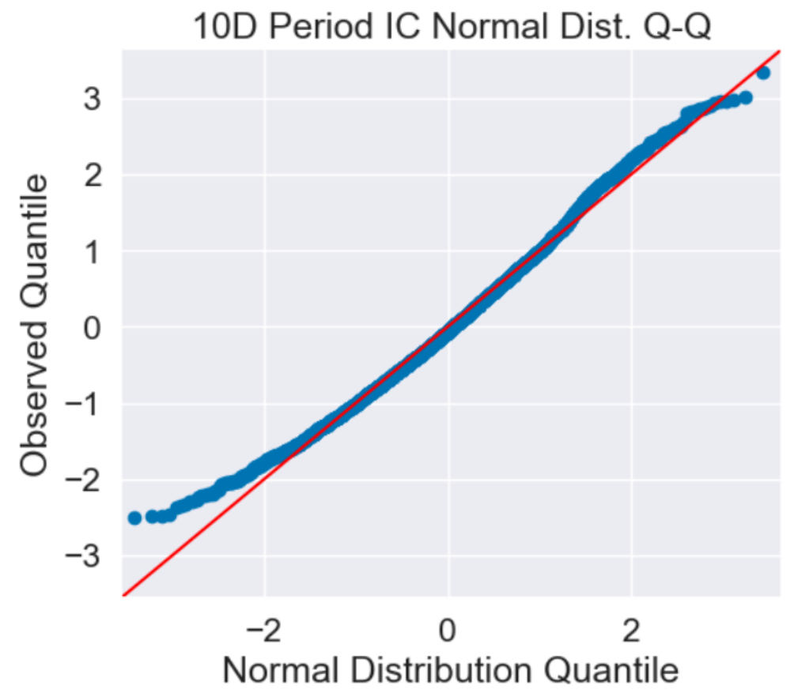
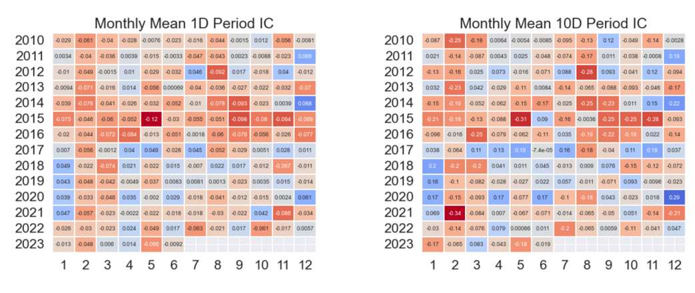

# 从零学量化63—量化因子评价神器Alphalens库详解（三）：因子IC 

在《因子评价神器Alphalens库详解（一）：数据准备》这篇文章中，我们对Alphalens库做了个总体的介绍，Alphalens对因子性能的评价主要有三部分：

1）因子分组收益的评价；

2）因子信息系数（IC）的评价；

3）因子换手率的评价。

本文将继续以市值因子为例，详细介绍因子信息系数（IC）的评价。因子IC评价是通过调用Alphalens库的create_information_tear_sheet函数完成的。关于什么是因子IC评价，请参见《解析因子评价：如何选择最佳的投资因子》一节。

## 01 调用create_information_tear_sheet函数
### 1. 在调用create_information_tear_sheet函数之前，先要获取因子值数据和股票的交易价格数据，然后用Alphalens的get_clean_factor_and_forward_returns函数来预处理因子数据，得到符合Alphalens格式要求的数据factor_data。
具体的因子数据和数据预处理参见《因子评价神器Alphalens库详解（一）：数据准备》一节，这里不再赘述。
### 2. 得到符合Alphalens格式要求的数据factor_data后，就可以调create_information_tear_sheet函数生成因子的IC评价报告：

```python 

al.tears.create_information_tear_sheet(factor_data)

```

初学者建议使用Jupyter Notebook运行Alphalens，在其他的Python编辑器中可能有些图表的显示会出现问题。

## 02 因子IC评价报告解析
对create_information_tear_sheet函数生成的因子IC评价报告逐一解析如下：
### 1. IC值分析表



以下是对这些指标的解释：

1）IC Mean（IC均值）：

IC值用来评估因子值与未来收益之间的相关性，反映因子的预测能力。IC的均值代表了因子预测的平均准确性。在本例中，1D和10D的IC均值分别为-0.021和-0.047，IC值的绝对值并不太高，这表示因子在1D和10D这两个周期的预测能力不太强。

2）IC Std.（IC标准差）：

IC的标准差代表了这种预测准确性的稳定性或一致性。在本例中，1D和10D的IC标准差分别为0.133和0.166，这表示因子的预测能力在不同的时间点上有一定的波动。

3）Risk-Adjusted IC（风险调整后的IC）：

这是IC均值除以IC标准差得到的值，这个值也称作IR，它代表了在考虑预测稳定性的情况下的预测能力。在本例中，1D和10D的风险调整后的IC分别为-0.160和-0.280，其绝对值并不高，这表示在考虑预测稳定性后，因子在1D和10D这两个周期的预测能力依然不太强。

4）t-stat(IC)（IC的t统计量）：

这是一个用来检验IC均值是否显著不为0的统计量。在本例中，1D和10D的t统计量分别为-9.149和-16.004，这表示IC均值显著不为0。

5）p-value(IC)（IC的p值）：

这是一个用来检验IC均值是否显著不为0的概率值。在本例中，1D和10D的p值都为0.000，这表示IC均值显著不为0。

6）IC Skew（IC的偏度）：

这是一个衡量IC分布的偏斜程度的指标。在本例中，1D和10D的IC偏度分别为0.297和0.321，这表示IC的分布有一定的偏斜。

7）IC Kurtosis（IC的峰度）：

这是一个衡量IC分布的尖锐程度的指标。在本例中，1D和10D的IC峰度分别为0.113和-0.166，这可能表示IC的分布不是非常尖峰。
### 2. IC 时间序列图



IC时间序列图是用来展示IC随时间变化的情况。在这个图中，x轴代表时间，y轴代表在各个时间点上的IC值。每一点代表在该时间点，因子值与未来收益的相关性。正值表示因子值和未来收益正相关，即因子值较高的股票在未来的收益也较高；负值则表示因子值和未来收益负相关，即因子值较高的股票在未来的收益反而较低。

IC时间序列图可以用来观察因子预测能力的稳定性。如果图中的点大部分都分布在同一边（同在正值区域或负值区域），并且没有明显的上升或下降趋势，那么我们可能会认为这个因子的预测能力较稳定。反之，如果图中的点散落在正值区域和负值区域两边，或者有明显的上升或下降趋势，那么我们可能会认为这个因子的预测能力较弱，或者在变化中。

图中的绿色线为因子IC值的一个月移动平均线，可以更好的帮助我们观察IC值的变动情况。
### 3. IC分布的直方图




在这个直方图中，x轴代表了IC的取值，y轴代表了对应IC值出现的频率。每个直方图的柱子代表了一段IC值的区间，柱子的高度代表了在该IC区间内的天数。柱子越高，说明相应的IC值出现的频率越高。

这个直方图可以帮助我们理解IC值的分布情况：

如果大部分的柱子都集中在正值区域，那么可能说明因子得分与未来收益大部分时间都是正相关的，即因子得分高的股票在未来的收益也高。

如果大部分的柱子都集中在负值区域，那么可能说明因子得分与未来收益大部分时间都是负相关的，即因子得分高的股票在未来的收益反而低。

如果柱子在正值和负值区域都有较高的频率，那么可能说明因子得分与未来收益的相关性并不稳定，即因子的预测能力较弱。

图中还标注了IC的均值和标准差。
### 4. IC分布的Q-Q图





Q-Q图（Quantile-Quantile图）是一种图形工具，用于比较观察数据的分布与理论分布（通常为正态分布）。在这里，我们使用Q-Q图来比较IC的分布与正态分布。

在Q-Q图上，x轴代表理论分布（这里是正态分布）的分位数，y轴代表观察数据（这里是IC）的分位数。每个点代表一个特定的分位数。

如果观察数据严格符合理论分布，那么Q-Q图上的点应该沿一条45度线（即y=x线）分布。这条线被称为等分线。然而，如果观察数据并不符合理论分布，那么点会偏离这条线。

如果因子具有良好的预测性，那么IC的分布不应该是正态的，而应该呈现S形曲线。这种S形曲线表明IC的分布的尾部更厚，这通常被解释为因子在极大值或极小值（即尾部）有更强的预测力，也就是说，因子包含的信息更多。

在这种情况下，Q-Q图上的点会在中间部分接近等分线，而在两端（尾部）偏离等分线，形成S形曲线。这种形态的Q-Q图表明IC的分布与正态分布有所偏离，尾部更厚。
### 5. IC的热力图



IC的热力图是一个用来展示IC在不同月份中的平均表现情况的工具。
在这个热力图中，每一行代表一个特定的年份，每一列代表一个特定的月份，图中的每一个格子代表该年份和月份对应的IC的平均值。颜色的深浅代表IC值的大小，颜色越深表示IC值越大，即因子预测未来收益的能力越强。反之，颜色越浅表示IC值越小，即因子预测未来收益的能力越弱。图中的蓝色系代表IC值为正值，红色系代表IC值为负值。

通过观察热力图上的颜色分布，我们可以了解因子的一致性，以及跨越不同市场周期时的表现。

热力图还可以帮助我们理解因子预测能力是否存在季节性或其他时间相关的模式。例如，如果我们发现某一列（即某一月份）的颜色普遍较深，那么可能说明在这个月份，因子的预测能力较强。

在这篇文章中，我们详细解析了Alphalens库中create_information_tear_sheet函数输出的各项图标。这些图表可以帮助我们更好地理解因子IC在历史上的表现，并可能提供一些关于其在未来表现的线索。同时需要注意的是，因子IC只是因子评价的一部分，我们需要结合因子其他方面的评价，来全面的选择有效因子。而且，任何因子的表现都可能会随着市场环境的变化而变化，因此，我们需要定期更新和重新评估我们的因子模型。